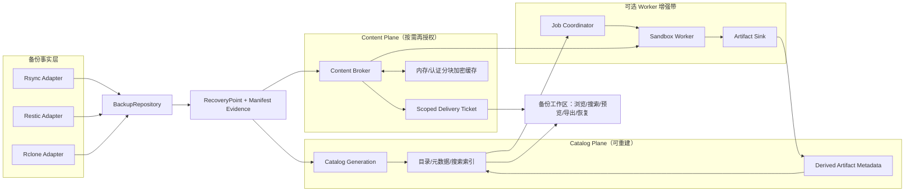
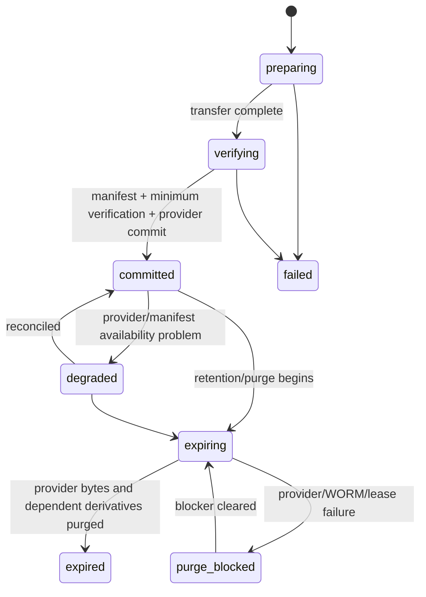
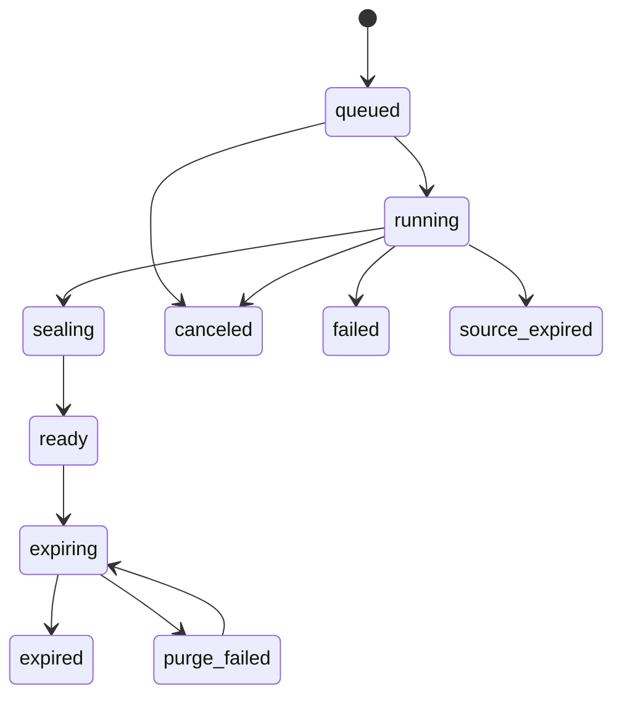

# 备份数据资产浏览与预览：终态技术设计

- **状态：** 用户已于 2026-07-13 明确认可；实施总计划待最终审阅
- **日期：** 2026-07-13
- **范围：** 本文定义完整终态架构、领域契约、安全边界、兼容迁移和运行语义；不代表当前阶段开始实现。
- **需求来源：** `prd.md`
- **研究依据：** `research/` 下的代码现状、竞品、内容安全、恢复点、生命周期和 Worker 协议研究。

## 1. 设计目标与非目标

### 1.1 目标

本设计把 Xirang 从“能证明备份任务运行过”扩展为“能安全理解、浏览、预览、取回和恢复已备份数据”，同时保留其 agentless 运维平台定位。

系统必须同时满足：

1. **版本可信：** 用户看到的每棵文件树都对应可证明的 `RecoveryPoint`，不能把成功运行、可变镜像或旧索引伪装成历史快照。
2. **Provider 诚实：** Rsync、Restic、Rclone 保持各自真实能力，通过适配器统一用户契约，不通过 UI 条件分支制造虚假一致性。
3. **只读资产体验：** 提供成熟的目录、搜索、预览、收藏、标签、批量导出和版本比较，但不在备份仓库内创建、编辑、重命名或协作文件。
4. **内容安全：** 文件名、内容、缩略图、OCR、转换文档、媒体派生物、搜索片段和导出均经过独立授权、审计、资源限制与生命周期治理。
5. **可恢复：** 从单文件调查到隔离恢复、验证和受控原位恢复形成连续闭环。
6. **轻量核心：** 官方 all-in-one 在没有 Worker 时仍可完成恢复点、目录、浏览器原生预览、下载和恢复；高级处理是可选增强。
7. **可重建：** Catalog 和派生物不是备份事实源。数据库或索引损坏时，可以从可信仓库身份、提交清单和 Provider 事实重建允许重建的部分。

### 1.2 非目标

- 向备份仓库上传、在线编辑、重命名或删除单个文件。
- 公共分享链接、协作文档、评论、桌面同步和移动端自动上传。
- 把任意目录或 Remote 猜测成可信恢复点。
- 在核心镜像内强制内置 LibreOffice、OCR、ClamAV、FFmpeg 等重型工具。
- 把预览、恶意扫描或 OCR 结果当作备份成功/完整性/可恢复性的证明。
- 支持没有显式产物清单契约的 Command 任务资产浏览。

## 2. 总体架构



### 2.1 五个隔离域

| 隔离域 | 是什么 | 不是什麽 |
|---|---|---|
| Provider/Repository | 真实备份字节与原生版本身份 | Xirang Catalog 的副本目录 |
| RecoveryPoint | 统一版本边界和证据记录 | 一次 `TaskRun` 的别名 |
| Catalog Plane | 可重建的目录、元数据、搜索和派生状态 | 备份事实源 |
| Content Plane | 精确版本的再授权字节通道 | 公共文件服务器或 JWT URL |
| Worker Plane | 可缺席、受沙箱限制的内容处理器 | 备份提交、验证、保留或恢复必经路径 |

### 2.2 可信链

```text
TaskRun evidence
  → BackupRepository publication
  → RecoveryPoint
  → Manifest / CatalogGeneration
  → Verification / Drill evidence
  → Preview / Download / Export / Recovery audit
```

每一跳都有独立状态。传输成功但恢复点发布失败时，UI 显示“传输成功，资产恢复点未提交”，不得自动晋升为可浏览可信点。

## 3. 领域模型与所有权

### 3.1 `BackupRepository`

仓库是一等资产，独立于 Task。建议字段/关系：

- `id`：Xirang 稳定 opaque ID。
- `provider_kind`：`rsync | restic | rclone`。
- `repository_identity`：非秘密稳定指纹；由 Provider 原生身份或 Xirang 仓库标记生成。
- `display_name`、`description`。
- `version_mode`：`native_snapshot | hardlink_tree | full_copy_tree | versioned_prefix | native_object_versions | mutable_head`。它描述仓库实际版本机制，不复用 Task 表单的执行模式枚举。
- `status`：`connecting | online | degraded | offline | disconnected | purging | purge_blocked`。
- `capability_revision`：最近一次能力探测快照。
- `immutability_level`：`mutable | xirang_managed | backend_versioned | storage_worm`。
- `access_binding_id`：指向加密保存的接入绑定，而非把凭据放入公开 locator。
- `retention_policy_id`、`last_seen_at`、`last_reconciled_at`。

一个仓库可以有多个 Task 写入；一个 Task 在同一时间只有一个活动写入仓库链接。历史 `TaskRepositoryLink` 保留切换时间，避免迁移后丢失血缘。

### 3.2 `RepositoryAccessBinding`

封装“从哪里、以什么身份访问仓库”：

- 绑定节点/SSH 凭据用途、Restic 密码引用、Rclone 配置引用或本地路径根。
- 所有秘密字段经现有 `secure`/未来 credential provider 边界解析，不进入 API DTO、审计或 Worker。
- 绑定可以被撤销或替换；撤销让仓库离线，不删除仓库/恢复点身份。
- 重新接入必须验证 `repository_identity`，禁止把新仓库误绑定到旧记录。

### 3.3 `RecoveryPoint`

核心字段：

- `id`：稳定 opaque ID。
- `repository_id`、可空 `producing_task_id` / `producing_task_run_id`，以及不可变 task/run 摘要。
- `provider_locator`：加密或非秘密化 locator；Restic 为仓库身份 + full snapshot ID，Rsync/Rclone 为 Xirang point ID/commit marker。
- `version_semantics`、`capture_started_at`、`capture_finished_at`、`committed_at`。
- `state`：`observed | retired | preparing | verifying | committed | degraded | expiring | expired | failed | purge_blocked`；`observed` 与 `retired` 仅允许 `mutable_head` 使用。
- `manifest_digest`、`entry_count`、`logical_bytes`、`catalog_generation_id`。
- `source_consistency`：活动源捕获区间、源端快照、应用 quiesce 等声明。
- `fidelity_profile`：ACL/xattr/hardlink/symlink/空目录/特殊文件及比较方法。
- `immutability_level`、`physical_availability`、`retention_deadline`、`hold_state`。
- 可空 `retirement_reason`（`cutover | withdrawn`）与 `retired_at`；仅用于非破坏性退役的 `mutable_head`，不能代表 Provider 字节已删除。
- 能力快照：list/search/sequential/range/download/restore/diff。

`mutable_head` 是仓库上的特殊单例视图：只表示最近一次观测的可变内容，必须带 `observed_at` 和 freshness。它没有伪造的历史 `RecoveryPoint` 序列。

公开状态均为 typed code：`immutability_level = mutable | xirang_managed | backend_versioned | storage_worm`，`physical_availability = online | offline | missing | unknown`，`hold_state = none | active | released`。Capability 不可用原因返回稳定 `code + localized params`，禁止使用 `map[string]string` 容纳 Provider 原文；未知 code 映射为通用安全文案并保留 correlation ID。

Task 执行模式（`legacy_mutable | versioned_hardlink | versioned_full_copy | versioned_prefix | native_object_versions`）、Repository `version_mode` 与 RecoveryPoint `version_semantics`（`native_snapshot | xirang_manifest | imported_baseline | mutable_head`）是三个不同枚举。适配器显式映射它们；`imported_baseline` 表示证据较弱但经用户确认的单个基线点，不能变成仓库版本模式或伪造的历史序列。

为统一寻址，`mutable_head` 在 `recovery_points` 表中使用每仓库一个稳定 ID 的非历史单例记录，`state=observed`、`version_semantics=mutable_head`，每次成功观测只推进 `observed_at`、source fingerprint 和 Catalog generation，不创建历史序列，也不得显示为 committed/immutable。它因此可以安全使用统一 AssetRef；所有内容/导出/处理在读取与发布前后仍必须重验源指纹。

该单例有独立于不可变恢复点的完整生命周期。首次成功接入创建一次 `observed` 记录；周期 reconcile 对同一 ID 原子切换 Catalog generation，失败只更新 availability、staleness 与安全错误码，不制造新点或改成 `degraded`。Repository disconnect 只撤销访问并保留 offline/stale Catalog，重新接入同一 identity 后继续使用原 ID。普通保留策略与 `RecoveryPointHold` 不适用于可变内容，因为它们无法冻结 Provider 字节；显式迁移也禁止把该行改写成 committed/imported baseline，验证后的 baseline 必须是新的不可变 RecoveryPoint。

非破坏性 cutover/撤销展示使用 `observed → retired`：先拒绝新工作、撤销票据、等待租约、移除搜索投影与内容 Catalog，再写入 typed `retirement_reason`/`retired_at`，仅保留 opaque tombstone/audit 和受保护的 legacy rollback locator；Provider 字节保持原样，`physical_availability` 继续报告事实，不能把 retired 解释为已清除。显式物理 purge（包括以后清除已 retired 的 legacy 字节）走 `observed | retired → expiring → expired`，只有 Adapter 对账确认精确 Provider 字节已删除才可进入 expired；失败走 `expiring → purge_blocked → expiring` 重试。`retired` 不可 reconcile、重新激活或读取，也不计入历史或备份健康；需要再次接入时必须走显式仓库接入流程并建立新的 repository identity/view，而不是复活旧 AssetRef。

### 3.4 Manifest 与 Catalog

- `RecoveryPointManifest`：Provider 发布时的规范清单，记录摘要算法、生成器版本、完整度、对象数、逻辑字节、fidelity 和提交证据。
- `CatalogGeneration`：某恢复点某一代可重建索引，状态为 `building | complete | partial | failed | superseded`；只有原子完成标记才能成为活动代。
- `CatalogEntry`：`recovery_point_id`、opaque entry ID、parent ID、规范路径、名称、类型、大小、mtime、模式/所有者（若可用）、MIME、内容指纹强度、Provider entry locator 和安全状态。
- Entry ID 在同一恢复点内由规范路径的 keyed digest 稳定产生；对外资源身份始终是复合 `AssetRef{recovery_point_id, entry_id}`，单独的 entry ID 不具备全局唯一性。API 不接受任意 Provider 路径作为资源身份。
- Entry Identity Key 是安装级稳定随机密钥，由通用 versioned keyring 包装；普通应用 KEK 轮换只 rewrap，不改变 entry ID。主动替换会使深链接/覆盖引用失效，必须作为显式重建迁移执行并记录影响，不能在启动时静默生成新 key。

旧 `SnapshotFileIndex` 只有 task/snapshot/path/size/mtime，不是 manifest，不能迁移为 `complete` Catalog。

### 3.5 派生物、用户覆盖与操作实体

| 实体 | 关键身份 | 生命周期 |
|---|---|---|
| `DerivedArtifact` | source fingerprint + capability/schema + pipeline + profile + security-policy revision | 继承源恢复点；可重建 |
| `ProcessingJob` | work key + attempt/fencing token | 持久队列；至少一次执行、有效一次发布 |
| `SavedSearch` | owner + versioned query AST | 不保存结果；显式失效范围失败关闭 |
| `Favorite` / `UserTagAssignment` | owner + opaque RP/entry identity | 源过期后仅可保留无路径/文件名的墓碑 |
| `RecentAssetAccess` | owner + opaque entry identity | 默认 30 天；源过期立即删除 |
| `ExportJob` | frozen selection digest + requester + archive profile | 加密临时产物；默认绝对 TTL 24h |
| `RecoveryPlan` | exact RP/entries + target + conflict policy + preflight revision | 授权前冻结；目标漂移后失效 |
| `RecoveryJob` | authorized plan digest + execution attempt | 持久、可取消、逐项结果和验证证据 |

## 4. RecoveryPoint 发布与 Provider 适配

### 4.1 统一适配器接口

Provider Adapter 内部接口按能力拆分，而不是一个巨型实现：

```go
type RepositoryProber interface { Probe(ctx, binding) (RepositoryIdentity, CapabilitySet, error) }
type RepositoryReconciler interface { Reconcile(ctx, repository) (RepositoryObservation, error) }
type PointPublisher interface { Publish(ctx, publicationAttempt) (ProviderCommitEvidence, error) }
type ManifestBuilder interface { BuildManifest(ctx, point) (ManifestStream, error) }
type PointReader interface { List(...); Stat(...); OpenSequential(...) }
type PointRangeReader interface { OpenRange(...) }
type PointDeleter interface { DeletePoint(ctx, point, fence) error }
```

Restore、diff、native search 和 native version attestation 使用独立可选接口。UI/API 只消费 `CapabilitySet` 和原因码，不出现 `executorType === restic` 决策。

### 4.2 发布状态机



Provider 发布与数据库提交是双写窗口。每次 attempt 使用稳定 point ID 和 fencing token；启动/周期 reconciler 可以识别“Provider 已提交、DB 未提交”或反向异常，不以目录年龄猜测成功。

### 4.3 Rsync

- 新版本化仓库：全新 staging tree + 前一 committed tree 的 `--link-dest` + 同挂载原子 rename。
- 预检必须真实执行 hard-link probe、确认 staging/final 同 mount、空 staging、inode/空间、link count 和不兼容 flags。
- 禁止 `--inplace`、`--append` 等可能修改共享 inode 的模式。
- `-a` 不等于 `-HAX`；有效 flags 和缺失元数据写入 fidelity profile。
- hardlink 不可用时可退回完整新树，但恢复点语义不变。
- 整个 staging/manifest/rename 窗口必须持有前一 committed point 的 `rsync_parent` 恢复点租约，避免 retention 删除或改变 `--link-dest` 引用；发布成功或失败清理后释放。
- 当前目标仅登记为 `mutable_head`；迁移用导入基线或从下一次运行开始，不伪造历史。

### 4.4 Restic

- 每次 backup 注入唯一 Xirang task/run tag，并解析该命令最终 JSON summary 的 full snapshot ID。
- Provider locator = repository identity + full snapshot ID。查询 `latest` 不是正常发布或恢复路径。
- 解析 full snapshot ID 后，发布器必须流式枚举该精确快照，生成规范 `RecoveryPointManifest` 的算法/生成器版本/count/logical bytes/digest/completeness/fidelity，并完成最低验证；在此之前恢复点保持 `verifying`，不能把后续 Catalog 构建当作缺失 manifest 的替代品。
- 共享仓库中的 snapshot 必须按 tag/host/path 和 run evidence 归属；当前 `ListSnapshots` 全仓结果不能直接盖上调用 Task ID。
- `append_only` 现有配置只说明 repository format 选择，不能声明 append-only credential 或 WORM。
- 旧索引先隔离为 legacy，只有重建并通过完整度提交的 Catalog 才可搜索。

### 4.5 Rclone

- 可移植默认：每恢复点唯一、永不复写的 prefix；commit manifest 是发布边界。
- Remote 必须通过 read-after-write/list、commit marker、稳定 identity/hash 或明确弱比较能力门禁。
- 不依赖“远端目录 rename 原子”；可直接写最终唯一 prefix，commit 前不暴露。
- `--backup-dir` 只是被覆盖/删除对象的 reverse delta，缺少后来新增对象信息，不能成为独立恢复点。
- 后端原生版本仅在适配器能记录每对象 version ID/delete state、证明生命周期和精确重建时启用。
- GA 同时提供受能力门禁的 `native_object_versions` 模式：清单逐对象记录 version ID/delete marker，保留策略证明这些版本在恢复点期限内不会提前消失，并用精确版本读取/恢复/删除测试证明可重建；不满足任一条件即拒绝启用并使用唯一 prefix 模式。
- legacy sync 在迁移基线期间必须暂停/fence，并处理外部写入；原 prefix 保留到验证完成。

### 4.6 Command

Command 默认 `unsupported`。未来只有在任务声明版本化产物清单、Provider locator、读取方式、验证和恢复契约后，才能实现新的 Adapter；日志输出不是资产。

## 5. Catalog Plane 与搜索

### 5.1 基础 Catalog

- 每个 committed 且仍保留的恢复点必须建立路径/名称/类型/大小/mtime/能力与基本安全元数据。
- 内部 `CatalogGenerationState`、查询 `CoverageStatus`（`building | complete | partial | failed | unavailable`）和 `Staleness`（`fresh | stale | unknown`）是三个独立字段；内部 `superseded` 不得泄漏成用户覆盖状态，Provider 离线也不能伪装成 generation 失败。
- 构建写入新 generation；批量完成 manifest count/digest/completeness 校验后原子切换活动代。
- 空目录/空快照也必须产生 `complete` generation，不能以“存在任意 row”判定就绪。
- Provider 离线时，不可变恢复点仍可浏览已提交 Catalog，并标记内容不可用；`mutable_head` 同时显示观测时间与 stale 状态。
- Catalog 是可重建元数据；Provider 数据不存在时不可从 Catalog 还原内容。

文件名和规范路径属于敏感但必须可排序/分页的 Catalog 元数据。本设计沿用 Xirang 控制面数据库边界，不对每个名称/路径做会破坏索引与排序的应用层字段加密；它们必须受数据库/宿主卷加密、备份加密、最小文件权限和资产 RBAC 共同保护，并禁止进入日志/指标。正文、OCR、snippet 和派生内容不适用这一例外，必须使用下述应用层加密。数据库备份因此被视为敏感资产。

### 5.2 增强覆盖调度

所有符合策略的保留恢复点最终处理 OCR、正文、缩略图、文档转换、扫描和媒体派生物：

1. 用户主动预览和安全扫描阻断任务最高优先。
2. 最新恢复点自动处理。
3. 近期历史后台处理。
4. 较老历史使用低优先级回填。
5. 备份提交、验证和恢复保留独立资源槽，回填可暂停/限速。

强内容摘要 + 相同 capability/schema + pipeline fingerprint + output profile + security-policy revision 才能复用计算结果。复用的是加密派生 blob；每个恢复点仍有独立授权绑定和到期引用。

### 5.3 便携搜索索引

SQLite 和 PostgreSQL 必须有一致语义，因此不把 SQLite FTS5、PostgreSQL `tsvector` 或数据库默认 collation 当作产品契约。设计采用 `SearchIndex` 端口和默认便携 postings 实现：

- Go 层执行统一 Unicode NFKC、case folding、路径分段、中英文 token/bigram、文件类型和日期规范化。
- 名称/路径/标签元数据写规范字段和 n-gram postings；正文/OCR 只写由独立 Search Token Key 生成的 HMAC tokens、字段频率和加密 excerpt block 引用。
- Search Token Key 随机生成并由应用 KEK 包装；普通 KEK 轮换只重包密钥，不改变 token。主动销毁/替换 token key 会触发可重建全量 reindex。
- 关系库保存文档、generation、field coverage 和 postings；查询使用 equality/intersection 获取候选，Go 层完成相同的排名、稳定排序和 cursor 编码。
- 对内容候选，只有完成权限/step-up 后才解密受限 excerpt 并验证真实命中；HMAC/gram false positive 不会返回给用户。
- 排名固定由字段权重、term coverage、路径接近度、恢复点新鲜度和用户明确排序组成；cursor 包含 query generation + sort tuple，generation 变化返回可识别的 stale cursor。

该实现牺牲数据库原生语言分词的一部分高级能力，换取双数据库一致性、可测试性和内容 token 不明文落库。未来可增加外部 SearchIndex 实现，但 API 语义、权限过滤和 coverage 契约不变。

### 5.4 搜索范围和权限

- 默认 `current`：每个授权任务/来源谱系最新 committed 点；legacy 使用 `mutable_head`。共享仓库只暴露当前用户有权访问的 producing lineage，不能因为拥有其中一个 Task 就看到同仓库其他 Task 的恢复点、计数或证据。
- `all_retained`：全部 committed、未过期点；范围可深链接和保存。
- 历史按任务/来源谱系 + Provider 规范路径分组；跨任务不因同路径/同 hash 合并。
- 搜索 pipeline 顺序必须是：授权范围 → 可见文档候选 → 分组/计数/建议 → snippet。
- 无有效 step-up 时，疑似秘密文件从正文/OCR 匹配、计数、建议和片段中整体排除；路径命中按 list 权限处理。
- 响应返回请求字段的 generation/coverage：`complete | partial | building | failed | unavailable`。只有 complete 才能声称“无结果”。

## 6. Content Plane、票据与缓存

### 6.1 内容读取端口

`ContentBroker` 的主要来源是复合 `AssetRef{recovery_point_id, entry_id}`（repository 由恢复点解析）；交付层使用 typed `DeliverySource = backup_asset | recovery_result`，后者仅由受控恢复模块以 `RecoveryResultRef{recovery_job_id, result_id}` 注册。每种 source adapter 都必须独立校验权限、step-up、租约/TTL 和读取边界，不能退化为任意路径读取。`recovery_result` 签票和读取要求 `backup_assets:recover`、精确 RecoveryJob ownership 与专用 `recovery.result_download` proof；`backup_assets:download` 单独不足，也不作为额外叠加权限。它负责：

- 重新校验恢复点状态、资产权限、所有权、敏感等级和动作；
- 根据 Adapter 能力选择 sequential、Range、受控物化或明确降级；
- 验证 ETag/内容指纹，特别是 `mutable_head` 前后变化；
- 限制单请求/用户/Provider/全局并发、字节、速率和持续时间；
- 传播客户端取消，关闭 SSH/进程/Reader，并记录安全审计摘要。

任何 API/Worker 都不能绕过 Broker 直接使用仓库凭据。

### 6.2 原生媒体的两段式票据

当前 JWT 位于 `Authorization` header，``、`<video>`、`<audio>` 和 PDF iframe 无法附带。设计不把 JWT 或长期 bearer 放入 URL：

1. 前端使用正常 Authorization 调用 `POST /recovery-points/:rpId/entries/:entryId/delivery-tickets`，声明动作、renderer/profile 和可选 step-up proof。
2. 服务端创建服务器侧 ticket row，只保存随机秘密的 hash，并返回非秘密 opaque `delivery_id` URL；同时设置 `HttpOnly; SameSite=Strict; Secure`、精确 Path 作用域的短时 delivery cookie。
3. 原生元素访问 `/api/v1/asset-content/:deliveryId`，浏览器自动携带 path-scoped cookie。URL 中只有不可授权的 delivery ID。
4. Content gateway 校验 cookie hash、用户/会话、资源、动作、method、Range、TTL、并发和撤销状态。

图片/短文档 ticket 使用短绝对 TTL；媒体 ticket 使用较长但有上限的 absolute + idle TTL，以支持多次 Range seek。下载 ticket 每次签发前要求有效五分钟 step-up。Ticket 不可转换为分享链接，登出、权限变化、恢复点 expiring 或安全 purge 会立即撤销。

生产环境必须使用 HTTPS 才签发 Secure cookie。开发环境使用受控 localhost 策略或前端 bounded Blob fallback，不能因为 HTTP 调试而把 ticket secret 改放 URL。

Nginx 的 asset-content 专用格式完全省略 `$request`、`$request_uri`、`$uri`、args 和 cookie，只记录 request ID、状态、字节和时间；应用层再记录 keyed delivery-ID fingerprint 与 Range 摘要。任何一层都不记录 JWT、原始路径或查询词。

### 6.3 HTTP 内容语义

- 稳定内容提供 `ETag`（版本/内容指纹）、`Last-Modified`、`Accept-Ranges`、`206`、`Content-Range`、`If-Range`。
- `Content-Type` 来源于受控 MIME 探测和 renderer profile，不盲信扩展名/Provider metadata。
- 原件下载使用 `Content-Disposition: attachment` 和安全文件名；可能主动执行的 HTML/SVG/XML 永不以同源 active inline 方式交付。
- 设置 `X-Content-Type-Options: nosniff`、严格 CSP、frame/object 限制和 Referrer Policy。
- 大内容不受当前通用 30 秒 `WriteTimeout` 误杀：使用独立受控 server/route timeout 策略或经评审的响应控制器；不能全局无限延长 API 超时。
- Provider 不支持随机读时，UI 明确显示“需物化/仅下载/仅恢复”，不伪造 seek。

### 6.4 分层安全物化

```text
小型/顺序内容 → 有界内存 buffer/stream
大型随机内容 → 认证分块加密 cache（每次启动随机密钥）
外部工具必须要路径 → Worker 独占限额 tmpfs
```

认证分块缓存要求：

- 每对象独立 nonce/segment index，AEAD associated data 绑定 recovery point、entry、content fingerprint、chunk index 和 cache format version。
- 专用目录，禁止落入 `/data`、`/backup`、`/logs` 或任何备份源；无明文磁盘 fallback。
- 每对象/用户/Provider/全局字节和文件数配额，LRU 只作为候选，仍受 idle/absolute TTL 和 lease 约束。
- 每次启动随机内存 key；崩溃残留不可解密。启动先撤销旧 generation，再按 DB/文件系统 reconciliation 删除 orphan。
- 全局禁用开关。禁用时依能力退回顺序预览、下载或恢复，并说明原因。

Worker path materialization 只能进入作业专属 `tmpfs`，`noexec,nosuid,nodev`，宿主机禁用或加密 swap。这里不使用现有整值字符串 AES-GCM。

## 7. 可选 Worker 与派生物

### 7.1 拓扑和信任

```text
Job Coordinator → mTLS/local authenticated lease → Worker Sandbox
Content Broker → attempt-bound InputSessionGrant → Worker
Worker → attempt-bound ArtifactUploadSession → Xirang validator → Derived Store/Catalog
```

- Core 使用 DB 持久队列，不强制 Redis/Kafka。
- Worker 主动拉取租约；默认只信任同机或管理员显式登记的 mTLS trust domain。
- Worker 无数据库、仓库、SSH/Restic/Rclone 凭据、Provider locator 或宿主路径访问。
- Worker 默认无 Internet/DNS，仅能访问 Broker/Sink；病毒库/模型更新由独立 updater 身份执行。
- Updater 不是内容处理 Worker：它使用独立身份、allowlist 出站、签名/摘要验证和原子 content-addressed bundle store，或接受管理员离线导入；Worker 只读挂载已验证 bundle。Core 持久记录 bundle version/fingerprint/更新时间/失败，pipeline fingerprint 变化把受影响派生物标 stale 并触发受配额回填。解析作业永远不因更新需要而获得网络。
- Input grant 的随机激活秘密只能使用一次；激活后得到绑定 job/attempt/worker/AssetRef/TTL/请求数/累计字节/并发上限的读取 session，可按 capability 进行多次 Range，不会因 seek 退化为共享 bearer。Sink grant 同样只激活一次，但允许在限额内上传一个原子多产物集合；最后提交 artifact manifest，只有当前 fencing token 可以一次性发布该集合。

### 7.2 Capability 和版本

标准 capability：

`image.thumbnail`、`text.extract`、`image.ocr`、`secret.classify`、`document.convert`、`malware.scan`、`media.probe`、`media.transcode`、`archive.inspect`、`archive.extract_entry`。

秘密分类采用失败关闭的双层来源：Core 先按路径/名称/MIME/配置类型和有界内容扫描产生 `secret | non_secret | unknown`；可选 `secret.classify` Worker 再对符合策略的完整文本/OCR 做增强。正文/OCR postings 只有在对应源版本已有可接受的分类结果后才可发布；`unknown` 与 `secret` 在没有有效 step-up 时都从匹配、计数、建议词和片段中排除。这样无 Worker 时不会以“尚未分类”为由放宽内容揭示。

Worker 握手声明：

- protocol version；
- capability schema version；
- pipeline fingerprint（工具/模型/字体/codec/病毒库/配置）；
- MIME/profile、stream/Range 需求、input/output 上限；
- 页数/像素/时长/归档展开限制；
- CPU/GPU、并发槽和 `ready | degraded | draining`。

### 7.3 Job 与发布

`work_key = source fingerprint + capability/schema + pipeline fingerprint + output profile + security_policy_revision + all output-affecting params`。

Processing 状态固定为 `queued → leased → fetching/materializing → processing → uploading → validating → succeeded`，旁路状态为 `retry_wait | cancel_requested | canceled | failed | superseded | expired`；状态与稳定错误码分离，重启接管只能由新 fencing token 继续。

- 同 work key 排队/运行合并；有效派生物直接复用。
- Job envelope 包含 attempt、lease、fencing token、硬资源预算和恢复点租约。
- 至少一次执行、有效一次发布：Artifact Sink 只接受当前 fencing token，验证 MIME/数量/大小/digest/completeness 后原子发布。
- `mutable_head` 在读前和发布前复核；变化产生 `superseded`，迟到结果销毁。
- Office→pages→OCR、probe→transcode 等 DAG 由 Core 编排，Worker 不互相调用。
- 取消先撤销 Input/Sink grant，再终止完整进程树和清理 tmpfs；合并工作只有最后一个 interest 消失才取消底层任务。

### 7.4 错误与降级

稳定错误码分为：

- 永久输入/策略：`unsupported_format`、`encrypted_archive`、`input_too_large`、`materialization_disabled`、`source_changed`、`source_expired`；
- 瞬时资源/基础设施：`worker_unavailable`、`provider_unavailable`、`quota_busy`、`timeout`、`worker_crash`、`lease_lost`；
- 合约/安全：`protocol_incompatible`、`invalid_output`、`digest_mismatch`、`sandbox_violation`、`network_violation`。

合约/安全错误隔离 Worker，不盲重试。成功但不完整使用 `completeness=partial` + warnings。无 Worker 时不制造噪声失败作业，UI 显示“增强能力未部署”。

### 7.5 派生物加密与密钥分域

Child 1 提供通用 versioned keyring 基础设施，只负责随机域密钥的生成、包装、版本、rewrap 和可用性报告；它不让不同领域共享数据密钥。密钥生命周期固定如下：

| Key domain | 稳定性与丢失影响 |
|---|---|
| Entry Identity | 安装级稳定；普通轮换只 rewrap；丢失会改变条目 ID 和深链接 |
| Cursor Signing | 短期双 key 验签；丢失只使现有 cursor 失效 |
| Audit Fingerprint | 版本化；丢失不破坏已保存链，但失去跨版本指纹关联 |
| Search Token | 稳定 HMAC token key；替换触发全量可重建 reindex |
| Derived Store | 每 blob DEK + 独立 KEK；丢失触发派生重建 |
| Export | 每 export DEK + 独立持久 KEK；丢失会使未到期导出不可读 |
| Recovery Cleanup Ownership | 安装级稳定 HMAC key；只验证隔离恢复目录的 owned marker，丢失后禁止自动清理并要求人工对账 |
| Preview cache | 每进程随机 key；重启后按设计失效 |

- 每个物理 derived blob 使用随机 DEK 和 streaming/chunked AEAD；DEK 由独立 Derived Store KEK keyring 包装，不复用 Export KEK、Search Token Key 或 process cache key。
- `DerivedArtifact` 绑定保存 wrapped DEK 引用、cipher format/version 和 digest；OCR/正文 excerpt block 也在该加密域，数据库只保存 HMAC postings 和密文引用。
- `DerivedArtifactState = active | stale | unavailable | superseded | revoked | purging | purge_failed`，状态与 completeness/scan finding 正交。任何撤销、过期、key 丢失或回滚必须先在同一事务中把正文/OCR 搜索投影标成 unavailable 并移除 postings/excerpt reference/classification coverage，再销毁 wrapped DEK/blob；禁止留下仍可命中但无法解密验证的幽灵索引。
- 跨恢复点去重时，共享物理 blob，但为每个 source point 保存授权/lifecycle reference。一个恢复点过期只删除其引用；最后一个 live reference 消失时先销毁 wrapped DEK，再清理 ciphertext。
- Pipeline/病毒库 fingerprint 更新会把旧产物标记 `stale` 并安排低优先级 superseding job；新产物发布前旧产物仍按明确 stale 状态可用或被安全策略阻断。
- KEK 轮换采用 versioned keyring 和 rewrap，不解密重写大型 blob；key 丢失显示派生物不可读并触发重建，不能影响原恢复点可信度。

### 7.6 沙箱与配额

- 非 root、只读 rootfs、drop capabilities、no-new-privileges、cgroup CPU/内存/PID、seccomp/AppArmor 等价限制。
- 配额覆盖 user/task/provider/capability/worker/global：队列、并发、输入/输出字节、wall time、tmpfs、页数、像素、媒体时长、归档条目/深度/展开量/压缩比。
- 交互槽和后台回填槽分离；Worker 健康、积压、ETA、失败类别和资源使用进入监控。
- stdout/stderr 截断脱敏；不记录路径、内容、票据和工具原始输出。

## 8. 文件类型预览策略

| 类型 | Core 路径 | Worker 增强 | 安全/降级 |
|---|---|---|---|
| 纯文本、配置、日志、代码 | 有界 sequential read，编码/BOM 探测，转义文本、行号、搜索 | 语法高亮、全文提取、秘密分类 | 截断明确标记；不执行 HTML/脚本；二进制退回 hex/metadata |
| 图片 | 浏览器安全 raster + ticket；小图 Blob 可选 | 缩略图、EXIF 安全提取、OCR、大图金字塔 | SVG/活动图片先 rasterize/sanitize；解码像素上限；恶意 finding 警告/阻断 |
| PDF | 同源 ticket 的浏览器只读 viewer（策略允许时） | 沙箱页渲染、文本提取、OCR | JS/外链禁用；解析失败退回下载/恢复；声明预览可能与原件不同 |
| Office/ODF | metadata + 下载 | 沙箱转换为 PDF/页面图 + 文本 | 宏/外链/模板网络禁用；不提供编辑 |
| 音频 | 原生 Range ticket | probe/兼容转码 | codec 不支持时显示原因，退回下载 |
| 视频 | 原生 Range seek | poster、probe、HLS/兼容 profile 转码 | 限制时长/分辨率/码率；无 Range/禁物化时退回下载/恢复 |
| ZIP/TAR 等归档 | metadata | 受限目录索引、单 member 提取 | 路径穿越、绝对路径、设备/链接、炸弹、加密归档 fail closed |
| 数据库/磁盘镜像/未知二进制 | metadata、有限 magic/hex header | 可选专用只读解析器（未来 capability） | 默认不挂载、不执行、不加载插件；下载/恢复 |
| HTML/XML/SVG | 转义源文本 | 静态净化/raster profile | 永不在主 origin active inline |

所有 preview DTO 返回：renderer、profile、source/derived、complete/partial、bytes/pages/time coverage、tool fingerprint、created/scanned time、限制原因和 fallback actions。

## 9. 授权、step-up 与审计

### 9.1 权限矩阵

新增独立权限，不复用 `tasks:read`：

| 动作 | Admin | Operator | Viewer |
|---|---|---|---|
| `backup_assets:list` | 全部 | 仅拥有节点/Task producing lineage；共享仓库内逐恢复点过滤 | 无 |
| `backup_assets:preview` | 全部 | 仅拥有范围 | 无 |
| `backup_assets:download` | 有；每次授权需要 step-up | 默认无 | 无 |
| `backup_assets:export` | 有；创建/下载分别校验 | 默认无 | 无 |
| `backup_assets:recover` | Admin + fresh step-up + grant | 无 | 无 |
| 恢复结果下载（`backup_assets:recover`） | 仅精确 RecoveryJob owner + `recovery.result_download` proof | 无 | 无 |
| `backup_repositories:manage` | Admin；连接/断开/重连 | 无 | 无 |
| `backup_repositories:purge` | Admin + fresh step-up + reason + grant | 无 | 无 |

全局列表/搜索先服务端 ownership filter。当前 Viewer 绕过 Task ownership 的行为不能进入任何资产路由。

### 9.2 敏感内容

- 普通已授权预览不重复 step-up。
- 疑似秘密正文揭示要求可复用五分钟 step-up；无 proof 时正文/OCR 搜索完全排除该资产的匹配事实。
- 下载原件每次签发 ticket 时要求有效五分钟 proof。
- 隔离恢复结果下载沿用 `backup_assets:recover`，还必须匹配精确 RecoveryJob owner 和 `recovery.result_download` 五分钟 proof；拥有 `backup_assets:download` 不能查看恢复结果，拥有 recover 也不能跳过专用 proof。
- 恢复、仓库 purge、原位覆盖必须使用 fresh proof（不复用缓存）+ 理由 + 绑定动作的限时 grant。
- step-up proof 必须绑定专用 action purpose：`asset.secret_reveal`、`asset.download`、`asset.export_create`、`asset.export_download`、`asset.recover`、`recovery.result_download`、`recovery.result_retain`、`repository.purge` 互不替代；通用 TOTP 成功不能被跨动作重放。
- 恶意/敏感分类只能增加验证、警告或阻断，不能放宽原 RBAC/ownership。

现有 JWT 的 `purpose=step_up` 只保留为 token class；新增必填、服务端 allowlist 的 `step_up_action` claim。`POST /auth/step-up` 请求必须提交 typed action purpose，`GenerateStepUpToken`/验证器必须显式接收 expected purpose，未知、缺失、通用旧 proof 或任意其他 purpose 一律拒绝。注册表同时枚举现有配置导入/导出、终端、任务触发/恢复等高风险 purpose 和上述资产 purpose；迁移必须让所有既有调用方一次性传入准确 purpose，不能留下接受通用 proof 的兼容旁路。后端运行完整 purpose 两两交叉拒绝矩阵和路由覆盖测试；前端 API、Auth context、hook 与 proof storage 以 purpose 为键，默认不复用，只有同 purpose 且未过期的 proof 才可按策略复用。

### 9.3 审计

唯一 typed domain-action registry 由基础包维护，路由测试禁止自由字符串。完整类别包括：

- Repository/RP：`repository_list/connect/reconcile/disconnect/import/review/purge_plan/purge`、`recovery_point_list/detail/evidence/diff`；
- Asset/overlay：`asset_list/search`、`saved_search_create/update/delete`、`favorite_add/remove`、`tag_create/update/delete/assign/unassign`、`recent_clear`；
- Content/processing：`preview_job/preview_ticket/preview_read`、`download_ticket/download`、`processing_policy_update`、`archive_inspect/archive_member`；
- Export/recovery：`export_create/cancel/download_ticket/download`、`recovery_plan/preflight/authorize/execute/cancel/verify/cleanup/retain/result_download_ticket/result_download`；
- Lifecycle：`retention_policy_create/update/delete`、`hold_create/release`。

后续增加资产路由时必须先扩展这个 registry、sanitizer 与覆盖测试；不能在 handler 内临时拼字符串。

这些事件进入独立的 append-only `backup_asset_audit_events`，使用与现有 HTTP 审计相同目标的 `prev_hash/entry_hash` 完整性链，但采用资产专用 sanitizer 和 retention。Provider 凭据实际使用仍同时写入既有 `credential_audit_events` 的安全摘要；两类事件通过 correlation ID 关联而不复制秘密元数据。

资产审计记录 actor、opaque resource IDs、task/repository/recovery-point IDs、动作、结果、字节/条目/Range 摘要、renderer/derived fingerprint、step-up/grant ID、失败类别和 path/query keyed fingerprint。路径/查询指纹使用独立、版本化的 Audit Fingerprint Key，不复用 Search、Derived、Export、cache 或审计完整性链密钥；低熵路径和搜索词不得使用可离线枚举的裸 hash。禁止记录原始路径、文件名、搜索词、snippet、内容、cookie、JWT、Provider locator 或 secret。大量媒体 Range 聚合为 session summary，避免日志洪泛；聚合失败不能阻塞内容读取，但必须产生有界告警和后续 reconciliation 指标。

审计保留按封闭 segment 清理，而不是从单条全局链中截掉任意前缀：每段保存前段终点、段首/段尾 hash、条目数和时间边界；清理明细后保留不含资产内容的 checkpoint/anchor。验证器必须能证明每个保留段内部连续、相邻段锚点连续，并显式报告已按策略清除的历史区间。

## 10. 前端信息架构与状态

### 10.1 路由

`/app/backups` 升级为可深链接工作区：

- `/app/backups/overview`：现有可信度、健康、存储、配置引导。
- `/app/backups/data`：仓库、恢复点、目录、全局搜索、预览、下载/导出。
- `/app/backups/recovery`：恢复计划/作业、演练证据、历史结果。
- `/app/backups/repositories` 可作为 data 内管理子视图，而不是新一级侧栏入口。

兼容 `/app/backups` 重定向 overview。Tasks 继续管理配置、调度、执行和日志；资产入口不再藏在任务历史 Dialog。

### 10.2 三栏调查工作台

- 左栏：仓库/任务、恢复点、目录树、收藏/标签/保存搜索。
- 中栏：虚拟化文件列表/网格、筛选、排序、批量选择、coverage 和在线状态。
- 右栏：预览、元数据、版本、可信证据、安全、下载/恢复动作。
- URL 包含 repository/task/recovery-point/opaque parent-entry/entry、saved-search ID、scope、非敏感 filter/sort、view 和 inspector tab；不把原始路径、临时搜索正文或批量选择集放入 URL，需深链接的搜索使用 opaque saved-search ID。
- 面板宽度/列宽/视图偏好只存本地非敏感配置。文件路径、选择集、理由、ticket、proof 不进入 local/session storage。
- 列表使用服务端 cursor + 前端虚拟化；目录翻页、搜索和恢复点切换可取消请求并保留上级状态。

窄屏转换为上下文选择器 → 文件列表 → 全屏预览。返回时保留滚动位置、筛选、选择和 recovery point；不把桌面三栏压缩成不可用小列。

### 10.3 关键状态表达

UI 不用单一“可用/不可用”：

- RecoveryPoint：observed/retired（仅 mutable head）/preparing/verifying/committed/degraded/expiring/expired/failed/purge_blocked，以及 mutable/managed/versioned/WORM 正交属性。
- Catalog：内部 generation `building/complete/partial/failed/superseded`；对外 coverage `building/complete/partial/failed/unavailable`；staleness 独立为 `fresh/stale/unknown`。
- Content：available/offline/range unavailable/materialization disabled/source changed。
- Preview：native/derived/partial/unsupported/not deployed/queued/failed。
- Security：scan `not_scanned/no_finding/finding/stale`；sensitivity `secret/non_secret/unknown`，其中 unknown 与 secret 均失败关闭。

仓库离线不是备份损坏；Worker 缺席不是内容不存在；未扫描不是安全；部分索引的零结果不是“没有文件”。

### 10.4 无障碍与国际化

- 所有树/列表/网格/预览动作支持键盘、可见焦点、ARIA 选择状态和屏幕阅读器摘要。
- 图片提供文件名/元数据替代文本；媒体提供字幕轨 capability 位，不能把波形当唯一信息。
- 颜色不独立表达信任/恶意/过期，徽章包含文本与图标。
- 动画遵循 reduced motion；大列表 loading/error/partial state 使用现有 UI primitives。
- 所有用户文本进入 zh/en i18n；Provider/错误码映射为本地化文案，原始工具错误不直出。

## 11. 收藏、标签、保存搜索与最近访问

- 收藏、标签和最近访问是用户覆盖，不写回 Provider，不改变 manifest/digest/可信状态。
- 保存搜索保存 versioned query AST、显示名、scope 和 owner，不缓存成员列表/snippet。精确恢复点过期后显示 broken scope，禁止静默扩大。
- 收藏/标签绑定 opaque entry。源过期后可以保留只含 opaque target 和用户自写 label/tag 的墓碑，不能复制旧路径、文件名、MIME、hash。
- 最近访问默认滚动 30 天，提供清除历史；源过期/安全 purge 立即删除，不保留墓碑。
- 标签定义独立存在，assignment 随资源生命周期清理。
- 这些实体不形成 retention hold。真正 hold 必须是显式管理员保留策略实体并单独审计。
- `BackupRetentionPolicy` 是 Repository/Task-link 范围的版本化保留规则；`RecoveryPointHold` 是绑定精确恢复点的显式管理员实体，包含 `operational | legal` 类型、理由的加密引用、创建/到期/释放 actor 与时间。活动 hold 阻止正常 expiry 和 Provider 删除；Purge 只能先撤销访问并进入 `purge_blocked`，必须通过独立 Admin fresh step-up + reason 显式释放 hold 后才能删除，不能在安全清理中静默越过。
- 资源上限由 settings registry 管理并有安全默认值：query AST 深度 12、节点 256、序列化 64 KiB；每用户保存搜索 200、收藏 50,000、标签定义 500、assignment 100,000、最近记录 10,000；用户 label/tag 名不超过 128 个 Unicode 字符且 512 bytes；单次批量变更 1,000 项；最近访问写入 120 次/分钟并按同一 AssetRef 合并。达到上限返回稳定错误，不截断后谎报成功；管理员可在硬上限内调低/调高。创建、修改、删除、清除历史和 broken-scope 变化均进入脱敏资产审计。

## 12. 异步批量导出

### 12.1 选择与状态机

创建时把搜索/选择解析为精确 `RecoveryPoint + manifest entry IDs`，生成 canonical selection digest。之后不重新执行搜索、不替换新版本、不把 `mutable_head` 变化静默纳入。



Job 记录逐项 `pending/read/packed/skipped/failed`，允许在最终策略支持时生成“完成但含失败项”的报告；不能把缺失项隐藏在成功提示中。

运行态还包含 `retry_wait` 与 `cancel_requested`。每次执行持久化 attempt、lease owner/expiry、fencing token 和 checkpoint；重启或双 Worker 接管只允许当前 fence 进入 sealing/ready，旧 attempt 的迟到输出必须被拒绝并清理。每个来源恢复点由 `export_job` lease 固定到作业终止或到期。

### 12.2 归档与路径规则

- 默认 ZIP（广泛兼容）；可选 TAR + 压缩 profile。客户端下载内容是普通归档，TLS 和短时下载 ticket 保护传输；这里的“加密导出”明确指服务器临时归档始终加密 at rest，而不是把密码嵌入 URL 或长期保存用户归档密码。
- 归档内部路径从选择根规范化，移除绝对路径、盘符、`..`、NUL 和平台危险名。
- 同名冲突使用稳定规则：保留相对树；跨根冲突添加来源/恢复点短标签，并在 manifest report 说明。
- Symlink 默认作为链接元数据或安全文本说明，不跟随到选择外；特殊文件默认跳过并报告。
- 大批量使用流式读取、背压和硬逻辑/物理字节、条目数、持续时间配额。

### 12.3 加密与跨重启

- 每个导出随机 DEK，使用 streaming/chunked AEAD；associated data 绑定 export ID、chunk、selection digest 和 format version。
- DEK 由独立 Export KEK 包装。Export KEK 由稳定 `DATA_ENCRYPTION_KEY`/未来 KMS 保护并携带 key version；轮换保留旧 key 解包直到所有对应导出到期。
- 运行中作业在重启后通过 DB state、checkpoint、attempt/fencing token 和输出验证恢复或安全重试；不信任残留文件名/mtime。
- ready 默认 absolute TTL 24h，且不超过最早源恢复点 deadline。下载前重新授权并签发短 ticket。
- 到期先撤销 ticket、删除 wrapped DEK 完成密码学撤销，再 idempotent 删除 ciphertext。
- 失败/取消/部分不可发布产物立即销毁 key 并清理。结果摘要可保留约 90 天，路径/选择清单随 artifact 删除。

导出 volume 与进程临时 preview cache 分离：前者持久加密以跨重启，后者每次启动随机 key。

## 13. 受限归档浏览

- `archive.inspect` 只返回受限目录 index：member opaque ID、父 ID、净化显示名、类型、声明/估算展开大小和 warning。
- 限制归档字节、嵌套深度、member 数、单 member/总展开字节、压缩比、CPU/memory/wall time。
- 拒绝绝对路径、穿越、逃逸 symlink/hardlink、device/FIFO/socket、重复路径歧义和格式解析异常。
- 加密归档默认 `encrypted_archive`，不在本设计中收集/保存归档密码。
- 单项取回是独立 `archive.extract_entry` job，绑定外层 asset fingerprint + member chain；输出继承外层权限、敏感、加密和 expiry。
- 归档内容不原地执行、挂载或展开到普通磁盘。超限/不支持时退回原件下载或受控恢复。

## 14. 受控恢复计划

### 14.1 两阶段模型

```text
资产选择
  → RecoveryPlan（精确版本 + 目标 + 冲突策略）
  → 预检/差异/风险报告
  → Admin fresh step-up + reason + plan-bound grant
  → RecoveryJob
  → post-restore verification/report
```

`RecoveryPlan` 冻结 repository/recovery point/entries、selection digest、目标 node/root/path、Provider capability revision、目标 preflight revision、冲突策略和预计 bytes/items。任一源/目标 revision 变化都使授权失效并要求重新预检。

源 revision 是 typed union，而不是只有 RecoveryPoint ID。不可变点使用已提交的 exact locator + manifest digest；`mutable_head` 使用 `ObservationRevision{source_fingerprint, catalog_generation_id, observed_at}`，且所有 entry 必须来自该 generation。revision 进入 selection/plan digest、授权 grant、RecoveryJob 与每个可恢复 checkpoint；服务端在 preflight 生成前后、grant 签发前、首次目标写入前后以及每次 takeover/resume 前后重新观测。变化发生在写入前时把 plan 标为 `superseded` 并拒绝执行；写入后发现变化时停止后续写入、保留已写清单并进入 `needs_attention`，绝不把稳定 mutable-head ID 当作稳定内容版本。

Plan 状态固定为 `draft | preflight_ready | authorized | superseded | expired | executed | canceled`；Job 状态固定为 `queued | running | verifying | cancel_requested | canceled | succeeded | degraded | needs_attention | failed`。Job 只表达恢复执行 outcome，成功/降级/失败后不因明文结果清理而被改写；结果保留、撤销和清理只由 `RecoveryResultSet` 状态表达。合法转换、终态和重启 reconciliation 结果由后端状态机统一，前端不得用自由字符串推断。

### 14.2 默认隔离恢复

- 默认目标为目标节点配置的安全 recovery root 下新建 `<job-id>` 目录；建议默认 `/var/tmp/xirang-recovery`，但必须在节点 preflight 中确认允许根、权限、空间和不与备份源重叠。
- 恢复前检查节点在线/凭据用途、容量/inode、父路径 realpath、symlink、mount、运行任务冲突、恶意 finding、源可用性和预计变更。
- Provider Adapter 把 exact point/entries 映射到执行，不允许 Restic `latest` 或 Rclone 对未声明目标直接 destructive sync。
- Rsync 本地仓库到远程节点应通过明确 local→remote restore path/stream，不复用当前假设“备份 target 在节点本地”的反向命令。
- 逐项记录成功、失败、跳过、bytes、hash/size/mtime verification；验证失败产生 degraded job，而不是隐藏为成功。

### 14.3 原路径恢复

只有验证隔离结果后或用户显式选择时可进入：

- `fail_on_conflict`（默认）；
- `skip_existing`；
- `overwrite_selected`；
- `exact_mirror`（可能删除目标额外内容，最强警告和独立 grant）。

执行前展示 create/overwrite/delete/skip 计数和关键路径的安全摘要。授权绑定 plan digest、目标、冲突策略、task/repository/RP、选择摘要、理由和 TTL。恶意 finding 默认阻断；管理员 override 需要单独理由和审计。若 Provider/目标支持原生快照或 rollback marker，可作为 capability 加强，但不能承诺通用自动回滚。

### 14.4 并发与取消

- 同目标节点恢复与普通写入任务按节点互斥；只读预览可继续但受 Provider 配额。
- queued/preflight 可完全取消；写入开始后的取消是 best effort，结果必须标记可能的部分目标状态。
- `exact_mirror` 在删除阶段前设置第二 checkpoint；取消/失败报告已经执行的删除。
- 恢复作业持久化并在重启后 reconciliation；不能盲目重放非幂等写入，必须根据 Provider/目标 checkpoint 判断 resume、verify 或人工处理。
- 隔离结果是 Provider 之外的明文副本，默认绝对 TTL 24 小时；管理员可显式 retain 到一个新的有界期限，不能无限期隐式保留。RecoveryResultSet lifecycle owner 负责目标节点 orphan reconciliation、到期前提示、ticket/引用撤销、精确 job 目录清理、失败重试和 `cleanup_failed` 审计/告警；这些事件不改写已经终止的 RecoveryJob outcome。
- 每个可下载普通文件/验证报告使用不含路径的 `RecoveryResultRef{recovery_job_id, result_id}`。签票与读取均要求 `backup_assets:recover`、精确 RecoveryJob ownership 和独立 `recovery.result_download` 五分钟 step-up；`backup_assets:download` 既不能单独授权，也不要求与 recover 叠加。短票据复用 Content Plane Range/累计预算/撤销语义，并通过受限 SSH-purpose 读取精确结果；审计只记录 job/result opaque ID、字节和结果。目录下载不从远端临时树临时打包，改用原冻结选择集的持久 ExportJob；Symlink/特殊文件不作为恢复结果下载源。

隔离结果目录由独立 `RecoveryResultSet` 管理，状态固定为 `ready | revoking | cleaned | cleanup_failed`；`cleanup_failed → revoking` 是唯一重试边，`cleaned` 为终态。实体保存 `recovery_job_id` FK、目标节点、opaque result IDs、created/absolute-expiry/可空 bounded-retain deadline、cleanup attempt/lease/fencing token，以及 owned marker digest，不保存可由客户端提交的绝对路径。创建 job 目录时先在安全 root 的精确 `<job-id>` 子目录内原子写入 marker，marker 绑定 installation ID、job ID、随机 ownership nonce 和 root revision，并由独立 Recovery Cleanup Ownership Key 做 HMAC；数据库只存验证所需的 digest/nonce 引用。无有效 marker、目录为 symlink、越过 root 或 marker 与 DB/FK 不一致时自动清理必须 fail closed 并告警。

清理顺序固定为：事务性 `ready|cleanup_failed → revoking` 并递增 fence → 撤销全部结果 ticket/grant、拒绝新签票/retain → 有界等待并主动关闭旧 fence 的 Range/SSH 流 → 重新验证 target/root/owned marker → 只删除精确 job 子目录 → 写 `cleaned` tombstone；任何中断进入或保持 `cleanup_failed`，由同一幂等序列接管，旧 fence 不能继续读或写状态。orphan scan 只处理 marker HMAC 有效且能经 job FK/tombstone 对账的目录；未知/伪造目录隔离告警而不删除。retain API 要求 Admin、`backup_assets:recover`、精确 RecoveryJob ownership、`recovery.result_retain` fresh proof、硬上限内的新 deadline 和 typed audit；cleanup API 要求同一 RBAC/ownership、显式确认与 audit，但不延长数据暴露也不复用下载 proof。自动到期清理使用服务身份并写相同审计类别。

## 15. 仓库重新接入、删除与灾难重建

### 15.1 三个不同动作

| 动作 | 效果 | 风险门禁 |
|---|---|---|
| 删除/归档 Task | 停调度并解除写入链接；仓库/RP 保留 | 普通 tasks:write + 影响提示 |
| 断开 Repository | 撤销 access binding；Catalog 离线可见 | Admin + 确认；不删数据 |
| Purge Repository/RP | 删除 Provider bytes、Catalog、派生物、ticket/export/reference | Admin fresh step-up + reason + impact/hold/lease/WORM preflight |

现有 DELETE Task 的语义需要改为安全归档/解绑，不能继续硬删唯一凭据后留下不可管理字节。真正删除 task metadata 只在无仓库/运行/审计依赖时由后台 retention 处理，并保留必要 lineage header。

### 15.2 重新接入

向导流程：

1. 选择 Provider 类型和新的 access binding；秘密只在授权路径提交。
2. Probe repository identity/capabilities，不列出内容给无权限用户。
3. 与已有 identity 匹配：重新绑定；冲突 identity 拒绝覆盖。
4. Restic：读取原生仓库身份/快照，按 Xirang tags/run evidence 归属；无法归属的快照进入 admin review，不自动挂到 Task。
5. Xirang Rsync/Rclone：验证仓库 marker、point commit manifest 和 digest，重建 RecoveryPoint/Catalog。
6. Legacy tree/remote：仅登记 `mutable_head` 或用户确认的 `imported_baseline`，记录证据不足。
7. Catalog 以新 generation 重建；派生回填低优先级恢复。

不提供任意根目录/Remote 的递归自动发现。用户明确提供的路径仍要经过 root allowlist、identity marker 和 Provider parser。

### 15.3 数据库灾难恢复边界

- 可从仓库重建：repository identity、可证明的 recovery points、manifests、Catalog 和重新生成的派生物。
- 不能从仓库重建：用户/角色、ownership、保存搜索、收藏/标签、最近访问、grant、审计、Worker/导出/恢复 job 历史和其他控制面配置。
- 完整灾难恢复仍要求备份 Xirang DB、敏感配置和 `DATA_ENCRYPTION_KEY`；仅恢复 DB 无 key 会丢失 credential/access binding 解密能力。
- Repository reconnect 不绕过 RBAC：初始系统恢复需要 bootstrap admin 和显式 credential provisioning。

## 16. 保留、租约、GC 与安全清除

`RecoveryPointLease` 是基础领域实体而不是 retention 私有实现。持有者类型至少包括 `rsync_parent | catalog_build | content_session | processing_job | export_job | recovery_job`，并绑定恢复点、owner job/session、attempt/fencing token、可续租的短 lease 和绝对 deadline。各生产者负责 acquire/renew/release；retention 只消费统一租约决定等待、拒绝新租约或由安全 purge 覆盖。进程崩溃后的 lease 只能由新 fencing owner 接管，旧 owner 的迟到发布无效。

### 16.1 RecoveryPoint 保留

当前按目录 mtime、Restic `forget`、Rclone `--min-age` 的直接清理必须重构为 RecoveryPoint state owner：

1. `committed/degraded → expiring`，拒绝新工作和 ticket。
2. 等待有上限的普通 lease grace；安全 purge 可覆盖。
3. 撤销 ticket、取消 Worker/export/recovery interests，销毁派生/export keys。
4. Adapter 删除 exact point 并反复 reconcile。
5. 清理 file-level Catalog/paths/snippets/OCR/thumbnails/archive indexes/user recent。
6. 保留安全 tombstone 与聚合证据，标记 `expired`。

Provider/WORM 失败为 `purge_blocked` 并告警，不能谎报删除完成。

`mutable_head` 不进入上述按保留期自动选择的路径，也不能被 hold 伪装成冻结版本。它由 repository reconcile owner 管理：`observed` 成功刷新保持稳定 ID；disconnect 保持 observed 但标记 offline/stale；非破坏性 cutover/withdraw 先完成 revoke、lease drain 和 Catalog/search 清除，再进入带 typed reason 的 `retired`，保留 legacy locator/Provider 字节用于可审计回滚。显式物理 purge 才从 observed 或 retired 进入 `expiring`，对账确认删除后为 `expired`；Provider/WORM 失败走 `expiring → purge_blocked → expiring` 重试。对账必须清理迟到 generation/派生发布，并确保 retired、expiring、expired 点没有活动 ticket、lease、search posting、Catalog 内容或 Worker/导出/恢复 interest。

### 16.2 统一 GC 形状

Preview cache、Worker tmpfs、derived blobs、exports、staging points 和 Catalog generations 使用：

- 启动 initial reconciliation；
- 周期 idempotent/batched prune；
- DB lease/heartbeat/fencing 和 absolute deadline，不依赖 file age；
- orphan scan、key-first revocation、删除失败状态与可观测重试；
- 每类独立 quota/retention，不使用一个危险的全局 `RemoveAll` 根。

法律/安全 purge 采用 revoke-first，覆盖普通 lease；下载到客户端的副本无法召回，UI/审计需说明。

## 17. API 边界

下面是领域 API 形状，不是最终 Swagger 命名；实现时继续使用 `/api/v1`、response helpers、Auth/RBAC/ownership 和 typed frontend wrapper。

### 17.1 Repository / RecoveryPoint

- `GET /backup-repositories`
- `POST /backup-repositories/connect`
- `GET /backup-repositories/:id`
- `POST /backup-repositories/:id/reconcile`
- `POST /backup-repositories/:id/disconnect`
- `POST /backup-repositories/:id/purge-plan`
- `POST /backup-repositories/:id/purge`
- `GET /backup-repositories/:id/recovery-points`
- `GET /recovery-points/:id`
- `GET /recovery-points/:id/catalog-status`
- `GET /recovery-points/:id/evidence`
- `POST /recovery-point-diffs`（两个精确恢复点/目录范围；Catalog 元数据比较与 Provider 原生差异证据分层返回）

### 17.2 Asset / Search / Preview

- `GET /recovery-points/:id/entries?parent=&cursor=&sort=`
- `GET /recovery-points/:rpId/entries/:entryId`
- `POST /asset-search`（query AST 放 body，避免 URL/log 泄露）
- `GET/POST /saved-searches`
- `POST /recovery-points/:rpId/entries/:entryId/preview-jobs`
- `POST /recovery-points/:rpId/entries/:entryId/delivery-tickets`
- `GET /asset-content/:deliveryId`（cookie ticket；支持 Range）
- `POST/DELETE /favorites`、`/asset-tags`、`/recent-access/clear`

### 17.3 Export / Recovery

- `POST /asset-exports`、`GET /asset-exports/:id`、`POST /asset-exports/:id/cancel`
- `POST /asset-exports/:id/download-ticket`
- `POST /recovery-plans`、`GET /recovery-plans/:id`
- `POST /recovery-plans/:id/preflight`
- `POST /recovery-plans/:id/authorize`
- `POST /recovery-plans/:id/execute`
- `GET /recovery-jobs/:id`、`POST /recovery-jobs/:id/cancel`
- `POST /recovery-jobs/:id/results/:resultId/download-ticket`
- `POST /recovery-jobs/:id/results/retain`（bounded deadline + `recovery.result_retain`）
- `POST /recovery-jobs/:id/results/cleanup`（整组 revoke/fence/owned-marker 精确清理）

### 17.4 DTO 原则

- API 使用 opaque IDs，不接受客户端拼接仓库路径。
- snake_case 在 backend DTO，frontend mapper 转 camelCase；组件不得看到 raw DTO。
- capability/availability 返回稳定 code + localized key 所需参数，不返回 raw `err.Error()`。
- cursor 签名并绑定 user/scope/query generation；不能改写 scope 后复用。
- Cursor Signing Key 使用独立 versioned keyring domain；可短期双 key 验签并随 cursor 最大 TTL 淘汰旧 key，不复用 Entry Identity、Search、Audit、Derived 或 Export keys。
- mutation 支持 idempotency key；job create 返回 `202` 和 resource location。
- 所有 list/search 响应包含 coverage、staleness、capability reason 和 server-evaluated permissions。

## 18. 部署、配置与可观测性

### 18.1 Core all-in-one

- 新增专用 encrypted preview cache 路径，例如 `/var/cache/xirang/assets`，不加入备份源/持久数据声明；每进程 key。
- 新增持久 ciphertext export/derived store volume，例如 `/var/lib/xirang-asset-runtime`，与 `/data`、`/backup`、`/logs` 分离并明确“不要作为普通备份源递归备份”。
- Worker 必需路径通过 Compose/Kubernetes `tmpfs` 提供；官方文档要求 swap disabled/encrypted。
- Nginx 增加 asset-content route 的 streaming、Range、buffering、timeout 和 access-log redaction；不放宽其他 API。
- CSP 只允许同源受控内容；必要 Blob 使用单独审查，HTML/SVG 不 active inline。

### 18.2 Settings registry

所有动态项进入 `settings.Service`（DB > env > default），至少覆盖：

- asset catalog/search enable、backfill pause、per capability eligibility/size limits；
- preview memory/cache bytes、object bytes、TTL、concurrency、rate；
- delivery ticket idle/absolute TTL；
- Worker trust endpoints、protocol policy、queue/concurrency/resource budgets；
- derived/export store quotas、export TTL、GC cadence；
- archive limits；
- recovery safe roots、preflight validity、job concurrency；
- recent access retention 和 evidence tombstone retention。

静态启动秘密/路径（KEK、mTLS key、volume root）保持 env/file secret 并标记 RequiresRestart。

### 18.3 指标与告警

指标避免高基数路径/entry labels：

- repository online/degraded/reconcile failures；
- committed/degraded/expiring/purge_blocked point counts；mutable-head observed/retired counts、最后成功观测 age 与 reconcile failures 独立统计，绝不并入 retained/history/backup-health 计数；
- Catalog coverage/backlog/build latency；
- search latency/result/partial coverage（不记录 query）；
- ticket issue/reject/bytes/Range/concurrency；
- cache hit/eviction/decrypt failure/orphan bytes；
- Worker slots/queue/lease loss/quarantine/job duration/error category；
- export/recovery queue/duration/bytes/outcome/purge failures；
- derived/export quota saturation。

告警聚焦仓库离线、Catalog 长期 partial、backfill stalled、cache/export GC failure、Worker protocol quarantine、purge_blocked 和恢复验证失败。Worker 缺席在未配置时是 info，不是告警。

## 19. 兼容与迁移

### 19.1 数据库迁移

- 每次 schema 变化提供成对 SQLite/PostgreSQL migration 和 down strategy；时间全部 UTC。
- 新表先旁路建立，不直接改写旧 snapshot/task 数据。
- Task/TaskRun FK 允许历史归档：RecoveryPoint 复制必要 immutable run summary，原 FK 可空/SET NULL。
- 旧 `SnapshotFileIndex` 标为 legacy generation；新索引完成前可保留旧 UI，但不得进入全局资产结果或信任状态。

### 19.2 现有任务引导

1. 为现有 Rsync/Restic/Rclone Task 创建 repository candidate 和 access binding，不改变执行命令。
2. Restic probe repository identity；共享仓库 task 合并到一个 Repository，但 snapshot 归属需 tag/evidence review。
3. Rsync/Rclone 创建 `mutable_head` compatibility view；无历史承诺。
4. 新 Restic run 开始保存 unique tags/full snapshot ID。
5. 用户通过 dry-run wizard 选择 Rsync hardlink/full-copy、Rclone versioned-prefix 迁移。
6. 迁移验证后切换 TaskRepositoryLink；legacy 目标保持可回滚，直到明确清理。

任何迁移都不自动移动/删除 Provider 数据，不根据旧 TaskRun 猜造 RecoveryPoint，不把旧 `append_only` 配置映射为 WORM。

配置导出格式升级为 `version: "2.0"` envelope，并继续接受现有 `1.0`；Repository/Task 关系通过导出内稳定 reference 与 repository identity 重映射而不是复用数据库自增 ID。新实例导入必须支持共享仓库去重、重复导入幂等、旧格式向后兼容和先 disconnected 后 probe 的失败关闭流程。

### 19.3 前端迁移

- `/app/backups` 保留并增加子路由；旧 Tasks 快照入口先提供跳转到新资产深链接。
- 旧 SnapshotBrowser 在新能力稳定后移除；期间恢复 route 保持现有 Admin gate，但 UI 警告 legacy semantics。
- typed API 新模块按 repository/recovery-point/assets/search/content-ticket/export/recovery 拆分，禁止继续扩张单一 client 文件。

## 20. 错误处理、失败关闭与降级

错误返回稳定 code、retryable、stage、safe message、capability reason 和 correlation ID。

| 场景 | 用户状态 | 系统行为 |
|---|---|---|
| Repository offline | Catalog 可浏览；内容暂不可用 | 不标损坏；后台 reconcile |
| Catalog partial | 显示覆盖率 | 不声明零结果；继续/重试 generation |
| Worker missing | 增强能力未部署 | native preview/download/restore 保持 |
| Provider no Range | 不能 seek 或需物化 | 按策略物化；否则下载/恢复 |
| cache disabled/full | 明确降级原因 | 不落明文；拒绝/顺序读取 |
| source changed | mutable content 已变化 | ticket/job superseded；重新选择 |
| malware finding | 警告/阻断 | 扫描成功 finding；不改 backup trust |
| export/recovery restart | 正在恢复状态 | fencing reconciliation；不盲重放 |
| purge blocked | 未完成清除 | 撤销访问、告警、重试；不谎报 expired |

应用降级或旧版本二进制回滚前必须先 fence/暂停相关 Task，并把 Task 重新绑定到保留的 legacy locator；只有旧 runtime 可理解且安全的配置恢复后才能启动旧调度器。未知 executor/publication schema 必须失败关闭。单独关闭 UI/feature gate 不能证明旧二进制不会把版本化仓库根当作 mutable target。

未识别内部错误只向客户端返回通用安全消息；结构化日志使用 `logger.Module`、opaque IDs 和安全 stage，不输出 Provider 命令原文/凭据/文件内容。

## 21. 验证策略

### 21.1 Backend

- Provider contract tests：发布、list/stat/open/range、identity、capabilities、reconcile、delete idempotency。
- Rsync filesystem tests：same mount/link probe、hardlink mutation protection、atomic publication、inode/link fallback。
- Restic fixtures：shared repository、unique tag/full snapshot attribution、legacy index rejection、no `latest` restore。
- Rclone fake remote：commit marker consistency、weak hash capability、version prefix、external mutation、no destructive default restore。
- Migration tests：SQLite/PostgreSQL paired schema、legacy rows、rollback and UTC safety。
- Auth matrix tests：Admin/Operator/Viewer + ownership + list/preview/download/export/recovery/purge。
- Ticket tests：cookie/path scope、TTL/idle、Range/If-Range、revocation、logout、permission change、no JWT URL/log leakage。
- Search property tests：Unicode normalization、SQLite/Postgres identical ordering/cursor、coverage、secret exclusion、permission-before-count。
- Worker protocol tests：lease/fencing/dedup/late output/cancel/quarantine/resource errors。
- Cache/crypto tests：chunk tamper, wrong generation, crash orphan, quota, no plaintext fallback。
- Export/recovery state machine and restart/fault injection tests。

### 21.2 Frontend

- typed mapper tests and no raw snake_case in components。
- route/deep-link, three-column/narrow flow, scroll/selection preservation。
- permission/step-up/grant and browser-storage safety。
- virtualized list/search partial coverage and stale cursor recovery。
- media Range/ticket renewal, preview fallback, Worker queued/failed states。
- export/recovery wizard, impact diff, restart reconciliation, per-item failures。
- keyboard/ARIA/focus/reduced-motion/contrast and zh/en coverage。

### 21.3 System and operations

- `make check` plus frontend `npm run check` and backend full tests。
- Multi-arch Docker build; core-only and core+Worker Compose smoke tests。
- Network-off Worker sandbox test, tmpfs quota, swap deployment preflight。
- Repository offline/online、DB restore + reconnect、key rotation、container restart、crash during provider/DB dual write。
- Large directory/search/thumbnail/media/export load tests with backup priority isolation。
- Security tests：path traversal、symlink escape、content sniff、HTML/SVG active content、archive bomb、malformed media/PDF/Office、ticket replay、audit redaction。

## 22. 关键取舍与被拒绝方案

| 决策 | 采用 | 拒绝及原因 |
|---|---|---|
| 产品定位 | 只读可信资产浏览器 | 通用网盘会引入写入/协作/同步第二产品 |
| 版本模型 | Repository + RecoveryPoint | TaskRun 不是产物身份；文件夹时间戳不能证明提交 |
| Rsync 历史 | 新树 + link-dest / full-copy fallback | 更新同一目录无法提供历史且可能残留删除文件 |
| Rclone 历史 | 唯一 prefix + commit manifest | backup-dir 不是完整点；原生版本不通用 |
| 内容访问 | Broker + scoped ticket cookie | JWT URL 泄漏；全量 Blob 不支持大媒体 seek |
| 缓存 | 认证分块加密 + process key | 普通明文磁盘和静默 fallback 不可接受 |
| 搜索 | 便携应用规范化 + keyed postings | 两数据库原生 FTS 语义漂移；明文正文索引风险高 |
| Worker | 可选 pull lease + Broker/Sink | Worker 直连仓库泄露凭据并复制 Provider 逻辑 |
| 导出 | 持久 encrypted job + wrapped DEK | 重启全部失效浪费大型工作 |
| 恢复 | 计划/预检/隔离/验证 | 单 Dialog 直接写原路径无法表达 Provider 风险 |
| 仓库生命周期 | 独立一等资产 | Task 硬删会留下失联字节；任意扫描会误归属 |

## 23. 设计审批与剩余门禁

本文没有待用户选择的范围性未决项。当前状态为：

1. 用户已于 2026-07-13 明确认可本 `design.md`；
2. 终态已拆成有依赖顺序、可独立验证/回滚的 `implement.md`，当前正在进行完整规划包最终审阅；
3. 高风险密码学、ticket cookie、Provider publication、portable search postings、原位恢复和 purge 仍必须在各自子任务实现前通过 threat-model/API review；
4. 在用户最终认可完整 `prd.md + design.md + implement.md` 后，本规划父任务仍不作为实现目标；未来只有用户另行要求实施时，才创建并启动第一个子任务。
