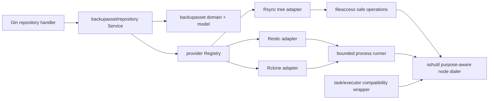

# 备份资产 Provider 读取适配 — Focused Design

## 0. Status And Decision Record

- Task: `07-13-backup-assets-provider-readers`
- Parent: `07-12-backup-data-explorer-design`
- Base: `main@8317fe6e04ea9ec1480460074ce9fe99ae8a7626` (`v0.45.0`)
- Dependency: merged Child 1 domain foundation at `9d8215f8d18d70e522cb8965ccb584d0a0f5162a`
- Status: implementation, contract audit, spec sync, and final local verification complete; Phase 3.4 commit pending
- User decision: 2026-07-13 selected **A — layered capability boundary**
- User approval: 2026-07-13 reviewed the focused package and explicitly authorized `task.py start`

This design narrows and corrects the parent Child 2 outline using the merged code. It does not change the parent product model: Repository and RecoveryPoint remain the truth boundary, Provider bytes remain authoritative, and Catalog/content remain later children.

## 1. Goals And Non-Goals

### 1.1 Goals

1. Give Rsync, Restic, and Rclone one honest read-only capability boundary without pretending that their identity, versioning, consistency, or Range semantics are equivalent.
2. Connect existing backup Tasks to stable Repository records through probe-first, encrypted access bindings and explicit Task lineage.
3. Provide bounded, cancelable, exact-locator point/entry list, stat, sequential open, and optional Range ports for later Catalog and Content consumers.
4. Move local/SFTP path access from check-then-use validation to an operation-coupled safety boundary, while retaining the legacy file browser's documented behavior.
5. Reuse purpose-scoped SSH credentials, known-host verification, credential audit, typed asset audit, and Child 1 state machines without introducing a reverse dependency on `task/executor`.
6. Expose only feature-gated Repository connect/list/detail/reconcile/disconnect APIs with fail-closed RBAC and lineage ownership.
7. Reuse the existing `000062` schema; no migration is required.

### 1.2 Non-Goals

- No Provider write, marker creation, publication, manifest build, restore, migration, retention, purge, or delete.
- No conversion of legacy Task execution, no change to backup commands, and no inference of historical RecoveryPoints from TaskRun rows.
- No public entry/content endpoint, frontend route, feature enablement, periodic Catalog build, or preview UI.
- No automatic import/rebuild/purge workflow; those remain Child 14.
- No claim that an agentless SFTP client can cryptographically constrain a malicious SSH/SFTP server.

## 2. Evidence-Driven Corrections To The Parent Outline

The merged implementation requires six corrections before Child 2 can be safe:

1. `ListRecoveryPoints() []NativePoint` is unbounded. All point and entry listing ports must accept a bounded page request and return an opaque continuation cursor.
2. `ToRecoveryPointDTO` currently infers all `xirang_manifest` points as `hardlink_tree`. Any Child 2 query that returns a RecoveryPoint must validate it with the owning Repository's actual `version_mode`; semantics alone are insufficient.
3. `DialSSHForNodePurpose` lives in `task/executor`, hard-codes task credential audit semantics, and depends on preloaded SSHKey state. Provider code must not import it. The generic purpose-aware dial boundary moves down to `sshutil`; the executor keeps a compatibility wrapper.
4. The current file handler validates a pathname and opens it later. That check-then-use shape has symlink replacement races. `fileaccess` must own list/stat/open operations, not merely return a validated string.
5. Restic has a native repository ID, while existing Rsync targets and general Rclone remotes do not. A single identity algorithm would either lie or block common existing backups. Identity strength and merge policy must therefore be explicit.
6. Child 1's theoretical `CapabilitiesForTask` currently sets Restic and Rclone Range to true. Child 2 cannot use that as an effective observation: Restic is sequential-only, and Rclone/Rsync Range remains false until the active binding's executable transport probe proves it.

## 3. Architecture And Dependency Direction



The dependency rules are mandatory:

- Root package `backupasset` remains domain-only and does not import concrete Provider, Gin, middleware, or task executor packages.
- `backupasset/provider` imports root `backupasset` types but not handlers or task executors.
- The application service lives in `backupasset/repository`, which may import both root domain and Provider registry packages. This avoids `backupasset -> provider -> backupasset` cycles.
- `fileaccess` is a filesystem security package. It does not import Gin, GORM, model, backupasset, or task packages.
- `sshutil` owns common purpose/scope/known-host/auth/dial mechanics. Provider and task executor depend downward on it.
- Handlers do not construct commands, decrypt bindings, query Provider locators, or mutate repository rows directly.

## 4. Package Responsibilities

### 4.1 `backend/internal/backupasset`

Child 1 remains the owner of:

- Provider/status/version/point/capability enums;
- state transition and profile validation;
- opaque IDs, sanitized DTO conversion, feature gate, lease, keyring, and audit;
- typed sentinel errors and permission constants.

Child 2 may extend the capability reason registry with safe codes required by the read boundary, but it must not introduce a parallel capability model.

### 4.2 `backend/internal/backupasset/provider`

Owns:

- narrow read and future mutation port types;
- registry and capability lookup;
- internal access-binding schema and exact Provider locators;
- signed opaque cursor codec;
- bounded process/session runner contracts;
- Rsync tree, Restic, and Rclone adapters;
- Provider-specific strict parsers and executable fakes.

It never owns Repository DB transactions or authorization.

### 4.3 `backend/internal/backupasset/repository`

Owns:

- feature-gated connect/list/detail/reconcile/disconnect application methods;
- loading Task/Node/bindings and mapping them into ephemeral Provider access;
- identity conflict, idempotency, active binding replacement, TaskRepositoryLink, Repository state, and mutable-head transactions;
- server-side Admin/Operator visibility scopes and per-lineage projection;
- safe error classification and typed asset/credential audit correlation.

### 4.4 `backend/internal/fileaccess`

Owns canonicalization, containment, symlink policy, entry typing, list/stat/open, resource caps, and pre/open/post invariants for local and SFTP trees. Callers supply already-resolved roots; this package never queries the database or reads `FILE_BROWSER_ALLOW_ALL`.

### 4.5 `backend/internal/sshutil`

Owns a purpose-aware node dialer that composes:

- managed-key purpose/node/tag scope;
- inline credential compatibility;
- known-host verification;
- TCP and SSH handshake cancellation/deadlines;
- resolved credential metadata suitable for audit, never secret material.

The existing task executor API remains as a thin compatibility wrapper so existing tasks do not change behavior.

## 5. Provider Port And Registry Contract

### 5.1 Narrow ports

Consumers request only the capability they need:

```go
type RepositoryProber interface {
    Probe(context.Context, AccessBinding, OperationLimits) (RepositoryObservation, error)
}

type PointLister interface {
    ListPoints(context.Context, ReadSnapshot, PageRequest) (NativePointPage, error)
}

type EntryLister interface {
    ListEntries(context.Context, ReadSnapshot, PointLocator, EntryLocator, PageRequest) (EntryPage, error)
}

type EntryStatter interface {
    StatEntry(context.Context, ReadSnapshot, PointLocator, EntryLocator) (Entry, error)
}

type SequentialReader interface {
    OpenSequential(context.Context, ReadSnapshot, PointLocator, EntryLocator, ReadRequest) (ReadHandle, ContentStat, error)
}

type RangeReader interface {
    OpenRange(context.Context, ReadSnapshot, PointLocator, EntryLocator, ByteRange) (ReadHandle, ContentStat, error)
}
```

`ReadSnapshot` binds every call to the opaque Repository ID, expected capability revision, expected point/source observation, and runtime access binding. A Provider cannot silently refresh these values during an operation.

`ReadRequest` carries a positive caller-authorized byte ceiling. Sequential handles enforce it while streaming and hold their concurrency slot until close; they do not reuse the metadata stdout limit. Range length is the corresponding hard byte ceiling for `RangeReader`. Later Content Broker policy supplies user/session/rate budgets, but no current or future consumer may request an unbounded reader.

Future types are frozen separately:

```go
type PointPublisher interface { Publish(context.Context, PublicationAttempt) (ProviderCommitEvidence, error) }
type ManifestBuilder interface { BuildManifest(context.Context, RepositoryRef, PointLocator) (ManifestStream, error) }
type RepositoryReconciler interface { Reconcile(context.Context, RepositoryRef) (RepositoryObservation, error) }
type PointDeleter interface { DeletePoint(context.Context, RepositoryRef, PointLocator, FencingToken) error }
```

Child 2 does not register or call a publisher, manifest builder, or deleter. Repository application reconciliation uses the read-only prober and persists its observation.

### 5.2 Registry

The registry stores a typed registration per `backupasset.ProviderKind` and has one getter per narrow port. A missing Provider or missing optional port returns `ErrCapabilityUnavailable` plus a safe capability reason. It never panics, returns nil-success, or falls back to another Provider.

No consumer may switch on `Task.ExecutorType`. Only task-to-binding construction at the repository connection boundary maps the existing Task executor type to a Provider kind.

Command Tasks without a future explicit artifact contract remain unregistered/unsupported and create no Repository, binding, link, or RecoveryPoint.

### 5.3 Exact internal locators

- Provider locators are internal typed values and are always `json:"-"`.
- Persisted Provider point/entry locators use the existing encrypted columns and model hooks.
- HTTP routes accept only opaque Xirang Repository IDs. Later asset routes will accept `AssetRef`, never Provider paths, remotes, or snapshot prefixes.
- Restic locators contain only a validated full snapshot ID and exact normalized entry path.
- Rsync/Rclone mutable point locators bind the single observed view plus its source fingerprint; they are not historical versions.

### 5.4 Bounded opaque pagination

`PageRequest` clamps the limit to a configured hard maximum and carries an opaque cursor. Cursor payloads contain only:

- format/key version and expiry;
- Provider kind and opaque Repository/point scope;
- capability/source revision;
- last opaque point/entry digest and sort direction.

They never contain a raw path, filename, remote, repository identity, or Provider locator. The Cursor Signing key signs the payload; Entry Identity/point-scoped digests let streaming adapters find the continuation without exposing the native locator. Scope, revision, expiry, signature, or missing-last-item mismatches fail closed as stale/invalid cursor.

Adapters may rescan a native listing to find a cursor, but memory, bytes, items, time, and concurrency remain bounded. A parser truncation or limit hit is an error, not a successful partial page.

Adapters do not trust Provider-native output order. They recover the previous opaque digest under the same source revision, then use a bounded top-k selection over the documented stable sort tuple (`name/path tuple + opaque digest` for entries, `captured time + opaque digest` for points). A missing previous digest or changed revision returns a stale/source-changed error rather than skipping or duplicating silently.

## 6. Repository Identity And Access Binding

### 6.1 Identity classes

`RepositoryObservation` records an internal identity class:

| Provider/mode | Identity class | Merge policy |
|---|---|---|
| Restic | `native_repository` from validated `restic cat config` ID/version | May reuse one Repository across Tasks; each future snapshot still requires exact producing lineage |
| Rsync legacy mutable | `task_scoped_endpoint` from verified node/local root facts | Never auto-merge across Tasks; one Repository view and mutable head per lineage |
| Rclone legacy mutable | `task_scoped_endpoint` from verified node, remote/backend, and bound-root facts | Never auto-merge across Tasks; one Repository view and mutable head per lineage |

This is deliberately asymmetric. A shared mutable Repository has only one singleton head but the current schema has one producing lineage per point; auto-merging two Tasks would create ambiguous ownership. Restic can share the Repository because Child 3 will attribute each full snapshot separately.

### 6.2 Scoped endpoint identity

Rsync/Rclone do not expose a universal native repository ID and Child 2 cannot write a marker. Their scoped identity therefore uses a random 256-bit `identity_salt` stored only inside the encrypted access binding. Probe computes a domain-separated HMAC over a canonical identity document containing:

- identity schema version and Provider kind;
- exact Task lineage ID;
- stable local/Node ID;
- canonical root or bound remote/backend facts;
- read-only root/provider facts such as filesystem identity or backend type.

The persisted identity is a non-secret versioned digest. The raw canonical document, root, remote, and salt are never placed in DTOs, logs, errors, or audit. A reconnect for the same Task loads the retained binding salt and must reproduce the same identity. A different identity cannot overwrite the old Repository.

The same salt derives `config_fingerprint` with a distinct HMAC label. This avoids a bare low-entropy path hash and does not reuse Entry Identity or Audit Fingerprint key domains.

If a disconnected scoped Repository has lost all decryptable bindings/salt, Child 2 fails closed. Re-identification/import belongs to Child 14.

### 6.3 Access binding schema

`RepositoryAccessBinding.EncryptedConfig` stores versioned internal JSON containing only what runtime access needs:

- schema and identity class/version;
- Task and Node references;
- encrypted identity salt for scoped identities;
- exact provider root/remote/repository locator;
- Restic repository password/access material or safe credential references;
- necessary non-secret probe facts and adapter revision.

All content is encrypted by the existing model hook. Normal API responses never serialize a binding model. Code that writes plaintext binding/locator values must use hook-triggering `Create`/`Save`; map-based GORM updates may update non-secret status fields only and must never write secret fields.

### 6.4 Task-derived connect contract

Child 2 connects existing backups, not arbitrary caller-supplied storage:

```json
{
  "task_id": 42,
  "repository_id": "optional-opaque-reconnect-target",
  "display_name": "optional label",
  "description": "optional label",
  "replace_access": false
}
```

The request never accepts `provider`, `remote`, `path`, shell fragments, Restic passwords, SSH private keys, or Rclone configuration. The service loads the Task and Node, validates that it is Rsync/Restic/Rclone, and constructs ephemeral access from server-side records.

Direct manual binding/import is deferred to Child 14. This constraint both serves current backup data and prevents the new route from becoming an arbitrary SSH/file/remote reader.

### 6.5 Probe-first connect transaction

1. Check `backup_assets.enabled` before Task/Node lookup, credential resolution, Provider I/O, or mutation.
2. Load the Task/Node and any existing active link/binding needed to reuse a scoped identity salt.
3. Build ephemeral access and perform a bounded read-only probe outside the DB transaction.
4. Validate Provider identity, identity class, capability set, adapter revision, availability, and sanitized observation.
5. In one transaction:
   - resolve Repository by exact strong identity or existing task-scoped link;
   - reject a supplied Repository whose identity differs;
   - create/reuse Repository and active TaskRepositoryLink;
   - retain an existing usable active binding unless `replace_access=true` explicitly targets the same Repository identity;
   - when replacing, revoke the old binding and create one new active encrypted binding;
   - update Repository status/capability timestamps;
   - create/update the single mutable head only for legacy mutable modes.
6. Commit, return sanitized DTOs, and write correlated typed audit evidence.

Retries are idempotent. A uniqueness race reloads and revalidates the winning identity/link rather than converting a constraint error into a second Repository.

## 7. Provider-Specific Read Semantics

### 7.1 Rsync/local tree adapter

Rsync is a publication tool; Child 2 reads its existing target tree through local or SFTP file access and never invokes an Rsync write path.

- Probe resolves the exact bound root, checks it is a directory, captures local/remote filesystem identity and a weak observation fingerprint, and proves supported list/stat/open behavior without creating a write-check file.
- The legacy mutable Provider exposes exactly one synthetic native point bound to the stable Xirang observed RecoveryPoint.
- List/stat/open operate only beneath the verified root through strict `fileaccess` policy.
- Symlinks may be listed as symlink entries but are never traversed or opened by Provider reads.
- FIFO, socket, device, and other special entries may be typed/listed but cannot be opened.
- Sequential read is available for regular files.
- Range is reported only for the concrete local/SFTP transport whose seek/read-at fixture passes, and every operation binds the opened handle to the expected source metadata. It is not inferred merely because Go exposes `io.Seeker`.
- Directory/root metadata is a change detector, not a manifest or immutable proof. Fidelity/consistency remains explicitly mutable/weak.

The adapter never calls `RsyncExecutor.Run`, `EnsureLocalTargetReady`, restore, mkdir, probe-file, or write-check code.

### 7.2 Restic adapter

Allowed read-only command families are fixed by the adapter:

- probe: `version`, `cat config`;
- points: `snapshots --json`;
- entries/stat: `ls --json <full-snapshot-id> <exact-path>`;
- sequential content: `dump <full-snapshot-id> <exact-path>`.

Contracts:

- Repository identity comes only from a strictly parsed native config ID/version, never repository path or password.
- Snapshot IDs must be full validated IDs; `latest` and prefixes are prohibited.
- JSON/NDJSON parsing is streaming and strict. Unknown required record types, malformed/truncated/oversized lines, output limits, or schema mismatch fail the operation; no invalid row is silently skipped.
- Snapshot/entry pages use opaque cursor continuation and bounded output.
- `dump` exposes sequential read only. Child 2 does not claim native Range by discarding bytes.
- Repository password is delivered through a bounded write-only SSH session stdin and the fixed `/dev/stdin` password-file path, then stdin is closed before parsing output. It never appears in argv, environment, a remote temporary file, logs, errors, or audit. A runtime that cannot prove this transport fails the Restic capability probe instead of falling back to secret-bearing command text or temp-file creation.
- Shared repository snapshots are not persisted or attributed by this child. Child 3 will use run evidence/tags and full IDs; whole-repository results never inherit the calling Task's ownership.
- `init`, `backup`, `restore`, `forget`, `prune`, `unlock`, and any mutation are impossible through the registered Child 2 command allowlist.

### 7.3 Rclone adapter

Allowed command families are fixed:

- probe: `version` and bounded backend/remote capability facts;
- list: `lsjson <bound-root> --max-depth 1`;
- stat: `lsjson <exact-object> --stat`;
- sequential content: `cat <exact-object>`;
- optional Range: `cat <exact-object> --offset N --count M`.

Contracts:

- Remote/config/root come only from encrypted server-side binding construction.
- Provider identity is task-scoped; remote names or paths alone are never treated as a globally stable repository identity.
- Backend hash, mtime precision, listing consistency, object versioning, and Range behavior are explicit facts, not inferred from the Rclone version string.
- Range defaults to unavailable. It becomes available only after a bounded read-only fixture/probe against a regular existing object proves exact offset/count semantics for the active binding. Empty/unprovable repositories remain sequential-only.
- Missing/weak hashes and eventual-consistency behavior are represented as fidelity/consistency facts, never upgraded to strong verification.
- `sync`, `copy`, `move`, `delete`, `purge`, `mkdir`, `rmdir`, `cleanup`, and mutating `backend` operations are absent from the Child 2 allowlist.

### 7.4 Command

Command remains `task_artifact_contract_missing`. It has no prober or reader registration and creates no asset records.

## 8. Operation-Coupled Safe File Access

### 8.1 API shape

`fileaccess` returns results/handles, never an allegedly safe pathname:

```go
type Tree interface {
    List(context.Context, Root, Locator, Policy, PageRequest) (EntryPage, error)
    Lstat(context.Context, Root, Locator, Policy) (EntryStat, error)
    OpenRegular(context.Context, Root, Locator, Policy) (ReadHandle, ContentStat, error)
}
```

Policies are explicit:

- `LegacyAbsoluteOrRelative + FollowOnlyWithinRoot` preserves the existing file browser contract.
- `StrictRelativeLocator + NeverFollow` is mandatory for Provider reads.
- `FILE_BROWSER_ALLOW_ALL` remains a legacy handler-only development bypass and is never visible to Provider code.

Strict locators reject empty/ambiguous components, NUL, absolute/volume paths, `.`, any `..` component, invalid encoding, and option-like ambiguity before I/O.

### 8.2 Local implementation

- Use Go 1.26 `os.Root` as the cross-platform contained compatibility primitive; it holds a root handle and prevents traversal outside the tree across renames and internal symlinks on supported platforms.
- On Linux, strict Provider roots additionally hold their own read-only `O_PATH|O_DIRECTORY` dirfd for fd-relative `openat2` operations with `RESOLVE_BENEATH`, no magic links, and no symlink following. Strict code does not attempt to extract the unexported fd from `os.Root`. Opened type/metadata are checked from the returned fd/handle.
- A platform without a race-resistant strict implementation reports the strict Provider capability unavailable; it does not silently fall back to check-then-use. Legacy browser behavior may continue through the contained compatibility policy.
- Mount/bind/proc/device boundaries and special files are explicitly classified; open is regular-file only.

### 8.3 SFTP implementation and trust boundary

SFTP has no portable atomic `openat2` equivalent. The implementation therefore:

1. validates strict relative locator and canonical root;
2. performs `Lstat`/`RealPath` containment and type checks;
3. opens the exact directory/file handle;
4. rechecks path/type/source metadata before returning or reading bytes;
5. closes and returns typed `mutable_source_changed` on observable change;
6. keeps cancellation connected to handle/SFTP/SSH session closure.

`github.com/pkg/sftp.ReadDirContext` accumulates the complete directory before returning, so strict Provider listing must not use it as the resource boundary. `fileaccess` accepts a directory-enumerator interface: the Provider supplies a bounded, server-generated read-only remote enumeration through the common runner, while the legacy browser may use its compatibility enumerator. Both paths still use the same containment/open mechanics and apply a hard result cap; the strict Provider path additionally enforces byte/time/item limits before accumulation can grow without bound. Unsupported remote enumeration capability fails closed instead of falling back to unbounded SFTP listing.

This protects against mistakes, static escapes, and observable races. It does not defend against a malicious trusted SSH server that lies differently on each operation; that would require a future remote helper/agent and is outside this agentless child.

### 8.4 Legacy file handler migration

The current file handler must call the shared operations and preserve:

- default/absolute path behavior;
- allowlisted roots;
- root-internal symlink following;
- development-only allow-all behavior;
- existing response and credential-audit contracts.

Database failures while loading allowed roots become internal errors instead of silently shrinking or bypassing the root set. List limits apply during enumeration, not after unbounded accumulation.

## 9. SSH, Process, Cancellation, And Resource Safety

### 9.1 SSH purposes

Add three exact managed-key purposes:

- `repository_probe`
- `repository_list`
- `repository_read`

Each is independently scope-checked. A key scoped to one cannot satisfy another. Empty managed-key scope retains the existing broad compatibility behavior. Inline Node password/private-key credentials still lack per-purpose metadata; the purpose classifies/enforces the call path and audit, but the design does not falsely claim that it narrows inline credentials.

### 9.2 Purpose-aware node dialer

The lower dialer:

- resolves managed or inline credentials through the existing provider;
- denies disabled/expired/wrong-purpose/wrong-node/wrong-tag managed keys before auth material or network use;
- verifies known hosts;
- honors context during TCP dial and SSH handshake by deadline/connection closure;
- returns only safe credential kind/source/ID metadata;
- accepts explicit audit context instead of hard-coding `task.credential.use`.

Provider callers write the exact credential-audit actions `repository.probe`, `repository.list`, and `repository.read` with the request correlation ID. Existing task callers continue to emit existing task actions through the compatibility wrapper.

### 9.3 Bounded runner

The runner accepts a server-defined tool enum, subcommand enum, and separately validated operands. It never accepts a raw command string from a handler or request.

Local execution uses `exec.CommandContext` argv. SSH protocol ultimately takes a command string; one central serializer quotes each validated operand and emits only an allowlisted binary/subcommand. This is described honestly as fixed server-side argv serialization, not native remote argv support.

Every operation has:

- context cancellation and configured timeout;
- global/provider semaphore;
- separate stdout/stderr pipes and hard byte/record/line limits;
- optional bounded secret stdin that is written once, never copied into result/error state, and closed before output consumption;
- strict streaming parser;
- bounded termination: close readers, TERM where supported, short grace, close session/client, join goroutines;
- typed timeout/canceled/limit/protocol/offline errors;
- no partial-success result after truncation, cancellation, parser failure, or source revision mismatch.

Metadata stdout is bounded by the Provider metadata setting. Content stdout is never accumulated: it is exposed only through a `ReadHandle` with the explicit `ReadRequest`/Range byte ceiling, caller context, held concurrency permit, and close/wait lifecycle. Raw argv, locator, remote, credential, stdout, and stderr never enter DTOs, logs, errors, or audit.

## 10. Repository And Mutable-Head State

### 10.1 Capability revision

Provider observation returns adapter contract revision plus effective capabilities. Repository `capability_revision` increments whenever the persisted effective capability snapshot changes or the adapter contract revision requires revalidation. Read snapshots/cursors bind this integer; stale readers fail rather than silently changing semantics.

`CapabilitySet.Reason` remains one primary overall blocking reason. Optional-port failures such as Range use a typed capability-unavailable error when requested; the design does not create a second parallel capability collection.

### 10.2 Successful reconcile

- Probe the active binding outside a transaction.
- Revalidate exact identity against the stored Repository.
- Atomically update status, last-seen/reconciled timestamps, capability revision/snapshot, and safe availability facts.
- For Rsync/Rclone legacy mutable views, create the singleton `state=observed`, `semantics=mutable_head` row once or apply the new observation to the same ID.
- Update `observed_at`, source fingerprint, availability, capability revision, and consistency/fidelity snapshots; never create history.
- Restic native snapshots are not persisted in Child 2.

### 10.3 Failed reconcile

- Preserve the last successful identity, source fingerprint, observed time, and mutable state.
- Update Repository status/last-reconciled time and a safe capability/availability reason.
- Mark mutable physical availability offline/unknown as appropriate without changing `observed` to `degraded` or `failed`.
- Do not return a partial observation or delete prior facts.

Until the Catalog child owns an explicit Catalog staleness read model, Repository/mutable staleness is derived from Repository status, `last_seen_at`, `last_reconciled_at`, `observed_at`, and physical availability. Child 2 does not add a second persisted staleness column.

### 10.4 Disconnect

In one transaction:

- revoke the active binding and set `revoked_at`;
- move Repository to `disconnected` through the Child 1 state machine;
- leave links, Repository, RecoveryPoints, Catalog rows, locators, identity, and Provider bytes intact;
- keep a mutable head `observed` but offline/stale, preserving its last successful fingerprint/time.

Reconnect must target the opaque Repository and reproduce the same identity. Retire/import/rebuild/purge remain later lifecycle operations.

## 11. API, Authorization, Ownership, Audit, And Errors

### 11.1 Routes

All routes live under the authenticated secured `/api/v1` group:

| Route | Permission | Behavior |
|---|---|---|
| `POST /backup-repositories/connect` | `backup_repositories:manage` | Task-derived probe-first connect/reconnect |
| `GET /backup-repositories` | `backup_assets:list` | Cursor-paged lineage-scoped list |
| `GET /backup-repositories/:id` | `backup_assets:list` | Sanitized detail after visibility resolution |
| `POST /backup-repositories/:id/reconcile` | `backup_repositories:manage` | Bounded synchronous read-only probe + observation transaction |
| `POST /backup-repositories/:id/disconnect` | `backup_repositories:manage` | Revoke access only |

There is no standalone arbitrary probe route. Connect and reconcile use probe internally. This avoids accepting secret/locator input without a persistent resource and matches the existing typed audit registry.

### 11.2 Feature gate ordering

Auth and RBAC run before the handler, so Viewer/unknown roles cannot use feature state as an oracle. Inside the application service, the feature gate is the first operation. Disabled mode returns a stable typed `feature_disabled` response and performs zero Task/Repository query, decryption, credential resolution, SSH, Provider command, DB mutation, or success audit.

### 11.3 Visibility

- Admin may manage and read all Repository metadata.
- Operator may list/detail only when at least one active non-null TaskRepositoryLink or RecoveryPoint `producing_task_id` joins to a live Task whose current Node is owned. Snapshot columns are display/history facts, never authorization authority.
- Operator projections include only owned lineages. Child 2 returns no cross-lineage aggregate counts or evidence; detail contains only filtered safe lineage summaries. Later children may add counts only after filtering first.
- Owning one Task in a Restic shared Repository never grants access to another Task's snapshots.
- Unattributed/imported/deleted-task lineage is Admin-only.
- Viewer has no asset permission and receives 403 before service invocation.
- Operator access to an unowned opaque ID returns the same not-found response as a missing ID.

Repository identity, access-binding details, raw capability evidence, roots, remotes, and credentials are absent from DTOs. `RepositoryDTO` remains the public core; detail wrappers contain only authorized safe lineage summaries and access status appropriate to the caller.

### 11.4 Typed audit

Use the Child 1 actions without expanding them:

- connect (including `stage=probe`) -> `repository_connect`;
- list/detail -> `repository_list` with `stage=list|detail`;
- reconcile -> `repository_reconcile`;
- disconnect -> `repository_disconnect`.

The HTTP request ID is the correlation ID for asset audit, credential audit, and safe structured logs. Events contain only opaque IDs, safe stage/outcome/code, counts, capability reason, and correlation ID. They never contain repository identity, raw path/name/remote, Provider locator, config, argv, output, or credential material.

Typed asset/credential audit writes follow the established best-effort policy: failures emit a bounded safe warning and do not expose payload/error details. Primary authorization still fails closed independently.

### 11.5 Error mapping

A single handler mapper uses standard response envelopes:

| Domain result | HTTP behavior |
|---|---|
| invalid request/opaque ID | 400 |
| RBAC denial | 403 before handler |
| missing or Operator-unowned resource | 404 |
| identity/active-binding/state conflict | 409 |
| feature disabled | 503 with `feature_disabled` reason |
| Provider offline/timeout | 503 with safe reason/correlation ID |
| unsupported Provider/capability | 501 through the named typed capability-error helper, with a safe reason |
| unexpected DB/crypto/protocol error | generic 500 via `respondInternalError` |

Known capability responses may place a validated `CapabilityReason` and correlation ID in `Response.Data` through one named response helper. Handlers never construct ad hoc `c.JSON`, and raw `err.Error()` is never returned.

Safe capability/error additions required by implementation are limited to identity unavailable, protocol incompatible, operation timeout, and resource limit. Params remain Child 1 allowlisted safe enums/numbers/correlation ID only.

## 12. Settings And Limits

Child 2 adds dynamic non-secret settings through `settings.Service`:

| Key | Default | Validation | Use |
|---|---:|---|---|
| `backup_assets.provider_operation_timeout` | `2m` | `5s..30m` | probe/list/stat/setup timeout |
| `backup_assets.provider_max_concurrency` | `4` | `1..32` | shared Provider semaphore |
| `backup_assets.provider_metadata_limit_bytes` | `16777216` | `65536..67108864` | maximum metadata stdout/parser budget |

Stderr, individual record, page size, and termination-grace hard ceilings remain conservative code constants. Content streaming duration/bytes/rate are later Content Broker policy and are not smuggled into these metadata settings.

## 13. Compatibility, Schema, Documentation, And Rollback

### 13.1 No schema migration

`000062` already supplies Repository identity uniqueness, one active binding, one active Task link, singleton mutable head, encrypted locators, capability snapshots, observation fields, and lineage snapshots. Child 2 must not add an observation-history table or queryable error column.

Versioned access-binding JSON, identity class prefixes, capability JSON, and consistency/fidelity JSON fit existing encrypted/text columns.

### 13.2 Existing behavior

- Existing backup/restore/retention/snapshot/task commands remain unchanged.
- Existing file browser routes keep their public behavior while switching to shared safe operations.
- Existing Restic snapshot handlers are not silently redefined as the new asset API.
- Feature remains disabled by default and no frontend navigation is added.
- Swagger and the backend maintainer route reference document only the five actual feature-gated routes.

### 13.3 Rollback

1. Set `backup_assets.enabled=false` to stop all new service/Provider behavior.
2. Stop using or explicitly disconnect bindings if operationally required.
3. Preserve additive Repository/link/RP/audit rows and the `000062` schema for forward-fix.
4. Do not delete or rewrite Provider bytes; Child 2 never wrote any.
5. The legacy file browser may be switched back only if the old race-prone implementation is still considered acceptable; preferred rollback is to retain the hardened `fileaccess` boundary.

No Git/database rollback may claim that disabling the feature removes Repository history or Provider data.

## 14. Threat Model And Test Strategy

### 14.1 Trust boundaries

- Trusted: Xirang process, configured database/KEK, verified SSH host identity, and remote SSH/SFTP service as infrastructure.
- Untrusted: HTTP input, Task labels/config shape, paths/remotes before validation, Provider output, repository contents, symlinks/special files, concurrent source mutation, cursor tokens, tool versions/schema, and cancellation timing.
- Explicitly not defended in Child 2: a malicious remote SSH/SFTP server that fabricates a self-consistent but false filesystem view.

### 14.2 Required contract suites

Provider/registry:

- compile-time narrow ports, unknown/missing capability, Command unsupported;
- cursor signature/scope/revision/expiry/stale-item rejection;
- no public DTO or audit serialization of locators/bindings.

Identity/service:

- Restic native identity merge without lineage expansion;
- scoped salt/HMAC stability, task isolation, config fingerprint domain separation;
- probe-first no-write failure, idempotent retry, identity conflict, explicit binding replacement;
- transaction and uniqueness-race behavior;
- no migration/table additions.

File access:

- NUL/absolute/volume/dot/dot-dot and overlapping roots;
- root/internal/escaping/dangling symlink cases and injected races;
- local root rename, Linux strict open, unsupported-platform fail-closed;
- FIFO/socket/device/hardlink/permission/disappearance;
- bounded enumeration and cancellation;
- legacy browser compatibility and Provider bypass isolation.

Restic fake:

- version/config native identity;
- shared repository and full/short snapshot IDs;
- valid/malformed/truncated/oversized JSON/NDJSON and unknown records;
- exact Unicode/leading-dash path serialization and binary dump;
- cancellation/timeout/output cap;
- negative command audit proving no latest/init/backup/restore/forget/prune/unlock.

Rclone fake:

- task-scoped endpoint identity;
- list/stat/sequential read with weak/missing metadata;
- exact/unsupported/incorrect offset-count behavior;
- remote/path option and shell injection characters;
- eventual change/source mismatch and empty repositories;
- negative command audit proving no mutation subcommand.

SSH/runner:

- each repository purpose and every wrong-purpose pair;
- disabled/expired/node/tag scope before credential/network use;
- inline-credential compatibility claims;
- TCP/handshake/session cancellation;
- TERM-ignore forced close, goroutine cleanup, stdout/stderr/line/item limits;
- secret-free error/log/audit with shared correlation ID.

API/ownership/audit:

- full middleware chain: no token, Admin, Operator, Viewer, unknown role;
- disabled mode zero side effects after RBAC;
- mixed-lineage shared Restic projection and no-existence leak;
- sanitized connect/list/detail/reconcile/disconnect envelopes;
- mutable singleton success/failure/disconnect invariants;
- exact route/action coverage and Swagger freshness.

### 14.3 Negative reachability scans

Tests/source checks must prove that the Child 2 registry and application service cannot reach Provider mutation commands, raw executor `CombinedOutput`, raw handler path validators, arbitrary shell templates, map-based secret updates, standalone probe input, public Provider locator fields, migration files, frontend routes, or feature enablement.

## 15. Design Review Checklist

- [x] Uses the merged Child 1 model and state machine without a second abstraction.
- [x] Avoids Go import cycles by separating root domain, Provider, and repository application packages.
- [x] Makes both point and entry listing bounded and cursor-scoped.
- [x] Does not infer RecoveryPoint version mode from semantics alone.
- [x] Supports all three Providers honestly without writing a marker.
- [x] Prevents mutable lineage ambiguity through task-scoped Rsync/Rclone identities.
- [x] Keeps Restic shared Repository identity separate from snapshot ownership.
- [x] Replaces check-then-use path validation with operation-coupled access.
- [x] States the SFTP malicious-server limitation explicitly.
- [x] Moves generic SSH purpose/dial behavior below task executor.
- [x] Defines strict command, output, timeout, cancellation, and concurrency boundaries.
- [x] Uses existing RBAC/audit actions and no standalone arbitrary probe route.
- [x] Preserves disabled-by-default, no-UI, no-migration, and no-Provider-mutation boundaries.
- [x] Defines idempotency, failure preservation, disconnect, and rollback behavior.

## 16. Implementation Gate

Implementation may begin only after:

1. this focused design and the matching `implement.md` pass written review;
2. the user reviews the final planning package and explicitly authorizes `task.py start`;
3. `trellis-before-dev` reloads the exact backend/API/security specs;
4. the work branch still starts from the recorded released base with only reviewed planning changes.
