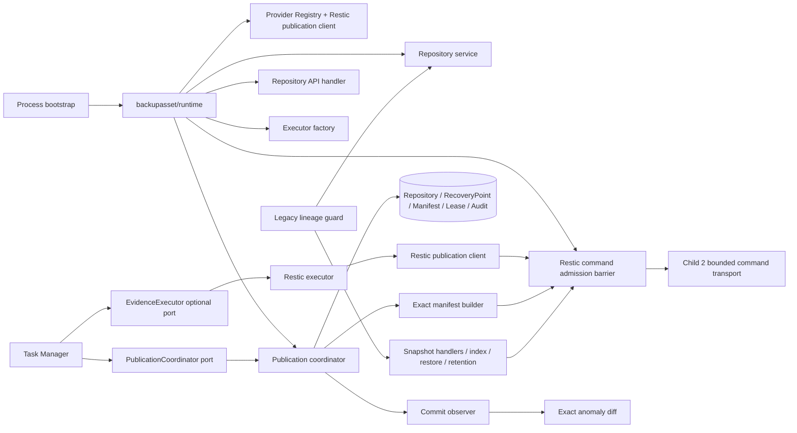

# Restic 精确血缘与恢复点发布 — Focused Design

## 0. Status And Decision Record

- Task: `07-14-backup-assets-restic-lineage`
- Parent: `07-12-backup-data-explorer-design`
- Base: `main@e1a8f24c3c8b8b71581cedc148c5f32482c8ac0b`
- Dependencies: merged Child 1 domain foundation and Child 2 Provider readers/repository access
- Status: in_progress; no product code or migration had been created at activation
- Architecture decision: layered publication coordinator around an optional evidence-aware executor
- Schema decision: user approved **A** on 2026-07-14 — paired `000063_backup_asset_publication_contract`
- Design review: user explicitly approved the complete Child 3 design on 2026-07-14 and stated there were no other objections
- Implementation gate: the user approved focused `implement.md` and explicitly requested implementation on 2026-07-14; `task.py start` completed and the task entered `in_progress`
- Implementation-plan self-review: executable-contract clarifications recorded after design approval are non-product-semantic—application/schema-down preflight mirrors the approved active-lease SQL guard; settings mutations use one explicit serialized snapshot; the ten-second command-join bound lives in neutral `sshutil` before settings consume it; admission tokens preserve rollback-safe mode; unfiltered point/TaskRun readiness cannot hide live-lease, backoff, batch, or current-process work; pre-command rejection is distinct from joined-command failure; worker callback ownership is singular; and reconciliation reports the typed publication outcome

This design corrects the parent Child 3 outline using current-main code and Restic v0.19.1 evidence. It does not change the parent product model: Repository and RecoveryPoint remain the backup truth boundary, Catalog remains rebuildable, and no public asset browser is introduced by this child.

## 1. Goals And Non-Goals

### 1.1 Goals

1. Attribute each successful asset-managed Restic run to the exact full native snapshot ID created by that command.
2. Make same-run retry/reconciliation idempotent and prevent different Tasks or TaskRuns in a shared Repository from claiming each other's snapshots.
3. Preserve three independent facts: Provider transfer result, publication evidence result, and RecoveryPoint publication state.
4. Publish a `committed` RecoveryPoint only after exact Repository identity, full snapshot ID, required tags, complete canonical manifest, and minimum verification all agree.
5. Reuse Child 2's typed access binding, safe argv runner, secret stdin, concurrency, cancellation, and resource controls for the new publication lane.
6. Centralize RecoveryPoint/manifest/lease/audit transactions in a Provider-neutral coordinator that Child 4 and Child 5 can reuse.
7. Recover safely from process death in both double-write windows without guessing `latest`, scanning by time, deleting Provider data, or rerunning an ambiguous backup.
8. Prevent legacy snapshot, anomaly, restore, and retention paths from crossing Task lineage when the asset feature is enabled.
9. Keep pristine `backup_assets.enabled=false` behavior compatible and free of Repository/RecoveryPoint/tag/audit side effects, while never reopening unsafe legacy operations after publication history exists.
10. Repair the schema contract honestly through paired SQLite/PostgreSQL migration `000063`.

### 1.2 Non-Goals

- No Rsync/Rclone versioned publication; those remain Child 4–5.
- No Catalog generation, asset search API, content ticket, preview, download, export, controlled recovery, or lifecycle deletion.
- No historical Restic import or backfill from untagged snapshots; Child 14 owns explicit import/reconnect.
- No `restic init`, `forget`, `prune`, `delete`, `restore`, `unlock`, repository repair, or retention mutation in the new publication lane.
- No new publication-attempt/outbox table and no new TaskRun publication columns.
- No frontend, Swagger-visible asset route, public feature enablement, or change to the default feature flag.
- No promise that policy verification, post-hooks, or downstream automation completed when a process died after Provider commit.

## 2. Evidence-Driven Corrections To The Parent Outline

The current code requires these corrections:

1. `TaskRun.ID` exists before executor invocation, but both current `Executor.Run` and the parent `EvidenceExecutor` draft omit it. The evidence request must carry exact run identity and a preallocated publication attempt.
2. `(int, *Evidence, error)` cannot represent exit-zero transfer plus invalid/missing evidence. Transfer errors and evidence failures require separate typed channels.
3. The legacy Restic executor merges stdout/stderr, uses the default scanner limit, ignores `scanner.Err()`, logs unconsumed JSON, writes a remote password file, and discards the summary. The asset lane must use the Child 2 runner instead of incrementally blessing that path.
4. RecoveryPoint/manifest transactions do not belong in Task Manager. Manager owns TaskRun orchestration; Repository publication service owns asset state and fencing.
5. Manifest completeness is already frozen as `complete | partial | unavailable`; a failed publication is `RecoveryPoint.state=failed`, not a fourth completeness value.
6. `task_repository_links.publication_mode` lacks `native_snapshot`, and Child 2 currently persists Restic as the false Rclone meaning `native_object_versions`.
7. `RecoveryPointLease` lacks a publication holder, while the schema has no uniqueness constraint for producing TaskRun or claimed native snapshot.
8. Child 2 Provider runtime is constructed privately inside API Router, so Task Manager cannot reuse its transport, Registry, limits, identity, or command runner.
9. Shared-repository risk is broader than `SnapshotFileIndex`: old list/files/search/diff/restore, anomaly `--latest 2`, task-level `restore latest`, and untagged `forget --prune` also bypass exact lineage.
10. TaskRun retention deletes old rows and clears the nullable FK. The RecoveryPoint must copy immutable run/link facts into typed lineage JSON before execution.
11. A fresh Child 1 lease currently derives its absolute deadline from each acquire time. Because execution and manifest publication use separate lease stages, every stage must reuse one immutable point-wide deadline instead of extending it.
12. RecoveryPoint owns an encrypted Provider locator but not encrypted commit evidence; full commit evidence is persisted on the Manifest. The verifying point therefore stores an exact versioned encrypted locator plus a safe, versioned summary envelope and canonical evidence digest in `ConsistencyJSON`, allowing byte-equivalent reconstruction after restart without adding another schema column.
13. Restic `ls` is name-ordered within each directory and depth-first, not globally ordered by full path. Canonical streaming validation must model that traversal with bounded O(depth) state.
14. Attempt tags are written before backup and Restic exit 3 can still save a tagged snapshot. Therefore tags prove attempt ownership but not exit-zero completion; a preparing point without a durable completion class can be quarantined exactly, but never auto-promoted by reconciliation. Restic v0.19.1 also persists a typed `Snapshot.Summary` (capture interval and backup counters) inside the snapshot object returned by `snapshots --json`, so durable `known_exit_zero` plus one exact-tag snapshot can rebuild commit evidence without trusting a rejected stdout summary; nil/invalid stored summary fails closed.

## 3. Architecture And Dependency Direction



Mandatory dependency rules:

- Root `backupasset` remains domain-only and does not import Provider, Repository, runtime, Gin, or task executor packages.
- `backupasset/provider` imports root domain and lower `sshutil`, but never imports API handlers or `task/executor`.
- `task/executor` may depend downward on Provider contracts; Provider never depends upward on executor callbacks or Task Manager.
- `backupasset/repository` owns DB/application transactions and may import root domain, Provider, and models. It does not import Task Manager.
- `backupasset/runtime` is the sole composition root below `cmd/server`; it may assemble Provider and Repository packages but contains no domain decisions.
- Task Manager depends on narrow coordinator/observer interfaces and never parses Restic JSON, tags, locators, or manifests.
- Legacy handlers depend on a lineage guard, not direct queries that reinterpret encrypted Provider locators.

## 4. Package Responsibilities

### 4.1 `backend/internal/backupasset`

Owns and extends:

- `PublicationNativeSnapshot` Task publication mode;
- `LeaseHolderPointPublication` holder type;
- typed publication audit actions and safe fields;
- typed immutable lineage summary encoding/decoding;
- publication failure/reconciliation reason codes shared by Repository DTOs and audit;
- settings accessors and validation for publication/manifest limits.

It does not run Provider commands or manage a worker loop.

### 4.2 `backend/internal/backupasset/provider`

Owns:

- publication attempt/commit/manifest value types and an execution lease-session port that contain no GORM behavior;
- Restic tag codec and strict full-ID validation;
- a Provider-specific Restic publication client using typed command operations;
- bounded backup stdout parsing with separate stderr completion evidence;
- exact-tag reconciliation lookup;
- exact full-ID recursive manifest streaming and canonical hashing;
- Registry access to optional `ManifestBuilder`/Restic publication capability;
- safe command purpose/operation allowlists.

It never creates or transitions RecoveryPoint rows.

### 4.3 `backend/internal/backupasset/repository`

Owns:

- feature-gated execution-session `Prepare`, `RecordProviderCommit`, `Defer`, and `Fail` application methods, plus `ListCandidates`/`ProcessPoint` reconciliation methods that let the runtime apply one concurrency bound to both wake-driven and periodic work;
- active Repository/Task link/access binding resolution and native identity revalidation;
- repository-scoped Restic binding validation plus per-linked-Task execution
  access derivation, so a shared native Repository keeps one retained binding
  without borrowing another Task's Node, locator, secret, or audit identity;
- deterministic point allocation, immutable lineage snapshot, point-wide deadline, lease acquire/takeover/heartbeat/release;
- `preparing -> verifying -> committed|failed` state transitions;
- inactive partial/unavailable manifest revisions and active complete manifest publication;
- source-fingerprint/native-ID conflict classification;
- exact Task lineage guard used by legacy surfaces;
- typed asset/credential audit correlation.

It never decides TaskRun success/retry status.

### 4.4 `backend/internal/backupasset/runtime`

Constructs exactly once:

- Foundation service and settings-backed limits;
- Keyring/cursor codec and asset audit writer;
- Node dialer, shared concurrency gate, and command transport;
- Rsync/Restic/Rclone read adapters;
- Restic publication/manifest client;
- one generation-fenced Restic command-admission barrier covering backup, read, restore, anomaly, retention, publication, manifest, and reconciliation commands;
- Provider Registry;
- Repository/publication/lineage-guard services and publication reconciler.

`cmd/server` constructs this runtime before the executor factory and Task Manager, injects its Restic publication client into the executor factory, injects its coordinator/guard into Manager, and passes its Repository service to Router. Router no longer creates a second Provider runtime.

### 4.5 `backend/internal/task/executor`

Owns the optional evidence execution extension and maps existing Task fields into a Restic backup request. The compatibility `Executor.Run` path remains unchanged for pristine feature-disabled execution and all non-evidence executors; a safety-latched Restic Task is blocked before fallback.

### 4.6 `backend/internal/task`

Manager owns:

- TaskRun and Task transfer/verification status;
- pre/post-hook and existing policy verification order;
- selecting compatibility `Run` versus optional `RunWithEvidence`;
- translating timeout/cancel/non-zero/evidence failure into coordinator `Defer` or `Fail` calls;
- marking an interrupted stale TaskRun honestly through a reconciler callback;
- dispatching exact anomaly work only from committed publication outcomes.

Manager never writes a RecoveryPoint or Manifest model directly.

## 5. Typed Contracts

### 5.1 Provider attempt and commit evidence

Conceptual contract; exact fields are private/internal and all sensitive fields remain `json:"-"`:

```go
type PublicationAttempt struct {
    Provider             backupasset.ProviderKind
    RepositoryID         string
    RepositoryIdentity   string
    TaskRepositoryLinkID string
    RecoveryPointID      string
    TaskID                uint
    TaskRunID             uint
    RequiredTags          []string
    PointDeadlineAt       time.Time
    Access                AccessBinding
    Fence                 backupasset.LeaseFence
}

type ProviderCommitEvidence struct {
    Provider           backupasset.ProviderKind
    RepositoryIdentity string
    NativePointID      string
    CaptureStartedAt   time.Time
    CaptureFinishedAt  time.Time
    FilesProcessed     uint64
    LogicalBytes       uint64
}

type ManifestEvidence struct {
    DigestAlgorithm string
    Digest          string
    Generator       string
    GeneratorVersion string
    Completeness    backupasset.ManifestCompleteness
    EntryCount      int64
    LogicalBytes    int64
    Fidelity        ResticManifestFidelity
}
```

Attempt validation requires exact Provider kind, opaque Repository/link/point IDs, positive Task/TaskRun IDs, exact native identity, exactly two canonical generated tags, a non-zero immutable point deadline, valid active fence, and a matching Restic access binding. No attempt may be constructed from HTTP input.

Commit evidence validation requires Restic, the same Repository identity, full lowercase 64-hex ID, valid non-zero RFC3339/RFC3339Nano capture timestamps with any legal offset, `end >= start`, UTC normalization before persistence, and checked integer conversions. Restic's backup summary does not echo tags, so this evidence claims only that the allowlisted command was constructed from the attempt and produced the exact summary ID; it never fabricates observed tags. The manifest header or exact-tag reconciliation must later observe a raw tag list whose multiset is **exactly** the two requested markers and must prove `Snapshot.Original` is absent. The asset command accepts no user tags, so any extra/missing/duplicate tag or non-null `original` is a metadata-rewrite signal, not a compatible extension. Summary counts are evidence only; manifest counts remain independently derived.

The restart digest is SHA-256 over a versioned, length-delimited `xirang.restic.provider-commit.v1` envelope containing Provider kind, raw Repository identity, full native ID, UTC start/end nanoseconds, checked files/bytes counts, requested-tag-set digest, adapter revision, and capability revision. `ConsistencyJSON` stores only the safe scalar fields plus identity/tag/envelope digests; the encrypted locator supplies the full ID, and a matching live identity probe supplies the raw identity for reconstruction. The Manifest transaction encrypts the reconstructed envelope together with the separately observed tag attestation.

### 5.2 Evidence executor

```go
type EvidenceExecutionRequest struct {
    Task      model.Task
    TaskRunID uint
    Attempt   provider.PublicationAttempt
}

type EvidenceExecutionResult struct {
    ExitCode       int
    Completion     backupasset.ProviderCompletionClass
    ProviderCommit *provider.ProviderCommitEvidence
    EvidenceCode   backupasset.PublicationFailureCode
}

type ProviderCompletionClass string
const (
    CompletionKnownExitZero ProviderCompletionClass = "known_exit_zero"
    CompletionKnownNonzero  ProviderCompletionClass = "known_nonzero"
    CompletionOutcomeUnknown ProviderCompletionClass = "outcome_unknown"
)

type EvidenceExecutor interface {
    Executor
    RunWithEvidence(context.Context, EvidenceExecutionRequest, LogFunc, ProgressFunc) (EvidenceExecutionResult, error)
}
```

Contract:

- The outer `error` represents transfer/transport failure, timeout, cancellation, non-zero command completion, or runner lifecycle failure.
- `Completion` is exactly one of `known_exit_zero | known_nonzero | outcome_unknown`. Timeout/cancel, hard total-output limit, read/close/wait uncertainty, or lease-loss cancellation are unknown Provider outcomes and suppress automatic transfer retry until reconciliation/manual action; a known non-zero exit may use the existing bounded retry policy.
- `EvidenceCode` represents only an exit-zero evidence defect. It never triggers the existing transfer retry branch.
- A valid `ProviderCommit` requires `CompletionKnownExitZero`, `ExitCode == 0`, empty evidence code, and nil outer error. `CompletionKnownExitZero` with an evidence code has no `ProviderCommit`; reconstruction uses the Repository's stored snapshot summary only after exact-tag lookup.
- A non-zero exit returns `CompletionKnownNonzero` plus its numeric code for classification but never a publishable commit, even if stdout contained a valid summary. An unknown outcome uses a reserved sentinel exit code rather than fabricating a process status.
- Existing executors and pristine feature-disabled Restic continue through `Executor.Run` without type assertions changing their behavior; safety-latched Restic never reaches that fallback.

### 5.3 Publication coordinator

Task Manager consumes a narrow session port equivalent to:

```go
type PublicationCoordinator interface {
    Prepare(context.Context, PublicationRun) (PublicationExecution, error)
}

type PublicationExecutionMode string
const (
    PublicationModeCompatibility PublicationExecutionMode = "compatibility"
    PublicationModeEvidence      PublicationExecutionMode = "evidence"
)

type PublicationDeferral struct {
    Completion  backupasset.ProviderCompletionClass
    Code        backupasset.PublicationFailureCode
}

type PublicationExecution interface {
    Mode() PublicationExecutionMode
    Attempt() *provider.PublicationAttempt
    Context() context.Context
    Cancel(error) error
    Abandon(error) error
    CompleteCompatibility(context.Context) error
    RecordProviderCommit(context.Context, provider.ProviderCommitEvidence) (PublicationOutcome, error)
    Defer(context.Context, PublicationDeferral) error
    Reject(context.Context, backupasset.PublicationFailureCode) error
    Fail(context.Context, backupasset.PublicationFailureCode) error
}
```

For every Restic run, `Prepare` returns a non-nil mode-admission session; Provider kinds not implemented by this child still return nil and keep their existing path. A pristine-disabled run receives `compatibility`, a nil attempt, no asset DB/Provider side effect, and holds its admission token until `CompleteCompatibility` after the legacy command joins. A safety-latched Restic Task returns `legacy_fallback_blocked` before executor selection. With the feature enabled, a Restic Task must have a valid active `native_snapshot` link and receives `evidence`; otherwise `Prepare` fails before any Provider mutation. The evidence session owns the execution-stage heartbeat and exposes a context derived from the Task context; the first renewal/fence failure cancels that context, and Manager must close/join the command before completing the session.

Mode invariants are strict: compatibility requires nil attempt and its only normal terminal method is `CompleteCompatibility`; evidence requires a validated non-nil attempt and alone permits `RecordProviderCommit`, `Defer`, pre-command `Reject`, or post-command `Fail`. Mode-agnostic `Cancel`/`Abandon` manage local context, heartbeat, and admission only and never claim a publication result. Unknown runtime/future modes fail closed before executor invocation.

The runtime owns one Restic command-admission barrier. Every Restic operation that can reach credentials, SSH, a command stream, or legacy result projection obtains a generation-bound token **before** its safety decision and holds it until the command/read handle and response-side work close/join. Each token immutably snapshots both admission mode and generation. Only a `pristine_legacy` token may authorize compatibility; `rollback_safe` and `managed` are non-overridable floors even if a subsequent history/lease read appears empty. The covered classes are legacy unscoped backup/list/files/index/search/diff/snapshot-restore/anomaly/`restore latest`/retention; managed evidence backup/manifest/reconciliation; and managed exact reads/restores/anomaly. After acquiring a token, the caller re-reads the effective setting and managed-history latch under that generation; a pre-token guard result can never authorize a command.

Enabling the feature or admitting the first managed-history point closes all new Restic admission, takes the exclusive transition token, and waits boundedly for **every** previously admitted Restic operation to close/join before any `preparing` point or tagged backup can start. It then persists/activates the new generation and permanently disables legacy-unscoped admission once the latch exists. Every explicit update/import/delete that includes `backup_assets.enabled` uses this transition even when the apparent target equals the current effective bool; all coupled foundation-setting mutations are serialized over one fresh full-effective snapshot so concurrent requests cannot split the persisted bool from its generation. Disabling, application downgrade, and schema down use the same all-command exclusive drain; rollback-safe exact operations may be re-admitted only after the disabled generation and latch guards are active. After the drain, disable re-reads history plus active publication leases and selects rollback-safe if either exists; application downgrade and schema down reject either history or an active lease. A failed drain, safety query, or persistence callback rejects the transition and preserves the prior effective setting/generation. Startup with the flag false likewise chooses rollback-safe for history/active lease and remains unready on a safety-query error. The settings write controller completes this transition **before** persisting the new effective value; environment-driven startup performs the same preflight before schedules/endpoints. Restart startup has no admitted token but must reconcile/refuse stale Restic TaskRuns before declaring readiness. A setting or schema transition can therefore never race an already-authorized untagged/destructive command into a managed era.

There is no read-to-write token upgrade. Normal Child 3 `Prepare` can create a first point only after feature enable has already established the managed generation under the exclusive token; it then holds an evidence token for the command lifecycle. Any future administrative import path that can create the first latch while the flag is false must call the exclusive transition API before acquiring an operation token. Transition waiting never holds a settings/database transaction or point/lease row lock.

Immediately after `Prepare`, Manager installs a bounded `context.WithoutCancel` cleanup defer. Compatibility mode must end exactly once through `CompleteCompatibility`; evidence mode chooses exactly one desired terminal category: repeated idempotent `RecordProviderCommit` with the same full evidence, one typed `Defer`, one pre-command `Reject`, or one post-command `Fail`. If control unwinds before command completion, cleanup first invokes idempotent `Cancel(ErrPublicationSessionAbandoned)` to stop the derived command context/heartbeat and waits for the synchronous executor to join. A joined compatibility command then closes through `CompleteCompatibility`; an evidence command whose outcome is actually unknown closes through `Defer{Completion: outcome_unknown, Code: publication_session_abandoned}`; an evidence type/precondition failure proven to precede Provider invocation closes through `Reject`. `Cancel` accepts only typed internal causes, never mutates DB state, and deliberately retains admission so one of those terminal methods can finish safely. `Abandon` is the no-DB fallback used only when preparation audit or an indeterminate commit response prevents a trustworthy terminal mutation: it performs the same local cancellation/join and closes admission while leaving the live lease to expire. Replaying cleanup after a confirmed outcome is a no-op, so admission tokens, heartbeat goroutines, and live leases cannot leak on early returns.

`RecordProviderCommit` is idempotent and returns `verifying` after the short exact-locator transaction. It stops the execution heartbeat, atomically releases that stage's fence, makes a non-blocking best-effort wake, and does not wait for a potentially multi-hour manifest scan. A full wake channel is equivalent to a lost wake because `verifying` is durable; it can never block TaskRun completion. If the database result is unconfirmed, Manager retries **the same** record operation with byte-equivalent evidence and the coordinator performs read-back under the same immutable point identity; it must not downgrade a valid commit to `Defer(known_exit_zero)` or switch terminal categories. A confirmed rollback may be retried until the bounded cleanup deadline. If the result still cannot be determined, the local session stops heartbeat/releases admission and lets its lease expire without synthesizing a weaker durable marker: restart will observe either the committed `verifying` row or a marker-absent `preparing` row, and the latter is intentionally quarantined on an exact-tag match. This safe availability loss never converts the successful transfer into a transfer retry/error.

### 5.4 Reconciliation and callbacks

```go
type PublicationReconciler interface {
    ListCandidates(context.Context, int) ([]string, error)
    ProcessPoint(context.Context, string) (PublicationOutcome, error)
    HasUnresolvedPublication(context.Context) (bool, error)
}

type PublicationCommitObserver interface {
    ObserveCommitted(context.Context, PublicationOutcome)
}

type InterruptedRunReporter interface {
    ReportInterruptedPublication(context.Context, PublicationOutcome) error
}

type InterruptedRunReadiness interface {
    ReconcileInterruptedRuns(context.Context, int) (unresolved bool, err error)
}
```

Observers are best-effort and receive only opaque IDs, Task/TaskRun IDs, current/previous full native IDs in memory, capture times, and safe reason codes. They cannot change publication state. Manager skips reporter CAS while the Task ID remains in its current-process pending-run registry, so a fast worker cannot label a live post-hook as interrupted; restart reconciliation remains eligible after that in-memory registry disappears. Repository's readiness query is deliberately unfiltered by candidate lease/backoff/batch rules, while Manager alone owns stale TaskRun scans.

## 6. Deterministic Identity And Tag Contract

### 6.1 RecoveryPoint ID

For a producing TaskRun:

```text
point_id = first_16_bytes_hex(
  SHA-256("xirang.recovery-point.task-run.v1\x00" ||
          task_repository_link_id || "\x00" || decimal_task_run_id)
)
```

Properties:

- TaskRepositoryLink ID is installation-opaque random material; the resulting point does not expose the auto-increment TaskRun ID.
- Concurrent/repeated `Prepare` for the same run converges on the same primary key.
- A new automatic retry has a new TaskRun ID and therefore a new point even though `ChainRunID` is reused.
- Reconciliation of one TaskRun always reuses its original point; it never starts a second backup.

### 6.2 Restic tags

Exactly two tags are generated:

```text
xirang.link.v1.<32-lower-hex-task-repository-link-id>
xirang.point.v1.<32-lower-hex-recovery-point-id>
```

Rules:

- Fixed ASCII grammar, exact prefix/version, lowercase hex only, bounded length, and no comma, whitespace, NUL, newline, user label, path, host, Repository identity, or credential.
- Backup passes them as two separate `--tag` operands.
- Reconciliation passes one comma-separated AND-list to `snapshots --tag`, because repeated Restic `--tag` filters are OR.
- A snapshot is attributable only when its returned raw tag multiset equals the two generated markers exactly, `Snapshot.Original` is absent, and its Repository identity matches the attempt.
- Extra, missing, or duplicate tags fail closed. The asset lane accepts no user tags; `restic tag`/copy-style metadata rewrites retain `Snapshot.Summary` but can change the native ID and set `original`, so compatibility-by-superset would misattribute a rewritten snapshot.

### 6.3 Source fingerprint

After the full ID is known:

```text
source_fingerprint = hex(SHA-256(
  "xirang.restic.native-point.v1\x00" ||
  repository_identity || "\x00" || full_snapshot_id
))
```

The safe digest is indexed; the raw Repository identity/full snapshot locator remains encrypted. A failed point that reached Provider commit retains its claim so a different run cannot relabel the same native snapshot.

## 7. Restic Publication Command And Parser

### 7.1 Allowed command shape

The asset lane uses the shared command transport with a dedicated `restic_backup` operation and publish purpose mapped to the existing managed-key task-backup scope. Conceptual argv:

```text
restic --password-file /dev/stdin -r <private-repository> \
  backup --json \
  --tag <link-tag> --tag <point-tag> \
  [--exclude <pattern> ...] \
  -- <absolute-source>
```

Validation:

- binary passes the existing non-shell safe-binary validator;
- Repository locator is injected privately by the transport;
- password is bounded secret stdin and never argv/env/temp-file data;
- source is one absolute operand; excludes are separate bounded operands with count/length/NUL checks;
- tag operands must be exactly those in the attempt, and no user/additional tag option is accepted;
- no caller can add arbitrary Restic flags or subcommands;
- no repository auto-init occurs. A missing/unprobeable Repository fails before backup.

The legacy executor retains its existing compatibility behavior only when the feature is disabled. The new lane does not create a remote password file or execute `which`, `snapshots`, `cat`, or `init` through shell strings.

### 7.2 Stream completion contract

The lower SSH command stream is extended to expose, after natural stdout EOF and joined completion:

- exact exit status when available;
- bounded stderr bytes or a stable stderr-truncated category;
- timeout/cancel/output-limit/record-limit/read/write/close/wait classification;
- a single joined lifecycle result.

It never returns raw stderr in an error. Content readers keep their existing simpler `ReadHandle`; only typed command-stream consumers can inspect safe completion metadata. Explicit `Close` before natural EOF is cancellation, not proof of command completion.

### 7.3 Backup JSON state machine

Stdout is parsed as newline-terminated JSON Lines under explicit total and per-record limits:

- `status`: require valid numeric types/ranges; emit clamped 0–100 progress and safe throughput; discard `current_files`.
- `verbose_status`: accept documented actions and safe numeric counters; discard `item`.
- unknown message type before summary: ignore for Restic's forward-compatible JSON contract.
- `summary`: require exactly one, `dry_run=false`, full lowercase 64-hex `snapshot_id`, non-zero RFC3339/RFC3339Nano `backup_start`/`backup_end` with any legal offset, `end >= start`, UTC normalization, and checked counts.

Restic `error` and fatal `exit_error` JSON are stderr records. Stderr is consumed into a bounded sink, may increment safe error counters, and is never parsed as publication evidence or copied into an error. The summary must be the final nonblank, newline-terminated stdout record. On the first within-limit semantic defect (malformed JSON, invalid/missing message type, oversized individual record that can still be bounded-discarded, duplicate/non-final summary, or invalid field), the parser records a stable evidence code but continues bounded draining to natural EOF and joins the command; it must not call `Close` early. Only a proven exit zero may return that `EvidenceCode`. Non-zero exit, timeout/cancel, read/close/wait failure, or a hard total-output limit that cancels the command is an outer transfer/lifecycle error and overrides every parser defect.

Exit code 3 and all unknown future non-zero codes are transfer failures. Any snapshot Restic may have created in that condition remains Provider data but is terminally ineligible for publication by this attempt.

### 7.4 Logging and progress

- Raw JSON, item/current-file paths, native full ID, tags, Repository locator, command argv, source/excludes, and stderr never enter TaskLog, zerolog, audit, LastError, metrics labels, or API errors.
- Logs contain Task/TaskRun/RecoveryPoint opaque IDs, stage, stable code, percent, and safe counts only.
- Summary evidence is passed in memory to the coordinator and encrypted at rest before any DTO projection.

## 8. Exact Manifest And Minimum Verification

### 8.1 Command and identity binding

The ManifestBuilder uses a dedicated read-only manifest purpose/operation:

```text
restic --password-file /dev/stdin -r <private-repository> \
  ls --json --recursive -- <full-snapshot-id> /
```

Before enumeration it loads the active binding and probes native Repository identity. After enumeration and command completion it probes again. Both observations must equal the attempt identity and expected capability/adapter revision; any drift leaves the point uncommitted.

### 8.2 Record acceptance

- Require exactly one leading snapshot header whose full ID equals commit evidence, whose raw tag multiset is exactly the two requested markers, whose `original` field is absent/null, and whose non-zero snapshot `time` equals normalized `CaptureStartedAt`. The allowlisted asset command does not expose Restic `--time`, so v0.19.1 uses the same instant for snapshot time and backup start; mismatch proves metadata drift or an unsupported command contract.
- Accept current `message_type` and the deprecated `struct_type` compatibility field only when present values agree.
- Known records tolerate unknown JSON fields; unknown record type fails completeness.
- Node types `file`, `dir`, `symlink`, `dev`, `chardev`, `fifo`, `socket`, and `irregular` are encoded distinctly; an unknown future type fails closed until the fidelity contract is reviewed.
- Require absolute canonical slash paths, matching basename/name, no NUL, no duplicate path, valid numeric ranges, and file-size presence only where semantically valid. Slash normalization preserves exact UTF-8 code points and performs no Unicode normalization or case folding.
- Validate Restic's deterministic depth-first pre-order with a bounded directory-component stack initialized by root `/`. Before each record, pop zero or more completed directory frames until the top path equals the record's parent; require that equality, validate/update the frame's strictly increasing sibling name, then push a directory record as the new frame. A popped directory can never be re-entered. This accepts valid cases such as `/a/...` before sibling `/a-` without buffering or globally sorting the tree.
- EOF must follow a complete newline-terminated record and successful command close.

### 8.3 Canonical representation

Raw JSON is never hashed directly. A complete SHA-256 manifest receives a versioned, length-delimited binary stream:

1. prelude: domain `xirang.restic.manifest.complete.v1`, Provider kind, full snapshot ID, tag-codec version, and traversal profile `restic_depth_first_name_v1`;
2. for each node: normalized path bytes, native type, field-presence bitmap, size, mode, UID, GID, mtime/atime/ctime in UTC nanoseconds, and inode;
3. trailer: checked entry count and regular-file logical byte total.

Every integer has fixed width and byte order; strings use unsigned length plus exact UTF-8 bytes. Integer overflow, invalid time, duplicate path, invalid parent/sibling traversal order, or unsupported record prevents `complete`.

An inactive partial revision uses a disjoint domain `xirang.restic.manifest.partial.v1`, the same identity/traversal prelude and accepted-node encoding, followed by a mandatory partial terminator containing the stable failure category, accepted entry count, and accepted regular-file bytes. It never emits the complete trailer. Thus a partial prefix cannot collide with a shorter complete manifest, and two implementations agree on the failure boundary without hashing raw error text or rejected record bytes. `unavailable` has an empty digest and zero counts.

### 8.4 Fidelity

Generator is `xirang-restic-ls`, generator/schema version is `1`, algorithm is `sha256`, and fidelity profile is typed `restic_ls_json_v1`.

The profile states explicitly:

- included: path/name, native type, regular-file size, mode, UID/GID, mtime/atime/ctime, inode;
- commit-bound: Repository identity, full snapshot ID, required tags;
- not exposed by Restic `ls --json` and therefore not claimed: link target, xattrs, generic attributes, device/link counts, content blob IDs, subtree IDs, ACL/security descriptors;
- native Restic snapshot ID remains the Provider's content-addressed tree identity; the Xirang manifest is deterministic inventory evidence, not a replacement repository integrity proof.

### 8.5 Completeness persistence

- A fully verified stream yields an active `complete` manifest and permits `committed`.
- A stream that parsed a trustworthy prefix before deterministic truncation/protocol failure may persist one inactive `partial` revision using the separate partial domain/terminator and safe prefix counts, but no RecoveryPoint digest projection.
- Failure before trustworthy enumeration may persist one inactive `unavailable` revision with empty digest and zero counts.
- Only an active `complete` manifest copies digest/count/bytes/fidelity onto RecoveryPoint.
- Retrying/reconciliation creates the next revision and deactivates no prior complete manifest unless the same fenced transaction publishes the replacement.
- Catalog remains zero/uncreated in Child 3 and can never substitute for manifest completeness.

### 8.6 Resource limits

Manifest parsing is streaming O(path bytes + directory depth) memory with component-only stack frames; both record size and depth are bounded. Dedicated dynamic settings avoid reusing the interactive list ceiling:

| Setting | Default | Bounds/purpose |
|---|---:|---|
| `backup_assets.manifest_timeout` | `2h` | `1m..24h` |
| `backup_assets.manifest_max_bytes` | `4294967296` | `1MiB..16GiB`, streamed total |
| `backup_assets.manifest_max_entries` | `10000000` | `1..100000000` |
| `backup_assets.manifest_max_record_bytes` | `1048576` | `4KiB..4MiB` |
| `backup_assets.manifest_max_depth` | `4096` | `1..65536`, traversal stack |

Reaching any bound is explicit non-completeness and never silent truncation.

## 9. Publication State, Transactions, And Fencing

### 9.1 Prepare

After pre-hook success and immediately before Provider mutation:

1. Snapshot the feature decision for this run and recheck exact Restic Task/Node/link ownership. A later setting change never switches an in-flight run to the legacy executor.
2. Load the active `native_snapshot` TaskRepositoryLink and decryptable
   repository binding. The retained binding's originating Task/Node must still
   be live and consistent, but a shared linked Task derives its own Node,
   locator, secret, Task ID, and audit context from current Task state before
   the Child 2 read-only native identity/capability probe. The live observation,
   not a stale cached identity, is frozen into the attempt; mismatch/offline
   fails before Provider mutation.
3. Lock the TaskRun row and verify it belongs to the Task and is still the active run.
4. Derive deterministic point ID/tags, one UTC `prepared_at`, and `point_deadline_at = prepared_at + backup_assets.lease_absolute_deadline`.
5. In one transaction create or load the same `preparing` RecoveryPoint with:
   - Repository and nullable producing Task/TaskRun FKs;
   - immutable Task/Node names and IDs;
   - typed lineage JSON containing TaskRun ID, trigger, chain ID presence/digest, link ID/publication mode, point/tag codec version, started/prepared time, immutable point deadline, and no secret/provider locator;
   - native snapshot semantics, backend-versioned immutability, online/unknown availability, and no manifest projection.
6. On primary-key or producing-TaskRun conflict, reload and lock by both identities, compare every immutable field, and continue only when they are byte-for-byte equivalent. A mismatch is `ErrConflict`; no second point is inserted.
7. Through a transaction-aware lease method, acquire the execution-stage `point_publication` fence under the stable point owner slot and the fixed point deadline.

A repeated `Prepare` for the same TaskRun is state-idempotent but never replays Provider mutation: a live lease returns typed `publication_in_progress`; an expired/abandoned point is owned only by reconciliation. The caller never receives another owner's fence. No Provider call occurs until the transaction commits and the execution lease session is running.

### 9.2 Live lease

- Owner slot is one fixed internal `point_publication` holder/owner pair per point. Execution, manifest, and reconciliation use that slot, but fences are never passed through the wake channel or reused across released stages.
- The execution session heartbeats while backup is active. The first renewal error or confirmed fence loss cancels the derived command context; the executor must close and join stdout/stderr/SSH under a bound shorter than the remaining lease before any completion callback is accepted.
- `RecordProviderCommit` releases the execution lease in its state transaction. The worker then acquires a fresh manifest-stage lease. If a crash leaves the prior lease active, the worker waits for short expiry and performs fenced takeover of that row instead.
- Every fresh stage lease receives the immutable `point_deadline_at`; takeover preserves the row deadline. No retry, release/acquire cycle, restart, or dynamic-setting change may move it forward. Once it passes, no new publication lease can be acquired.
- Session supervision cancels and joins active Provider work before the fixed deadline with a bounded safety margin. At/after the deadline, every old fence is invalid and only the deadline terminalizer described below may change the reconcilable point.
- A transient worker defer stops heartbeat and intentionally leaves its active lease to short-expire, providing durable retry eligibility. Successful/terminal work releases it. Takeover rotates attempt/fence and invalidates every old callback.
- Publication transactions use `AcquireTx`/`TakeoverTx`/`ValidateFenceTx`/`ReleaseTx` equivalents or one fenced conditional update. The global lock order is TaskRun (Prepare only) → RecoveryPoint → active RecoveryPointLease → Manifest → Audit; no code may lock lease then point. PostgreSQL row locks and SQLite immediate-write behavior receive parity tests.

### 9.3 Provider commit record

On valid exit-zero commit evidence, the coordinator uses a short bounded `context.WithoutCancel` DB cleanup context so a just-cancelled request cannot erase an already observed Provider fact.

In one transaction it:

- locks RecoveryPoint and matching active lease;
- validates point/link/run/Repository identity, attempted tag-codec digest, state, and fence without claiming the summary observed tags;
- computes source fingerprint and relies on both unique indexes;
- stores the full native ID in a versioned encrypted Provider locator;
- stores `provider_commit_v1` safe summary facts in `ConsistencyJSON`: capture start/end, checked files/bytes counts, Provider/adapter/capability revision, Repository-identity digest, requested-tag digest, and a canonical digest over the complete original evidence; no raw identity, tag, or native ID enters JSON;
- advances `preparing -> verifying` and releases the execution-stage lease under the same fence.

This transaction does not claim a complete manifest. A uniqueness conflict with a different point/run is a terminal lineage conflict, not an idempotent success.

If a response is lost, a repeated exact commit against an already `verifying|committed` point returns the current outcome read-only when the persisted locator/fingerprint/evidence digests match; a stale fence never mutates state, and mismatched evidence returns conflict without failing a point owned by a newer fence. After the transaction, `TryWake(pointID)` is non-blocking and may be dropped. The `verifying` RecoveryPoint is the durable queue. Task Manager continues post-hook/policy verification and completes TaskRun independently.

### 9.4 Publication worker: manifest commit

The publication worker acquires a fresh manifest-stage lease or takes over an expired active lease under the same owner slot and fixed point deadline. It enumerates outside a DB transaction while heartbeating; renewal/fence loss cancels and joins the read command before its result is discarded. It then uses one transaction that:

- locks point and current lease;
- revalidates every fence field and both deadlines inside that transaction;
- revalidates state, encrypted exact locator/source fingerprint, the safe summary envelope, Repository capability revision, manifest full ID/tags/identity, and active-manifest expectations;
- reconstructs the original Provider commit envelope from locator + current matching identity + derived requested-tag digest + persisted safe summary fields, and requires its canonical digest to equal the recorded digest; observed header tags are validated separately and then joined into the encrypted Manifest evidence;
- inserts the new manifest revision;
- marks only the complete revision active;
- stores full encrypted Provider commit evidence on that Manifest;
- copies the header snapshot time to `RecoveryPoint.CapturedAt` and digest/count/bytes/fidelity/capabilities to RecoveryPoint; capture start/end remain distinct evidence fields and are never inferred from DB timestamps;
- advances `verifying -> committed`, sets UTC committed time, and releases the lease.

Diagnostic partial/unavailable manifests use a deterministic ID for `(point, lease attempt)` so callback replay cannot duplicate a revision; they are always inactive. An old fence or late manifest affects zero rows and returns `ErrLeaseFenceLost`; it cannot commit after takeover. Repository code returns a safe committed `PublicationOutcome` only after transaction success; the runtime worker is the sole caller of the best-effort post-commit observer, so losing an anomaly callback cannot weaken RecoveryPoint truth or cause callback ownership to split across layers.

### 9.5 `Defer` / `Reject` / `Fail` contract

Execution-session `Defer` accepts a typed `PublicationDeferral`, not a bare code: `known_exit_zero` requires an exit-zero evidence defect code, while `outcome_unknown` requires a timeout/cancel/resource/lifecycle code; every other pairing fails validation. It and ordinary `Fail` require a joined command and a valid current fence for mutation. `Reject` is separate and accepts only allowlisted precondition/type codes while tests prove Provider invocation never began. These operations stop the session heartbeat and write only their safe typed facts into versioned `ConsistencyJSON`. An exit-zero evidence defect intentionally persists only the durable completion marker and safe code—the invalid stdout summary is not promoted into commit evidence. Raw errors/output never enter the point. Only an actual zero-result exact-tag lookup may initialize `first_missing_observed_at`. A stale call returns `ErrLeaseFenceLost` without changing the newer owner's state.

| Condition | Operation | Point/lease result |
|---|---|---|
| Task cancel, timeout, hard backup-stream total limit, transport/close/wait uncertainty | `Defer{outcome_unknown, code}` | keep `preparing`; do not claim snapshot missing; exact-tag discovery may quarantine but never auto-publish |
| proven exit zero + evidence defect | `Defer{known_exit_zero, evidence_code}` | keep `preparing`; persist the durable exit-zero marker; leave lease to short-expire so exact-tag lookup can reconstruct from the snapshot's stored summary |
| valid full commit + transient/unconfirmed `RecordProviderCommit` result | retry the same idempotent `RecordProviderCommit` only | confirmed record reaches `verifying`; an unresolved result creates no weaker marker and is resolved after restart as either verifying or marker-absent quarantine |
| known non-zero exit, including 3 | `Fail` | `preparing -> failed`; release; never publish a snapshot from that command |
| transient manifest offline/timeout/cancel/shutdown/truncation | `Defer` | keep `verifying`; optional inactive partial/unavailable revision; leave lease to short-expire |
| deterministic tag/identity/native conflict, unsupported manifest protocol/type, or manifest-stage configured resource-limit breach | `Fail` | persist one inactive diagnostic revision when available, then `preparing|verifying -> failed` and release |
| fixed point deadline reached | `ExpireAtDeadline` | lock point plus latest lease; require deadline elapsed, no valid/live lease, reconcilable state, and unchanged `ConsistencyJSON.publication_revision`; conditionally match state + exact prior consistency blob/revision and move to `failed`; no new lease |
| same operation replay with identical terminal facts | idempotent read | return current state; create no row/event twice |

`Defer` never schedules a transfer retry. `Fail` accepts only an allowlisted terminal publication code and cannot overwrite `committed`, another terminal state, or a point protected by a different fence. `ExpireAtDeadline` is the sole no-active-fence terminalizer: it is safe only because the immutable deadline permanently forbids future acquire/renew, and its CAS revision rejects a concurrent pre-deadline commit.

### 9.6 Transfer and publication result matrix

| Transfer/evidence | TaskRun behavior | RecoveryPoint behavior |
|---|---|---|
| pristine feature disabled | existing legacy flow | no asset point/side effect |
| permanent prepare precondition or `legacy_fallback_blocked` | terminal failed with stable code; no automatic retry | no point/Provider mutation |
| duplicate `publication_in_progress` for the same run | warning without transfer or automatic retry | existing point/session untouched; no second point/backup |
| transient prepare DB/probe failure before command | existing bounded transient retry | transaction rollback or reconcilable preparing point; no Provider mutation |
| timeout/cancel/hard backup-stream limit or lifecycle uncertainty | existing failed/canceled status, but no automatic transfer retry while Provider outcome is unknown | remain preparing for exact-tag discovery; a match is quarantined completion-unproven, never published |
| non-zero, including exit 3 | existing failed/retry semantics | terminal failed; any incomplete native snapshot is never published |
| exit 0 + invalid/missing stdout evidence | continue as transfer success | persist `known_exit_zero`; exact-tag recovery reconstructs only from a valid stored snapshot summary, otherwise fails closed |
| exit 0 + exact evidence | continue existing post-hook/verification success/warning flow without waiting for manifest | verifying, then worker commits |
| exit 0 + transient/unconfirmed commit-record result | transfer remains success; retry no transfer | retry/read back the same record; after restart observe verifying if it landed, otherwise marker-absent preparing is quarantined on a snapshot match |
| exit 0 + deterministic identity/tag/manifest conflict | transfer remains success | failed with typed safe code |

Publication failure may add a warning TaskLog entry but must not populate TaskRun `last_error` as a transfer error or schedule a transfer retry.
Existing post-hooks and policy verification remain TaskRun evidence: their warning/failure may change TaskRun/Task status but neither delays nor revokes a RecoveryPoint whose independent exact Provider commit, complete manifest, and minimum Provider verification succeeded. Conversely, TaskRun success never upgrades an uncommitted point.

## 10. Crash Recovery And Reconciliation

### 10.1 Worker lifecycle

- A bounded immediate pass starts after runtime/Manager wiring and before schedules are loaded. After it, Repository runs a separate unfiltered existence query over every Restic `preparing|verifying` point, including live-lease/backoff/beyond-scan rows; in managed/rollback-safe mode Manager owns a bounded stale-TaskRun reconciliation pass plus an unfiltered remainder query. Any unresolved point/run or query/codec error keeps runtime unready and schedules/endpoints closed. Pristine-disabled compatibility skips the managed TaskRun readiness port.
- A bounded in-memory point-ID wake channel gives newly verifying points low-latency processing; `TryWake` is non-blocking and becomes a no-op while stopping. Database state, not the channel, is the durable queue.
- A periodic worker uses `backup_assets.publication_reconcile_interval=5m`, batch size `100`, and bounded concurrency. `ListCandidates` keyset-pages only Restic native points in `preparing|verifying`, excludes live leases/backoff-ineligible rows, and never scans arbitrary Repository snapshots; wake IDs and returned candidate IDs both enter the same worker semaphore before `ProcessPoint`, so immediate work cannot bypass the configured concurrency bound.
- Retry/fairness state uses existing durable fields rather than a new queue table: versioned `ConsistencyJSON.publication` stores a monotonic `publication_revision`, attempt count, last safe code/time, stable `first_missing_observed_at`, and optional UTC `missing_grace_reported_at`. The Acquire/Takeover claim transaction locks point then lease and atomically increments revision/attempt, records `last_attempt_at`, and updates point `updated_at` **before** any Provider command; therefore crash-before-`Defer` still rotates the point. A transient attempt leaves its short lease active until expiry. Oldest-update/ID rotation plus keyset overfetch prevents a poison point from occupying every batch after restart.
- Eligibility always rechecks the immutable lineage deadline and current lease. A candidate with a live lease is skipped; an expired active lease is taken over; a released/no-lease stage acquires a fresh lease with the original deadline. The scan continues past skipped rows until it fills the eligible batch or reaches the end of the bounded keyset pass.
- A request to turn the feature false first closes all new Restic command admission/worker claims, while already prepared transfer sessions keep their original lane and may record an observed Provider commit. All admitted commands drain for a bounded interval; publication transfers/manifests may then cancel/join and defer without changing TaskRun truth. Only after every token closes and rollback-safe guards are ready does false become the effective mode; otherwise the prior generation remains effective.
- Process shutdown order is: stop schedules/endpoints/new triggers, close all new Restic admission, cancel or drain Manager execution and legacy command sessions, stop wake producers/new worker claims, cancel and join active manifest/read/restore/anomaly/retention streams, persist/release a valid quiesced fence when possible (otherwise let it expire), then close Provider runtime and DB. Channel send/close races are prohibited by the runtime-owned `TryWake` lifecycle.

### 10.2 Preparing point

After the live lease expires, reconciler takes over the same publication slot and performs exact Repository identity plus AND-tag lookup:

- zero matches: set `first_missing_observed_at` only once and retain `preparing`; after `backup_assets.publication_missing_grace=30m`, set `missing_grace_reported_at` atomically once and emit the bounded backlog warning/audit/metric, but do not move the stable origin when later attempts heartbeat;
- more than one raw AND-tag match: fail `ambiguous_run_tags` and never choose by time, ID order, tag superset, or rewrite metadata;
- exactly one candidate with non-null `original`, extra/missing/duplicate tags, or snapshot-time/summary drift is stored only as a versioned encrypted quarantine observation and safe digests, then fails `provider_snapshot_rewritten`; its current native ID is never recorded as the backup command's commit. Child 14 may create at most one separately reviewed `imported_baseline` linked to the quarantine record; it cannot relabel the failed point or create another trusted `native_snapshot` claimant;
- one match with durable `known_exit_zero`: require full ID, raw tags equal exactly the two generated markers, absent `Snapshot.Original`, snapshot time equal normalized stored-summary backup start, a valid Restic `Snapshot.Summary` stored inside that exact snapshot, agreement with the completion marker and any already persisted safe coordination facts, and no source-fingerprint claimant; construct the canonical `provider_commit_v1` from the stored summary, persist it under the reconciliation fence, then continue manifest verification. Missing/invalid stored summary is a deterministic evidence failure, not permission to reuse malformed stdout;
- one match with `outcome_unknown`, durable known-nonzero, or no completion marker (including crash between remote exit and DB outcome): tags prove ownership only. Store the encrypted locator/source fingerprint and safe quarantine observation under the fence, transition to `failed(provider_completion_unproven)`, and never build an active manifest or auto-publish; Child 14 may later offer explicit reviewed import;
- wrong Repository identity/tag/protocol: fail closed;
- transient offline/timeout: keep preparing and retry within the fixed point deadline;
- deadline reached with zero match: `ExpireAtDeadline(snapshot_missing_at_deadline)`; deadline reached after another transient publication failure: `ExpireAtDeadline(publication_deadline_exceeded)`.

### 10.3 Verifying point

Reconciler loads the encrypted exact Provider locator plus versioned safe summary envelope, reconstructs and digest-verifies the original commit evidence, revalidates identity/tags/full ID, rebuilds the manifest with a new revision, and commits only under its new fence. A late live manifest cannot win after takeover. Transient failure and deterministic incompatibility follow the `Defer`/`Fail` table; the fixed deadline uses `ExpireAtDeadline`.

### 10.4 Interrupted TaskRun

Publication recovery does not claim the whole orchestration completed. It reports an outcome to Manager:

- terminal TaskRun: leave unchanged;
- stale pending/running/retrying run with recovered Provider commit: CAS that exact TaskRun to `warning`, set finished time, and use stable code `process_interrupted_after_provider_commit` because post-hook/policy verification/downstream automation are unknown;
- stale pending/running/retrying run with proven missing/failed transfer: CAS that exact TaskRun to `failed` with stable code `process_interrupted_before_provider_commit`;
- update the aggregate Task only with `status=running`, `last_run_at` equal to the interrupted run's normalized `started_at`, and `NOT EXISTS` a newer active TaskRun. If the cross-engine precision-safe predicate does not match, leave Task untouched and emit a safe reconciliation alert rather than guessing;
- do not automatically fire success automation, downstream chains, or transfer retry.

This preserves the Provider fact in RecoveryPoint while keeping TaskRun orchestration honest.

### 10.5 Forbidden reconciliation behavior

No reconciliation path may use snapshot prefix, `latest`, host/path time grouping, Repository before/after difference, global snapshot order, old SnapshotFileIndex rows, TaskRun finish time proximity, or Provider deletion/repair.

## 11. Shared Runtime And Feature Boundary

### 11.1 Runtime construction

The current Router-private helper is extracted into `backupasset/runtime`. The runtime exposes already-constructed services/ports, not secrets or concrete fields. Production has one Provider command transport and one dynamic concurrency gate.

Router tests may construct the same runtime factory with deterministic fakes; production Router must receive the runtime and must not silently create a fallback second instance.

### 11.2 Feature-disabled behavior

For a Restic run that begins with `backup_assets.enabled=false`, Manager acquires one side-effect-free compatibility admission so the persisted latch and enable-transition barrier cannot be bypassed. When no publication-origin RecoveryPoint exists:

- `Prepare` returns a compatibility session with nil attempt without requiring a Repository link and without calling the evidence executor, tag codec, Provider client, lease/audit writer, manifest builder, or reconciler;
- Restic runs through existing `Executor.Run` exactly as before;
- legacy snapshot/list/search/diff/restore/retention/anomaly paths retain current behavior;
- no Repository/Task link is required for backup execution;
- no RecoveryPoint/manifest/lease/audit row or Xirang tag is created;
- no new frontend/API response changes.

Schema migration application is deployment metadata, not runtime feature activation; its link-mode correction alone does not trip the latch. Any Child-3-codec `native_snapshot` RecoveryPoint or retained lifecycle tombstone permanently proves managed history, regardless of current state (`preparing|verifying|committed|degraded|expiring|expired|failed|purge_blocked`) or Task/TaskRun FK becoming null, so state transitions/archival cannot clear the latch. Child 3 derives it from existing points without a new column; Child 14 must preserve it in the lifecycle tombstone. It is Repository-scoped when an exact current Task binding proves identity; if any managed history exists installation-wide and a legacy Restic Task is unlinked, stale, or ambiguous, safety resolution fails closed because non-sharing cannot be proven.

If that latch—or an active publication lease during initialization—applies while the dynamic feature is false, the Repository/ambiguous Task enters rollback-safe mode: no new Restic backup may fall back to the untagged legacy executor, exact committed-lineage reads remain guarded, and task-level `restore latest`, repository-wide anomaly selection, and untagged retention stay blocked before credentials/SSH. The admission token preserves this floor even if a later query no longer sees the lease; only a new exclusive transition may install pristine mode. The user must re-enable exact publication or complete an explicit downgrade preflight; a flag flip alone cannot create untracked snapshots or delete retained ones.

### 11.3 Feature-enabled behavior

With the feature enabled:

- every Restic backup requires a connected native Repository link and uses the exact evidence lane;
- missing/mismatched binding fails before Provider mutation;
- non-Restic executors retain current behavior until their owning children add evidence implementations;
- old Restic task-level `latest` operations and repository-wide retention no longer receive a permissive fallback.

## 12. Legacy Surface Isolation

### 12.1 Lineage guard

Repository service provides one guard that resolves only committed native Restic points for an exact Task and active link. It can:

- list committed full IDs and safe capture metadata;
- resolve a 4–64 hex prefix only when exactly one committed point in that Task matches;
- reject another Task/manual/uncommitted/failed/expired point before any Provider command;
- provide current and previous committed points ordered by captured time plus point ID;
- report whether a Restic Task is asset-managed for restore/retention fencing.

Task ownership is derived from live authorization scopes plus immutable producing lineage, not Task name snapshots.
The guard is safety-active when the dynamic feature is enabled **or** the persisted managed-lineage latch exists. “Disabled mode retains current behavior” below always means pristine disabled mode with no such history.
Every guarded Restic operation also obtains the runtime's generation token before credential/SSH access and retains it through command/read-handle close and response completion. The guard decision is re-evaluated after admission, so an entry check cannot race feature/latch transition.

### 12.2 List/files/diff/snapshot restore

- List queries snapshots by the link tag and intersects with committed DB full IDs before returning legacy DTOs.
- Files and snapshot restore resolve the requested prefix through the Task guard, then invoke the Provider using the full ID only.
- Diff resolves both IDs independently in the same Task committed set; cross-Task or ambiguous prefixes fail before Restic.
- Existing short-ID UI remains compatible inside the Task's proven set.

### 12.3 Legacy search/index

- SnapshotFileIndex is permanently marked legacy and is never publication/manifest/Catalog evidence.
- Enabled-mode indexing receives the guard's exact committed full-ID set and enumerates only those snapshots through the strict bounded recursive Provider parser; it never calls legacy `ListSnapshots`/`ListFiles` as a completeness source.
- Search adds the same allowed-ID predicate; contaminated historical rows cannot appear.
- Enabled-mode rebuild replaces/prunes rows outside the allowed Task set without promoting completeness.
- `EnsureIndexed` checks expected committed snapshot coverage rather than “any row exists”.
- Pristine disabled mode retains current behavior; rollback-safe disabled mode keeps the allowed-ID filter and never exposes contaminated rows.

### 12.4 Anomaly diff

Repository-wide `snapshots --latest 2` is removed whenever lineage safety is active. Publication outcome supplies exact current and previous committed full IDs for the same Task. No predecessor means no diff history. A later snapshot from another Task/manual source cannot participate.

### 12.5 Restore latest and retention

- Manager rejects task-level Restic `RunRestore`/`restore latest` whenever lineage safety is active; exact snapshot restore remains guarded until the controlled-recovery child replaces it.
- Restic legacy retention executes no `forget --prune` whenever lineage safety is active. It emits a stable safe warning/audit/metric that lifecycle ownership is pending Child 14.
- These guards run before SSH, credential resolution, password handling, or command construction.

## 13. Schema Migration `000063`

### 13.1 Up migration

Paired SQLite/PostgreSQL migration performs, in engine-safe form:

1. Extend `task_repository_links.publication_mode` with `native_snapshot`.
2. Convert only links whose joined Repository `provider_kind='restic'` and current mode is the Child 2 placeholder `native_object_versions` to `native_snapshot`.
3. Extend `recovery_point_leases.holder_type` with `point_publication`.
4. Add unique index `idx_recovery_points_producing_task_run_unique` on every non-null `producing_task_run_id`. This all-semantics scope is intentional: one TaskRun may name at most one publication point; mutable-head rows normally keep this FK null, and setting it does not permit duplicate points.
5. Add unique index `idx_recovery_points_native_source_unique` on `(repository_id, source_fingerprint)` where `semantics='native_snapshot'` and fingerprint is non-empty.

SQLite rebuilds constrained tables while preserving every column/FK/index and uses `PRAGMA foreign_key_check` in integration fixtures. PostgreSQL replaces named checks transactionally. UTC columns and existing data remain unchanged.

### 13.2 Migration preconditions and data safety

- Child 3 is the first writer of immutable Restic points, so no valid production duplicates should exist at migration time.
- Migration must fail on unexpected duplicate immutable lineage rather than delete, merge, or relabel RecoveryPoints.
- Only Restic-linked placeholder values are converted; Rclone `native_object_versions` remains unchanged.
- No Provider bytes are touched.

### 13.3 Down migration

Down is supported only before the new publication contract is in use:

- pause schedules/endpoints/workers, acquire the exclusive all-Restic-command admission token, and drain/join every backup/read/restore/anomaly/retention/publication command before making the feature false;
- require no active `point_publication` lease and `NOT EXISTS` any Child-3-codec native point or retained managed-history tombstone, regardless of lifecycle state or nullable Task/TaskRun FK. Later lifecycle migrations must reject their own down before dropping such a tombstone, so sequential down cannot erase this proof before `000063` checks it;
- drop the two new indexes;
- map converted Restic link modes back to the old compatibility value for the old binary;
- restore original checks/table shapes in both engines.

SQLite and PostgreSQL down fixtures must prove that any live command/admission, active lease, any-state Child-3 point, tombstone, or FK-null history rejects down without changing schema/data. After any publication row exists, rollback keeps additive schema and rolls application behavior back only. It never deletes native snapshots or committed RecoveryPoints to make down migration possible.
Here “application rollback” means a Child-3-compatible binary with the feature false and the persisted safety latch enforced. Downgrading to a pre-Child3 binary after use is prohibited until an explicit operator downgrade preflight stops every affected Task, proves no in-flight lease/command, preserves Provider bytes, and installs equivalent retention/read guards; silently mapping enums back is not sufficient.

### 13.4 Parent reservation

Child 3 owns `000063`; parent migrations previously numbered `000063…000069` are now `000064…000070`. Migration tests and future child commands use the new numbers consistently.

## 14. Settings And Operational Controls

New dynamic settings:

| Setting | Default | Contract |
|---|---:|---|
| `backup_assets.publication_reconcile_interval` | `5m` | `30s..24h` |
| `backup_assets.publication_reconcile_batch_size` | `100` | `1..1000` |
| `backup_assets.publication_worker_concurrency` | `2` | `1..32`, also subject to shared Provider/node gates |
| `backup_assets.publication_missing_grace` | `30m` | `1m..24h` |
| `backup_assets.publication_stream_max_bytes` | `268435456` | `1MiB..1GiB`, backup JSON total |
| `backup_assets.manifest_timeout` | `2h` | `1m..24h` |
| `backup_assets.manifest_max_bytes` | `4294967296` | `1MiB..16GiB`, streamed |
| `backup_assets.manifest_max_entries` | `10000000` | `1..100000000` |
| `backup_assets.manifest_max_record_bytes` | `1048576` | `4KiB..4MiB` |
| `backup_assets.manifest_max_depth` | `4096` | `1..65536` |

Cross-setting validation requires heartbeat < lease duration, command cancel/join bound < `(lease duration - heartbeat)`, missing grace >= lease duration and < absolute deadline, manifest timeout < absolute deadline, record bytes <= manifest bytes, and worker/batch/limits positive. Update/import/delete of any foundation key takes one service-wide mutation lock, resolves one fresh DB→environment→default snapshot, validates the proposed overlay against that exact copy, and holds the lock through persistence. Deleting a foundation override validates its environment/default fallback in the same full combination. Every mutation whose actual plan contains `backup_assets.enabled` also passes the exclusive all-Restic-command admission transition before the settings transaction opens, including an apparent no-op; other foundation changes need serialization and full-combination validation but do not rotate admission. `Prepare` snapshots the effective absolute deadline into lineage; later setting changes affect only new points. The feature flag default remains false; environment-driven startup uses the same readiness check.

Metrics use bounded labels only:

- publication attempts/outcomes by Provider, stage, stable code;
- preparing/verifying backlog age/count;
- reconciliation match class and fence loss;
- manifest duration/entries/bytes/limit category;
- legacy operation blocked count;
- no Task name, path, host, Repository locator/identity, native ID, tag, or error string label.

## 15. Security, Audit, And Error Contract

### 15.1 Typed audit actions

Add and freeze:

- `recovery_point_publication_prepare`
- `recovery_point_publication_verify`
- `recovery_point_publication_commit`
- `recovery_point_publication_fail`
- `recovery_point_publication_reconcile`
- `restic_legacy_operation_blocked`

Publication events contain actor/system identity, opaque Repository/point IDs, Task/TaskRun IDs, stage, stable outcome/code, entry/byte counts, and correlation ID only. `restic_legacy_operation_blocked` may additionally contain one validated typed operation in `AuditFieldOperation`; no other action accepts that field or arbitrary labels. Full native ID, tags, paths/names, locator, identity, raw output/stderr, manifest records, source/excludes, and credentials are prohibited.

Task-triggered Provider access also writes existing credential audit with the same correlation ID and task-backup/repository-list purpose, never duplicated secret metadata.

### 15.2 Error classification

Stable internal codes include:

- `publication_precondition_missing`
- `publication_in_progress`
- `publication_session_abandoned`
- `evidence_missing_summary`
- `evidence_malformed_stream`
- `evidence_duplicate_summary`
- `evidence_non_final_summary`
- `evidence_invalid_native_id`
- `provider_nonzero_exit`
- `provider_timeout`
- `provider_canceled`
- `provider_resource_limit`
- `provider_outcome_unknown`
- `provider_completion_unproven`
- `provider_snapshot_rewritten`
- `repository_identity_drift`
- `run_tag_missing`
- `ambiguous_run_tags`
- `native_point_conflict`
- `manifest_partial`
- `manifest_unavailable`
- `lease_fence_lost`
- `publication_deadline_exceeded`
- `snapshot_missing_at_deadline`
- `legacy_fallback_blocked`
- `legacy_operation_blocked`

Errors wrap package sentinels with `%w`. Public/internal logs expose only stable safe messages. Raw `err.Error()`, Restic stderr, JSON line, or command text is never persisted.

### 15.3 Secret lifecycle

- Restic secret exists only in decrypted binding memory and bounded secret stdin buffer.
- Buffers are zeroed where practical after write; command/attempt structs are `json:"-"` and never formatted wholesale.
- RecoveryPoint exact locator and Manifest commit evidence use their existing model encryption hooks and `Create`/`Save`, never secret-bearing map updates. RecoveryPoint consistency/lineage JSON contains only typed digest-safe coordination facts.
- No remote/local credential temp file is created by the asset lane.

## 16. Compatibility, Rollout, And Rollback

### 16.1 Rollout order

1. Apply `000063` on both engines only after the deployment migration coordinator has exclusively drained all Restic command admission.
2. Start runtime with feature still false; pristine repositories with no managed publication history remain legacy-compatible.
3. When tests/config explicitly enable the feature, require Repository connect/probe before the next Restic run.
4. Start immediate then periodic reconciler.
5. Keep public asset navigation absent; only existing legacy snapshot surfaces gain enabled-mode lineage guards.

### 16.2 Application rollback

- Set `backup_assets.enabled=false` only through the all-command exclusive transition: stop new admissions, drain/cancel/join every Restic backup/read/restore/anomaly/retention/publication operation, then activate rollback-safe guards.
- Existing Xirang-tagged Restic snapshots remain valid native snapshots; tags are additive and harmless to old Restic use.
- Retain RecoveryPoint/manifest/audit/lease history and additive `000063` schema after use.
- A Repository with managed publication history enters rollback-safe mode: legacy Restic backup fallback, cross-Task reads, `latest`, anomaly-wide selection, and untagged retention stay blocked. Pristine repositories alone retain exact legacy behavior.
- A pre-Child3 binary is not a valid post-use rollback target because it cannot enforce the safety latch. Use a Child3-compatible binary with the gate false or complete the explicit operator downgrade fence first.
- Never run forget/prune/delete/restore/init as rollback cleanup.

### 16.3 Compatibility limitations

- Enabling the feature intentionally requires connected Restic Repository identity; an unconnected task fails before backup rather than producing untraceable data.
- Enabled or rollback-safe mode intentionally blocks task-level `latest` restore and legacy retention until exact controlled owners exist.
- The old search index remains a compatibility cache, not trustworthy completeness.
- Restic versions whose JSON/tag/ls behavior cannot satisfy the strict adapter contract fail publication while preserving transfer facts; no version-specific permissive parser is added.

## 17. Testing And Verification Strategy

### 17.1 Migration/domain

- SQLite and real PostgreSQL apply/down through `000063`.
- Restic-only placeholder conversion; Rclone unchanged.
- check constraints accept/reject exact modes/holders.
- unique producing TaskRun and Repository/native fingerprint conflicts.
- FK/index/UTC parity and SQLite table-rebuild integrity.
- domain mapping, lineage codec, tag codec, audit registry, settings cross-validation.

### 17.2 Restic execution fixtures

Real-shaped NDJSON fixtures cover:

- stdout status/verbose records, bounded stderr error/exit-error records, and unknown compatible stdout fields/message types;
- valid final summary and full ID;
- missing, duplicate, non-final, dry-run, uppercase/short/no ID;
- malformed/truncated/no-final-newline/oversized record and total stream;
- an early malformed record followed respectively by exit zero, exit 3, and wait failure, proving completion-result precedence;
- valid `Z` and non-UTC-offset timestamps (for example `+08:00`) normalize to the same UTC evidence contract;
- exit 3 with summary, generic non-zero, timeout, cancellation, stderr flood, wait/close error;
- progress percent/throughput and raw path/output redaction.

### 17.3 Manifest fixtures

- Unicode and option-like names, empty file, directories, symlink and all supported special types;
- header ID/tag mismatch, duplicate/missing header, unknown record/type;
- rewritten snapshot fixtures: add tag, set the same two tags, and add-then-remove tag all preserve summary but set `original`/change ID and must fail `provider_snapshot_rewritten`;
- duplicate/non-canonical path, invalid depth-first parent/sibling order, the valid `/a/...` then `/a-` edge case, depth limit, and no Unicode normalization/case folding;
- missing/present optional fields, time/numeric overflow, logical-byte overflow;
- record/entry/byte/time limits, cancellation, truncated EOF, non-zero close;
- pre/post identity drift;
- deterministic complete/partial digest across chunk boundaries and rejected raw-JSON/order variation; partial domain/terminator prevents collision with any shorter complete manifest and binds stable failure category plus prefix counts.

### 17.4 Publication and crash windows

- pristine disabled path performs only side-effect-free latch resolution and zero asset mutation/Provider command; rollback-safe disabled path performs no Provider mutation and keeps only persisted guards;
- non-evidence executors preserve success/failure/progress/hooks;
- same TaskRun repeated prepare/commit-record/worker completion is state-idempotent without returning another owner's fence or replaying backup;
- automatic retry creates a distinct point/tag;
- two Tasks and concurrent runs in one Repository plus manual/untagged snapshots never cross-claim;
- exit-zero evidence defect preserves transfer success and remains reconcilable;
- lease-renew failure cancels and joins the command; released execution fence is never handed to the worker; fresh stage leases retain the original absolute deadline;
- legacy backup, list/files/index/search/diff, anomaly, snapshot restore, `restore latest`, and `forget --prune` commands racing feature enable each hold all-command admission until close/join/response completion; no managed point/tagged run starts early, and failed bounded drain preserves the old generation rather than allowing an untracked/destructive overlap;
- transient poison points rotate fairly through durable `ConsistencyJSON` + lease expiry + `updated_at`; missing grace never moves `first_missing_observed_at`; shutdown/restart resumes without lost work;
- lost wake/process restart reconstructs byte-equivalent Provider commit evidence before manifest activation; stale fence/late summary/late manifest cannot commit after takeover;
- known-exit-zero marker + exact unmodified snapshot with exact tag set and valid stored `Snapshot.Summary` safely recovers even when stdout summary was missing/malformed; missing/invalid summary or any `original`/tag/time rewrite fails closed. Record response loss is retried/read back as the same operation; the indistinguishable exit-zero/exit-3 crash-before-durable-outcome state and every `outcome_unknown` match are quarantined completion-unproven. Also cover verifying/manifest absent, preparing/snapshot missing, duplicate tag matches, and identity drift;
- interrupted TaskRun and aggregate Task updates use exact CAS and become honest warning/failed without success automation/downstream dispatch.

### 17.5 Legacy safety

- list/files/search/diff/snapshot restore accept only committed current-Task IDs;
- Task-local unique short prefix works; ambiguous/cross-Task prefix fails before Provider;
- enabled index never stamps Repository-wide snapshots and contaminated rows are filtered;
- anomaly uses exact current/previous same-Task IDs;
- task-level `restore latest` and Restic `forget --prune` never reach command runner when enabled or safety-latched;
- pristine-disabled handler/frontend API contracts and current snapshot browser/search/diff tests remain green; every lifecycle state/tombstone and nullable Task/TaskRun FK keeps the latch, so disabling after publication cannot fall back to untagged backup or destructive legacy operations.

### 17.6 Gates

Focused suites, dual-engine migration integration, backend tests/lint/build, frontend regression check when API DTO behavior changes, full `make check`, doc freshness, migration parity/UTC, source-boundary forbidden-command scans, dependency-direction checks, `go test -race` for coordinator/lease/parser packages where practical, and `git diff --check` are mandatory before Phase 3.4.

## 18. Rejected Alternatives

### 18.1 Post-run `latest`/time/difference discovery

Rejected because shared Repository concurrency, manual snapshots, retries, clock drift, and partial commands make attribution ambiguous. Tags are reconciliation evidence, not permission to guess normal output.

### 18.2 Patch the legacy SSH stream only

Rejected because it retains shell-string composition, merged stderr, remote password files, separate runtime/concurrency, and weaker cancellation/resource guarantees. It would violate the approved Child 2 boundary.

### 18.3 Put DB publication inside Restic executor

Rejected because it mixes Task transfer with RecoveryPoint transaction ownership, prevents clean Rsync/Rclone reuse, and scatters lease/audit/state transitions across Provider code.

### 18.4 Replace every executor result now

Rejected because a universal interface migration would churn Rsync/Rclone/Command/restore paths without Child 3 value. The optional extension preserves compatibility and becomes reusable.

### 18.5 Zero migration with deterministic IDs/CAS only

Rejected by the user-approved schema review: it would retain a false `native_object_versions` value, lack a truthful lease holder, and leave exact-once integrity outside the database.

### 18.6 Durable publication-attempt/outbox table

Deferred because one TaskRun produces one point and existing RecoveryPoint typed lineage/consistency JSON, lease rows, `updated_at`, deterministic ID, and tags provide durable deadline/retry/fairness state under the contracts above. A future multi-artifact run may justify an outbox, but Child 3 does not add speculative schema.

### 18.7 Auto-publish a tag-only preparing snapshot

Rejected because Restic writes the attempt tags before completion and exit 3 may save a snapshot. After a crash, that point is indistinguishable from exit zero before DB record; a complete inventory proves only that the saved tree is readable, not that no source file was omitted. Tags therefore authorize quarantine/ownership only unless `known_exit_zero` was already durable.

### 18.8 Provider-side success marker / remote supervisor

Deferred outside Child 3. A marker written only after exit zero could recover the final ambiguous window, but doing so safely requires a trusted remote supervisor or a second Repository mutation/tag transaction, its own crash protocol, capability/version tests, and revised authorization. A DB outbox alone cannot atomically commit a remote process exit. The focused design chooses fail-closed quarantine instead of reintroducing shell/agent assumptions or unapproved Provider mutation.

## 19. Focused File Boundary

Expected implementation ownership is limited to:

- paired `000063` migrations and backup-asset migration integration fixtures;
- root backupasset domain/settings/audit/lease/lineage types;
- Provider contracts/Registry/runner/Restic publication and manifest files plus command-stream support in `sshutil`;
- Repository publication/reconciliation/lineage-guard files and focused connect/binding corrections;
- shared backupasset runtime composition;
- executor evidence contract, Restic executor/factory, Task Manager/runner integration;
- legacy snapshot handlers/indexer/diff/search, anomaly exact diff, and Restic restore/retention guards;
- current admin backup and environment-variable documentation only where behavior/settings claims change;
- Trellis specs only for durable conventions learned during implementation.

No frontend feature, public asset route, other Provider publisher, Catalog/content/Worker/export/recovery/lifecycle package, Docker contract, or unrelated Task refactor belongs in this child.

## 20. Resolved Decisions And Review Gate

Resolved:

- layered coordinator, not executor-owned persistence;
- optional typed evidence executor, not a universal executor rewrite;
- Child 2 safe command path for backup/manifest;
- deterministic point ID plus two opaque tags;
- strict final-summary parsing with transfer/evidence separation;
- exact streaming `restic ls` manifest with validated depth-first sibling ordering and bounded O(depth) state;
- asynchronous manifest worker backed durably by `verifying` RecoveryPoint state, not a new queue table;
- `complete|partial|unavailable` manifest semantics;
- execution lease-session cancellation/join plus fresh manifest-stage fences, never an in-memory fence handoff;
- one immutable point-wide deadline, durable retry/fairness state in existing JSON/lease/timestamp fields, and in-transaction fence validation;
- immediate/periodic exact-tag reconciliation;
- durable `known_exit_zero` is mandatory for automatic preparing-point recovery; tag-only/outcome-unknown snapshots are quarantined, never auto-published;
- pristine-disabled compatibility plus a persisted post-publication safety latch for backup/lineage/restore/retention/anomaly isolation;
- paired `000063` and parent reservation shift to `000064…000070`.
- a Restic access binding remains repository-scoped: every shared linked Task
  re-derives execution access from its own current configuration and is admitted
  only after its live probe confirms the retained native Repository identity.

Implementation-plan self-review additionally fixed executable ownership/signature details without changing the approved behavior: `ListCandidates`/`ProcessPoint` replace an ambiguous batch mutation and a separate unfiltered readiness query covers filtered residue; worker is the sole commit-observer caller while Manager's active-run registry prevents false interruption; admission tokens snapshot the rollback-safe floor; `Cancel` and `Abandon` have distinct resource ownership; pre-command `Reject` is separate from post-join `Fail`; settings validation receives explicit current/overlay maps under one mutex; the shared command-join bound is introduced in a lower-layer Task 2 file before any settings/commit consumer; and both application/schema-down preflights reject active publication leases before callbacks.

Implementation review also froze two safe recovery details: immutable
`producing_*` snapshots come from the database-loaded Task rather than caller
fields, and exact legacy-index replacement stages rows under a non-native ID
until a short transaction swaps in a complete marker. A failed enumeration
therefore exposes no partial rows and retains the preceding complete cache.

No product or schema decision remains open. The user explicitly approved this complete Child 3 design on 2026-07-14 and stated there were no other objections. The user subsequently approved the exact TDD/commit/validation checklist in `implement.md`, explicitly requested implementation, and `task.py start` moved Child 3 to `in_progress` on the same date.
