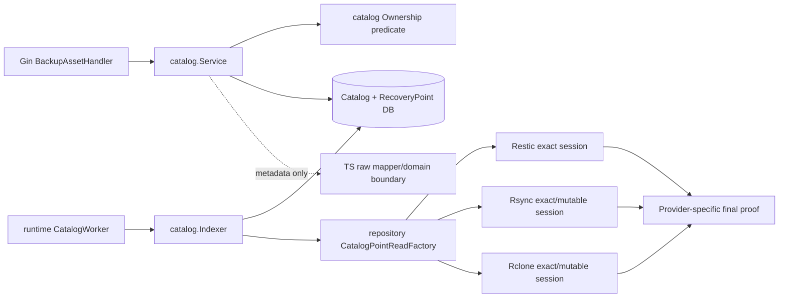
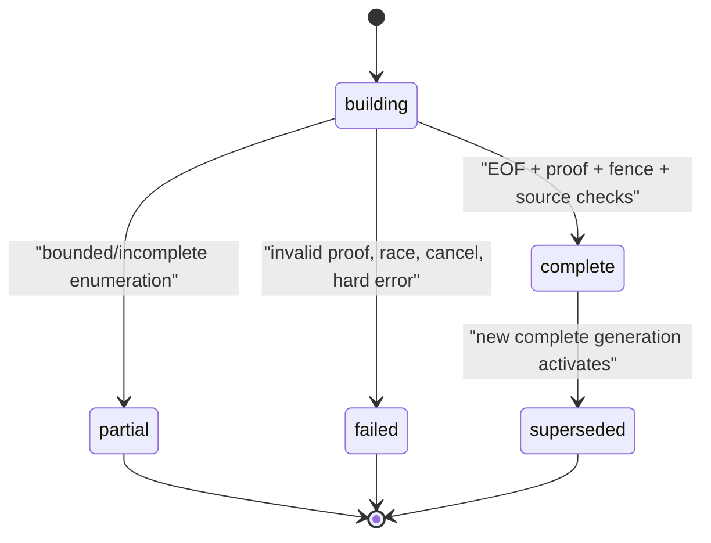

# Child 6 Atomic Catalog Design

## 1. Status and decisions

本设计冻结 Child 6 的目标 API、事务、Provider proof、ownership、worker 和 frontend boundary。Schema 方案 A、三份规划文档整体、范围合同和 implementation/start 已于 2026-07-17 获用户明确批准；总控随后执行 Phase 1.4 `task.py start`，task 当前为 `in_progress`。

已冻结：

- Catalog 是可重建 metadata plane，不是 Provider truth、ContentBroker 或恢复源。
- 所有 public asset identity 使用 `{recoveryPointId, entryId}`，请求不接受 Provider path/native locator。
- generation state、coverage、staleness、physical/content availability 分离。
- Restic/Rsync/Rclone 完整 Catalog 都需要 Provider-specific publication-compatible proof；当前 common `provider.Entry` 不足以证明 digest。
- producing-lineage filter 在 projection/count/evidence/cursor 之前执行；Viewer 由 route RBAC 先返回 403。
- Runtime 是唯一 composition root；handler 永不执行 Provider command。
- `backup_assets.enabled` 继续默认 `false`；前端仅交付 API boundary。

决策记录：用户已选择 §16 方案 A，接受 process-local per-repository lane（无 migration）替代 durable repository scheduler lease 的强度偏差；方案 B 在本 Child 中不实施，除非用户以后明确重新打开 schema 决策。

## 2. Current-main constraints

详细证据见 `research/current-main-evidence.md`。关键约束：

1. paired `000062` 已有 Catalog tables、per-point active unique index、count/digest/source/error fields、Entry Identity/Cursor Signing key domains 和 RecoveryPoint lease table。
2. paired `000063` 已支持 `catalog_build` holder；现有 lease unique slot 是 `(recovery_point_id, holder_type, owner_id)`。
3. `provider.Entry` 是 narrow read DTO，不包含每类 publication manifest 的完整 canonical fidelity record。
4. Restic exact read 由 lineage session 提供；managed Rsync 有 Repository-owned session；Rclone 尚无等价 Repository-owned unified session。
5. 当前 repository visibility 可见性依赖 active/non-archived Task link，并不能安全地复用于 shared-repository point aggregates。
6. 当前无 `backupasset/catalog` package、Catalog API 或 Catalog worker。

## 3. Component boundary



### 3.1 Ownership

- Existing `BackupRepositoryHandler`/`repository.Service` retain the already-public repository list/detail GETs and their single `repository_list` audit. They reuse Catalog's ownership predicate and a narrow Catalog summary projector for authorized counts/status; Router does not route those GETs through a second handler, so no double audit occurs.
- `catalog.Service` owns RecoveryPoint/entry/status/evidence/diff projections and implements the narrow repository Catalog summary port consumed by `repository.Service`.
- `catalog.Indexer` owns generation creation, batching, proof validation, activation and failed-build reconciliation.
- `catalog.Ownership` owns reusable SQL scopes. Repository package uses the same predicate for its existing list/detail projection so Child 2 routes cannot leak mixed lineages.
- Repository package owns DB-to-Provider access reconstruction and native locators. Catalog sees only safe canonical records, source revision and typed proof.
- Provider adapters own command execution, exact source semantics and publication-compatible proof generation. Catalog/handler never imports runner/SSH command primitives.
- Runtime constructs one Catalog service/indexer/worker and injects the service into Router.

### 3.2 Exact read session

未来内部接口形状：

```go
type PointReadRequest struct {
    RepositoryID    string
    RecoveryPointID string
}

type CatalogRecord struct {
    OpaqueIdentityDigest string
    ParentIdentityDigest string
    NormalizedPath       string // private, never serialized/audited
    Name                 string
    Type                 backupasset.CatalogEntryType
    Size                 int64
    ModifiedAt           *time.Time
    Mode                 string
    Owner                string
    MIMEType             string
    Fingerprint          string
    FingerprintStrength  string
    SealedProviderLocator string // already encrypted by repository boundary; never serialized/audited
}

type CatalogReadSession interface {
    SourceRevision() string
    ListCanonical(context.Context, provider.PageRequest) (CatalogRecordPage, error)
    Finalize(context.Context) (CatalogReadProof, error)
    Close() error
}

type CatalogReadProof struct {
    Mode             ProofMode // publication_manifest | mutable_observation
    SourceRevision   string
    Manifest         ManifestProof // provider publication-compatible digest/count/completeness
    Catalog          CatalogProof  // independently accumulated canonical digest/count
}
```

接口是设计形状而非 public DTO。实现可调整 Go 名称，但不能削弱：

- factory 只接收 server-resolved Repository/RP opaque IDs；不接收 task ID、path、remote、native snapshot ID、config 或 credentials；
- session 在 Repository package 内根据 point semantics/provider 解密 access/locator，并验证 exact lineage/commit marker；
- enumeration 只前进，不回退到 `latest`、mutable root 或另一个 point；cursor/source revision 变化立即失败；
- `Finalize` 只有在遍历到 EOF 且 provider-specific canonical codec 完成时成功；中途 cancel/limit/duplicate/invalid record 不能伪造 complete；
- `Close` 幂等并释放 admission token/handle；context cancel 必须终止/收拢 Provider command；
- native Provider locator 只存在于 Repository wrapper 内；wrapper 在返回 `CatalogRecord` 前封装成 authenticated encrypted locator，Catalog 只把 ciphertext 写入 staging row。模型 `EncryptIfNeeded` 不得双重加密；明文 locator 绝不进入 Catalog service/API、日志、audit 或 error。

### 3.3 Provider mapping

| Provider/point | Exact source | Final proof | Failure behavior |
|---|---|---|---|
| Restic native snapshot | producing lineage + full native snapshot ID + exact tags/summary | 同一 Restic manifest canonical codec 的 digest/count/completeness/source revision | rewritten/tag-only/latest/multiple/partial 均不 complete |
| Rsync managed immutable | exact committed tree marker/attempt/manifest | marker + publication manifest-compatible digest/count + source fingerprint | marker/fence/source mismatch fail closed |
| Rclone managed immutable | exact portable control/data root or native control key + object VersionIDs/manifest chunks and bound config | commit manifest-compatible digest/count + source revision | no current-root/mutable fallback; weak/unproven control graph not complete |
| Rsync/Rclone mutable head | stable observed point + current bound root | Catalog canonical digest/count + pre/post/tx source fingerprint | race/offline produces failed attempt; old active stays stale |
| Command | none | none | stable `task_artifact_contract_missing` unsupported |

Three Provider Catalog contract suites are a release prerequisite. A suite that only freezes the DB manifest reference without publication-compatible proof does not satisfy complete exposure and requires a design amendment/approval.

## 4. Catalog identity

### 4.1 Canonical record

- Provider session performs separator/root normalization exactly once and emits a private relative `NormalizedPath` plus stable opaque identity digests.
- Reject NUL, absolute roots, `.`/`..` traversal, empty non-root components, invalid parent graph, duplicate canonical identity, duplicate sibling name under the Provider's semantics, negative size and unsupported unbounded records.
- Identity normalization does not case-fold or NFKC provider names; Child 7 search normalization is separate and must not collapse filesystem identity.
- Symlink/hardlink/special/unknown are typed metadata only. Catalog never follows links during traversal. Unknown or unsafe types project safe `unknown` only when the Provider contract proves the record is bounded; otherwise the build is partial/failed.

### 4.2 Entry ID

```text
entry_id = HMAC-SHA256(
  EntryIdentityKey,
  "xirang.catalog.entry.v1" || 0x00 ||
  recovery_point_id || 0x00 || canonical_normalized_relative_path
)
```

- Entry Identity key is installation-stable and cannot rotate. Key lost/unavailable blocks new Catalog builds with typed availability; existing stored entry IDs remain readable, but disaster recovery cannot promise recreated IDs without the key.
- Entry type、size、mtime 和 content fingerprint 都不参与 entry ID。同一 mutable RecoveryPoint 的同路径类型变化保持 entry ID，并由 diff 报 `type_changed`；不同 RecoveryPoint 的同路径因 RP scope 得到不同 ID。
- Root is not a fake entry/path. Top-level entries have `parent_entry_id = NULL` and a fixed domain-separated root identity digest.
- Parent entry ID is resolved within the same RecoveryPoint/build. Missing parent, cycle or HMAC collision fails the build; it never overwrites another row.
- Every lookup predicate includes `recovery_point_id + active_generation_id + entry_id`. Entry-only lookup is prohibited even if the schema has an entry ID index.
- Cross-point diff does not compare entry IDs. It compares private canonical relative identities inside two authorized active generations.

## 5. Generation state machine



Rules:

- only `complete` may have `is_active=true`; partial/failed entry rows are diagnostic staging and never power public entry responses;
- a recovery point has at most one active generation by paired DB partial unique index;
- `expected_entry_count=0` is known zero when active manifest/proof says zero. Unknown expectation is represented externally as `null`, derived from absent manifest/incomplete proof—not by treating DB zero as known;
- canonical empty digest has a fixture and must match Provider proof; zero-entry complete is valid;
- immutable `expected_digest` is the frozen active publication-manifest digest; mutable uses empty `expected_digest`. `written_digest` is always the Catalog canonical digest. They represent different canonical domains and are never compared to each other;
- Provider `ManifestProof` is compared with frozen manifest ID/revision/digest/count/completeness/source revision. Provider `CatalogProof` is independently compared with the indexer's Catalog accumulator and staged row count/digest. This detects both source/manifest mismatch and reader/indexer corruption without falsely claiming the two digest domains are identical;
- for immutable points, `expected_entry_count` is the manifest count and `written_entry_count` is the Catalog record count. Both proofs are checked in their own domains and activation also requires these counts to agree; count mismatch is partial/failed even though the two digest values are intentionally different;
- old active generation remains active on partial/failed/cancel/timeout/offline/fence loss.

### 5.1 Build transaction sequence

1. Load an eligible point and authorized internal Repository context; snapshot point state, active manifest ID/revision/digest/count/completeness, source fingerprint/observed_at and capability revision.
2. Acquire `catalog_build` lease with `owner_id = "catalog:" + recoveryPointID`; random attempt/fence identify this build. Generation ID is never the owner.
3. In a short transaction lock point/current active manifest/generation sequence, validate lease fence, insert `building` generation with the frozen expected facts. Do not hold DB transaction during Provider I/O.
4. Open exact Repository session; for mutable head record fingerprint/source revision before enumeration.
5. Enumerate bounded pages, validate canonical records, derive IDs, calculate proof digest through Provider-compatible codec, and batch insert staging entries with context cancellation.
6. Reach EOF, call `Finalize`; compare publication-compatible proof with frozen manifest facts and compare Catalog proof with the independent indexer accumulator/staged rows. Re-read mutable fingerprint after enumeration.
7. Activation transaction locks point, active manifest, prior active generation and new generation; calls `ValidateFenceTx`; revalidates every frozen point/manifest/capability/source fact and mutable fingerprint/observed_at. PostgreSQL uses row locks. SQLite must not rely on its ignored `FOR UPDATE`: production `database.Open` already configures `_txlock=immediate&_busy_timeout=5000`; the implementation uses that real connection behavior plus checked conditional CAS/partial unique constraints and retries only typed busy/conflict outcomes.
8. Mark prior active complete generation `superseded,is_active=false`; mark new generation `complete,is_active=true,finished_at`; commit once.
9. Release lease only after transaction result. A late writer with an old fence cannot alter either generation.

### 5.2 Failure classification

- resource/timeout/partial EOF with trustworthy bounded prefix → generation `partial`, old active preserved. Public coverage describes the current exposed active scope: if a still-valid complete active generation exists, coverage remains complete and the partial attempt appears only as `latest_build`; coverage is partial only when no complete active generation covers that scope;
- a Provider that truthfully ends with partial/incomplete proof before claiming EOF yields `partial`; a claimed complete proof whose manifest ID/revision/digest/count/completeness/source revision mismatches frozen DB facts yields `failed/catalog_manifest_mismatch`; Catalog proof versus independent accumulator/row-count mismatch yields `failed/catalog_projection_mismatch`; duplicate identity, unsafe path/type and stale fence are also failed with their own stable codes;
- Provider offline/disconnected → failed build attempt or retry deferral, but never marks an existing active immutable Catalog failed/unavailable;
- no raw Provider error enters `error_code`; correlation ID links structured sanitized log.

### 5.3 Startup reconciliation

- Find `building` generations whose lease is missing/expired or build deadline passed.
- Lock generation/lease, verify no valid owner, mark `failed` with `catalog_build_abandoned` and finished time.
- Never infer complete from row count/digest columns alone; never activate during reconciliation.
- Superseded/failed/partial cleanup is bounded and may delete only Catalog entries/generations after retention; it never touches manifest/point/Provider data.

### 5.4 Retirement projection port

Child 6 does not add a lifecycle/retirement API, but must expose an internal transaction-bound `DeactivatePointProjectionTx` contract for the future retirement coordinator. The same transaction that changes an observed mutable head to `retired` must first mark its active generation non-active/superseded and make entry projection unreachable; if either update fails, retirement rolls back. Worker reconciliation additionally repairs impossible legacy/test rows (`retired` + active generation) by deactivating metadata only, but this repair is not a substitute for the transaction contract. No path deletes Provider bytes or reactivates a tombstone.

## 6. Eligibility, coverage, staleness and availability

### 6.1 Point eligibility

| Point | Index/build | Public active Catalog |
|---|---|---|
| immutable committed/degraded + complete active manifest | yes | yes after complete proof |
| immutable preparing/verifying | no | no |
| immutable expiring | no new build; existing reads stop according to lifecycle gate | no new exposure |
| expired/failed/purge_blocked | no | no |
| mutable observed | yes with fingerprint contract | yes after complete proof |
| mutable retired | no | no; activation retired atomically removes active projection |
| imported baseline | Admin-only if otherwise eligible | Admin-only |
| legacy `SnapshotFileIndex` | never promoted | never considered complete |

### 6.2 Orthogonal projection

```go
type CatalogGenerationState string // building, complete, partial, failed, superseded
type CoverageStatus string         // building, complete, partial, failed, unavailable
type Staleness string              // fresh, stale, unknown
type AvailabilityStatus string     // available, unavailable
```

- `generation_state` reports active/latest build state; it is not coverage.
- coverage reports whether the public requested scope is complete. If no complete active generation exists, entry list is unavailable even when a partial generation contains rows.
- immutable committed active Catalog stays `fresh` while bound manifest/point remains the same, even if Provider is offline; content availability is independently false.
- mutable active Catalog is fresh only when its generation fingerprint equals current point fingerprint and `now < observed_at + 2 * repository_reconcile_interval`; equality at the deadline is stale. Fingerprint drift or age makes it stale. Missing/invalid timestamp, unknown point enum or non-comparable revision makes it unknown. Provider offline does not by itself decide staleness, although a prolonged offline period normally crosses the time threshold.
- a failed/partial latest build does not overwrite the active complete generation's state. Projection can therefore truthfully be `active generation=complete`, `latest build=failed`, `coverage=complete`, and independently `staleness=fresh|stale` / `content availability=available|unavailable`.
- retired is not “stale”; it is not readable and has no active projection.
- only coverage complete permits a definitive empty list/diff conclusion.

## 7. Authorization and no-existence leaks

### 7.1 Role matrix

- route middleware requires `backup_assets:list` for all Catalog routes. Admin and Operator pass; Viewer/unknown/missing role receives 403 before handler/service calls.
- Admin scope includes every eligible point.
- Operator authorization is deliberately two-stage because typed lineage JSON cannot be portably/strictly validated inside equivalent SQLite/PostgreSQL SQL. Stage 1 queries only opaque IDs and control fields, using `recovery_points.producing_task_id` → current non-archived `tasks` → `node_owners(user_id)` and excluding imported baselines; it selects no names/counts/evidence. Stage 2 strictly decodes managed immutable publication lineage and requires TaskID/TaskRunID/TaskRepositoryLinkID/repository to agree with point FKs and live TaskRun/link rows. Mutable head uses its current typed TaskRepositoryLink binding. Malformed/conflicting lineage fails closed and is Admin-only.
- RecoveryPoint snapshot task/node fields are display-only after authorization. Deleted/archived producing Task, nil/unverifiable attribution and all `imported_baseline` points are Admin-only.
- visibility of a TaskRepositoryLink or one point does not authorize sibling points in a shared repository.

### 7.2 Query order

For every route, the first resource query applies the two-stage role/user ownership. The resulting authorized opaque point-ID set is then fed into projection/aggregate queries. Repository name/description/lineages, RecoveryPoint name/snapshot, generation/count/coverage, entry name/metadata, evidence and cursor page boundaries are projected only from that set. Operator requests for nonexistent and unowned IDs return the same sanitized 404 shape and audit outcome. Forbidden sibling counts never influence total/hasMore/nextCursor.

Point pagination uses bounded chunked scan-ahead until it has `pageSize+1` strictly authorized points. Cursor/hasMore are based only on visible anchors; hidden/invalid point IDs are never embedded in a cursor. A fixed candidate scan budget of `min(2000, max(200, pageSize*20))` prevents unbounded work. Exhausting the budget before establishing the page result returns typed `ownership_projection_limit` unavailable, never a false empty page. Repository counts batch over strictly authorized point IDs; they never run `COUNT` over the broad SQL candidate set.

Repository list aggregates only authorized points/lineages for Operator; a Repository with no authorized point/current lineage is absent. Admin-only points never enter Operator counts even if the same Repository is otherwise visible.

## 8. Exact public API

All paths below are relative to `/api/v1`, use existing response helpers/Auth/Audit middleware, and return the standard envelope. Every route is feature-gated and uses `RBAC(backup_assets:list)`.

| Method and path | Purpose | Request scope |
|---|---|---|
| `GET /backup-repositories` | authorized repository list | `limit`, `cursor`; existing connect-plane route retained |
| `GET /backup-repositories/:id` | authorized repository detail | repository opaque ID |
| `GET /backup-repositories/:id/recovery-points` | point list | `limit`, `cursor`, `sort=captured_desc|captured_asc|created_desc` |
| `GET /recovery-points/:id` | point detail | point opaque ID |
| `GET /recovery-points/:id/catalog-status` | active/latest generation + four-dimensional status | point opaque ID |
| `GET /recovery-points/:id/evidence` | exact layered evidence | point opaque ID |
| `GET /recovery-points/:id/entries` | one active generation directory page | `parent` opaque entry ID or empty root, `limit`, `cursor`, `sort` |
| `GET /recovery-points/:rpId/entries/:entryId` | exact composite entry detail | both opaque IDs required |
| `POST /recovery-point-diffs` | exact two-point diff | strict JSON body below |

Diff request (unknown fields/trailing data rejected, body bounded):

```json
{
  "base_recovery_point_id": "32-lower-hex",
  "compare_recovery_point_id": "32-lower-hex",
  "base_parent_entry_id": "optional-64-lower-hex",
  "compare_parent_entry_id": "optional-64-lower-hex",
  "sort": "path_asc",
  "limit": 100,
  "cursor": "opaque"
}
```

Exactly two distinct points are required. Both must be visible to the caller and belong to the same repository in Child 6. Each optional parent is validated as `{corresponding point, entry}`. There is no `latest`, native ID or path field.

### 8.1 Stable sorting

| Endpoint | Allowlist and DB tuple |
|---|---|
| repositories | fixed `(created_at DESC, id DESC)` |
| recovery points `captured_desc/asc` | stable `(COALESCE(captured_at, committed_at, created_at), id)` in requested direction; mutable `observed_at` is deliberately excluded because it changes |
| recovery points `created_desc` | `(created_at DESC, id DESC)` |
| entries `name_asc` default | `(name COLLATE binary/C, entry_id ASC)` |
| entries `name_desc` | `(name COLLATE binary/C DESC, entry_id DESC)` |
| entries `size_desc` | `(size DESC, name COLLATE binary/C ASC, entry_id ASC)` |
| entries `modified_desc` | `(modified_at IS NULL ASC, modified_at DESC, name COLLATE binary/C ASC, entry_id ASC)` |
| diff `path_asc` | private canonical path bytes under engine binary/C collation, then change-kind rank, then both entry IDs |

SQLite uses explicit `BINARY`; PostgreSQL uses explicit `C` semantics. Real dual-engine fixtures must prove identical ordering, root/null behavior and next-page results.

### 8.2 Cursor contract

Catalog cursors use `KeyDomainCursorSigning`, format v1, maximum decoded 8 KiB, 15-minute TTL, and bounded dual-key verification. Common signed claims include:

- endpoint and direction;
- user ID + role;
- repository and point scope appropriate to the endpoint;
- parent/subtree entry ID(s);
- sort enum and a non-sensitive opaque anchor;
- issued/expiry/key version.

Repository-list cursor binds auth, endpoint, fixed repository sort plus visible repository ID/created time; it cannot embed an unbounded set of generation IDs. Recovery-point-list cursor binds repository/auth/stable sort plus visible point ID/time and likewise does not bind per-item generations. Entry-list cursor binds exactly one RecoveryPoint, parent, active generation and opaque anchor entry ID; after authorization the server reloads that row from the bound generation to reconstruct name/size/mtime sort values. Diff cursor binds both points, both active generations, both subtrees and an opaque change anchor (present base/compare entry IDs + change kind); it reloads private canonical paths server-side. Tamper/invalid schema/oversize returns stable invalid-cursor 400. Expiry, missing anchor, role/user/scope/sort change or a bound entry/diff generation drift returns stable stale-cursor 409 so clients restart from page one. The signed-but-readable cursor contains no path/name/provider locator/private sort value.

## 9. DTO contract

All backend JSON uses snake_case. Closed enum mapping validates internal values; unknown values return a generic stable safe reason/correlation and fail closed. Frontend raw DTO types remain private and map to camelCase domain unions without casts.

### 9.1 Common status

```json
{
  "generation": {
    "id": "opaque",
    "sequence": 4,
    "state": "complete",
    "started_at": "UTC RFC3339",
    "finished_at": "UTC RFC3339",
    "error_code": "",
    "correlation_id": ""
  },
  "coverage": {
    "status": "complete",
    "indexed_entries": 0,
    "expected_entries": 0,
    "manifest_digest": "lower-hex-or-empty",
    "observed_at": "UTC RFC3339"
  },
  "staleness": {
    "status": "fresh",
    "observed_at": "UTC RFC3339",
    "reason": null
  },
  "content_availability": {
    "available": false,
    "reason": {"code": "repository_offline", "params": {}}
  },
  "permissions": {"list": true, "preview": false, "download": false}
}
```

`expected_entries` is numeric zero for known empty and JSON null for unknown. `generation` may describe the active generation plus a separately named `latest_build` diagnostic; state is never copied into coverage. Raw DB/provider enum strings do not pass through.

### 9.2 Repository and point

- Repository DTO: `id`, safe display fields, provider/version/status typed enums, authorized lineage summaries, authorized recovery-point count, common Catalog aggregate status, content availability, permissions.
- RecoveryPoint DTO: `id`, `repository_id`, safe producing task/node snapshot after authorization, semantics/state/immutability/physical availability, capture/commit/observe times, retention/hold safe fields, common Catalog status and permissions.
- No encrypted config/locator/rollback locator, repository identity, lineage JSON, consistency/fidelity raw JSON or raw capability map is serialized.

### 9.3 Entry

```json
{
  "recovery_point_id": "opaque-rp",
  "entry_id": "opaque-entry",
  "parent_entry_id": null,
  "name": "authorized display name",
  "entry_type": "file",
  "size": 42,
  "modified_at": "UTC RFC3339 or null",
  "mode": "safe normalized mode",
  "owner": "safe display owner",
  "mime_type": "application/octet-stream",
  "fingerprint_strength": "strong|weak|none",
  "breadcrumb": [{"recovery_point_id": "opaque-rp", "entry_id": "opaque-parent", "name": "authorized"}]
}
```

Every breadcrumb element remains composite. Raw content fingerprint/hash, `normalized_path`, Provider locator and security internal raw state are absent. Entry list may omit breadcrumb for cost; detail returns it after ownership. Fingerprints remain internal comparison/proof material so the API does not create a cross-point correlation or low-entropy dictionary oracle.

## 10. Evidence design

Evidence response is tied to exactly one authorized RecoveryPoint and contains independent layers:

1. `lineage`: producing Task/TaskRun opaque/numeric IDs, safe snapshot names, trigger/status/timestamps. `TaskRun.LastError`, logs and executor config are never serialized.
2. `manifest`: active manifest ID/revision/digest algorithm/digest/count/logical bytes/generator/version/completeness/timestamps. `EncryptedCommitEvidence` is decoded only into a closed safe publication summary, never returned raw.
3. `publication_verification`: provider, typed stage/outcome/failure code, verified/committed times, safe fidelity/capability projection. Absence remains `not_recorded`.
4. `restore_drills`: only rows whose non-null `source_task_run_id` exactly equals the producing TaskRun. `task_run_id` is the drill's own run and is never a fallback source join; nil source is `not_recorded`. Project status/step/times/confidence eligibility only. `SandboxPath`, every `*Error`, raw `SnapshotRef` and sandbox details are excluded.

The response includes per-layer `recorded | unavailable | not_recorded | invalid` and no aggregate “trusted” promotion. A successful drill does not repair a partial manifest; a complete manifest does not imply a successful restore drill. Evidence listing writes `recovery_point_evidence` audit with opaque IDs/status/count only.

## 11. Diff design

- The service first authorizes both point scopes independently, then loads their active complete generations in one consistent DB view.
- It compares private canonical relative identities and safe metadata. Added/removed/modified/type-changed are deterministic; Child 6 always excludes unchanged rows to bound result size and has no `include_unchanged` request flag.
- Each side in a change carries `{recovery_point_id, entry_id}` when present. No response uses one entry ID to represent both versions.
- Metadata layer reports name/type/size/mtime/fingerprint-strength changes. Internal strong fingerprints may project only `content_equality=equal|different`; weak/missing evidence projects `unknown`. Raw fingerprint values are never returned.
- `provider_evidence` is a separate typed section: `supported | unavailable | not_applicable` plus safe capability reason. Offline Provider never invents native evidence and does not prevent Catalog metadata diff if both active Catalogs exist.
- Cursor binds both generation IDs; an activation between pages returns stale cursor rather than mixing versions.
- Audit action is `recovery_point_diff`. Without a schema/action-registry change, top-level `recovery_point_id` is the base point and allowlisted `Fields[recovery_point_id]` is the compare point under this action's fixed semantics. Optional subtree pair is encoded only through a domain-separated `AuditFingerprintInput.Query` keyed fingerprint. Audit stores counts/stage/outcome, never raw subtree IDs, paths or names.

## 12. Worker design

### 12.1 Scheduling

- Catalog is deliberately absent from synchronous `Runtime.StartupPass`, which runs before Router/Listen and is fatal on error. Existing `main` launches `Runtime.Run` in a goroutine before constructing/listening on the HTTP server; Catalog starts its bounded scan only inside `Runtime.Run`, returns immediately to the run loop, and records/backoffs scan failure without blocking readiness.
- Candidate priority: newly committed immutable point, observed mutable head with changed fingerprint, failed retry eligible by backoff, older missing Catalog. Child 6 does not implement Search/Worker backfill priorities.
- Global semaphore bounds active Repository sessions. A per-repository lane serializes candidates inside one runtime; scheduler never holds a lane while waiting for global shutdown.
- Fair round-robin prevents a large Repository from starving others. One failed point does not block later eligible points after backoff.
- Retry backoff is reconstructed from durable generation history: let `failure_count` be consecutive retryable `partial|failed` generations for the same point and source/manifest revision since the last complete generation; `ordinal=min(10,max(0,failure_count-1))`. `base=min(repository_reconcile_interval,5m)`, `cap=max(base,min(catalog_build_timeout,1h))`, `raw=min(cap,base*2^ordinal)`. Interpret the first 16 bits of `SHA-256(pointID || latestGenerationID || ordinal)` as `u/65535`; `jitter=0.8+0.4*u`, and `next_at=latest.finished_at+raw*jitter`. Success/source revision change resets the count. Non-retryable proof/fence errors wait until point/manifest/capability revision changes. Restart recomputes the same schedule from DB.

### 12.2 Lease and fencing

- Point lease duration/heartbeat/absolute deadline reuse the foundation safety bounds and dynamic settings.
- stable owner `catalog:<rpId>`; random attempt/fence per execution.
- build deadline is `min(started_at + catalog_build_timeout, lease.absolute_deadline)`; no Provider page or retry extends it.
- renew loss cancels Provider context immediately, joins enumeration, marks attempt failed if still fenced, and never activates.
- takeover tests run old and new attempts concurrently; only new fence can commit.
- activation calls `ValidateFenceTx` inside the same transaction as active switch.

### 12.3 Shutdown

`Shutdown(ctx)` is idempotent:

1. stop accepting schedules/timers;
2. cancel all active build contexts;
3. before waiting, durably CAS-release/revoke every still-owned active fence and mark the in-process attempt revoked; activation checks both attempt state and `ValidateFenceTx`;
4. wait for Provider sessions and batch writers to close within grace;
5. return a bounded error if revocation or join fails. A reader unblocked after Shutdown cannot activate even when it ignored cancellation.

Startup and shutdown tests cover cancellation mid-page, during heartbeat, before/inside activation, repeated shutdown and stuck Provider close.

### 12.4 Settings

Catalog 不新造另一套 settings。`FoundationService.CatalogConfig()` 只解析 Child 1 已登记、已具 DB > env > default 与 bounds 的现有值：`backup_assets.enabled`、`catalog_batch_size`、`catalog_build_timeout`、`repository_reconcile_interval`、`provider_max_concurrency` 与 lease duration/heartbeat/absolute deadline。Provider page/resource bounds继续来自现有 Provider/manifest config。

§12.1 冻结 backoff 公式，§6.2 冻结 mutable freshness 为 `2*reconcile interval`，build/abandoned deadline 是 `min(started+build timeout, lease absolute deadline)` 且只有无有效 fence 时才由 reconciler 标 failed。这些是算法不变量，不新增动态 registry key。无 Catalog package 直接读 env/全局变量；无效现有设置按 Foundation 的 fail-closed validation 返回错误并记录结构化安全日志。

## 13. Audit, logging and error projection

- Reuse registered `repository_list`, `recovery_point_list`, `recovery_point_detail`, `recovery_point_evidence`, `recovery_point_diff`, `asset_list` actions.
- Every public GET/POST diff writes success/blocked/failure through the existing asset audit writer. Router coverage test fails if a route lacks an action.
- Audit fields: opaque repository/RP/entry IDs, task/run IDs where authorized, counts, stable stage/code, correlation ID. Excluded: path/name/query/cursor/native ID/provider locator/commit evidence/raw error/config/credentials.
- Structured logs use `logger.Module("backupasset.catalog")`, stable code/stage and opaque IDs; no high-cardinality path label.
- Safe error mapping: invalid input/cursor 400; Viewer RBAC 403; Operator unowned and not-found same 404; stale cursor/state 409; unsupported Command 501; offline/provider timeout/resource 503; internal 500 generic message + correlation.
- Unknown enum/capability/provider value maps to a closed `unknown_internal_state` capability reason and fails the operation; raw value stays only in sanitized server diagnostics if safe.

## 14. Frontend boundary

New API modules privately declare `Raw*` DTOs and export only mapped camelCase types/functions:

- `backup-repositories-api.ts`: list/detail mapping and existing route clients;
- `recovery-points-api.ts`: point list/detail/status/evidence;
- `backup-assets-api.ts`: entry list/detail and exact diff.

Domain unions mirror the closed enums in §6/§9. Mapper behavior:

- validate and normalize times as UTC RFC3339 `string | null`, matching existing `domain.ts`; do not introduce JavaScript `Date` domain fields. Invalid required time fails closed and invalid optional time maps only according to its explicit nullable contract;
- preserve known zero versus null expected count;
- reject/safely downgrade unknown enums to a typed unavailable result, never `unknown as T`;
- map every entry/diff side into composite `AssetRef`;
- pass `AbortSignal` to request wrapper;
- encode query parameters with `URLSearchParams`; never accept path identity;
- map capability reason code/params without raw Provider message.

`client.ts` composes factories. `domain.ts` owns shared public domain types. No React component/page/route/i18n UI text is added and feature remains hidden.

## 15. Verification architecture

### 15.1 Dual-engine behavior

No-migration option still requires the same behavior suite against SQLite and a real PostgreSQL service:

- partial unique active switch and transaction rollback;
- PostgreSQL row locks and SQLite two-real-connection tests opened through production `database.Open`/real file DSN (not a simplified in-memory GORM DSN), including immediate/CAS write serialization, stale fence and no visible zero/multiple-active window;
- generation sequence collision/retry;
- root `NULL` parent and sort collation parity;
- ownership `EXISTS`, shared repository counts and page boundaries;
- cursor order/resume and two-generation diff consistent view.

`TEST_POSTGRES_DSN` absence is a failure in the mandatory CI job. Local absence is recorded `not_executed`, never pass/skip evidence.

### 15.2 Provider contract suites

Each Provider fixture proves empty/non-empty traversal, page boundaries, canonical record ordering, digest/count/completeness, exact source, source change, duplicate/unsafe entry, cancellation/Close, offline mapping and zero mutation. A common suite prevents an adapter from declaring complete without proof.

### 15.3 Security matrix

- Admin/Operator/Viewer/unknown role;
- owned/unowned points in the same Repository;
- current, archived, deleted, nil-attributed and imported-baseline lineage;
- names/count/evidence/hasMore/cursor no-leak;
- composite ID mismatch/cross-point replay;
- raw field serialization/audit/log scanning;
- handler source scan forbidding provider/runner/SSH/process imports and command literals.

## 16. Schema gap and approval alternatives

### 16.1 No-migration coverage

Existing paired `000062/000063` is sufficient for every durable Catalog fact except a Repository-scoped scheduler lease. It already provides dual-engine constraints, active generation, entry projection, proof fields, key domains and `catalog_build` RecoveryPoint fences. Therefore Child 6 must not create a migration merely to rename/add convenience columns.

### 16.2 Repository scheduling gap

The parent plan says “`catalog_build` RecoveryPoint lease plus per-repository scheduler lease.” Current lease rows require a RecoveryPoint FK and uniqueness is point-scoped. Different points in one Repository can each acquire a lease; a sentinel point or settings row would be schema abuse.

| Option | Contract | Benefits | Cost/risk | Rollback |
|---|---|---|---|---|
| A (selected 2026-07-17) | process-local per-repository lane + durable per-point lease/fence | no schema; fits official single all-in-one runtime; all same-point activation correctness remains durable | cross-process same-repository/different-point serialization is explicitly unsupported | stop worker; no schema down |
| B (not selected) | new durable repository lease entity/index | preserves parent wording across processes | requires paired migration, real PG evidence, reservation change, extra lifecycle/reaper; cannot silently use 000065–71 | stop worker, prove no active leases/builds, guarded down before rows; otherwise forward repair |

If the user later reopens the decision and selects B, implementation must stop until a separate approved schema amendment supplies:

- exact SQLite/PostgreSQL DDL and one identical contiguous version in both engines. The parent must explicitly reallocate the whole reservation (for example, assign Child 6 the next version and shift Search–GA together) rather than pick `000072`, skip a version or silently consume current `000065…000071`;
- old-binary compatibility (additive table ignored);
- apply/down, UTC, crash/takeover, orphan and rollback proof;
- down guard for active repository leases or Catalog builds;
- renumbering/update plan if the global reservation changes.

Under the selected A contract, no Child 6 migration number or SQL is authored or planned.

## 17. Rollback and failure containment

Application rollback sequence:

1. keep `backup_assets.enabled=false` / disable Catalog route scheduling;
2. stop new schedules, cancel and bounded-join worker sessions;
3. release/expire owned leases; old fence cannot publish;
4. leave complete active Catalog generations in DB or stop exposing them; delete only incomplete/superseded rebuildable generations after verification;
5. preserve RecoveryPoints, active manifests, audit and all Provider bytes;
6. do not run schema down under option A. Under future option B, use its separately approved guarded down only before durable rows are relied upon.

Provider offline, Catalog rollback or UI disable never triggers a Provider restore/mutation. Catalog cannot reconstruct content and must not claim it can.

## 18. Parent contract coverage and deviations

| Parent Child 6 contract | Design section | Status |
|---|---|---|
| atomic generations, zero entry, old active preservation | §5 | covered |
| state/coverage/staleness separation | §6, §9 | covered; availability also separate |
| mutable race, retired projection | §5–6 | covered |
| repository/RP/entry/evidence/exact diff APIs | §8–11 | exact routes frozen |
| composite identity, no Provider path identity | §4, §8–9 | covered |
| shared repository ownership before counts/evidence | §7 | covered |
| offline immutable browse | §6, §9 | covered |
| startup/periodic worker, bounded concurrency/backoff/shutdown | §12 | covered |
| RecoveryPoint lease/fence | §5, §12 | covered |
| per-repository scheduler lease | §12, §16 | **approved option-A deviation: process-local lane; no cross-process different-point serialization claim** |
| manifest count/digest validation | §3, §5, §15 | covered by new Provider-specific proof seam; cannot fall back silently |
| three Provider suites | §3, §15 | hard exposure gate |
| frontend boundary only | §14 | covered |
| Swagger/tests | §15 and `implement.md` | covered |
| no mutation/handler commands | §3, §13 | covered |

## 19. Final design approval record

On 2026-07-17 the user explicitly approved:

1. this API/DTO/transaction/ownership/Provider proof contract;
2. the exact future file manifest and validation plan in `implement.md`;
3. the continued feature-disabled, frontend-boundary-only scope;
4. implementation/start itself.

The Phase 1 approval gate is complete, and the total controller ran Phase 1.4 `task.py start` after approval. The task remains `in_progress`; implementation and local verification completed on 2026-07-18 with the fresh SQLite, real PostgreSQL 18, Provider, race, Swagger, backend/frontend and project evidence recorded in `implement.md` §2.1. Commit/archive/journal/PR/CI/merge/post-merge statuses remain pending, not executed or not applicable until those delivery steps occur.
