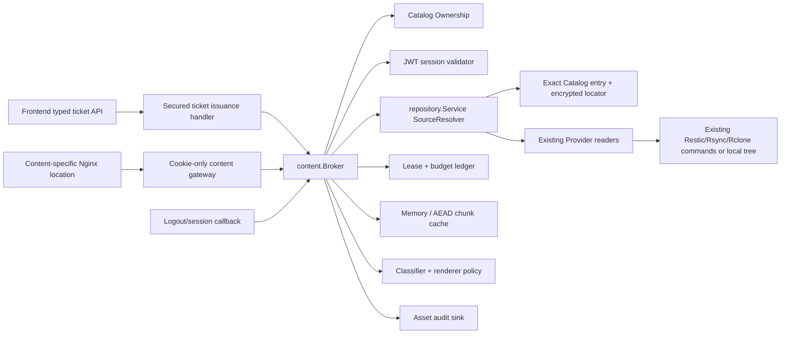
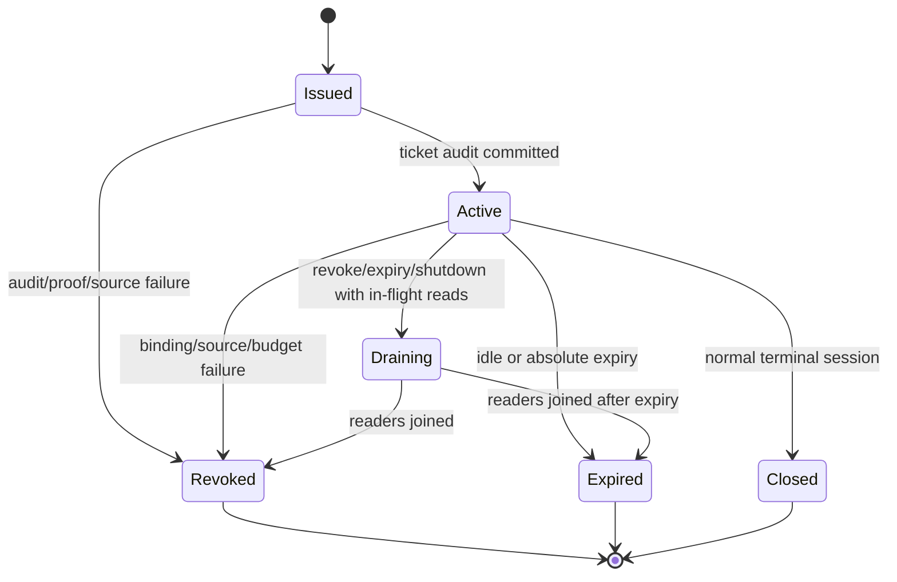

# Child 8 Backup Asset Content Plane Design

## 1. Status, authority, and frozen boundary

This focused Phase 1 design on
`codex/backup-assets-content-plane`, based on
`a3c309a922d9a4f48cb82031031c0975c251f5f4` was explicitly approved by the
user on 2026-07-18. The user separately authorized `task.py start` and product
implementation; the start command has now executed and the Trellis task is
`in_progress`.

Task 1/2 implementation evidence later exposed the gaps recorded in
`research/implementation-amendment-a-evidence.md`. Sections amended for that
evidence are a focused planning revision. The user explicitly approved Focused
Amendment A on 2026-07-18, opening the newly listed Provider/Repository/
source-contract files and remaining GREEN work. Three pre-discovery test edits
remain disclosed and do not themselves constitute GREEN evidence.

Task 3 review then found that this document had generalized the publication
deadline contract to Content leases. The parent contract limits deadline
inheritance to new fences in one multi-stage publication; independent holders
receive their own bounded deadline. The user approved Focused Amendment B's
design proposal and then explicitly approved the complete written revision on
2026-07-18. Product work may resume under the corrected manifest and TDD plan.

The parent design remains authoritative where this document is silent. This
design freezes the following Child 8 boundary:

- Child 8 owns paired `000066`, a backup-asset-only delivery grant service,
  cookie gateway, Range/accounting policy, per-process authenticated cache,
  core classification/renderers, safe audit/logging/Nginx integration, and a
  frontend ticket API mapper.
- It consumes Child 2 Provider read ports through `repository.Service`, Child 6
  Catalog/ownership/lease truth, and Child 7's existing step-up and audit
  registries.
- It never invokes `ContentIndexIngest`, creates Search postings/excerpts,
  persists derived content, or calls a Worker.
- Child 9 owns the workspace UI. Children 10-11 own Worker/path materialization,
  Derived Store and enhanced preview. Child 13 owns the only future
  `RecoveryResult` adapter.
- `backup_assets.enabled` remains false by default. Command remains typed
  unsupported. No Provider byte mutation or new Provider command is permitted.

## 2. Component boundary



### 2.1 Package ownership

- `backupasset/content` owns closed delivery contracts, grant lifecycle,
  cookie verification, session/resource reauthorization, lease heartbeat,
  Range parsing/representation, accounting, cache, classification, renderer
  policy, audit aggregation and lifecycle reconciliation.
- `backupasset/repository/content_read.go` implements only the source adapter.
  It owns Provider/access/native locator resolution and admission tokens. It
  returns safe stat/capability facts and closeable readers, never credentials
  or locators.
- `backupasset/runtime` remains the composition root. It constructs exactly one
  Broker/cache/reconciler and joins them during feature transitions/startup/
  shutdown.
- `api/handlers/backup_content_handler.go` owns transport mapping only. It has
  no GORM queries, Provider registry, runner, SSH dialer or command builder.
- `middleware` exposes safe parsed JWT session facts and redacts the content
  route label. A route-local safe recovery wrapper catches content panics
  without dumping request URI/headers/cookies through Gin's generic recovery.
  It does not authenticate content cookies.
- Frontend owns only private raw DTO validation, camelCase mapping, and JSON
  issuance calls. The content URL remains opaque.

### 2.2 Trust boundaries

```text
Authorization JWT -> issuance handler -> exact proof adapter -> Broker
                                       (JWT never crosses into delivery URL)

delivery_id URL + path cookie -> gateway -> cookie hash/session/resource checks
                              -> reserved budget -> SourceResolver -> bytes

AssetRef -> repository.Service -> encrypted locator/access -> existing Provider
          (no native path/secret returns to Broker or handler)
```

## 3. Closed domain contracts

### 3.1 Resource and action

```go
type DeliveryResourceKind string
type DeliveryAction string

const (
    DeliveryResourceBackupAsset    DeliveryResourceKind = "backup_asset"
    DeliveryResourceRecoveryResult DeliveryResourceKind = "recovery_result"

    DeliveryPreview  DeliveryAction = "preview"
    DeliveryDownload DeliveryAction = "download"
)

type RecoveryResultRef struct {
    RecoveryJobID string
    ResultID      string
}

type DeliveryResource struct {
    Kind           DeliveryResourceKind
    Asset          *backupasset.AssetRef
    RecoveryResult *RecoveryResultRef
}
```

`ValidateDeliveryResource` accepts exactly one `backup_asset` AssetRef in Child
8. Empty, dual, unknown and `recovery_result` values return a stable typed
error. RecoveryResult remains present in the Go type and nullable schema solely
to force future callers through an explicit adapter registration; it is not a
working branch or hidden stub.

### 3.2 Representation policy

```go
type Renderer string
type RendererProfile string
type RangePolicy string
type MethodPolicy string

const (
    RendererEscapedText  Renderer = "escaped_text"
    RendererSafeRaster   Renderer = "safe_raster"
    RendererSameOriginPDF Renderer = "same_origin_pdf"
    RendererNativeAudio  Renderer = "native_audio"
    RendererNativeVideo  Renderer = "native_video"
    RendererMetadataHex  Renderer = "metadata_hex"
    RendererAttachment   Renderer = "attachment"

    MethodGetHead MethodPolicy = "get_head"
    RangeNone     RangePolicy = "none"
    RangeSingle   RangePolicy = "single"
)
```

Profiles are versioned and coupled, not arbitrary strings:

| Action | Renderer | Profile | Range | Required proof |
|---|---|---|---|---|
| preview | escaped_text | `text_v1` | none | none for non-secret; `asset.secret_reveal` otherwise |
| preview | safe_raster | `raster_v1` | none or single | same classification rule |
| preview | same_origin_pdf | `pdf_v1` | none or single | same classification rule |
| preview | native_audio | `audio_v1` | single for seek, otherwise explicit degraded mode | same classification rule |
| preview | native_video | `video_v1` | single for seek, otherwise explicit degraded mode | same classification rule |
| preview | metadata_hex | `hex_v1` | none | same classification rule |
| download | attachment | `original_v1` | none or single | exactly `asset.download` |

The request declares an exact action/renderer/profile. The server validates it
against detected MIME, source capability, classification and budgets. It does
not silently switch to a more permissive representation. A rejected response
may return closed fallback actions/capability reasons; a caller must request a
new ticket for the fallback.

### 3.3 Grant state machine



Terminal states cannot return to active. A process restart revokes previous
process active/issued/draining rows; it never resumes a cookie with a new lease
fence or cache key.

### 3.4 Public and internal identifiers

- `grant_id`: internal random 128-bit opaque ID; FK/audit correlation only.
- `delivery_id`: independent random 128-bit opaque ID; route lookup only and
  non-authorizing by itself.
- `cookie_secret`: independent random 256-bit secret, returned only in one
  Set-Cookie header; DB stores `SHA-256(cookie_secret)`.
- `request_id`: independent internal request reservation ID.
- `session_jti`: the existing login JWT's random JTI. It is a non-bearer session
  identifier, stored as private model data and never logged/audited.

Separating grant and delivery IDs lets the audit chain use an internal opaque
resource without leaking the public URL identifier. Guessing a delivery ID is
still insufficient without the cookie secret.

## 4. Paired `000066` schema

Both engines add
`000066_backup_asset_content.{up,down}.sql`. SQLite uses
`TEXT/INTEGER/DATETIME` and the configured immediate write transaction;
PostgreSQL uses bounded `VARCHAR`, `BIGINT`, `BOOLEAN` and `TIMESTAMPTZ` with
named constraints. All application timestamps are UTC. GORM models use
`json:"-"` for session, secret hash, source fingerprint, fence, accounting and
audit-control fields.

No `AutoMigrate` path is added. No keyring or RecoveryPoint lease closed set is
rebuilt.

### 4.1 `backup_asset_delivery_grants`

Identity/resource columns:

```text
id PK (32 hex)                         internal grant ID
delivery_id UNIQUE NOT NULL (32 hex)  public non-authorizing route ID
resource_kind                         CHECK = backup_asset in 000066
recovery_point_id NULL
catalog_generation_id NULL
entry_id NULL
recovery_job_id NULL
recovery_result_id NULL
```

The exact resource CHECK is:

```text
resource_kind = 'backup_asset'
AND recovery_point_id IS NOT NULL
AND catalog_generation_id IS NOT NULL
AND entry_id IS NOT NULL
AND recovery_job_id IS NULL
AND recovery_result_id IS NULL
```

The backup tuple has a composite FK to
`catalog_entries(generation_id, entry_id, recovery_point_id)` with `RESTRICT`.
Catalog/point cleanup must revoke, drain, audit and delete ephemeral grants
first; it cannot silently cascade an active session. Recovery columns have no
FK until Child 13.

Actor/session columns:

```text
owner_user_id FK users(id) ON DELETE CASCADE
session_jti (32 hex, private)
session_token_version >= 0
session_role CHECK admin|operator
session_expires_at
```

Representation/security columns:

```text
action CHECK preview|download
method_policy CHECK get_head
range_policy CHECK none|single
renderer / profile (closed coupled set)
classification CHECK non_secret|secret|unknown
classification_revision > 0
classification_source_revision >= 1
step_up_action NULL or exact asset purpose
step_up_proof_id NULL or 32 hex
step_up_expires_at NULL
provider_kind CHECK restic|rsync|rclone
source_fingerprint NOT NULL
entry_fingerprint NOT NULL DEFAULT ''
fingerprint_strength CHECK strong|weak|none
representation_etag NOT NULL
source_size >= 0
source_modified_at NULL
detected_media_type NOT NULL
representation_source_bytes >= 0 and <= source_size
representation_size >= 0
representation_truncated closed boolean
cookie_secret_hash exactly 64 lowercase hex
```

The three representation fields are one closed product. Raw raster/PDF/audio/
video/original representations require source and representation sizes to equal
`source_size` with `truncated=false`. Escaped text and metadata/hex bind the
exact source prefix and deterministic output size; `truncated` is true exactly
when the bound source prefix is smaller than `source_size`. HTTP
`Content-Length` always uses `representation_size`, never `source_size`.

One table CHECK enforces the action/security product:

- download -> attachment/original_v1 + exact `asset.download` proof;
- non-secret preview -> no proof binding;
- secret/unknown preview -> exact `asset.secret_reveal` proof;
- every proof-bound absolute expiry is at or before proof expiry.

Lifecycle/lease/accounting columns:

```text
state CHECK issued|active|draining|revoked|expired|closed
revocation_reason closed typed code, empty only before terminal revoke
revoked_at NULL
lease_id UNIQUE FK recovery_point_leases(id) RESTRICT
lease_attempt_id NOT NULL
lease_fence_token_hash exactly 64 hex
absolute_expires_at
idle_expires_at
idle_ttl_seconds > 0
last_activity_at
max_bytes_per_request > 0
max_cumulative_bytes >= max_bytes_per_request
max_requests > 0
max_in_flight > 0
reserved_bytes >= 0
delivered_bytes >= 0
request_count >= 0
in_flight >= 0
version > 0
created_at / updated_at
```

Checks require `delivered_bytes + reserved_bytes <= max_cumulative_bytes`,
`request_count <= max_requests`, `in_flight <= max_in_flight`, and
`idle_expires_at <= absolute_expires_at <= session_expires_at`.

Safe audit summary columns hold only counters/codes:

```text
audit_state CHECK none|pending|emitted|retry_wait|failed
audit_range_count / audit_range_bytes / audit_request_count >= 0
audit_success_count / audit_blocked_count / audit_failure_count >= 0
audit_failure_code closed safe code
audit_attempt_count >= 0
audit_next_attempt_at NULL
```

Indexes cover `delivery_id + state`, session revocation, exact resource/state,
expiry reconciliation and pending audit. No index contains path/name/query.

### 4.2 `backup_asset_delivery_requests`

Each authenticated HTTP attempt has one persistent reservation row:

```text
id PK
grant_id FK grants(id) ON DELETE CASCADE
method CHECK GET|HEAD
range_kind CHECK full|normal|open_ended|suffix
range_start NULL / range_end_exclusive NULL / suffix_length NULL
state CHECK reserved|streaming|succeeded|blocked|canceled|failed|reconciled
reserved_bytes >= 0
provider_bytes >= 0
response_bytes >= 0
http_status = 0 OR 100..599
failure_code closed safe code
started_at / last_progress_at / finished_at NULL / created_at / updated_at
version > 0
```

Range checks enforce exactly the fields required by each kind, positive
resolved lengths, end <= bound source size, and zero reservation for HEAD.
GET reservation is the exact full/range representation length and cannot
exceed the persisted per-request grant cap.

An authenticated malformed/multipart/out-of-bounds Range still receives a
zero-byte `blocked` request row and consumes one grant/scope request count. An
unknown delivery ID or wrong cookie creates no row and reveals no grant facts.

Indexes cover grant/state/start time and stale in-flight reconciliation. Raw
Range headers are never stored.

### 4.3 `backup_asset_delivery_usage`

This table makes scoped reservations portable across processes and engines:

```text
scope_kind CHECK global|user|provider
scope_id bounded private label
window_started_at / window_expires_at
request_count >= 0
reserved_bytes >= 0
delivered_bytes >= 0
in_flight >= 0
version > 0
updated_at
PRIMARY KEY (scope_kind, scope_id)
```

`global` requires `scope_id='global'`; `user` uses a canonical positive decimal
user ID (engine-equivalent CHECKs reject signs, leading zeros, non-digits and
overflow); `provider` uses `restic|rsync|rclone`. SQL and service validation
reject every other combination. Rows store counters, not policy maxima, so a tighter current
settings snapshot takes effect immediately. A window can reset only inside the
reservation transaction; if old in-flight work remains, reset is deferred and
the conservative old counters continue to apply.

### 4.4 Audit idempotency index

`000066` adds a partial unique index on existing
`backup_asset_audit_events(grant_id, action)` for non-empty internal grant IDs
and the four Child 8 content actions. Ticket and final read summaries can then
retry after a crash without producing two authoritative summaries. It adds no
audit column and stores no public delivery ID.

Apply fails closed if legacy rows already contain duplicate non-empty content
`grant_id + action` values; migration code never rewrites or deduplicates the
append-only audit chain. The existing `backupasset.AuditWriter` retries unique
violations and eventually returns an error, so the Content audit adapter does
not treat that error alone as success. After a failed write it loads the exact
existing row and compares the closed actor/resource/action/outcome/summary
projection. Only an exact match is idempotent success; a missing row or any
field mismatch remains a hard audit failure.

### 4.5 Foreign keys, indexes and UTC parity

- SQLite runs with foreign keys enabled and ends every apply/down fixture with
  `PRAGMA foreign_key_check` empty.
- PostgreSQL tests named CHECK/FK actions and actual constraint behavior; SQL
  text matching is not evidence.
- Composite Catalog FK rejects cross-point/cross-generation grants.
- Partial/unique indexes reject duplicate public delivery IDs, duplicate lease
  ownership and duplicate content audit summary.
- All timestamp fixtures use a frozen injected UTC clock and prove
  PostgreSQL `TIMESTAMPTZ` round trips under a non-UTC process timezone.

### 4.6 Down, safe drain, and `000065` compatibility

The down migration starts with an atomic guard over:

```text
any backup_asset_delivery_grants row
any backup_asset_delivery_requests row
any backup_asset_delivery_usage row
any recovery_point_leases row with holder_type = content_session
```

If any exists, the down SQL transaction fails before dropping the audit
index/table and leaves application schema/data/indexes identical. A raw-SQL
blocked-down fixture asserts that atomic snapshot. A production
`golang-migrate.Steps(-1)` attempt may mark migration metadata dirty before the
guard SQL runs, so runtime safe-drain is a mandatory preflight and tests do not
claim that an attempted migrator rollback preserves metadata. The migration
never deletes, revokes or expires state to make its own check pass.

Because requests have a valid `NOT NULL` grant FK with `ON DELETE CASCADE`, an
independent request-only used state cannot exist without corrupting FK state.
Used-down families are therefore grant-with-optional-request, usage, and
orphan/active `content_session` lease. The grant+request fixture proves both
rows and their FK relationship survive a blocked down.

An explicit runtime `PrepareContentSchemaDown` is the only safe-drain path:

1. close issuance/content admission and wait for route producers to stop;
2. revoke every cookie/grant and cancel/join every reader;
3. flush or reconcile bounded audit summaries;
4. release current fences, mark expired leases, and prove no active/unknown
   reservation remains;
5. delete terminal requests/grants/usage and released/expired
   `content_session` leases in one bounded administrative transaction;
6. run the normal guarded down.

If any step cannot prove safety, retain `000066` and use a forward repair.
Pristine down returns exactly to `000065`. Because `000066` never changes the
Search Token or lease closed sets, the existing `000065` used-down guard remains
unchanged and still protects Child 7 when a later downgrade is attempted.

## 5. Ticket issuance flow

### 5.1 Endpoint

```http
POST /api/v1/recovery-points/{rpId}/entries/{entryId}/delivery-tickets
Authorization: Bearer <login JWT>
X-Xirang-Step-Up: <optional exact proof>
Content-Type: application/json

{
  "schema_version": 1,
  "action": "preview",
  "renderer": "safe_raster",
  "profile": "raster_v1"
}
```

Unknown JSON fields, unknown schema, body over the small content-ticket limit,
invalid IDs, mismatched action/renderer/profile and query-bearing alternatives
are rejected. The URI is the only resource input.

### 5.2 Ordered issuance pipeline

1. `AuthMiddleware` validates login JWT, revocation and current token version,
   then exposes safe JTI/version/role/expiry facts in context.
2. Static `backup_assets:preview` RBAC rejects Viewer before body/service work.
   The Broker additionally requires `backup_assets:download` for download.
3. Strictly decode/canonicalize the representation request.
4. Load exact active complete Catalog tuple and re-run
   `Ownership.AuthorizedPointIDs` for the actor.
5. Create a provisional internal grant ID and acquire a `content_session` lease
   with a zero explicit deadline, letting the existing LeaseService issue a
   fresh bounded holder deadline. Compute the grant absolute expiry separately
   as the minimum of session/proof/profile and returned lease deadline; never
   reuse the historical publication deadline.
6. Derive a ticket context deadline as the earliest of the configured
   `content_ticket_timeout` (default 20s, maximum 25s), session/proof/profile
   and lease boundaries. Open the exact source through `SourceResolver`,
   stat/revalidate it, perform bounded MIME/classification scan and bounded
   in-memory text/hex preparation, then close/join the scan reader.
7. Validate requested renderer/source capability and exact proof requirement.
   On failure, audit a bounded blocked result, release the provisional lease and
   create no grant/cookie.
8. Generate independent delivery ID/cookie secret; transactionally insert the
   `issued` grant with hash-only secret and exact bindings.
9. Write the typed ticket audit using internal grant ID. Failure revokes the
   row, releases the lease, emits no cookie and returns 503.
10. Transition `issued -> active`, return the descriptor, and append one
    Set-Cookie header.

No Provider handle survives issuance. No raw path/name/provider error is put in
the response. A classification/source drift between scan and activation causes
the final transaction to fail and requires a new request.

Ticket issuance never performs a large full-object disk materialization. That
work is admitted only by a later content request after atomic request/scope
reservation. Ticket timeout/cancel releases the provisional lease, creates no
active grant/cookie and returns a safe bounded failure before the unchanged
global 30-second server WriteTimeout can terminate the response.

### 5.3 Success DTO and cookie

The response envelope data is closed:

```json
{
  "schema_version": 1,
  "content_url": "/api/v1/asset-content/<delivery_id>",
  "action": "preview",
  "renderer": "safe_raster",
  "profile": "raster_v1",
  "content_type": "image/png",
  "content_length": 12345,
  "etag": "\"opaque-representation-validator\"",
  "last_modified": "2026-07-18T00:00:00Z",
  "range": "single",
  "classification": "non_secret",
  "expires_at": "2026-07-18T00:02:00Z",
  "idle_expires_at": "2026-07-18T00:01:00Z",
  "capability_reason": null,
  "fallback_actions": []
}
```

The frontend never receives internal grant/session/lease/source IDs or cookie
secret. `content_url` must be relative same-origin and contain no query,
fragment, userinfo or bearer-like value, but the mapper does not parse/rebuild
the delivery ID.

Cookie attributes:

```text
Name: xirang_asset_delivery
Value: v1.<base64url random secret>
Path: /api/v1/asset-content/<delivery_id>
Domain: omitted (host-only)
HttpOnly: true
SameSite: Strict
Secure: true in production
Max-Age/Expires: no later than grant absolute expiry
```

The gateway parses the raw Cookie header and requires exactly one cookie with
that name. Duplicate same-name cookies fail closed instead of relying on parser
ordering.

### 5.4 Controlled insecure loopback

`Secure=false` is allowed only when all conditions hold:

- `backup_assets.content_allow_insecure_loopback=true` was explicitly set;
- direct `RemoteAddr` is loopback (or a configured trusted loopback proxy);
- normalized Host is exactly `localhost`, `127.0.0.1` or `[::1]` with an
  optional local port;
- effective scheme is HTTP and no untrusted forwarded header is used;
- feature remains non-public/default false.

Host alone is insufficient. Any ambiguity returns a typed
`secure_transport_required`. No code path puts secret/JWT in the URL as a
fallback.

## 6. Session, authorization and revocation

### 6.1 Safe session facts

`AuthMiddleware` adds a private immutable context value:

```go
type SessionBinding struct {
    JTI          string
    UserID       uint
    Role         string
    TokenVersion uint
    ExpiresAt    time.Time
}
```

It comes from the same claims already parsed for Authorization. The handler
does not parse/store the raw token again. `JWTManager` gains a narrow
`IsSessionRevoked(jti)` query that checks the in-memory/persisted revocation
state without reconstructing a JWT.

### 6.2 Every-request reauthorization

Before a reservation or source open, the gateway/Broker validates:

```text
feature enabled
delivery ID syntax and exactly one cookie, constant-time hash match
grant active and process generation current
now < idle <= absolute <= login session/proof expiry
JTI not revoked; user exists; token_version and role unchanged
current RBAC contains action permission
current Catalog ownership contains exact RecoveryPoint
point/generation/entry still exact and eligible
classification revision/risk still compatible
lease fence currently valid
method/range/renderer/profile match grant
```

The same subset is run on heartbeat during long reads. A failed check cancels
the request context before reader close and transitions the grant to
draining/terminal.

### 6.3 Logout and permission changes

`AuthHandler` receives an optional narrow `ContentSessionRevoker`. After JWT
revocation succeeds it calls `RevokeSession(JTI, logout)`, which updates grants
and cancels in-memory readers. The callback never receives the raw JWT.

If cancellation persistence fails, logout still succeeds because
`IsSessionRevoked` rejects the next request/heartbeat. The failure increments a
safe reconciliation metric and is retried. User deletion, role/token-version
change, ownership changes and feature disable are caught through the same
revalidation path.

## 7. Lease and SourceResolver design

### 7.1 Lease ownership

Every successfully issued grant owns one `content_session` lease:

```text
RecoveryPointID = AssetRef.RecoveryPointID
HolderType      = content_session
OwnerID         = internal grant_id
AcquireLeaseRequest.AbsoluteDeadline = zero
```

The existing LeaseService supplies a fresh bounded holder deadline (the current
foundation cap defaults to seven days). Only a new fence in the same multi-stage
publication inherits an explicit historical point deadline. A Content session
does not reuse that deadline: a committed RecoveryPoint may remain browseable
long after publication execution ended. Root LeaseService behavior remains
unchanged.

The grant stores its own
`absolute_expires_at = min(profile, session, exact proof when required,
lease.AbsoluteDeadline)` and may expire earlier. The raw fence token remains
only in the existing lease row and current process memory. The grant stores
attempt ID and a fence-token hash for mismatch detection, not a second usable
fence. Heartbeat interval is less than the short lease duration and the Broker
stops renewal/releases the lease no later than the earlier grant expiry.

On ordinary revoke/close, the current process releases the exact fence. On a
crash, startup revokes the grant, waits for/marks expiry, and may take over only
for cleanup after the old lease is no longer active. It never resumes delivery
under the new fence.

### 7.2 SourceResolver port

```go
type SourceResolver interface {
    OpenContentSource(context.Context, SourceRequest) (SourceSession, error)
    ValidateContentCacheRoot(context.Context, string) error
}

type SourceRequest struct {
    Ref                 backupasset.AssetRef
    CatalogGenerationID string
    ExpectedSource      string
    ExpectedEntry       string
    Mode                SourceMode // stat, sequential, range
    MaxBytes            int64
    Range               *ResolvedRange
}

type SourceSession interface {
    Stat() SourceStat
    Capabilities() SourceCapabilities
    Reader() SourceReader
    Revalidate(context.Context) error
    Close() error
}

type SourceReader interface {
    io.ReadCloser
    ProviderBytes() int64
}

// provider.ProviderByteReporter is optional and does not widen ReadHandle.
type ProviderByteReporter interface {
    ProviderBytes() int64
}
```

`repository.Service` implements the port. It first validates the feature,
runtime and closed request shape, then acquires exactly one
`publication.OperationContentRead` token before any Catalog/access query whose
model hook can decrypt a Provider locator/binding and before touching any
Provider port. Only after admission does it reload the exact active Catalog
tuple and point, resolve encrypted locator/access internally and return a sealed
session. Portable
Restic/Rsync/Rclone locators select the existing registry readers. A Rclone
`native:<physical-key>\x00<version-id>` locator instead reconstructs the exact
managed native request using the existing publication binding path and composes
the already-implemented `RcloneNativeExactReader` and
`RcloneNativeExactRangeReader`; it is never routed through the generic Rclone
reader. The interface does not expose native locator, AccessBinding, command
arguments, stderr or credential material. The only Provider API addition is an
optional internal byte reporter used to implement `SourceReader.ProviderBytes`;
it adds no read/mutation/command capability.

The admission token is transferred through the selected source path. Managed
Rsync's internal exact-point constructor accepts the pre-acquired token rather
than consuming a second admission slot. Native Rclone retains that same token
while calling only `OpenVersion`/`OpenVersionRange`; generic Rclone registry
readers are unreachable for a native locator.

Both counters are thread-safe, monotonic and overflow-checked. The Repository
reader counts every caller-visible byte and returns the maximum of that count
and an underlying `provider.ProviderByteReporter`; bounded Provider handles
include their hidden overflow probe before returning/closing. A negative,
decreasing, overflowing or unavailable final count is unknown evidence and
forces conservative full-reservation charge.

`Close` order is reader close/join -> post-read source validation -> owned
Provider/session release -> admission token. Every stage runs even after an
earlier error. Source/fence drift is the authoritative safe result when observed
alongside a generic limit/close failure. Context cancellation reaches the
Provider transport/local reader.

Post-close validation never uses an unbounded `context.Background()`. At close
the session derives a cleanup context with `context.WithoutCancel` and a
five-second ceiling. When the request context carried an earlier hard deadline,
that deadline wins; when it did not, the five-second ceiling still applies. An
already elapsed deadline performs no detached Provider I/O and becomes
source-unknown, which conservatively charges/revokes. Tests assert the cleanup
context always has a finite deadline.

### 7.3 Point and source rules

- immutable: semantics native snapshot/xirang manifest/imported baseline,
  state `committed|degraded`, exact publication evidence and active Catalog;
- mutable: semantics `mutable_head`, state `observed`, exact active Catalog and
  source fingerprint;
- retired/expiring/expired/purge-blocked/failed/preparing/verifying or unknown
  combinations: reject;
- Command: `task_artifact_contract_missing`;
- missing sequential reader: `sequential_read_unavailable`;
- missing/probe-failed Range: `range_unavailable`.

Mutable sessions revalidate before open, after reader close, after completed
cache materialization, and at every HTTP Range request boundary. A change
invalidates the grant and all cache chunks for that object generation.

## 8. HTTP gateway and Range semantics

### 8.1 Route and methods

```http
GET  /api/v1/asset-content/{deliveryId}
HEAD /api/v1/asset-content/{deliveryId}
```

The route is outside `AuthMiddleware` and normal JSON audit middleware. It
accepts no POST/OPTIONS upgrade, no query string, no Authorization fallback and
no alternate resource path. Errors have an empty/generic body.

Asset-content-shaped paths are recognized before the global CORS branch. The
canonical GET/HEAD route is registered together with explicit content-safe
rejections for OPTIONS, unsupported methods and the trailing-slash form, so
neither global preflight handling nor Gin's automatic slash redirect can bypass
path redaction, Fetch Metadata/origin checks or content-local recovery.

### 8.2 Range parser

Accepted syntax is case-sensitive `bytes=` with exactly one member:

```text
bytes=START-END
bytes=START-
bytes=-SUFFIX_LENGTH
```

Whitespace tricks, plus signs, negative normal offsets, overflow, zero suffix,
end before start, commas/multipart, other units, duplicate Range headers and
out-of-bounds starts are 416. A valid end beyond EOF is clamped to EOF.
For a non-empty representation, a suffix length at least the full size resolves
to the whole representation and remains a 206 response; any Range on a
zero-length representation is 416.

Frozen status/header matrix:

| Request | Result |
|---|---|
| full GET/HEAD permitted and within budget | 200, full representation length |
| valid single Range with `RangeSingle` | 206 + exact Content-Range/Length |
| malformed/multipart/out-of-bounds/RangeNone | 416 + `Content-Range: bytes */size` |
| If-Range matches strong validator/date | honor Range as 206 |
| If-Range mismatch, full permitted | ignore Range and return full 200 |
| If-Range mismatch, full forbidden by grant/budget | 412, no partial/full body |
| full GET exceeds per-request/grant representation cap | 413, no source open |

HEAD performs all auth/accounting/source-stat checks, returns the same status
and representation headers as GET, writes zero bytes, and consumes one request
count but zero byte reservation.

### 8.3 Representation validators

ETag input is a canonical digest over:

```text
resource kind + exact AssetRef + Catalog generation + source fingerprint
+ entry fingerprint/strength + source size/modtime
+ renderer/profile + classification policy revision + representation version
+ representation source bytes/size/truncation
```

Immutable/proven byte identity may use a strong ETag. Mutable/weak/none
fingerprints use `W/` and cannot satisfy a strong If-Range entity-tag
comparison. Last-Modified uses the stable bound source time, rounded to HTTP
seconds. Source drift revokes the grant rather than changing validators in
place.

`Accept-Ranges: bytes` is emitted only for a proven Provider Range reader or a
fully committed authenticated cache object. Sequential-only/partial cache uses
`Accept-Ranges: none`.

### 8.4 Response headers and deadlines

All content responses set:

```text
X-Content-Type-Options: nosniff
Cross-Origin-Resource-Policy: same-origin
Referrer-Policy: no-referrer
Content-Security-Policy: sandbox; default-src 'none'; frame-ancestors 'self'; object-src 'none'
X-Frame-Options: SAMEORIGIN
Cache-Control: private, no-store
Content-Encoding: identity
```

Content-Type and Content-Disposition come only from the renderer matrix.
Attachment filenames are sanitized basenames with CR/LF/NUL/control/bidi/path
characters removed, bounded ASCII fallback, and an encoded `filename*` value.

A writer wrapper uses `http.NewResponseController` through Gin's `Unwrap`.
Before each successful write it sets a new idle write deadline no later than
the grant absolute expiry. Unsupported response control fails large streaming
capability safely. Global server `WriteTimeout=30s` and all other server
timeouts remain unchanged.

The issuance JSON handler separately uses the hard ticket deadline described in
Section 5.2. ResponseController is a content-GET/HEAD streaming control; it is
not used to hide a ticket POST that already exceeded the server WriteTimeout.

### 8.5 CORS, CSRF and Fetch Metadata

- The global CORS middleware bypasses its ACAO/credential/OPTIONS-success branch
  for every asset-content-shaped path. The content route also defensively
  deletes any inherited CORS headers and never answers cross-origin CORS.
- If `Sec-Fetch-Site` is present, only `same-origin` or `none` is accepted;
  `same-site` and `cross-site` are rejected.
- Origin, when present, must be exact current origin. The host-only Strict
  cookie and exact Path remain required even when Fetch Metadata is absent.
- `Cross-Origin-Resource-Policy: same-origin` blocks readable/embed reuse by
  other origins. Query strings are rejected before grant lookup.

These controls prevent cross-site budget consumption/data embedding while
preserving same-origin ``, `<audio>`, `<video>` and PDF iframe requests.

## 9. Atomic request and scope accounting

### 9.1 Reservation transaction

After cookie/session/resource validation and Range resolution, but before any
source/cache reader opens, the Broker loads one validated settings snapshot and
locks rows in this order:

```text
global usage -> provider usage -> user usage -> grant -> request insert
```

PostgreSQL uses ordered `SELECT ... FOR UPDATE`. SQLite uses the repository's
immediate transaction and conditional versioned updates. Both enforce in one
transaction:

```text
scope window request/byte/in-flight maxima
grant request_count + 1 <= max_requests
grant delivered + reserved + new <= max_cumulative_bytes
grant in_flight + 1 <= max_in_flight
new reservation <= max_bytes_per_request
idle refresh <= absolute expiry
```

If any predicate fails, all counters/request creation roll back and no source
opens. Concurrent transaction tests use barriers, not timing sleeps, and prove
the number/bytes of successes never exceed each bound.

User, Provider and global settings each define both window byte and request
maxima. The persisted scope `request_count` therefore always participates in a
closed admission predicate; it is never an observational-only counter.

### 9.2 Progress and finalization

The Content source wrapper counts caller-visible reads. Provider bounded handles
add a read-only byte reporter that includes internal overflow probes, and
invariant/Repository wrappers forward it. Each counter is hard bounded by the
reservation, whose worst case includes one probe byte where applicable. Final
charge is:

```text
max(provider bytes successfully read, response bytes successfully written)
```

If final Provider accounting is unavailable, the read/close outcome is
ambiguous, or a counter would exceed the reservation, the request fails closed
and charges the full reservation. Content never subtracts a hidden probe or
opens a source when probe overhead was not reserved.

Finalize atomically transitions the request once, decrements reserved/in-flight
on every scope/grant, and increments delivered by the charge. Duplicate finish,
cancel or retry sees the terminal request version and becomes a no-op; counters
cannot go negative or release twice.

On cancellation/write error, the request context is canceled first, then the
reader/session is closed/joined, then finalization records actual bounded
charge. If the process dies or outcome cannot be proven, startup reconciliation
charges the full reserved amount before releasing in-flight. This is
conservative and prevents crash/replay amplification.

### 9.3 Idle and absolute TTL

Only a successfully authenticated reservation refreshes idle expiry to:

```text
min(now + persisted idle_ttl, absolute_expires_at)
```

Malformed authenticated Range/HEAD consumes request count and cannot refresh
idle indefinitely unless the reservation policy explicitly records valid
activity. Absolute/session/proof expiry never moves. Long streams also require
periodic lease/auth/source heartbeat; active writes alone do not override a
failed security heartbeat.

### 9.4 Provider without Range

The Broker chooses one explicit capability path:

1. bounded sequential text/hex/download read;
2. full sequential materialization into authenticated cache when source size,
   all quotas and absolute time permit;
3. preview/download capability reason with only-download or only-recovery
   fallback.

It never implements seek by rereading an unlimited prefix per Range request.
Only a completely materialized, post-validated cache object gains
`Accept-Ranges: bytes`.

## 10. Authenticated cache

### 10.1 Memory tier

Small scans/text/hex and small sequential objects use a bounded process memory
pool. A reservation is charged before allocation against object, user,
Provider and global memory quotas. The pool never grows from Content-Length
alone; source size and actual reads remain bounded. Buffers are cleared before
reuse/release.

### 10.2 Disk root and process generation

Default root is `/var/cache/xirang/asset-content`, created `0700` and owned by
the runtime user in the all-in-one image. Startup performs these checks before
enabling disk cache:

1. setting is absolute, clean and not filesystem root;
2. no path component is a symlink or special file;
3. `EvalSymlinks`, file identity and Linux mount information do not resolve to
   or beneath `/data`, `/backup`, `/logs` or a parent/child bind thereof;
4. `repository.Service.ValidateContentCacheRoot` confirms no local/managed
   backup source overlap without returning those source paths;
5. an exclusive process lock is acquired; ambiguous multi-process ownership
   disables cache;
6. all operations are opened through `os.Root` containment and opaque relative
   names.

If mount/source verification is unavailable or ambiguous, disk cache is
disabled with `cache_root_unverified`. The server may continue with memory/
sequential/download degradation. It never chooses `/tmp`, a Provider source or
a persistent application volume silently.

At every startup a fresh process generation ID, independent 32-byte AEAD key
and independent log-fingerprint key are generated. Before admission, old root
entries are deleted without following links. A deletion failure keeps disk
cache disabled; old ciphertext is never accepted with the new key.

### 10.3 Chunk format

Use standard-library AES-256-GCM with a fresh random nonce for every chunk.
Each opaque chunk file contains only:

```text
magic | format version | process generation | nonce | ciphertext+tag
```

Associated data is canonical length-prefixed binary encoding of:

```text
"xirang/content-cache/v1"
process generation
RecoveryPoint ID
entry ID
Catalog generation
source/content fingerprint
renderer/profile materialization format
owner user ID
chunk index
plaintext length
```

No concatenated ambiguous string encoding is allowed. File names are an HMAC
of a separate file-name subkey over object generation + chunk index and contain
no user/resource/path/name/fingerprint text.

Decrypt validates magic/version/generation, expected nonce length, AEAD tag,
AAD resource/chunk/length and exact ciphertext size. Wrong key/generation/
resource/chunk, swapped chunks, truncation and tamper all fail closed, revoke
the cache object, increment a bounded metric and fall back only through a new
authorized source read.

### 10.4 Atomic materialization

Materialization has an in-memory object state:

```text
reserved -> writing -> validating -> committed
                   \-> failed -> deleting
```

- Reserve expected plaintext/ciphertext bytes and file count before source
  open. If source size is unknown or exceeds limits, do not materialize.
- Write each chunk to an opaque `.partial` name under `os.Root`, fsync as
  required by the durability profile, then close it. No plaintext file exists.
- After the final chunk, close/revalidate the Provider source and verify exact
  expected length/fingerprint.
- Atomically publish only the in-memory manifest after every chunk is sealed.
  Rename partial opaque files within the root; incomplete objects are not
  Range-readable.
- Failure deletes partial ciphertext and releases reservations. ENOSPC marks
  cache full and degrades explicitly; it does not spill plaintext elsewhere.

### 10.5 Quotas, leases and reconciliation

Enforce bytes and file counts per object, user, Provider and process-global
scope. Cache identity is owner-partitioned: different users never share a
materialized object; same-user reuse additionally requires the exact
resource/source/renderer/profile generation. The owner ID is inside keyed
opaque identity/AAD and never a file name or log label. A cache read holds an
in-memory lease/reference count; entries with a lease cannot be evicted.
Idle/absolute TTL is fixed at object commit and bounded by the grant/source
generation. LRU only chooses among unleased, expired or quota-pressure
candidates.

Periodic reconciliation scans a bounded number of root entries and deletes:

- untracked opaque files;
- `.partial` files older than the write deadline;
- expired objects with no lease;
- wrong-format/special/symlink entries (and disables cache on containment
  ambiguity).

Shutdown stops new cache users, waits for leases within the bounded runtime
deadline, deletes the current generation best-effort, zeroes key material and
records deletion backlog metrics. A restart always treats leftovers as
undecryptable orphan ciphertext.

The cache key is deliberately absent from persistent keyring/DB. Search,
Cursor, Entry Identity, Audit Fingerprint, Recovery Cleanup and application KEK
domains are not reused.

## 11. Classification and renderer policy

### 11.1 Classification pipeline

`ClassificationPolicyVersion = 1` produces exactly
`secret|non_secret|unknown` with bounded evidence and no captured secret value.

Pipeline:

1. validate the Catalog entry is a regular file and canonical metadata is
   internally consistent;
2. apply versioned path/name rules for private keys, credential stores,
   `.env`, auth/token/password files, kube/cloud configs and known system secret
   locations;
3. combine Provider MIME/extension only as untrusted hints;
4. read at most `classification_scan_bytes` through the Broker/source lease;
5. detect magic/MIME, BOM/encoding, binary ratio and active formats;
6. run bounded literal/state-machine secret signatures (PEM private key,
   credential assignment, known token/key forms) without backtracking regex or
   retaining the match;
7. optionally read Child 7 active document classification only when exact
   Catalog generation/source and positive revision match;
8. close/revalidate source and produce a result/reason/revision.

Decision lattice:

- any positive core/Search secret evidence -> `secret`;
- core scan can prove a closed allowed non-secret format and no secret signal
  -> `non_secret` (Search `unknown` is absence of durable evidence, not a veto);
- truncated/inconclusive/unsupported/error/binary ambiguity -> `unknown`;
- Search `non_secret` never downgrades core `secret|unknown`;
- unknown follows the same authorization as secret.

The result stored in a grant is ticket-local. Child 8 never calls
`ContentIndexIngest`, advances a Search classification revision, creates
postings or persists scan bytes/findings.

### 11.2 MIME and active content

MIME selection uses bounded magic sniffing and renderer-specific validation.
Provider `mime_type` and extension can narrow expected formats but cannot
override conflicting magic. A mismatch is `mime_confusion` and degrades to
escaped text/hex/attachment as policy allows.

HTML, XML, SVG, XHTML, scriptable image/container content and unknown active
formats are never returned as their active inline MIME on the application
origin. They can only be:

- normalized escaped/plain source under `text/plain`;
- bounded hex/metadata under `text/plain`;
- original bytes under `application/octet-stream` attachment with download
  step-up.

### 11.3 Core renderer matrix

| Renderer | Detection/limits | Output | Failure/degradation |
|---|---|---|---|
| `escaped_text/text_v1` | UTF-8/BOM/closed encodings, text byte/line/control limits | bounded `text/plain; charset=utf-8`, replacement/control escaping, explicit truncation metadata in ticket | binary/invalid -> hex/metadata |
| `safe_raster/raster_v1` | PNG/JPEG/GIF/WebP closed magic; bounded `image.DecodeConfig`; dimensions/pixels/size | matching raster MIME, inline same-origin | SVG/active/malformed/pixel bomb -> hex/download |
| `same_origin_pdf/pdf_v1` | exact PDF magic, size/range policy, header policy review | `application/pdf`, inline same-origin sandbox framing | malformed/unsupported/no safe range -> download/recovery |
| `native_audio/audio_v1` | closed WAV/MP3/FLAC/OGG/M4A family and size | native MIME, inline, real Range/cache only when advertised | codec/no Range -> sequential/full if bounded, else download/recovery |
| `native_video/video_v1` | closed MP4/WebM/OGG family, size | native MIME, inline, real Range/cache | codec/no Range/oversize -> download/recovery |
| `metadata_hex/hex_v1` | any regular file; prefix bounded by hex limit | safe `text/plain`, offsets/hex/printable columns only | source read unavailable -> metadata only/no ticket |
| `attachment/original_v1` | any regular file allowed by download policy | original bounded stream as attachment; active MIME forced octet-stream | no sequential/source -> recovery only |

Core does not invoke external image/PDF/media/Office/archive parsers, mount an
image, execute macros/scripts, follow links, or load plugins. Worker-enhanced
sanitization/rasterization/transcoding is deferred.

### 11.4 Text and hex completeness

Text/hex representations have a configured maximum and are a derived bounded
representation, not the original byte object. Their ETag/profile/length apply
to the transformed result. Truncation is declared in the ticket descriptor and
never presented as complete. HTTP Range is disabled for these transformations.

## 12. Handler and API design

### 12.1 Issuance handler

`BackupContentHandler.Issue` performs:

```text
strict JSON + URI IDs
safe SessionBinding from Gin context
optional exact proof adapter
Broker.Issue
response helper + Set-Cookie
```

All authorization, classification, Provider access, lease, accounting, audit
and policy logic stays in the Broker. Viewer is statically rejected by
`middleware.RBAC(backup_assets:preview)`; the Broker still treats middleware as
defense in depth and rechecks action permission/ownership.

### 12.2 Content handler

`Serve` accepts GET/HEAD, raw cookie header and Fetch Metadata, then delegates
to one Broker gateway method that returns a prepared representation/stream
contract. It writes binary HTTP status/headers/body directly; this is the
explicit non-JSON exception to normal response helpers. It never calls
`c.JSON`, leaks a domain error string or opens a Provider itself.

The route is wrapped by `middleware.ContentSafeRecovery` inside the global Gin
recovery layer. A panic produces a generic 500 and a structured safe category/
request ID only; it never invokes Gin's request dump containing raw delivery
path or Cookie header.

Uniform unauthenticated/expired/revoked delivery failures return empty 404 to
reduce ticket-oracle differences. Authenticated policy failures use the frozen
HTTP matrix where semantics require it (412/413/416/429), still with safe
bodies/headers.

### 12.3 Feature-disabled construction

Like current Catalog/Search handlers, lightweight router tests get a typed
feature-disabled content service. It cannot set a cookie, create a grant or
open a source. Production injects the shared runtime Broker.

### 12.4 Swagger

Swagger documents:

- secured JSON issuance request/response and 400/401/403/404/409/413/503;
- cookie-authenticated GET/HEAD representation, Range/If-Range and
  200/206/404/412/413/416/429/503;
- no Authorization/query secret on content URL;
- closed renderer/profile/action/resource capability fields.

Only tracked `backend/internal/api/docs/docs.go` is staged after
`make swag-init`; ignored JSON/YAML outputs are not staged.

## 13. Frontend boundary

Add shared closed types to `web/src/types/domain.ts`:

```ts
type BackupContentAction = "preview" | "download";
type BackupContentRenderer =
  | "escaped_text" | "safe_raster" | "same_origin_pdf"
  | "native_audio" | "native_video" | "metadata_hex" | "attachment";
type BackupContentProfile =
  | "text_v1" | "raster_v1" | "pdf_v1" | "audio_v1"
  | "video_v1" | "hex_v1" | "original_v1";
type BackupContentRangePolicy = "none" | "single";
type BackupContentClassification = "non_secret" | "secret" | "unknown";
```

`backup-content-api.ts` keeps raw snake_case DTOs private, encodes only the
closed issuance request, uses `request<unknown>()`, and maps success to
`CatalogProjection<BackupContentTicket>`.

The mapper blocks the entire projection on:

- unknown enum/schema or malformed UTC/size/ETag;
- unsafe/cross-origin/query/fragment/userinfo URL;
- action/renderer/profile/range/classification/proof coupling contradiction;
- expiry ordering contradiction;
- `available` representation plus incompatible capability reason/fallback.

It does not extract the delivery ID, append JWT/query, call `fetch` for content,
persist URL/ticket/path, create a Blob/media element or add any UI/router/hook.
Tests freeze time with `vi.setSystemTime` or use explicit relative fixtures and
run under `env -u NODE_ENV`.

## 14. Audit, application logging and metrics

### 14.1 Typed audit

Issuance writes one of:

```text
preview_ticket success|blocked|failure
asset_download_ticket success|blocked|failure
```

Final/reconciled session writes one aggregate:

```text
preview_read success|blocked|failure
asset_download success|blocked|failure
```

Audit contains actor, internal grant ID, opaque AssetRef/repository/task facts,
renderer/profile/source class, exact step-up action/proof ID, bounded request/
byte/Range summary, outcome and safe failure code. It may pass the raw Catalog
path only as an in-memory `AuditFingerprintInput`; only keyed fingerprint is
persisted. It never records name/query/content/public delivery ID/cookie/JWT/
session JTI/Provider locator or error output.

Ticket audit is required before cookie issuance. Range read aggregation updates
safe grant counters transactionally. The reconciler retries final audit with
the `grant_id+action` unique index; duplicate means already emitted. Audit
failure does not interrupt bytes already authorized/streaming, but pending
backlog has a hard bound. Once full, new tickets stop with `audit_backlog_full`
until reconciliation catches up.

### 14.2 Structured application logs

Global StructuredLogger maps an exact matched content path to
`/api/v1/asset-content/:deliveryId` before logging. It never logs RawPath,
RequestURI, args or cookies. Content logs use only:

```text
request_id, keyed_delivery_fingerprint, action class, safe reason code,
status, bytes, elapsed bucket
```

The fingerprint is HMAC-SHA256 with an independent per-process key and is
truncated only after HMAC. Raw delivery ID and internal grant ID are not log
fields. Metrics labels are closed low-cardinality enums; IDs/user/path/provider
locators are not labels.

### 14.3 Metrics

Bounded metrics include ticket/read outcomes, current in-flight by Provider,
charged/reserved byte totals, lease/source-change/cancel reasons, cache
hit/miss/full/tamper/orphan counts, audit backlog/retry and reconciliation age.
No content/path/name/MIME value beyond a closed renderer/media class is a label.

## 15. Nginx and all-in-one deployment

### 15.1 Exact content location

Place a higher-precedence exact-regex location before generic `/api/v1/`:

```nginx
location ~ ^/api/v1/asset-content/[0-9a-f]{32}$ {
    access_log /logs/nginx-asset-content.log xirang_asset_content;
    error_log /dev/null crit;
    proxy_pass http://127.0.0.1:3000;
    proxy_http_version 1.1;
    proxy_buffering off;
    proxy_request_buffering off;
    proxy_cache off;
    proxy_max_temp_file_size 0;
    gzip off;
    proxy_read_timeout 75s;
    proxy_send_timeout 75s;
    send_timeout 75s;
    proxy_set_header Host $http_host;
    proxy_set_header X-Forwarded-Proto $xirang_effective_proto;
    # Range/If-Range pass through unchanged
}
```

Exact timeout values are bounded infrastructure ceilings; the shorter
grant/lease/write deadlines remain authoritative. No generic `/api/v1/`
timeout is lengthened or made infinite.

An Nginx `map` accepts only exact `http` or `https` forwarded proto values and
otherwise falls back to the inner `$scheme`. The exact content location uses
`$http_host` so direct `host:10761` and an external TLS proxy's original Host
remain distinguishable for same-origin validation. The application still
normalizes/rejects malformed Host/Origin values and never treats these headers
as content authorization.

### 15.2 Dedicated log format

```nginx
log_format xirang_asset_content
    '$request_id $status $body_bytes_sent '
    'rt=$request_time uct=$upstream_connect_time '
    'uht=$upstream_header_time urt=$upstream_response_time';
```

The format/location must contain none of `$request`, `$request_uri`, `$uri`,
`$args`, cookie variables, referrer, user agent, remote user or forwarded URI.
Only request ID/status/bytes/timing remain.

Nginx error logs have no configurable redaction format and can embed the full
request URI. The exact content location therefore sends its own critical error
log to `/dev/null`; safe access status/timing plus backend metrics/audit remain
the diagnostic sources. It must not inherit the server error log for content
requests.

The location declares its own security headers so it does not accidentally
inherit the SPA CSP/X-Frame `DENY` that would break reviewed same-origin PDF.
It sets nosniff/no-referrer/CORP and preserves/validates backend
sandbox/SAMEORIGIN headers.

### 15.3 Rendered-config proof

`scripts/check-asset-content-nginx.sh` renders the template with the same
official Nginx envsubst path, runs `nginx -t`, extracts the exact content block
and asserts:

- exact route and dedicated log format;
- forbidden log variables absent;
- location-local unformatted error logging is disabled;
- buffering/cache/temp/gzip off and timeouts finite;
- generic API location still present with its existing contract;
- listen port remains 10761 and no TLS/image namespace change.
- exact content Host preserves an explicit external port and effective proto is
  closed to `http|https`; mutated `$host`/untrusted proto templates fail.

Its self-test mutates each critical property in temporary fixtures and proves
the checker fails. CI runs checker + self-test before the all-in-one Docker
build.

### 15.4 Cache directory

`deploy/allinone/Dockerfile` creates/chowns
`/var/cache/xirang/asset-content` without declaring it a persistent volume.
Entrypoint keeps `/data`, `/backup`, `/logs`, nginx and port behavior unchanged.
The Nginx README documents the content route/log and non-persistent cache root;
public release/source-of-truth claims remain unchanged.

## 16. Runtime lifecycle

### 16.1 Construction order

Current main creates the asset runtime before JWT manager. Child 8 changes
`main.go` to create exactly one JWT manager immediately after DB/settings are
ready, call `SetDB`, and pass a narrow validator into runtime construction.
The later AuthService/router reuse the same instance. No duplicate revocation
cache exists.

Runtime construction order becomes:

```text
Foundation/settings -> keyring/audit/ownership/admission/provider/repository
-> content config/session validator/source resolver/lease
-> cache + Broker + content reconciler
-> Catalog/Search workers and exposed services
```

The exact internal order may preserve existing dependency construction, but
content cannot accept traffic until repository, audit, lease and session
validator are all non-nil and startup reconciliation is complete.

### 16.2 Startup

Within `Runtime.StartupPass`, before router traffic:

1. initialize admission/current feature mode;
2. validate content settings and cache root; create fresh keys/generation;
3. stop/revoke prior-process issued/active/draining grants;
4. conservatively reconcile stale request reservations and usage in-flight;
5. reconcile pending final audit summaries;
6. release/expire old content leases and delete cache orphans;
7. expose content-ready only if the feature is enabled and every mandatory
   security dependency is ready;
8. continue existing publication/Catalog/Search startup sequence.

Feature disabled performs no grant/cache mutation except bounded cleanup of
already-existing Child 8 state needed for safe rollback; it never ensures a new
persistent key because none is required.

### 16.3 Run and shutdown

Runtime Run starts one bounded content reconciler alongside existing workers.

`StopAccepting` closes both provider admission and content ticket/request
admission immediately. `Shutdown` then:

1. revoke/cancel active grants and wait for handler/source goroutines;
2. close/join readers and finalize reservations;
3. flush/reconcile audit summaries;
4. release exact leases;
5. stop cache reconciler/delete generation/zero process keys;
6. stop Search/Catalog/publication workers and the existing admission barrier.

Errors are accumulated so every content cleanup stage runs; the runtime does
not return after the first content cleanup error and leave readers/keys active.
The outer server still stops HTTP before worker LIFO drain.

### 16.4 Feature transitions and schema down

The new `content_read` admission token makes existing feature transitions wait
for active Provider readers. Content admission also closes before settings
persist a disable. After disable, old cookies fail the feature check and are
revoked/reconciled.

`PrepareSchemaDown` composes the explicit content safe drain before the
existing publication downgrade guard. UI gate disable alone is insufficient.

## 17. Settings contract

All keys join the existing atomic `BackupAssetSettingsSnapshot` and are parsed
by `FoundationService.ContentConfig()`. DB > env > code default remains the
resolution order. Defaults are conservative and the feature itself remains
false.

| Key | Default | Validation bounds/purpose |
|---|---:|---|
| `backup_assets.content_preview_ttl` | `2m` | 15s..10m |
| `backup_assets.content_media_ttl` | `15m` | 1m..30m |
| `backup_assets.content_idle_ttl` | `60s` | 15s..10m; <= selected absolute TTL |
| `backup_assets.content_write_idle_timeout` | `30s` | 5s..2m |
| `backup_assets.content_ticket_timeout` | `20s` | 1s..25s; strictly below server WriteTimeout |
| `backup_assets.content_request_max_bytes` | `67108864` | 64KiB..1GiB |
| `backup_assets.content_cumulative_max_bytes` | `536870912` | request max..8GiB |
| `backup_assets.content_max_requests` | `256` | 1..4096 |
| `backup_assets.content_grant_max_in_flight` | `2` | 1..8 |
| `backup_assets.content_user_max_concurrency` | `4` | grant max..32 |
| `backup_assets.content_provider_max_concurrency` | `4` | 1..existing provider max |
| `backup_assets.content_global_max_concurrency` | `16` | user/provider max..128 |
| `backup_assets.content_rate_window` | `1m` | 10s..10m |
| `backup_assets.content_user_window_bytes` | `1073741824` | request max..16GiB |
| `backup_assets.content_provider_window_bytes` | `4294967296` | request max..64GiB |
| `backup_assets.content_global_window_bytes` | `8589934592` | provider max..128GiB |
| `backup_assets.content_user_window_requests` | `1024` | 1..65536 |
| `backup_assets.content_provider_window_requests` | `4096` | user..262144 |
| `backup_assets.content_global_window_requests` | `8192` | provider..1048576 |
| `backup_assets.content_classification_scan_bytes` | `262144` | 4KiB..4MiB |
| `backup_assets.content_text_preview_bytes` | `1048576` | scan max..16MiB |
| `backup_assets.content_hex_preview_bytes` | `65536` | 1KiB..1MiB |
| `backup_assets.content_raster_max_pixels` | `100000000` | 1M..250M |
| `backup_assets.content_memory_global_bytes` | `67108864` | 1MiB..1GiB |
| `backup_assets.content_memory_object_bytes` | `4194304` | 64KiB..global |
| `backup_assets.content_memory_user_bytes` | `16777216` | object..global |
| `backup_assets.content_memory_provider_bytes` | `33554432` | object..global |
| `backup_assets.content_cache_enabled` | `true` | bool; runtime safety may disable |
| `backup_assets.content_cache_root` | `/var/cache/xirang/asset-content` | absolute; runtime source/root proof |
| `backup_assets.content_cache_chunk_bytes` | `1048576` | 64KiB..8MiB |
| `backup_assets.content_cache_object_bytes` | `536870912` | chunk..8GiB |
| `backup_assets.content_cache_user_bytes` | `2147483648` | object..32GiB |
| `backup_assets.content_cache_provider_bytes` | `4294967296` | object..64GiB |
| `backup_assets.content_cache_global_bytes` | `8589934592` | provider/object..128GiB |
| `backup_assets.content_cache_object_files` | `1024` | 2..131072; enough for derived chunks+manifest |
| `backup_assets.content_cache_user_files` | `4096` | object..262144 |
| `backup_assets.content_cache_provider_files` | `8192` | object..262144 |
| `backup_assets.content_cache_global_files` | `16384` | 16..262144 |
| `backup_assets.content_cache_idle_ttl` | `15m` | 1m..24h |
| `backup_assets.content_cache_absolute_ttl` | `2h` | idle..24h |
| `backup_assets.content_reconcile_interval` | `1m` | 10s..1h |
| `backup_assets.content_reconcile_batch_size` | `100` | 1..1000 |
| `backup_assets.content_audit_backlog_max` | `10000` | 100..100000 |
| `backup_assets.content_allow_insecure_loopback` | `false` | explicit bool + runtime proof |

Cross-field validation rejects partial/inconsistent snapshots: request >
cumulative, object > scope/global, idle > absolute, ticket timeout >= server
WriteTimeout, grant concurrency > scope, Provider concurrency > existing
Provider admission, classification scan > text limit, memory/cache object >
user/provider/global, user/provider/global request maxima out of order, derived
chunk+manifest files > object files, file scopes out of order, or unsafe/empty
root. Runtime cache safety can degrade cache only; an invalid settings snapshot
fails content readiness and ticket issuance.

## 18. Threat model

| Threat | Required control and verification |
|---|---|
| Ticket theft | 256-bit cookie secret, 128-bit delivery ID, TLS/Secure, short absolute+idle TTL, action/resource/session binding, budgets and revocation; acknowledge bearer risk until expiry if both values are stolen |
| Replay/concurrent seek | atomic request/cumulative/in-flight reservations, request rows, exact finalize, scoped windows and max-in-flight |
| Ticket fixation | server-only random delivery/secret/internal IDs; no client ID; new grant per issuance; duplicate cookie fail closed |
| Cookie path/host collision | host-only, exact Path, Strict, HttpOnly, Secure production, raw header exactly-one parser, no Domain |
| CSRF/CORS/embed | same-origin/none Fetch Metadata, exact Origin, no content CORS, CORP same-origin, Strict cookie, query rejection |
| CORS/redirect middleware bypass | content-prefix split before global preflight, explicit OPTIONS/method/slash rejection, content-safe recovery/logging on every shaped path |
| JWT/logout bypass | safe JTI binding, memory+DB revocation check, token-version/role reload, logout cancel callback and heartbeat |
| Viewer/ownership confusion | static preview RBAC before ticket plus service recheck; `AuthorizedPointIDs`; exact composite Catalog FK on every request |
| Purpose confusion | closed action/classification/proof product; exact `asset.secret_reveal` vs `asset.download`; exhaustive pairwise tests |
| RecoveryResult confused deputy | SQL `resource_kind=backup_asset`, recovery columns NULL, no FK/route/adapter, stable unsupported tests |
| Range amplification | single Range only, no multipart, bounded reservation before source, no repeated-prefix fake seek, invalid authenticated Range consumes request count |
| Budget races | deterministic lock order, DB transactions/CAS, real SQLite/PostgreSQL barriers/race tests, conservative crash charge |
| Hidden Provider probe | bounded handle reports probe-inclusive bytes, wrappers forward, reservation includes overhead, unknown final count charges full reservation |
| Mutable TOCTOU | exact active generation/fingerprint at issuance, before/after every read and Range boundary; Close invariant; revoke/cache invalidation |
| Provider cancellation leak | request context propagation, bounded deadlines, close/join order, goroutine/race tests |
| Cache plaintext/tamper | AEAD chunks only, random process key/nonces, canonical AAD, no plaintext fallback, tamper/wrong key/generation tests |
| Cross-user cache inheritance | owner-partitioned identity/AAD and per-user reservations; no cross-user hit or shared materialization |
| Cache orphan/key loss | startup old-generation deletion before enable, periodic bounded reconciliation, shutdown key zero/delete, deletion failure disables cache |
| Path/symlink/bind escape | absolute dedicated root, component/mount/source checks, `os.Root`, opaque names, special/symlink rejection, adversarial filesystem fixtures |
| MIME confusion/active content | magic-first closed MIME, nosniff, HTML/XML/SVG never active-inline, closed renderer coupling, attachment octet-stream |
| Raster/PDF/media parser risk | bounded size/header/pixels, no external parser, sandbox/same-origin headers, malformed fixtures, explicit fallback |
| Header/file-name injection | remove CRLF/NUL/control/bidi/path components; bounded RFC encoding; response header tests |
| Public ID/path log leak | middleware constant route label, per-process keyed ID fingerprint, dedicated Nginx format, audit internal grant only, redaction tests |
| Panic/error request dump | content-local recovery emits safe category/request ID only; exact Nginx location discards unformattable error log |
| Ticket POST timeout | <=25s hard context below 30s server WriteTimeout; bounded scan only; no synchronous large disk materialization |
| Audit loss/flood | grant aggregate counters, unique idempotency index, bounded retry/backlog; stop new tickets when backlog full; Range not one event each |
| Shutdown/lease takeover | stop admission first, cancel/join/finalize/release, old process grants revoked, stale fence rejected, bounded reconciliation |
| Cache/source resource exhaustion | pre-reservation at object/user/provider/global scopes, files/bytes/TTL caps, no unknown-size materialization |

Residual risk is explicit: a thief who obtains both public delivery ID and
HttpOnly cookie secret can use that narrowly scoped bearer until revocation or
short expiry. IP/User-Agent binding is rejected because it is unstable,
spoofable and privacy-sensitive; TLS, cookie scope, session revocation and hard
budgets are the controls.

## 19. Error and degradation matrix

| Condition | Issuance/gateway result | Allowed fallback |
|---|---|---|
| feature disabled | typed unavailable / empty gateway failure | Catalog metadata remains |
| Viewer/unowned | 403 before ticket; gateway revoke/404 | none |
| secret/unknown without exact proof | step-up required, no cookie | request exact secret proof |
| download without exact proof | step-up required, no cookie | none until proof |
| RecoveryResult/Command | stable unsupported | Child 13 / no Command support |
| repository offline/disconnected | typed capability unavailable | metadata, retry later |
| Provider no Range | sequential/cache if bounded | only download or recovery |
| unsafe/full/disabled cache | typed cache reason | sequential/download/recovery, no disk fallback |
| mutable source changed | revoke, 409/404 safe content failure | refresh Catalog/new ticket |
| invalid/multipart Range | 416, request count charged if authenticated | full/new valid single Range |
| full representation over cap | 413 before source open | bounded preview/download/recovery |
| scoped budget/concurrency exhausted | 429 + bounded Retry-After | wait/new ticket after policy permits |
| lease/session/permission lost | cancel/revoke/empty failure | reauthenticate/reauthorize |
| audit backlog full | new ticket 503 | wait for reconciliation; active safe reads finish |
| ResponseController unsupported | no long streaming capability | bounded Blob/sequential/download/recovery |
| classifier/render mismatch | fail closed unknown/unsupported | safer renderer or attachment with proof |

Errors expose closed reason codes and correlation/request IDs only. Provider
stderr, path, name, locator, delivery/session/cookie material and content are
never returned.

## 20. Validation design

### 20.1 Backend unit/contract

- closed resource/action/renderer/profile/range/state/error products;
- cookie generation/hash/constant-time verify/duplicates/path/host/secure;
- proof purpose exhaustive cross-product and session binding/revocation;
- Range parser/If-Range/ETag/headers/HEAD/full/206/412/413/416;
- reservation/finalize/idempotency/cancel/crash/idle/absolute behavior;
- cache crypto/AAD/nonces/tamper/quota/root/orphan/key loss;
- classifier/MIME/active/raster/PDF/media/text/hex/file-name headers;
- source resolver exact Catalog/point/provider capability and close/join;
- audit aggregation/redaction/idempotency/backlog;
- runtime startup/feature transition/logout/shutdown.

### 20.2 Dual-engine behavior

The migration fixture applies real `000066` from `000065` on SQLite and a
required isolated PostgreSQL 18 database, asserts valid/invalid rows/FKs/checks/
indexes/model/UTC, then tests pristine and every used-down family.

`content/behavior_integration_test.go` runs the same budget/grant transitions
against both engines. PostgreSQL is mandatory in CI via
`REQUIRE_POSTGRES_CONTENT_TEST=1`; missing DSN is fatal. Concurrent tests use
transaction barriers and prove exact success totals and non-negative counters.

### 20.3 HTTP/system/deployment

- Gin handler/router/RBAC/CORS/Fetch Metadata/log redaction tests;
- real `httptest.Server` streaming, cancel and ResponseController behavior;
- fake Provider Range/sequential/weak fingerprint/source-change fixtures;
- `go test -race` for concurrent seek/cache/cancel/shutdown;
- Swagger regeneration and diff review;
- rendered Nginx checker/self-test + `nginx -t` + all-in-one Docker build;
- frontend strict mapper tests and `env -u NODE_ENV npm run check`;
- backend/full `make check`, UTC migration lint and `git diff --check`.

All time-sensitive tests inject a frozen clock or explicit relative time. No
test relies on wall-clock sleeps for state transitions. Secret fixtures use
`FAKE_*_FOR_TEST_ONLY` and tests assert they never appear in DB/JSON/log/audit/
errors/cache filenames.

## 21. Rollback and failure recovery

### 21.1 Application/read-plane rollback

1. stop new content issuance/requests;
2. revoke all delivery secrets and cancel active contexts;
3. close/join Provider readers and finalize reservations conservatively;
4. flush/reconcile audit, release/expire leases;
5. discard process cache/log keys and delete encrypted generation;
6. disable content route/feature behavior while leaving Catalog/Search metadata
   browsable and Provider bytes untouched.

Disabling the UI alone is not rollback. Old cookies remain rejected by DB
state/session/feature checks.

### 21.2 Schema rollback

- pristine or explicitly safe-drained ephemeral state may down to `000065`;
- any remaining grant/request/usage/content lease blocks atomically;
- if drain cannot prove no in-flight/unknown state, retain additive schema and
  ship a forward fix;
- never delete Catalog/Search/Provider data to make content down pass;
- never occupy/skip/renumber `000067+` locally.

### 21.3 Cache/audit failure

Cache corruption/key loss deletes ciphertext and degrades; it does not affect
source bytes. Audit write failure queues a bounded summary; ticket issuance
blocks when the backlog cannot accept more. Audit chain itself remains owned by
the foundation writer and is not rolled back with cache/grants.

## 22. Key decisions and rejected alternatives

| Decision | Adopted | Rejected |
|---|---|---|
| Native media auth | public non-authorizing ID + path cookie + server grant | JWT/secret/query URL; long bearer share link |
| Session truth | JTI/version/role/expiry binding + current revocation/user checks | storing/replaying JWT in DB/cookie |
| Provider access | repository SourceResolver + existing readers/admission | Broker receives registry/credentials/locator/runner |
| Content lease deadline | independent zero-explicit-deadline bounded holder lease; shorter grant TTL | historical publication deadline; root holder-group rewrite |
| Range | real Provider Range or fully authenticated cache | repeated prefix reads, multipart assembly, fake seek |
| Accounting | DB reservation rows + scoped usage + conservative crash charge | in-memory-only counters or post-read charging |
| Provider metering | optional internal byte reporter + Content visible counter; reserve hidden probe | assuming `Read` return values include Provider limit probes |
| Cache | owner-partitioned per-process AEAD chunks under verified `os.Root` | cross-user sharing, plaintext temp files, persistent keyring key, whole-string encryption |
| Classification | core bounded fail-closed policy; Search can only elevate | trusting extension/MIME or writing Child 7 ingest from Child 8 |
| Active formats | escaped/hex/attachment only | same-origin HTML/XML/SVG active inline |
| RecoveryResult | schema columns but SQL/service disabled | generic path source or premature Child 13 adapter |
| Long response | bounded route ResponseController deadline | global infinite/extended API WriteTimeout |
| Logs | constant route + keyed fingerprint + Nginx minimal format | raw path/delivery ID/request URI/cookie logs |
| Down | explicit stop/revoke/join/audit/lease drain + atomic guard | migration deletes live/uncertain rows automatically |

## 23. Approval gate

Implementation requires explicit review/approval of this design, `prd.md` and
`implement.md`. Approval must specifically accept the high-risk boundaries:

- paired `000066` schema/down safe-drain behavior;
- cookie/session/revocation model and residual bearer risk;
- repository SourceResolver plus `content_read` admission ledger;
- Range/If-Range/accounting semantics;
- per-process AEAD cache/root policy;
- core classification/renderer/header policy;
- Nginx/app log redaction and frontend-only boundary.

The user explicitly approved these boundaries on 2026-07-18 and separately
authorized `task.py start` plus product implementation. This approval does not
represent any implementation, test, commit, PR, CI, merge or post-merge action
as passing; each remains evidence-driven under `implement.md`.

## 24. Focused implementation Amendment A gate

Phase 2 evidence in
`research/implementation-amendment-a-evidence.md` found one explicitly
unchanged boundary that must become mutable: exact Provider byte metering and
Repository forwarding. It also closes representation persistence, ticket
deadline, CORS/trailing-slash routing, external-origin and quota contracts
inside already listed files.

The original approval did not silently authorize this manifest expansion. The
user explicitly approved Focused Amendment A on 2026-07-18, opening Amendment A
and the remaining Child 8 GREEN tasks. Every original out-of-scope boundary and
delivery/verification gate remains in force; approval is not test or completion
evidence.

## 25. Focused implementation Amendment B gate

Task 3 review found that the former Section 7.1 lease rule contradicted the
parent's producer-specific deadline contract and would make old committed
RecoveryPoints unreadable after publication expiry. The same review found
concurrent product edits outside the exact manifest and an admission token
acquired after decrypted Catalog state had already loaded.

`research/implementation-amendment-b-evidence.md` freezes the correction:

- Content acquires a fresh bounded zero-explicit-deadline `content_session`
  lease and keeps its grant TTL separately shorter;
- root LeaseService semantics remain unchanged;
- admission occurs before decrypted locator/access loads and exactly one token
  is transferred through every source path;
- post-close validation has the earlier request deadline plus a five-second
  cleanup ceiling;
- only `content/lease.go` and `content/lease_test.go` join the product manifest;
  manifest-external concurrent edits are manually restored with `apply_patch`.

The user approved the Amendment B design proposal and then explicitly approved
this complete written PRD/design/plan package on 2026-07-18. Product work may
resume under the corrected manifest. No prior focused pass that encoded the
superseded lease rule is GREEN evidence, and approval itself is not test or
completion evidence.
