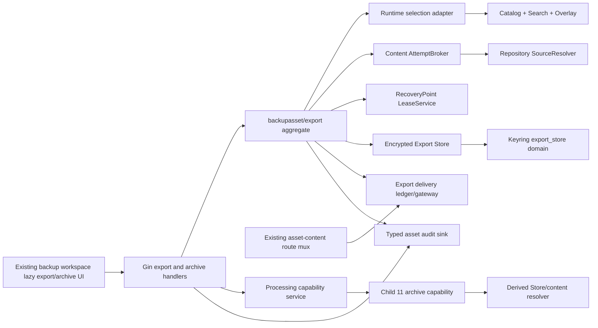

# Backup Asset Export And Restricted Archive Retrieval Design

## 0. Planning Authority And Gate

This design is the Child 12 Phase 1 technical contract. It is based only on
merged `main` at `9ad2893c714c82781461f452030c25e0766eedd4`; it does not import
an unmerged sibling. The child is now `in_progress`; the parent remains `planning`.

```text
task:                     .trellis/tasks/07-22-backup-assets-export-archive
branch:                   codex/backup-assets-export-archive
base / HEAD / main:       9ad2893c714c82781461f452030c25e0766eedd4
origin/main / merge-base: 9ad2893c714c82781461f452030c25e0766eedd4
delivered program state:  11/15
planning approval:        complete_approved (2026-07-22 controller user reply "批准")
workflow transition:      complete_approved (same approval + user clarification)
implementation approval: complete_approved (same approval + user clarification)
task.py start approval:   complete_approved (same approval + user clarification)
task.py start:            executed once on 2026-07-22
product/test/migration:   executed within exact 131 manifest; runner stdout ownership RED/GREEN complete
PostgreSQL lock tranche:  closed (lock order/context/idempotency only; controller fresh required `TestExportBehaviorPostgres` PASS `11.527s`)
focused crypto review:    closed (spec ✅; quality APPROVED; zero findings)
archive-profile sub-boundary: closed (independent current-code review: complete AssetRef + nonnegative root
                          ordinal validation before allocation; collision allocator/limits final-member validation
                          after scope prefixing and every retry; focused selectors passed; remaining P3
                          instrumentation coverage limitation is not a product failure)
final implementation review: closed in focused implementation/review tranches
Step 10 runnable gates:   passed_current_runner_amended; exact 131 = 68 tracked + 63 untracked;
                          runner package/race/vet/full/PostgreSQL/bundle gates passed fresh
Step 10 status:           blocked_external; dependency audit is the sole open gate
dependency audit gate:    1 moderate + 3 high; no compatible complete Node 20/React 18 fix;
                          brace-expansion upstream/tooling or Node 22.22+/React 19.2.7+/Router 8 migration needed
historical local gates:   checkpoints only; current completion evidence is the fresh runnable-gate record
Step 11 / delivery:       authorized_limited_pending; exact stage/commit/push and draft PR/CI only
Step 11 preflight:        exact git-add staging attempt rejected by read-only Git metadata before index mutation; staged=0
Step 11 gate:             draft must remain draft; no ready/merge/completion claim before dependency-risk closure
delivery mutations:       stage/commit/archive/journal/push/PR/CI/merge still not_executed
```

The thirteen focused corrections in PRD §7 are part of the approval surface. In
particular, `member_chain` is a versioned one-hop contract in this child and
the 000068 export delivery ledger is resolved behind the already redacted
`/asset-content/:deliveryId` path. The same approved planning scope covers the saved-search
commit Tx seam, permanent quota-bucket use latch, Repository settings-fixture
completeness, Export-owned delivery budgets and composite Content+Export logout
revocation. The exact future manifest is 56 create + 67 modify after the
2026-07-23 test-only no-aging-calendar fixture amendments, the 2026-07-24
Settings/Config handler amendment and the existing Overlay idempotency helper
required to atomically publish and consume live Export settings, the 2026-07-25 PostgreSQL
migration-dirty search-path guard/test amendment, and the same-day SQLite
DSN query-replacement guard/test amendment for non-overridable writer locks, the
2026-07-26 archive-member non-projectable Derived-manifest amendment, the narrow
`content/attempt_broker.go` source-reader drain amendment, the narrow shared
Provider bounded-reader cancellation amendment (`provider/restic.go` plus its
existing `runner_test.go`), and the final removal of unrelated `settings_handler_test.go` because dedicated
live-settings coverage is in `settings_transition_test.go`. The 2026-07-28
accessibility amendment adds only existing `web/src/index.css` and
`web/src/index-css.test.ts` for the approved global reduced-motion/power-save
behavior. The export-list inset focus ring remains owned by the already-listed
export panel files. A separate narrow amendment adds existing
`web/src/lib/api/core.ts` so removing decoded `exportJobId` query fields
preserves unrelated raw query bytes, order, duplicates, bare flags, empty
separators and hash fragments. The final focused amendment adds only existing
`processing/capabilities/runner.go` and `runner_test.go`: a full gate observed
`read |0: file already closed` because `exec.Cmd.Wait` may close `StdoutPipe`
before a delayed consumer reaches EOF. The repair uses a deterministic RED and
a parent-owned pipe while retaining concurrent Wait/process-group cleanup.
These amendments change no product contract, dependency, capability profile,
migration, Provider behavior, deployment, release or correction count.
The 2026-07-28 CI-equivalent dependency audit does not amend this manifest.
A compatible lockfile probe removes the earlier advisories but still fails on a
new `brace-expansion` advisory without a compatible published fix and on
`react-router 8.3.0`, which requires Node `>=22.22` and React `>=19.2.7` while
this repository intentionally targets Node 20 and React 18. `--force`, a hidden
major override, and an unrelated router/React migration are rejected. Both
package files remain byte-identical to HEAD; the unrelated `core.ts` amendment
made the prior exact scope 129, and the runner amendment makes the approved
target 131. The earlier exact-129 verification passed child/parent validation,
manifest/static/gofmt, frontend/budgets, normal/race, vet, backend lint/build,
required PostgreSQL zero-skip selectors and the corrected short-TMP full gate.
Those results became historical when a later final `make check` captured the
real runner pipe race. The delayed-consumer test then reproduced the exact
`file already closed` RED; the parent-owned-pipe GREEN passed focused/package/
race/repetition/vet, exact-131 parity, corrected short-TMP full gate, bundle
budgets and required real PostgreSQL migration/Export/Processing selectors.
Step 10 is again closed for every runnable boundary and remains
`blocked_external` only on dependency audit.

Narrow workflow-only permission for exact staging, one coherent commit, push and
a draft PR is restored. CI's dependency audit remains warning-only, so
otherwise-green CI does not close the audit. The PR must stay draft until a
compatible dependency remediation or explicit later risk-policy disposition.
Only after that closure may it become ready, merge, receive post-merge
monitoring and then allow Child 12 archive/journal work. The parent remains
`planning` and is never archived by this child.
The same approval,
as clarified by the user on 2026-07-22, also authorizes the planning workflow
transition, `task.py start`, and Phase 2 work inside the exact approved manifest.
When the controller presents multiple approval requests together, approval covers
all listed requests unless the user explicitly excludes one; this standing
interpretation does not authorize genuinely new scope, irreversible high-risk
actions, or manifest deviations.

The Provider amendment is limited to the shared internal `boundedReadHandle`.
Its old mutex scope covered `underlying.Read`, while `Close` needed that mutex
before it could reach `underlying.Close`; a blocked Provider read therefore
defeated the already-required Export drain acknowledgement. The revised lock
scope must preserve bounded-byte accounting and EOF/overflow behavior while
permitting cancellation to close the underlying reader. It neither changes a
Provider public contract nor exposes Provider bytes, locators, or credentials.

## 1. Goals And Invariants

### 1.1 Goals

1. Freeze a direct selection or saved search into immutable composite asset
   identities and produce an encrypted, durable ZIP/TAR asynchronously.
2. Preserve exact truth across partial failures, restart, lease takeover,
   cancellation, expiry, key loss and physical-delete failure.
3. Reuse merged Content/Processing/Derived/lease/audit ports without exposing
   Provider locators, credentials, paths, plaintext staging or Worker internals.
4. Complete the safe archive-index and single-member retrieval product in the
   existing backup workspace.

### 1.2 Non-Negotiable Invariants

- Provider data is read-only. Export, Derived, Catalog and reports are never a
  backup, recovery or verification fact.
- Every asset lookup carries `(recovery_point_id, entry_id)` plus the frozen
  Catalog/source identity. An entry-only repository query is invalid.
- Search resolution happens once before durable job creation. A persisted job
  is never expanded, refreshed or rebound to another RecoveryPoint. Saved-search
  owner/state/version/query and frozen Search generations are locked/revalidated
  in the create transaction before any lease or durable Export write.
- Only the current job fence and all current source-lease fences can mutate
  progress, seal an artifact or publish `ready`.
- Plain archive bytes never reach persistent storage. Staging and ready files
  are chunk-encrypted from the first byte.
- Export key material is independent from Entry Identity, Cursor, Search,
  Audit, Derived, Content cache and Recovery Cleanup domains.
- A ticket is an exact, path-scoped cookie capability; it is not a URL bearer,
  step-up proof or reusable permission.
- Export delivery owns 000068 budgeting; Content `BudgetService` remains bound
  to 000066. Logout fans out to both ledgers even when one revocation fails.
- Missing items remain visible as skipped/failed. `ready/partial` is distinct
  from `ready/complete`; zero packed items cannot be ready.
- Archive parsing/extraction remains inside the Child 11 closed capability.
  Core never accepts a member path, mounts an archive or recursively unpacks.
- A current-main Catalog/Content record has no link target. Export never guesses
  or dereferences a symlink/hardlink; both are reported as
  `skipped/link_metadata_unavailable` without a Provider byte read.
- Archive fallback is an explicit, permission-checked original Content download,
  never an implicit member-delivery substitution. Controlled recovery remains
  capability-gated until Child 13.
- `backup_assets.enabled` stays false by default. Command Provider stays typed
  unsupported. Core read paths remain available when Export/Worker is absent.

## 2. Component Topology And Dependency Direction



`backend/internal/backupasset/export` owns export state, selection snapshots,
archive assembly, ciphertext, keys, delivery, reconciliation and metrics. It
may depend on narrow interfaces using `backupasset.AssetRef`,
`content.AttemptBroker`, `backupasset.LeaseService` and the audit sink. It must
not import Provider implementations or inspect repository locators.

The existing shared `backupasset/runtime.Runtime` remains the only composition
root. A managed export runtime starts after Foundation/Content, obtains the
same Repository source resolver and LeaseService, exposes narrow API/gateway
methods, participates in stop-accepting/shutdown/schema-down, and owns one
persistent worker/GC loop. `cmd/server` wires accessors; it does not construct a
second DB/keyring/repository graph.

Archive-member orchestration stays in the single-AssetRef Processing/Derived
path. Export does not call the Worker to build ZIP/TAR and the Worker does not
receive a multi-asset export descriptor.

## 3. Frozen Selection And Idempotency

### 3.1 Public Intent

The strict create body is a tagged union:

```go
type CreateSelectionV1 struct {
    SchemaVersion int
    Kind          SelectionKind // explicit | saved_search
    Assets        []backupasset.AssetRef
    SavedSearchID string
    ExpectedSavedSearchVersion int64
}

type ArchiveProfileV1 struct {
    Format      ArchiveFormat      // zip | tar
    Compression CompressionProfile // zip_deflate_v1 | tar_none_v1 | tar_gzip_v1
}
```

Exactly one selection arm is present. The API does not accept path, Catalog
generation, fingerprint, byte estimate, query AST, Provider kind/locator,
archive program/options or an export expiry chosen by the caller.

`Idempotency-Key` is a required bounded opaque replay token, not authorization
material. Following the existing Overlay boundary, the server stores only a
domain-separated SHA-256 digest. It is intentionally independent of Export KEK
rotation/loss/deletion. The request-intent digest is canonical V1 over requester,
selection arm (explicit sorted refs or saved-search ID + expected version) and
archive profile. It deliberately does not depend on the later search result,
which lets the service check a replay before resolving a saved search.

Create order is fixed:

1. Authenticate, require Admin + `backup_assets:export`, validate a fresh
   `asset.export_create` proof and strict-decode the body.
2. Canonicalize the intent and look up
   `(owner_user_id, endpoint, idempotency_key_digest)`.
   Matching intent returns the existing job; a different intent returns the
   same safe conflict for every caller.
3. Resolve the selection read-only. Concurrent first requests may duplicate
   resolution work, but a saved-search result also captures a commit binding
   over ID/owner/expected version/active state/canonical query plus frozen Search
   generations. A unique idempotency insert elects one durable winner; losers
   discard their in-memory snapshot and return that winner.
4. Generate the job ID/DEK and, in one transaction using the global source lock
   order, invoke the typed Overlay saved-search Tx validator when applicable and
   revalidate every frozen Search generation/source before any 000068 insert or
   `AcquireTx`. Then insert a unique `creating` receipt with nullable result,
   acquire one `LeaseHolderExportJob` Foundation lease per distinct RecoveryPoint,
   create job + wrapped job-key + encrypted items/source refs, reserve quota, and
   finally bind the receipt/result as `committed`. Any failure rolls the entire
   transaction back. No durable row/lease/key/reservation follows a stale saved-
   search binding. Commit before returning `202 + Location`.

A crash before step 4 creates no job and a retry resolves again. A crash after
commit has a durable wrapped key, source leases and quota reservation even when
no attempt/artifact exists. Every replay then returns the frozen job without
rerunning Search. Concurrent losers never acquire a committed lease/reservation.

### 3.2 Selection Resolution Port

Export defines a narrow runtime-supplied port rather than importing handler
DTOs:

```go
type SelectionResolver interface {
    ResolveExplicit(context.Context, SelectionActor, []backupasset.AssetRef, SelectionLimits) (FrozenSelection, error)
    ResolveSavedSearch(context.Context, SelectionActor, string, int64, SelectionLimits) (FrozenSelection, error)
    RevalidateFrozenTx(context.Context, *gorm.DB, SelectionActor, FrozenSelection) error
    RevalidateMetadataTx(context.Context, *gorm.DB, FrozenItem) error
}

type SavedSearchCommitBindingV1 struct {
    SavedSearchID           string
    ExpectedVersion         int
    CanonicalQueryDigest    string
    SearchGenerationDigest string
}

type FrozenSelection struct {
    Items       []FrozenItem
    SavedSearch *SavedSearchCommitBindingV1
}
```

The runtime adapter composes the existing Overlay `UseSavedSearch`, Search
service, Catalog service and authorization scope. For a saved search it pins
the saved-search ID/owner/version/canonical-query digest plus an ordered digest
of the exact Search generations consumed, consumes signed cursors until empty,
and requires every page plus aggregate coverage to be `complete`.
`ErrStaleCursor`, broken scope, version change, partial coverage, duplicate
identity or the hard item/byte cap aborts the entire create. It never truncates.

An explicit directory expands through the exact Catalog generation in stable
entry-ID order before commit. Selected descendants covered by a selected
ancestor are deduplicated. Symlinks are leaves and never traversed. Directory
expansion and saved-search pagination share the same hard count/logical-byte
ceilings. Authorization is checked for every RecoveryPoint before any row is
persisted; mixed authorized/unauthorized input fails atomically without
revealing which identity existed.

`RevalidateFrozenTx` first calls a narrow Overlay service
`ValidateSavedSearchForExportTx` seam when a binding exists. That seam uses the
caller transaction to lock the saved-search row and validates owner, active
state, expected version and canonical-query digest without exposing the raw
model to Export. The resolver then locks/rechecks every bound Search generation
and exact RecoveryPoint/Catalog/source row immediately before `AcquireTx` and
insert. A mismatch aborts the transaction with no job/lease/key/reservation;
explicit selections skip only the saved-search check. `RevalidateMetadataTx` is the
non-byte port for directory/symlink/hardlink/special items; only regular files
are opened through `AttemptBroker`. Export rows do not use source FKs as a
retention mechanism: active Foundation leases protect queued/running/ready
sources, while terminal summaries may outlive source deletion without blocking
it or being cascade-deleted.

### 3.3 Frozen Record And Canonical Digest

Each `FrozenItemV1` contains:

```text
schema_version
recovery_point_id + entry_id
catalog_generation_id
source_fingerprint + entry_fingerprint + fingerprint_strength
provider_capability_revision
entry_type + logical_size + media_type
recovery_point_retention_until_optional
selection_root_ordinal + relative archive components
```

IDs/fingerprints/type/size/optional retention deadline remain queryable for
scheduling and fenced checks. Path components and display values are
canonicalized, then AEAD-encrypted under the job DEK with item ID + selection
digest as AD. No link target exists in the current-main source contracts, so
none is frozen, inferred or stored. Plaintext path/display values never exist in
a DB column.

The canonical selection digest is SHA-256 over a domain-separated canonical
binary encoding of schema version and frozen records sorted by lower-case
recovery point ID then raw entry ID. It intentionally excludes ZIP/TAR profile;
the request-intent digest and chunk AD bind that separately. Length-prefixing
every field prevents concatenation ambiguity. Duplicate refs are removed before
encoding; the final count is included. Tests provide golden vectors and a
one-field difference matrix.

## 4. Persistent Schema And Model Contract

Migration ownership is exactly paired
`000068_backup_asset_export.{up,down}.sql` for SQLite and PostgreSQL. The schema
is additive and does not rewrite old Task/Snapshot/Catalog/Content/Processing
rows.

### 4.1 Tables

| Table / model | Security and lifecycle fields |
|---|---|
| `backup_asset_export_jobs` / `BackupAssetExportJob` | opaque ID, owner, selection digest/version, archive format/profile, immutable typed limits-snapshot version/fields, closed execution state/result kind plus orthogonal cleanup state, current attempt/fence revision, absolute deadline, ready/expiry times, item/byte counters, safe error categories, transition revision, UTC timestamps |
| `backup_asset_export_keys` / `BackupAssetExportKey` | exactly one per job; active/rewrapping/destroyed/lost state, wrapped DEK + envelope nonce + KEK version/algorithm, key revision, created/rewrapped/destroyed UTC times; created atomically with job |
| `backup_asset_export_items` / `BackupAssetExportItem` | job + stable ordinal, composite ref, Catalog/source/entry identity, provider revision, type/size/optional RecoveryPoint retention deadline, encrypted path metadata nonce/ciphertext, closed item state, owning attempt, logical/provider bytes, safe error, UTC timestamps |
| `backup_asset_export_attempts` / `BackupAssetExportAttempt` | job + attempt number, worker owner, state, internal random 256-bit fence token, unique nonce prefix, lease expiry, checkpoint ordinal/count/bytes, final staging locator, failure category, start/finish/UTC timestamps |
| `backup_asset_export_item_attempts` / `BackupAssetExportItemAttempt` | immutable job/item/attempt observation, closed state, encrypted-spool digest/size/opaque locator, logical/provider bytes, safe error, started/read/packed/finished UTC times |
| `backup_asset_export_source_leases` / `BackupAssetExportSourceLease` | unique job + RecoveryPoint, Foundation lease ID/attempt/fence hash, exact returned `Lease.AbsoluteDeadline`, optional RecoveryPoint `RetentionUntil`, state, acquired/renewed/released UTC times |
| `backup_asset_export_artifacts` / `BackupAssetExportArtifact` | one job/current attempt + job-key reference, opaque locator, staged/sealed/revoked/purging/purged/purge_failed state, cipher/chunk/format versions, nonce prefix, chunk count, plaintext/archive/ciphertext digest and sizes, sealed/expiry/purged times |
| `backup_asset_export_idempotency` / `BackupAssetExportIdempotency` | owner + endpoint + domain-separated key digest, request-intent digest, creating/committed state, nullable-then-required result job ID, created/absolute expiry; unique owner + endpoint + digest |
| `backup_asset_export_quota_buckets` / `BackupAssetExportQuotaBucket` | global/user scope + subject, transition revision, active jobs/workers/readers and reserved/used store bytes; unique scope slot; the reserved global singleton is also the permanent 000068 use latch |
| `backup_asset_export_reservations` / `BackupAssetExportReservation` | bucket + job/attempt, job/worker/reader/store kind, reserved logical/provider/cipher/store bytes and slots, lease owner/expiry, active/purge_pending/released/expired state, UTC timestamps |
| `backup_asset_export_delivery_grants` / `BackupAssetExportDeliveryGrant` | strict resource kind `export_archive|archive_member`; exact export artifact/attempt/fence/digests/sizes/formats/job-key-version XOR exact member request/outer fingerprint/Derived set/artifact/blob/digest/size; owner/session JTI+token version/role revision, proof action/ID/expiry, cookie-secret hash only, exact action/path/method/range, state/revoke reason, idle/absolute expiry, request/byte/in-flight budgets, UTC timestamps |
| `backup_asset_export_delivery_requests` / `BackupAssetExportDeliveryRequest` | grant/request IDs, method/range, reserved/plain/cipher bytes, state/failure, start/finish timestamps for conservative crash reconciliation |
| `backup_asset_archive_member_requests` / `BackupAssetArchiveMemberRequest` | owner + endpoint + domain-separated idempotency digest/request-intent digest, outer composite ref and Catalog/source/entry fingerprint, archive-index artifact/revision, domain-separated one-element member-ID/chain digest, resolved ordinal, processing interest/job IDs, closed request state/error, absolute expiry, UTC timestamps; unique owner + endpoint + digest |

The PostgreSQL tranche closes one canonical persisted quota/archive row-lock
order: `Q(global,user) -> J -> A -> I -> IA`. `Q` locks the global quota bucket
before the user bucket, followed by the export job (`J`), current attempt (`A`),
item (`I`) and item-attempt (`IA`). Any nonlocking identity discovery or join is
only an untrusted hint and grants no mutation authority. After acquiring these
row locks, the transaction revalidates exact identity, owner, state, version/
revision, every relevant digest and persisted binding, deadline, and the full
current-attempt job/attempt/item/item-attempt tuple before any quota reservation/
charge or spool/archive/ciphertext mutation; any mismatch fails closed and rolls
back.

All opaque IDs are CSPRNG 128-bit lower hex except Catalog entry/fingerprint
fields with their existing validators. Counts/bytes are non-negative and
bounded; times are UTC and lifecycle ordering is enforced in CHECKs and Go
validators. There are no plaintext path/name/member/ticket/key columns. The
only raw fence credentials are internal `json:"-"` attempt rows and existing
Foundation lease rows; source refs retain hashes, and no fence reaches API,
audit, logs or metrics.

The DB uses FKs only inside the 000068 aggregate plus the existing wrapped-key
domain row. It deliberately does not FK frozen items/source refs to mutable
RecoveryPoint/Catalog/Foundation lease rows; active leases are the retention
authority and terminal export summaries must neither block nor be cascade-
deleted by source lifecycle. Artifact/spool locators are opaque single path
components. Partial unique indexes enforce one current attempt, one job key,
one artifact, one per-attempt item observation, active reservation slots,
idempotency slots and one active delivery ID. Delivery issuance
also checks the old Content table to avoid a cross-ledger ID collision; the
content mux rejects a logically impossible double match rather than choosing.

### 4.2 Closed States And Transitions

Job transitions:

```text
queued -> running | cancel_requested | failed | source_expired
running -> retry_wait | sealing | cancel_requested | failed | source_expired
retry_wait -> running | cancel_requested | failed | source_expired
sealing -> retry_wait | ready | cancel_requested | failed | source_expired
ready -> cancel_requested | expiring
cancel_requested -> canceled
expiring -> expired
```

`failed`, `source_expired`, `canceled` and `expired` are closed execution
outcomes. A ready user cancel records the cancel outcome as `canceled`; an
absolute ready expiry uses `expiring -> expired`. Neither outcome is overwritten
by a later disk-cleanup failure.

An expired sealing attempt returns to `retry_wait` only through fenced restart
reconciliation. That reconciliation retires the old attempt and artifact,
purges its staging object and clears current ownership while preserving its
immutable item-attempt rows. The next claim allocates a new attempt ID, fence
and nonce prefix, resets job/item projections and counters to byte zero, and
rebuilds the whole archive; it never resumes the retired archive bytes.

Job cleanup state is orthogonal to the execution outcome:

```text
none -> revoking -> purging -> purged
revoking | purging -> purge_failed
purge_failed -> purging
```

Any cancel/failure/source expiry/key loss/unpublishable artifact that owns a
spool or final object enters this cleanup machine, including before `ready`.
`revoking` closes access and destroys the wrapped DEK; `purge_failed` is
cryptographically access-terminal but physically retryable. Artifact state
uses the matching `revoked/purging/purged/purge_failed` tail, and purged rows
remain as bounded tombstones until summary retention expires.

Attempt states are `active/sealing/sealed/failed/canceled/superseded`; delivery
states are `issued/active/draining/revoked/expired/closed`; archive-member
request states are `queued/running/ready/failed/canceled/expired`. Every update
uses expected state + transition revision + current attempt/fence predicates.

Job-level item projection and immutable item-attempt transitions are monotonic
within an attempt:

```text
pending -> read -> packed
pending/read -> skipped | failed
```

Every fresh attempt that rebuilds from byte zero atomically resets every
job-level item projection, owning attempt and aggregate/checkpoint counter to
`pending`/zero under the new fence, including prior `packed`, `skipped` and
`failed` projections. Immutable item-attempt rows alone preserve what an old
attempt observed. Old staging/checkpoints are not reused as trusted ZIP/TAR
bytes.

### 4.3 Migration Up/Down

`up` creates all tables/indexes/CHECKs/FKs in dependency order and extends
`wrapped_domain_keys.domain` with `export_store`, preserving every previous
allowed value and index. `export_job` already exists in the 000062 lease-holder
CHECK, so 000068 must not rewrite that table or pretend to add the holder.

The SQL `down` first aborts when any of the thirteen 000068 tables has a row,
any active/past export RecoveryPoint lease exists, or any `export_store`
wrapped key exists. SQL does not claim to inspect the filesystem. Before the
down callback, `ExportRuntime.PrepareSchemaDown` stops admission, drains work,
holds the validated Export-root process lock, and rejects every owned, unknown
or unreadable staging/final/orphan entry. Only after that empty-root proof may
it invoke the SQL callback. A missing/unvalidated root fails closed. Only a
pristine unused schema may drop in reverse order and restore the 000067 key-
domain CHECK byte-for-byte in meaning. The first successful Export or archive-
member 000068 write transaction atomically ensures the reserved global quota-
bucket singleton. That row is never deleted by summary TTL, GC, purge or quota
reconciliation, so a used schema remains detectably used even after every other
row and file is purged. After use, rollback is application disable + forward
repair; destructive down is permanently forbidden without adding a fourteenth
table.

Required parity is not “file exists”: pristine apply/down, first-write latch,
used-down and purge-to-empty-down refusal, 067 preservation, UTC/model/index/
CHECK/FK parity and export behavior run on
SQLite and real PostgreSQL 18. CI selector changes from 067 head to include
`BackupAssetMigration068` and Export behavior. Required local/CI migration runs
set `REQUIRE_POSTGRES_MIGRATION_TEST=1`; Child 12 adds a fail-closed
`REQUIRE_POSTGRES_EXPORT_TEST=1` helper for Export behavior, and any command that
also exercises existing Processing PostgreSQL behavior sets
`REQUIRE_POSTGRES_PROCESSING_TEST=1`. Missing required DSN is fatal; a skip is
never parity evidence. Current `database.go` already registers one configured
`ScanLocation` for both pgx `timestamp` and `timestamptz` codecs; 068 parity
regresses both scan types without changing that connector.

## 5. Lease, Attempt, Checkpoint And Fencing

### 5.1 Acquisition And Renewal

Create acquires every distinct `LeaseHolderExportJob` lease in its single
transaction, with owner ID = export job ID and **zero**
`AcquireLeaseRequest.AbsoluteDeadline`. This preserves current-main's holder-
isolated zero-deadline acquisition; an explicit value would instead compare
against the most recent lease for the RecoveryPoint regardless of holder/owner
and can conflict with Catalog/Content/Processing history. RecoveryPoint/Catalog
rows are locked and revalidated before `AcquireTx`; the exact
`Lease.AbsoluteDeadline` returned for every source is persisted in the 000068
source-ref row. Job/key/items/refs and all leases either commit together or all
roll back. This closes the resolve-to-queue cleanup race and means queued jobs
never rely on a passive source FK. A hard `max_source_points` bounds transaction
size; `lease.go` and its tests remain unchanged.

Within that transaction define `source_cap` as the minimum of every returned
lease deadline and every non-null RecoveryPoint `RetentionUntil`. The job
execution deadline is
`min(created_at + frozen max_duration, source_cap)`. An already reached cap, or
one that cannot provide the frozen lease TTL plus renew margin required to start
safely, fails create with no job. Every later attempt repeats the remaining-time
safety check before claiming readers. A ready artifact/access deadline is
computed separately in §5.2 because ready TTL starts at `ready_at`.

Export time decisions use an injected UTC clock. Tests freeze that clock or
derive future/past values from one captured test-start instant; TTL, lease and
expiry tests never depend on a fixed calendar date that can age into failure.

The managed runtime starts heartbeats immediately after commit and renews both
the queued/ready job claim and RP leases before their safety margin. Claiming a
worker attempt allocates a durable attempt ID/raw fence token, CASes the job's
current attempt/fence revision, and verifies all previously acquired source
fences; it does not reacquire or extend their deadlines. Every `RenewTx` or
`TakeoverTx` result must preserve the persisted exact deadline; a mismatch or
attempt to supply/rewrite a deadline fails closed. A renew failure
cancels readers, revokes a ready artifact or supersedes/fails an active attempt,
and forbids seal/download.

Source leases remain active through ready and are released only after
cancel/fail/source-expired/expiry has revoked deliveries and destroyed the job
key, or after a safe terminal create rollback. Crash reconciliation renews a
still-valid owner or waits for short expiry and uses `TakeoverTx`; it never
reacquires or extends the returned absolute deadline. The raw Foundation fence remains only
in the existing lease row/process memory; the 000068 source-ref hash detects
mismatch without creating a second usable credential.

That `TakeoverTx` is a RecoveryPoint source-lease heartbeat-owner takeover and
is valid for queued/running/ready protection. A job-attempt takeover is a
separate CAS allowed only from `running/retry_wait/sealing`; only it allocates a
fresh attempt fence and resets current item projections. A ready reconciler may
take over source-lease ownership only to verify/retain or revoke the sealed
artifact. It cannot transition ready back to running, create an attempt, change
result/counters or reset projections.

### 5.2 Read And Seal Protocol

For each item the worker first validates feature, job/deadline, current raw
attempt fence and exact RP fence with `ValidateFenceTx`:

1. Directory/symlink/hardlink/special entries call only
   `SelectionResolver.RevalidateMetadataTx`. Safe directories may emit empty
   directory members. Every symlink/hardlink becomes
   `skipped/link_metadata_unavailable`; no target member is emitted, no target is
   guessed from path/name/locator/fingerprint, and no Provider byte source is
   opened. Special/unknown entries use their closed skipped categories.
2. A regular file opens a sequential `content.AttemptBroker` session bound to
   the frozen composite ref, Catalog/source/entry fingerprints and remaining
   budgets. Stat/type/size/fingerprint mismatch becomes `source_changed`.
3. Source bytes stream with backpressure into an attempt/item-specific encrypted
   spool under the Export root. The spool subkey/nonce/AD are distinct from the
   final archive stream. Logical, Provider and spool ciphertext bytes are
   reserved/counted separately; cancellation or lease loss closes the reader.
   A blocked read must not hold the lock needed to close its underlying reader:
   job cleanup waits for a positive reader-drain acknowledgement before key
   destruction or source-lease release.
4. After EOF/close, the worker authenticates the spool and revalidates source,
   metadata, job/attempt and every applicable fence. Failure destroys the spool,
   records an immutable failed item-attempt and continues only when the partial
   policy permits. No archive header has been written for that item.
5. Only a validated spool may write its deterministic ZIP/TAR header and body.
   After a header is written, any spool decrypt/tamper/local writer error aborts
   the whole attempt; it cannot be downgraded to an item failure. Full append
   commits the item-attempt/job projection as `packed`, then deletes the spool.

The checkpoint stores the last fully finalized item ordinal plus aggregate
counts/bytes and points at immutable item-attempt rows. It is useful for status
and orphan cleanup, not for appending to an old archive. On an active job-
attempt takeover every old spool/final staging object is destroyed and all
current projections reset from the preserved history. A ready source-lease
takeover performs no reset. ZIP central directories, TAR terminators and AEAD
trailers are created only under the current attempt.

Before final encryption, one quota/job/attempt/source-fence transaction
revalidates every frozen item's live source metadata and durably claims the
attempt-specific final staging locator. That locator is the nonce-ownership
claim: a concurrent seal loses authority before final encryption instead of
reusing the nonce. Ready publication repeats every frozen item's live metadata
revalidation inside its own authority transaction.

Sealing fsyncs ciphertext and its parent directory, validates the complete
authenticated stream and archive digest, then in one DB transaction locks the
job/attempt/artifact/all RP leases, rechecks cancel/deadline/source summaries,
sets the artifact sealed, computes complete/partial and commits
`expires_at=min(ready_at+job_frozen_ready_ttl, every persisted returned lease
deadline, every non-null RecoveryPoint RetentionUntil)`.
The filesystem rename uses an attempt-specific opaque staging locator; a late
rename without the DB transaction is an orphan and is deleted. Only the
current fence can publish the final locator.

The ready transaction does not release source leases. It transfers their
heartbeat responsibility to ready/expiry reconciliation. Any later lease loss
revokes delivery and enters cryptographic deletion; ready can never outlive the
earliest persisted lease/RecoveryPoint retention cap.

### 5.3 Takeover And Restart

Startup reconciliation treats `running/retry_wait/sealing` as untrusted unless
the same owner can prove an unexpired DB claim and every source fence. An
expired owner is superseded, open grants are revoked, old staging is deleted,
and a new attempt with a fresh nonce prefix retries the whole archive. Ready
artifacts are verified from DB metadata and authenticated header/trailer, not
filename or mtime; source-lease heartbeat takeover does not alter their attempt,
projection or counters. Missing/tampered ciphertext, wrapped key or locator
revokes deliveries and enters cleanup with a safe category.

This guarantees process restart/takeover. Container replacement persistence
depends on the Child 15 durable Compose volume and remains a named GA blocker.

## 6. Archive Assembly And Path Safety

### 6.1 Profiles And Streaming

The closed profiles are:

| Profile | Client archive | Server behavior |
|---|---|---|
| `zip_deflate_v1` | ZIP | default; standard deflate; deterministic headers |
| `tar_none_v1` | TAR | no compression; streaming |
| `tar_gzip_v1` | tar.gz | fixed gzip parameters; streaming |

No client compression level, executable, environment or filename is accepted.
Provider bytes first enter one bounded encrypted item spool; only authenticated,
post-read-revalidated spool bytes feed Go's standard archive writer and final
chunk encryptor. There is no plaintext temp file. Bounded buffers on both legs
propagate slow disk/archive writes as backpressure.

Limits separately cap frozen/source-point/packed entries, logical input bytes,
Provider bytes, spool + final ciphertext bytes, per-item bytes, open readers,
per-user/global jobs/workers, compression wall time and absolute job duration.
Quota bucket rows are locked in global-then-user order; an owner reservation is
inserted/updated in the same transaction as each counter CAS. Lease expiry lets
reconciliation conservatively reclaim a crashed worker/reader while filesystem
inventory repairs used store bytes. Reaching a hard global/archive limit fails
the job; a source-specific failure before an archive header may produce partial
if another regular item packed successfully.

### 6.2 Deterministic Safe Paths

Input path components are decrypted only inside the worker and passed through
a versioned sanitizer:

1. Reject invalid UTF-8, NUL, control/default-ignorable characters, empty,
   `.`/`..`, separators inside a component, absolute/UNC paths and drive roots.
2. Normalize NFKC, trim dangerous trailing dot/space, and replace Windows
   reserved device basenames with a stable safe form.
3. Bound component bytes, depth and final member bytes; overlong values receive
   a digest suffix rather than unsafe truncation.
4. Compare collision keys with Child 11's exported NFKC casefold rule. Preserve
   the selected relative tree; prefix cross-root conflicts with stable
   `rp-<short>/root-<ordinal>`, then use `~<stable ordinal>` suffixes.
5. Sort output by final collision key + composite ref. Repeat execution yields
   the same member names and report for the same snapshot/profile.

Directory entries are safe empty directories. Only Catalog `file` entries are
opened through the source port. Current Provider `CatalogRecord`, Catalog model/
DTO and Content `SourceStat` expose no link target, so every symlink and hardlink
is deterministically `skipped/link_metadata_unavailable`. Export never follows
one, opens its Provider byte source, emits an active/inert link or target-text
member, or infers a target from path/name/locator/fingerprint. Device, FIFO,
socket, unknown and other special entries remain skipped with closed categories.

`xirang-export-report.v1.json` is the final logical member. It contains only
the authorized archive's safe member names, opaque item IDs, status/categories
and counts; no Provider locator, credentials, ticket/key/fence or original
unsafe name. Failure to encode/write/report/close the archive prevents publish.

## 7. Encryption And Key Lifecycle

### 7.1 Key Hierarchy

At durable creation, CSPRNG generates one 32-byte export DEK. Before encrypted
item metadata commits, the same transaction inserts `backup_asset_export_keys`
with that DEK wrapped by active `KeyDomainExportStore` material using
AES-256-GCM and a random envelope nonce. Envelope AD binds export ID, selection
digest, KEK version and envelope format. The artifact references this job key;
it never becomes the first/only owner of wrapped key material.

HKDF/domain-separated subkeys cover `selection_metadata.v1`,
`item_spool.v1/<attempt>/<item>` and `archive_chunk.v1/<attempt>`. Spool and
final formats use independent random nonce prefixes/counters, and a takeover
destroys all old spools before deriving a fresh attempt stream. A crash after
create commit and before attempt claim can always unwrap the metadata key.

`export_store` is registered in the same typed keyring and
`wrapped_domain_keys` table but is not added to unconditional
`RequiredKeyDomains`. Enabling/using Export ensures it on demand. Rotation
makes new jobs use the new version; old versions remain unwrap-capable while
referenced, or job-key rows are rewrapped under transaction/fence. A version
cannot be retired/deleted while job keys reference it. Idempotency digests do
not depend on this key domain.

Mark-lost invokes an Export invalidator: revoke all affected deliveries,
invalidate current attempts, delete wrapped DEKs and enqueue ciphertext purge.
Unlike Derived/Search rebuild claims, an unavailable export is reported as
lost/expired; no plaintext or silent regeneration is returned to the caller.

### 7.2 Chunk Format

Cipher format V1 has an authenticated header, chunks and final trailer. Each
attempt gets a CSPRNG 64-bit nonce prefix unique for the job; the 96-bit GCM
nonce is prefix + uint32 big-endian chunk index, with chunk count capped below
counter exhaustion. DB uniqueness and generation retry reject a prefix
collision. Chunk index never repeats under the same DEK.

Chunk AD is canonical length-prefixed:

```text
xirang.export.chunk.v1
export_id
selection_digest
archive_profile + archive_format_version
attempt_fence_digest
chunk_index
plaintext_chunk_length
final_marker
```

The authenticated trailer additionally binds total chunk count, total logical
archive bytes and SHA-256 archive digest. Header/trailer and DB metadata must
agree before ready or Range delivery. Wrong key, nonce/AD mismatch, bit flip,
chunk reorder/duplication/removal, truncation, trailer substitution or cross-job
copy returns a stable tamper/key category and zero unauthenticated plaintext.

### 7.3 Cryptographic Deletion

Cancellation/failure/expiry order is:

1. Increment fence/stop attempts and atomically revoke every delivery.
2. Drain/close old streams.
3. Delete the wrapped DEK and encrypted selection metadata references; only
   then release/expire source leases and non-storage slot/byte reservations.
4. Idempotently unlink item spools/final ciphertext, fsync the parent, then
   re-enumerate under the validated Export-root lock to prove the owned object
   absent before closing artifact rows as `purged`. Only that three-part proof
   decrements used store bytes and releases the store-byte reservation.

Step 3 is the access boundary. Step 4 failure leaves the conservative store
charge in `purge_pending`, records job cleanup/artifact `purge_failed`, emits a
bounded metric/alert and retries; it never restores the key or permits quota
overcommit. Inventory reconciliation may correct the charged physical byte
count only after the locked root proves the object absent. A downloaded client
archive cannot be recalled and UI/audit state that limitation.

KEK-loss reconciliation resumes an already durable
`source_expired`/`cleanup=revoking` crash boundary without rewriting the
execution outcome or its safe error. It continues the same ordered cleanup,
destroys the exact job key and encrypted selection metadata, marks that exact
Export KEK version lost, and only then advances source/non-store release and
ciphertext/store cleanup.

## 8. Temporary Artifact Delivery Gateway

### 8.1 Why Export Owns Delivery Rows

Migration 000066 binds one delivery to one RecoveryPoint/Catalog/entry,
requires a Content RecoveryPoint lease, accepts only `resource_kind=backup_asset`
and `action=preview|download`, and closes renderer/product fields. Its
`IssueRequest` also has no archive-member request/job/artifact identity and
resolves Derived only for preview. A multi-RP export or one of several members
for the same outer asset must not weaken those CHECKs, synthesize one source
identity, or silently fall back to the outer original.

Migration 000068 therefore owns temporary-artifact delivery grants/requests
with a strict `export_archive | archive_member` union. It reuses only genuinely
exported Content cookie hash, deadline, method/Range and scheme primitives plus
the reviewed audit envelope, not the old Broker issue path/rows or
`content.BudgetService`. `export/delivery.go` owns independent 000068 transaction/
CAS reserve, finalize, replay and conservative-crash accounting and proves
semantic parity in focused tests. The existing
`GET|HEAD /api/v1/asset-content/:deliveryId` handler receives a typed resolver
mux. Exactly one of Content Broker or Export Gateway may claim an ID; zero and
double matches return the same safe not-found and emit no existence detail.

This keeps the already reviewed nginx streaming/Range/access-log-redaction path
and avoids deploy changes in Child 12.

### 8.2 Ticket Issue And Cookie Scope

`POST /asset-exports/:id/download-ticket` reauthorizes creator-bound Admin +
`backup_assets:export`, requires a fresh `asset.export_download` proof, locks a
ready/unexpired artifact, and sets an HttpOnly, Secure, SameSite=Strict cookie
whose path is exactly `/api/v1/asset-content/<deliveryID>`. The JSON response
contains the canonical query-free same-origin content URL, expiry and bounded
size/range metadata, never the secret.

In the issuing transaction the export grant freezes artifact ID, publishing
attempt/fence digest, archive/plaintext/ciphertext digests and sizes,
format/chunk versions plus job-key ID/version. It also freezes actor/session
JTI, token/role revision and exact proof action/ID/expiry; absolute expiry is
the minimum of ticket, session, proof and artifact boundaries. Serve locks and
matches that exact tuple. A second/current artifact, rewrap version change or
metadata replacement revokes the grant and requires a fresh ticket.

The shared scheme resolver accepts direct TLS, or one trimmed lowercase
`X-Forwarded-Proto:https` only when `RemoteAddr` is contained by the already
validated `TRUSTED_PROXIES` CIDR/IP set injected by Router. Untrusted peers,
zero/multiple/comma-joined values, any ambiguous `Forwarded` header, or a TLS/
header contradiction fail closed. Loopback HTTP is an explicit default-off
development policy. This fixes ordinary Content ticket issuance and is reused
by export/member issuance; port 10761/public CORS semantics do not change.

The cookie MAC/secret hash binds delivery, export, owner, auth session/JTI,
action `export_download`, path, GET/HEAD policy, single-range policy and absolute
expiry. Issue-time proof is not accepted at the content route. Logout, session
revision, permission/role change, job cancel/expiry/key loss and explicit
revoke close all matching grants.

The already planned handler/runtime/main wiring supplies Auth with one typed
composite content-session revoker behind the existing `BackupContentService`
shape. `RevokeSession` always attempts both the 000066 Content Broker and 000068
Export Gateway ledgers, even if the first fails; it aggregates only safe errors
and records a reconciliation need. Either branch denies the logged-out session
immediately from auth-session state, and runtime reconciliation retries partial
ledger writes after restart. No `auth_handler.go` signature or path change is
needed.

### 8.3 Range, Replay And Redaction

The export branch accepts GET/HEAD and at most one valid byte Range over
plaintext archive size. Its own 000068 delivery service reserves request/
plaintext/ciphertext budgets transactionally with row locks and revision CAS,
maps the plaintext interval to authenticated chunks, decrypts only those
chunks, slices exact bytes, and finalizes conservative accounting. Multi-range,
If-Range mismatch, overflow, request replay beyond cumulative/in-flight budget,
expired/unknown cookie, exact artifact/key tuple change and revoked job all
fail closed. HEAD reads only sealed metadata.

The stream rechecks grant/job/artifact/key state before open and before each bounded
chunk. Revocation moves active requests to draining and prevents new chunks;
old request evidence is reconciled after crash. No redirect, bearer query,
cacheable response or public filename is used. `Content-Disposition` uses a
fixed safe name derived from opaque export ID and format.

Structured app/audit/nginx logs contain only route template, status, byte/
Range summary and safe category. They never contain delivery ID in labels,
cookie/JWT/proof, selection, filename/member/path, locator, nonce/key or raw
error. The existing recovery middleware and canonical-path tests cover both
resolver branches.

## 9. Restricted Archive Member Orchestration

### 9.1 Index Read API

The existing preview-job endpoint remains the way to request
`archive.inspect`. Once its Derived artifact is active, the focused API exposes:

```text
GET  /recovery-points/:rpId/entries/:entryId/archive-members
POST /recovery-points/:rpId/entries/:entryId/archive-member-jobs
GET  /recovery-points/:rpId/entries/:entryId/archive-member-jobs/:jobId
POST /recovery-points/:rpId/entries/:entryId/archive-member-jobs/:jobId/cancel
POST /recovery-points/:rpId/entries/:entryId/archive-member-jobs/:jobId/delivery-ticket
```

The list endpoint uses the existing Derived reader to decode and revalidate the
canonical archive-index payload. It returns schema version, opaque index
revision, entries with opaque ID/parent ID, sanitized display name, regular
type, bounded size/media type and closed warning. It never returns ordinal,
raw path or Derived locator/artifact/blob ID.

### 9.2 Retrieval Job

Create accepts `{schema_version:1,index_revision,member_chain:[opaque_id]}` and
an idempotency header. The chain must have exactly one element. Before reading
the index, the service computes the canonical request-intent digest over actor,
outer composite ref, index revision and one-element chain, then looks up the
domain-separated key digest. Same key/same intent returns the existing request;
same key/different intent conflicts.

On a first request the service reauthorizes outer `AssetRef` for preview,
validates malware/sensitivity and active index revision, resolves the opaque ID
to its private ordinal, stores only its domain-separated digest plus that
ordinal, and inserts the unique request row. No raw or reversibly encrypted
member ID is persisted, so the request needs no unowned metadata key. Concurrent
losers return the winner. Only a committed queued request's reconciler requests
existing `archive.extract_entry` work with an interest key derived from request
ID; a crash after insert but before interest is repaired without duplicating a
Processing job.

The Processing descriptor continues to bind outer composite ref,
Catalog/source/entry fingerprints, provider revision, capability/schema,
pipeline/security revision, closed limits and member ordinal. The request row
binds index revision, member-chain digest, owner and resulting interest/job.
Poll/cancel require all bindings and safe-not-found cross-owner behavior. The
Worker re-inspects the source and includes member ID/size/media type in its
canonical output metadata; Core verifies those values and the current request
before marking ready.

`archive.extract_entry/archive_member_v1` remains attachment-only one-hop
retrieval even when its bounded member content is text. Its Derived manifest is
explicitly non-projectable: `manifestNeedsProjection` must not publish generic
Search/preview text or OCR output for this capability/profile. The exact
request-bound artifact remains available only to the delivery path in §9.3.

Length greater than one is `archive_nested_unsupported`. The implementation
does not route member output into `DerivedAttemptSourceResolver`; therefore it
cannot accidentally treat a nested archive as a new source. Encrypted archive,
unsupported media, duplicate/traversal path, link/device/FIFO/socket, bomb/
ratio/size/time limit, stale index, source drift and malformed output all map
to closed safe categories. In particular, a real ratio-bomb capability fixture
returns `ErrInputLimit`, the existing Worker mapping persists only
`ProcessingErrorInputTooLarge`, and the backend archive-product mapper must map
every persisted `ProcessingErrorInputTooLarge` to the same closed `limit`
fallback product. It must not depend on the non-persisted
`ReasonArchiveRatioLimit` diagnostic or leave a ratio-bomb state without
fallback eligibility.

### 9.3 Member Delivery And Lifecycle

Member output is an exact Derived `content` artifact bound to the outer asset,
processing job and request. A new exact resolver method requires request ID,
outer Catalog/source/entry fingerprints, index/member digest, Processing job/
attempt/artifact-set and the single `archive.extract_entry/archive_member_v1`
content artifact/blob/digest/size. Multiple/no matches fail closed; there is no
renderer inference or outer-asset fallback.

The delivery-ticket endpoint writes an `archive_member` grant in the 000068
gateway with that exact tuple. Child 12 exposes only attachment GET/HEAD with
`RangeNone`, a fixed safe filename and fresh exact `asset.download` proof. It
reuses exported cookie/deadline/session/scheme primitives and the same Export-
owned 000068 delivery budgeting, but does not call Content `BudgetService`,
invent a renderer port or claim text/raster/PDF preview. Archive index remains the bounded preview;
member permission never inherits `backup_assets:export`.

This prevents the unsafe state rather than relying on later cleanup. A running
request can be failed by a terminal authority/source change after its interest is
removed, but generic Search has no request-state join. Once a generic
projection has been published, ready revocation's unfenced `RevokeSet` fails for
it. The containment is deliberately limited to preventing new
archive-member projection publication; it does not claim durable cleanup of any
historical projection output.

The request/artifact expires no later than outer RecoveryPoint `RetentionUntil`,
the Derived policy or its Processing-bound expiry. Source drift, policy/classification change, cancel, key
loss or outer revoke removes interest and revokes Derived delivery before
artifact cleanup. Audit uses the already registered `archive_inspect` and
`archive_member` actions with outer opaque IDs, index/member digest and safe
category only, never member name/path/token.

For `encrypted_archive`, unsupported format and any archive limit outcome,
including ratio bomb projected from persisted `ProcessingErrorInputTooLarge`, the
panel may offer an explicit **download original** command only when the existing
Catalog permission/content-availability/capability product already allows it.
That command reuses Child 8's typed outer-asset Content request
`download/attachment/original_v1` and obtains a fresh, non-persisted exact
`asset.download` proof/ticket. This is intentionally separate from the forbidden
implicit outer-file fallback in member delivery. Missing download authority,
offline state or unavailable Content maps to one stable closed reason without
revealing whether the outer asset exists. Controlled-recovery fallback remains
capability-gated until Child 13 and is not an endpoint/job in this child.

## 10. API, Authorization And Audit

### 10.1 Export Endpoints And DTOs

```text
POST /api/v1/asset-exports
GET  /api/v1/asset-exports/:id
POST /api/v1/asset-exports/:id/cancel
POST /api/v1/asset-exports/:id/download-ticket
```

Create returns `202`, a canonical `Location` for exact status, and the mapped
job. Cancel is idempotent and returns `202` while revoke/cleanup runs. Status is
owner-bound; there is no public/list/share API in this child. Browser reload
reconciliation uses the opaque job ID in the existing data-route state.

The export DTO includes only schema version, opaque job ID, selection digest,
format/profile, closed execution state/result plus closed cleanup state,
counts/bytes, safe per-item status/error, attempt progress, retry/poll interval,
absolute deadline, ready/expiry times, server-evaluated permissions and safe
reason/correlation ID. Decrypted safe
archive member labels may be returned only while the DEK exists and only to
the owner; expired summaries omit them. It never exposes lease/fence/attempt
owner, key/nonce/locator, raw selection/path/name or ticket.

Status accepts only a signed opaque item cursor plus `items_limit` (default
100, hard maximum 200). Summary counters are authoritative for the whole
frozen selection; `items` is one stable-ordinal page with `next_cursor`.
Unknown/duplicate cursors, cross-job replay and page contradictions reject the
whole product. Polling does not refetch or render all 10,000 possible rows.

### 10.2 Authorization Matrix

| Route/action | Admin | Operator | Viewer | Exact proof |
|---|---|---|---|---|
| export create | owner scope + `backup_assets:export` | denied by default | denied | fresh `asset.export_create` |
| export status/cancel | creator + export permission | denied by default | denied | none beyond active auth |
| export ticket | creator + ready + export permission | denied by default | denied | fresh `asset.export_download` |
| export content GET/HEAD | exact cookie/session/grant + current permission | denied | denied | cookie, not step-up token |
| archive index/member | exact outer ownership + `backup_assets:preview` | owned lineage only | denied | sensitivity policy only |
| member attachment download | existing asset download policy | denied by default | denied | exact existing `asset.download` |
| archive original fallback | existing outer-asset download policy and availability | denied by current policy | denied | fresh exact `asset.download` |

The middleware uses existing typed permission constants and step-up registry.
`asset.export_create`, `asset.export_download`, `asset.download` and every other
purpose are run through the pairwise cross-purpose rejection matrix. There is
no credential JIT grant because Export receives no credentials or locators.

Invalid ID, cross-owner, unauthorized scope, missing job and wrong archive
binding collapse to the same safe 404 where existence would leak. Feature
disabled/unavailable and quota/retry use closed safe codes. Handlers call
response helpers and never return raw `err.Error()`.

### 10.3 Audit

Typed existing actions cover `export_create`, `export_cancel`,
`export_download_ticket`, `export_download`, `archive_inspect` and
`archive_member`. Route/action coverage tests fail if a mutation/read lacks its
registered action. Beyond the shared immutable actor/action/time/correlation
envelope and typed opaque target reference, Child 12 Export detail fields are
limited to selection digest, item count, logical/provider/artifact byte summary
and result/error category. They do not copy RP/entry lists or step-up/grant
details into the event payload.

The backup-asset audit sanitizer and segmented hash-chain retention remain the
only sink. Raw path/name/member, selection JSON, saved query, report, cookie,
JWT/proof, Provider locator, credential, key/nonce/fence and raw diagnostic are
forbidden in event payload, application log and metric labels. Audit failure
follows the existing action policy: sensitive ticket issuance and publish fail
closed; stream aggregation failure is bounded, alerted and reconciled without
logging content.

## 11. Settings, Root, Metrics And Runtime Lifecycle

### 11.1 Typed Settings

`settings.Service` and `backupasset.BackupAssetSettingsSnapshot` receive one
atomically validated config. Numeric byte values are binary bytes. Registry
values are dynamically reloadable except the root marked RequiresRestart, but
durable work never reinterprets a mutable snapshot after restart:

`BackupAssetFoundationSettingKeys` remains a complete fail-closed key set.
Because Repository's test `BackupAssetSettingsSnapshot` copies only its explicit
fixture map, `repository/testutil_test.go` must add exactly the frozen defaults
for the Child 12 keys and retain the existing snapshot-completeness assertion;
production fallback and weakened validation are forbidden.

| Key / environment | Type | Default | Min / max or closed values |
|---|---|---:|---|
| `backup_assets.export.enabled` / `BACKUP_ASSETS_EXPORT_ENABLED` | bool | `false` | bool |
| `backup_assets.export.root` / `BACKUP_ASSETS_EXPORT_ROOT` | string | `/var/lib/xirang-asset-runtime/export` | absolute private root; RequiresRestart |
| `backup_assets.export.default_profile` / `BACKUP_ASSETS_EXPORT_DEFAULT_PROFILE` | string | `zip_deflate_v1` | `zip_deflate_v1|tar_none_v1|tar_gzip_v1` |
| `backup_assets.export.chunk_bytes` / `BACKUP_ASSETS_EXPORT_CHUNK_BYTES` | int64 | `1048576` | `65536..8388608` |
| `backup_assets.export.max_items` / `BACKUP_ASSETS_EXPORT_MAX_ITEMS` | int | `10000` | `1..100000` |
| `backup_assets.export.max_source_points` / `BACKUP_ASSETS_EXPORT_MAX_SOURCE_POINTS` | int | `128` | `1..1024` |
| `backup_assets.export.max_item_bytes` / `BACKUP_ASSETS_EXPORT_MAX_ITEM_BYTES` | int64 | `2147483648` | `65536..274877906944` |
| `backup_assets.export.max_logical_bytes` / `BACKUP_ASSETS_EXPORT_MAX_LOGICAL_BYTES` | int64 | `10737418240` | `65536..1099511627776` |
| `backup_assets.export.max_provider_bytes` / `BACKUP_ASSETS_EXPORT_MAX_PROVIDER_BYTES` | int64 | `21474836480` | `65536..2199023255552` |
| `backup_assets.export.max_ciphertext_bytes` / `BACKUP_ASSETS_EXPORT_MAX_CIPHERTEXT_BYTES` | int64 | `12884901888` | `65536..1374389534720` |
| `backup_assets.export.user_active_jobs` / `BACKUP_ASSETS_EXPORT_USER_ACTIVE_JOBS` | int | `2` | `1..16` |
| `backup_assets.export.global_active_jobs` / `BACKUP_ASSETS_EXPORT_GLOBAL_ACTIVE_JOBS` | int | `8` | `1..64` |
| `backup_assets.export.worker_concurrency` / `BACKUP_ASSETS_EXPORT_WORKER_CONCURRENCY` | int | `2` | `1..16` |
| `backup_assets.export.max_open_readers` / `BACKUP_ASSETS_EXPORT_MAX_OPEN_READERS` | int | `2` | `1..8` |
| `backup_assets.export.max_duration` / `BACKUP_ASSETS_EXPORT_MAX_DURATION` | duration | `2h` | `5m..24h` |
| `backup_assets.export.max_attempts` / `BACKUP_ASSETS_EXPORT_MAX_ATTEMPTS` | int | `3` | `1..10` |
| `backup_assets.export.retry_base` / `BACKUP_ASSETS_EXPORT_RETRY_BASE` | duration | `5s` | `1s..1m` |
| `backup_assets.export.retry_max_delay` / `BACKUP_ASSETS_EXPORT_RETRY_MAX_DELAY` | duration | `5m` | `5s..30m` |
| `backup_assets.export.lease_ttl` / `BACKUP_ASSETS_EXPORT_LEASE_TTL` | duration | `90s` | `30s..5m` |
| `backup_assets.export.lease_renew_margin` / `BACKUP_ASSETS_EXPORT_LEASE_RENEW_MARGIN` | duration | `20s` | `5s..2m` and `< lease_ttl/2` |
| `backup_assets.export.ready_ttl` / `BACKUP_ASSETS_EXPORT_READY_TTL` | duration | `24h` | `15m..168h` |
| `backup_assets.export.summary_ttl` / `BACKUP_ASSETS_EXPORT_SUMMARY_TTL` | duration | `2160h` | `24h..8760h` |
| `backup_assets.export.ticket_ttl` / `BACKUP_ASSETS_EXPORT_TICKET_TTL` | duration | `5m` | `30s..15m` |
| `backup_assets.export.ticket_max_requests` / `BACKUP_ASSETS_EXPORT_TICKET_MAX_REQUESTS` | int | `256` | `1..4096` |
| `backup_assets.export.ticket_max_in_flight` / `BACKUP_ASSETS_EXPORT_TICKET_MAX_IN_FLIGHT` | int | `2` | `1..8` |
| `backup_assets.export.ticket_max_cumulative_bytes` / `BACKUP_ASSETS_EXPORT_TICKET_MAX_CUMULATIVE_BYTES` | int64 | `25769803776` | `65536..2748779069440` |
| `backup_assets.export.user_store_quota` / `BACKUP_ASSETS_EXPORT_USER_STORE_QUOTA` | int64 | `26843545600` | `1073741824..2199023255552` |
| `backup_assets.export.store_quota` / `BACKUP_ASSETS_EXPORT_STORE_QUOTA` | int64 | `107374182400` | `1073741824..10995116277760` |
| `backup_assets.export.gc_cadence` / `BACKUP_ASSETS_EXPORT_GC_CADENCE` | duration | `5m` | `30s..1h` |
| `backup_assets.export.reconcile_batch_size` / `BACKUP_ASSETS_EXPORT_RECONCILE_BATCH_SIZE` | int | `100` | `1..1000` |
| `backup_assets.archive.member_ttl` / `BACKUP_ASSETS_ARCHIVE_MEMBER_TTL` | duration | `1h` | `5m..24h` |
| `backup_assets.archive.max_expanded_bytes` / `BACKUP_ASSETS_ARCHIVE_MAX_EXPANDED_BYTES` | int64 | `8589934592` | `1048576..8589934592` |
| `backup_assets.archive.member_max_bytes` / `BACKUP_ASSETS_ARCHIVE_MEMBER_MAX_BYTES` | int64 | `268435456` | `65536..268435456` |
| `backup_assets.archive.max_entries` / `BACKUP_ASSETS_ARCHIVE_MAX_ENTRIES` | int | `100000` | `1..100000` |
| `backup_assets.archive.max_depth` / `BACKUP_ASSETS_ARCHIVE_MAX_DEPTH` | int | `16` | `1..16` |
| `backup_assets.archive.max_compression_ratio` / `BACKUP_ASSETS_ARCHIVE_MAX_COMPRESSION_RATIO` | int | `100` | `1..100` |
| `backup_assets.archive.max_duration` / `BACKUP_ASSETS_ARCHIVE_MAX_DURATION` | duration | `10m` | `1s..10m` |

The exact per-job typed snapshot columns are
`limits_schema_version`, `chunk_bytes`, `max_items`, `max_source_points`,
`max_item_bytes`, `max_logical_bytes`, `max_provider_bytes`,
`max_ciphertext_bytes`, `max_open_readers`, `max_duration_seconds`,
`max_attempts`, `retry_base_seconds`, `retry_max_delay_seconds`,
`lease_ttl_seconds`, `lease_renew_margin_seconds` and `ready_ttl_seconds`.
Archive format/profile are already immutable job columns, and
`absolute_deadline` is computed as the minimum of frozen job duration, every
zero-deadline acquisition's returned lease deadline and every non-null
RecoveryPoint `RetentionUntil`. SQL CHECKs enforce positive values, cross-field ordering and
the known snapshot version; no JSON/blob fallback is accepted.

Cross-field validation requires source points <= items, item <= logical,
provider >= logical, ciphertext >= logical + `max_items*1024 + 64 MiB`, ticket
cumulative >= ciphertext, user store <= global store, global store >=
ciphertext + max-item spool, user jobs <= global jobs, retry base <= max delay,
and renew margin < half lease TTL. Archive values may only tighten the immutable
Child 11 profile hard caps. Existing `backup_assets.idempotency_ttl=24h` and
`backup_assets.idempotency_key_max_bytes=128` are reused rather than duplicated.

At create, the job persists a versioned, typed, non-JSON limits snapshot with
the resolved profile/chunk size, item/source/item-byte/logical/provider/cipher
ceilings, per-job reader limit, duration/attempt/retry/lease parameters and
ready TTL. Attempts and restart reconciliation use those exact fields; a later
increase cannot enlarge the job, and a decrease does not reinterpret its
already reserved archive. Current global enable, worker/job concurrency and
store quota still govern admission; lowering a quota never discards an existing
conservative store reservation. Ticket limits are frozen separately into each
new delivery grant from the current validated snapshot. Archive-member work
freezes its effective limits in the existing versioned Processing descriptor
and request binding.

The global feature remains the outer gate and disabling it immediately fences
all work regardless of the frozen snapshot. Export enable does not enable a
Worker or updater. There is no raw Export KEK setting: `KeyDomainExportStore`
is versioned/wrapped in the typed keyring under the existing static master
wrapping secret. Root/master-secret changes require restart; key-domain rotation
uses the keyring lifecycle. Runtime-only concurrency/GC changes may be live but
cannot extend an already-created absolute deadline, artifact expiry or grant.

### 11.2 Root Validation

Before accepting work, Runtime calls merged
`Repository.ValidatePrivateRuntimeRoot`, requires a non-symlink owned directory
with restrictive mode, obtains the process lock, and proves no equality/
ancestor/descendant overlap with Content cache, Derived root, `/data`,
`/backup`, `/logs`, Task rsync roots or decoded local Repository bindings. A
remote/local ambiguity fails closed without logging the locator. Opaque files
are opened no-follow and confined under the locked root.

Child 12 does not edit Compose/Docker volume declarations, official all-in-one
image, root README, release docs or publish workflows. Child 15 must add and
test durable volume wiring before GA.

### 11.3 Metrics And Lifecycle

Metrics use only closed format/state/result/error labels: queue depth, duration,
logical/provider/cipher bytes, compression ratio buckets, attempt/retry/lease
loss/takeover, quota saturation, ticket issue/reject/Range, decrypt/tamper/key
loss and GC/purge failures. IDs, paths, member names and users are not labels.

Lifecycle scheduling is durable rather than process-local. Each job gets one
immutable unique `lifecycle_enqueue_sequence` allocated from the permanent
global quota-bucket latch. That row owns `lifecycle_next_sequence`, the persisted
sweep cursor/high-water/revision and a 30-second revision-fenced logical lease.
A sweep captures a finite high-water, defers later arrivals to the next sweep,
persists progress across fresh `Lifecycle` instances and scans at most
`min(limit*32, 10000)` candidates. Scheduler-only `UpdateColumns` CAS writes do
not mutate quota accounting, `transition_revision` or `updated_at`, and the
global row transaction ends before any cleanup callback. A pristine schema has
no latch and returns no work; any job present without the latch fails closed.
Only a legitimate first Export/archive-member write creates the latch.

Runtime startup order is root/keyring validation -> delivery/budget/source/
retired/sealing/lifecycle/orphan reconciliation -> publication -> ordinary
queued-job admission. Startup may resume already active
`running/retry_wait/sealing` work but does not claim an ordinary `queued` job.
`StopAccepting` is sticky across concurrent startup publication. Disable/stop-
accepting blocks create/member work and tickets, fences active attempts, revokes
deliveries, drains streams and leaves revoke-first GC running. Bounded drain
explicitly fails joined `running/sealing` attempts as retryable
`worker_unavailable` before restart cleanup; it never marks partial staging
ready. Create notification, a 100 ms queue wake while active work remains, GC
cadence and source-lease heartbeat are independent wake mechanisms. Schema down
participates in the global downgrade fence; Export's `PrepareSchemaDown` proves
the locked root empty before invoking the DB-only 068 down callback and refuses
any DB state, root entry or unreadable inventory.

## 12. Frontend State And Lazy Boundary

### 12.1 API Mapping

`backup-exports-api.ts` and `backup-archive-api.ts` are independently lazy and
call central `request<unknown>()`. Raw DTO interfaces stay module-private. The
mapper validates:

- 32-hex job/RP IDs, 64-hex entry/digests where required, exact nested
  composite refs and duplicate-free item ordinals;
- every closed job execution/cleanup, artifact, item, result, error and archive
  warning value;
- safe integer counts/bytes, RFC3339 UTC times and ordering
  `created <= deadline`, `ready <= expires <= returned-lease/retention cap`;
- state invariants such as ready requiring artifact/result/expiry and zero
  packed items forbidding ready;
- same-origin, query-free canonical delivery URL only; no cookie/proof value;
- one-hop member chain and matching index revision/job/outer ref;
- authoritative summary counters plus one stable item page (`<=200`) and opaque
  next cursor, without accepting a client-computed total.

Any unknown enum, missing required field, duplicate, contradiction or malformed
nested item rejects the whole product. Components never see snake_case or
`any`/`unknown as T`. Export-specific errors distinguish conflict, source drift/
expiry, quota, key/artifact unavailable and cleanup failure from cursor errors.

### 12.2 Selection And Controller

The exact integration seam is `AssetBrowser` -> `AssetBulkBar`. Admin may use
only explicit selected refs in Child 12 UI. The API module maps/tests the
`saved_search_id + expected_version` arm for non-UI clients, but the saved-
search overlay has no Export trigger in this Child. A click copies every
`AssetRef` object into a new frozen array and assigns a UI attempt/revision
before opening review or awaiting step-up. `selectionGeneration` is not used as
the freeze proof because toggle/clear and result replacement do not all advance it.

The export hook follows the existing processing hook pattern: lazy API import,
AbortController, action revision, server-provided bounded poll interval,
visibility/offline pause/resume, stale-response drop and terminal stop. Create
freezes one exact input before the first proof. Every transport attempt obtains
a fresh non-persisted proof; live retries reuse the same frozen input object,
idempotency key and request signal. `429` is a definitive backoff, while `503`,
other 5xx, network failures and `AbortError` are ambiguous outcomes. A proof
failure before transport, or while entering a definitive retry, discards that
intent so a later user action may create a new one. Ambiguous retry exhaustion
or proof failure retains the original intent for idempotent reconciliation even
if the visible selection/options later change.

Cancel during definitive backoff/proof stops without replay. Cancel during an
ambiguous backoff/request obtains a fresh proof, replays the same frozen input
and idempotency key with a new non-aborted signal, then cancels any durable job
returned by reconciliation. A late successful in-flight create is canceled by
job ID without restoring the dismissed route. Duplicate create is ignored, and
cancel works before/after the job ID without resurrecting a stale response.

The only reload-persistent state is validated `exportJobId` in the existing
`/app/backups/data` query. Opening a newly created job pushes exactly one
history entry; polling never navigates. Dismiss, safe 404/unauthorized and
repository/RP/view context reset clear only that key with replace, so Back does
not revisit a dead panel. On mount, GET-by-ID reconciles server/Core restart.
Selection, reason, proof, cookie and ticket are never written to local/session
storage, history state, URL or logs.

Both create and download call
`ensureStepUpProof(action,{persist:false,reuseCached:false})`. Their proofs are
held only for the in-flight request and cleared on abort/finally. Role-based UI
hiding is ergonomic only; server authorization remains decisive.

### 12.3 UI Composition And Accessibility

The bulk bar gains one Export command. Its lazy modal reviews the exact explicit
roots/count plus a clearly non-authoritative client estimate and closed format;
directory-expanded authoritative count/bytes/digest appear only after 202.
Status shows every job phase and aggregate packed/skipped/failed counts, while
item rows page by 100 (hard 200) with a bounded DOM. `retry_wait` is described
as automatic retry; there is no manual retry button/endpoint. Cancel and fresh
download remain explicit commands.

The ready TTL remains visually second-granular, but the seconds node is not a
live region. A separate polite announcement fires only on job-state changes and
the 1h/10m/1m/expired thresholds. Closing returns focus to the initiating bulk
button when it still exists; reload/direct-route/selection-reset falls back to
the results heading or focusable workspace root.

Archive index gains a lazy member panel listing sanitized hierarchy, size/type/
warnings and retrieval status. It sends only opaque index revision/member ID,
restores focus after modal close and renders unsupported/encrypted/limit/bomb/
stale states without suggesting extraction succeeded. The mapper folds every
persisted `ProcessingErrorInputTooLarge`, including the ratio-bomb fixture, into
the closed limit product. For encrypted,
unsupported and every closed limit outcome, it delegates an allowed original-
file action to the existing
`onPrepareDownload` path, which obtains a fresh `asset.download` proof/ticket.
When download permission, connectivity or Content availability is absent it
shows a stable closed reason; it never exposes a controlled-recovery action
before Child 13 capability exists.

All copy is in zh/en locales. Dialog names, focus trap/return, keyboard list/
grid selection, ARIA live/progress, reduced motion, loading/empty/error states,
and 1440/1200/390 layouts are tested. Export/archive chunks must stay outside
the eager API client and pass current 500 KiB JS / 105 KiB CSS main budgets.

## 13. Failure, Degradation And Rollback

| Failure | Closed result |
|---|---|
| saved search partial/stale/over limit or updated after final page | typed Overlay/Search Tx validation rejects before any 000068 insert/acquire; no durable job/lease/key/reservation; explicit selection unaffected |
| crash after create commit before first attempt | wrapped job key + leases + quota reconcile; selection remains decryptable |
| source cleanup races queued create | create lock/lease wins atomically or source_expired/no job; no passive FK hold |
| same RP has another holder or released lease history | zero-deadline Export acquire succeeds in its own holder/owner slot; returned deadline is persisted and caps execution/access |
| returned lease/retention cap reached or unsafe | create/attempt fails closed; no reacquire or explicit deadline extension |
| one mutable item drifts | item failed; remaining items may produce partial |
| source/local failure before item archive header | encrypted spool destroyed; item may fail partial |
| error after item archive header | whole attempt aborts; no malformed partial publish |
| all readable items fail/source expires | failed/source_expired; no ready artifact |
| lease lost/takeover | readers close; old attempt superseded; whole archive safely retried |
| cancel during seal | current fence invalidated; no publish; revoke/key-delete/cleanup |
| crash between revoke, key destruction, lease release and physical cleanup | reconciliation resumes the ordered idempotent state machine; no source lease is released while a wrapped DEK can still authorize artifact access |
| key missing/wrong/tamper | zero unauthenticated bytes; revoke and purge |
| disk/quota exhausted | bounded retry or failed; no plaintext fallback |
| two workers race quota / one crashes | bucket CAS admits at most ceiling; expired reservation reclaimed conservatively |
| physical unlink fails before/after publish | execution outcome remains truthful; cleanup/artifact purge_failed, store bytes stay charged, retry |
| Worker absent | export still works; archive member is typed not_deployed |
| archive encrypted/unsupported/over limit, including ratio bomb | real capability `ErrInputLimit` persists as generic `ProcessingErrorInputTooLarge`; backend mapper returns the closed limit product for every such code; extraction remains closed; allowed user may request fresh original Content download, otherwise one no-leak reason; controlled recovery remains unavailable until Child 13 |
| logout revoke partially fails | composite revoker attempts both 000066 and 000068 ledgers, returns only a safe aggregate, both branches deny the ended session, and restart reconciliation finishes ledger cleanup |
| export root unavailable | export unavailable; Catalog/Search/Content remain usable |
| feature disabled | new work/tickets blocked; revoke/GC reconciliation continues |
| Command source | stable typed unsupported item/create outcome; no invented reader |

Application rollback disables Export admission and archive-member orchestration,
fences attempts, revokes tickets/deliveries and drains streams, destroys wrapped
DEKs and encrypted selection references, then releases/expires source leases and
non-store reservations before continuing idempotent ciphertext/Derived cleanup.
Provider/Catalog/Search and
downloaded client archives are untouched. Additive 068 schema remains after it
has data; use a forward repair rather than unsafe down.

Phase 2 delivery validation treats Make's unignored `backend/xirang-server` as a
generated artifact, never a manifest path. Immediately after `make backend-build`
and after any later full build, delete exactly that binary and assert it absent.
The repository full gate is exactly `env -u NODE_ENV make check`, so a host
production `NODE_ENV` cannot hide frontend devDependencies or alter audit tests.
The final exact-manifest comparison is the set union of tracked diff, staged
diff and `git ls-files --others --exclude-standard`; no one view is sufficient.

## 14. Rejected Alternatives And Tradeoffs

1. **Reuse 000066 rows for export:** rejected because their one-AssetRef,
   Content lease/action/renderer CHECKs are intentional security boundaries.
2. **Add `/asset-export-content` and deploy rules now:** rejected because the
   existing generic asset-content route can safely mux typed ledgers and already
   has reviewed streaming/log-redaction behavior; deploy belongs to Child 15.
3. **Persist plaintext ZIP then encrypt:** rejected because crash/disk analysis
   would expose archive bytes and double storage/quota.
4. **Write Provider bytes directly to ZIP/TAR:** rejected because read-after
   drift cannot remove an already written member. Encrypted item spool is the
   required partial-result boundary.
5. **Resume a partial ZIP after takeover:** rejected because an old writer,
   central directory and nonce stream cannot be trusted under a new fence.
6. **Re-run saved search on retry:** rejected because the selection would drift
   and idempotency would no longer name one immutable job.
7. **Reuse Derived/Search key:** rejected because rotation/loss/deletion blast
   radii and readiness semantics differ.
8. **Put step-up proof/ticket in URL or storage:** rejected as replay/log/history
   exposure and purpose confusion.
9. **Implement recursive archive chain now:** rejected because current main has
   no exact Derived-artifact input identity/fence. One-hop is explicit and safe.
10. **Issue member through current Content Broker:** rejected because it cannot
    bind a request/artifact and attachment would select the outer original.
    The 000068 exact-artifact branch reuses primitives without changing 000066.
11. **Use RP/Catalog FK as queued retention:** rejected because RESTRICT creates
    a hidden hold and CASCADE destroys job truth. Foundation leases are the
    authority from create commit through access terminal.
12. **Modify credential grants:** rejected because Export receives bytes through
   Content source ports and never touches credentials.
13. **Add saved-search Export UI or preflight endpoint:** rejected for this
    focused child. Saved search is API-only and authoritative expansion appears
    after create; the UI never calls an estimate exact.
14. **Add export history/list/navigation:** rejected as unnecessary scope; one
    opaque route job ID satisfies focused reload reconciliation.
15. **Pass an explicit Export lease deadline:** rejected because current-main
    resolves it against the RecoveryPoint's latest historical lease without
    holder/owner isolation. Zero-deadline acquisition plus persistence of the
    returned deadline is compatible without changing Foundation lease code.
16. **Emit target-bearing link members:** rejected because current-main Catalog and
    Content contracts expose no target. Guessing one would create false archive
    content; all links use the focused skipped limitation.
17. **Implement controlled recovery as archive fallback:** rejected because that
    is Child 13. Child 12 exposes only the already-authorized original Content
    download and a closed capability reason otherwise.
18. **Reuse Content `BudgetService` for 000068:** rejected because it is coupled
    to 000066 usage/grant/request models. Export owns an equivalent reviewed
    transaction/CAS implementation without changing shared Content budget files.
19. **Trust the saved search after final pagination:** rejected because update can
    race create commit. A typed Overlay caller-Tx lock/version/query validation
    plus Search-generation revalidation closes the final window.
20. **Delete every quota bucket after purge:** rejected because that loses used-
    schema evidence. The global singleton is a permanent 000068 use latch.

## 15. Risk And Approval Register

| Risk / boundary | Mandatory pre-implementation or code-review proof |
|---|---|
| composite identity/freeze | no entry-only lookup; directory/search complete freeze and golden digest |
| migration 068 | paired pristine/used/purge-to-empty down with permanent global-bucket use latch, 067 preservation, real PostgreSQL parity with required migration/export/Processing helpers, both `timestamp`/`timestamptz` ScanLocation regressions and zero skip evidence, 069-071 reservation |
| key/chunk crypto | create-crash job key, subkey/nonce uniqueness, AD/trailer, tamper/reorder/truncate, rotation/rewrap/loss/deletion |
| RP lease/fence | zero-deadline create-time acquire despite other-holder/history rows, exact returned deadline persistence/caps, queued/ready renew, release/takeover preservation, late seal rejection, no source FK hold; `lease.go` unchanged |
| revoke/key/lease order | parent Step 9 refinement is fence/revoke/drain -> wrapped-DEK destruction -> source-lease/non-store release -> unlink/fsync/inventory -> store release; every crash boundary is atomic/idempotent and forbids a released-source/readable-key window |
| time determinism | injected/frozen clock or test-start-relative future/past for every TTL/lease/expiry case; no aging fixed-calendar fixture |
| quota | global/user bucket CAS, permanent global use latch, worst-case spool+final reservation, double claimant, store charge retained through unlink/fsync, crash reclaim/inventory repair |
| ticket/content mux | exact export/member artifact tuple, independent 000068 budget parity, collision/double-match, trusted proxy, cookie scope, Range/replay/revoke/log redaction, best-effort dual-ledger logout and restart convergence |
| partial archive | encrypted item spool, pre-header item failure/post-header attempt abort, deterministic paths/report, all links skipped without read/guess, special, zero-packed failure |
| archive Worker/fallback | opaque ID/index revision/outer fingerprint, malicious fixtures, one-hop rejection, real ratio-bomb `ErrInputLimit -> persisted ProcessingErrorInputTooLarge -> closed limit` mapper, encrypted/unsupported/all-limit original-download/no-leak frontend fixtures, Child 13 recovery gate |
| archive-member projection | `archive.extract_entry/archive_member_v1` text/OCR output is non-projectable before ready; terminal authority/source invalidation cannot leave generic Search/preview output visible; focused manifest regression covers prevention, not historical cleanup |
| saved-search final commit | typed Overlay owner/state/version/query Tx validation plus frozen Search-generation validation before acquire/insert; final-page update leaves no durable state; explicit arm unaffected |
| foundation settings fixture | complete atomic key snapshot and exact Repository frozen defaults; no fallback or weakened completeness test |
| authorization | Admin/Operator/Viewer/no-leak and all step-up purpose cross-rejections |
| audit/privacy | action coverage, sanitizer, retention chain, storage/log/query scans |
| runtime/root | source/cache/Derived overlap, no-follow/lock/quota, restart/orphan reconciliation, locked-root proof before DB-only down |
| frontend | mapper/paging closed product, explicit selection race, route push/replace/focus, quiet TTL, fresh proofs, reload, a11y/i18n/responsive/budget |
| deployment durability | named Child 15 blocker; no Child 12 claim of container replacement durability |

The 2026-07-22 controller-thread user reply “批准” explicitly approved the
planning package, including the thirteen-table 000068 aggregate,
create-time source leases/job key and immutable job limits, whole-attempt item
projection reset, encrypted item spool, orthogonal cleanup/store-quota truth,
exact export/member delivery mux plus trusted-proxy fix, digest-only one-hop
member binding, API-only saved-search arm, runtime-owned root down proof,
removal of credential-grant edits, opaque route job ID, zero-deadline lease
compatibility, no-link-target limitation, original-download-only archive
fallback, saved-search final Tx validation, permanent quota-bucket use latch,
complete Repository settings fixture, independent 000068 delivery budgeting,
composite dual-ledger logout, parent Step 9 key-before-lease rollback refinement
and no deploy/list/preflight API. This planning surface, the workflow transition,
`task.py start`, and Phase 2 implementation within the exact manifest are all
`complete_approved` by the same approval and the user's 2026-07-22 clarification.
The 2026-07-24 focused amendment does not add an endpoint or product behavior:
it routes the already approved dynamically reloadable Export settings through
the existing Settings/Config mutation boundaries so admission and the published
service/delivery bundle cannot retain a stale startup snapshot.

The 2026-07-25 focused amendment does not change a migration or permit dirty
startup. It makes the PostgreSQL `schema_migrations` existence probe resolve by
the same search path as the subsequent unqualified read, so independent test
schemas cannot interfere. A regression covers both an unrelated sibling schema
and a genuinely dirty current schema; CI remains fail-closed for the latter.

The same-day SQLite amendment does not add a setting or change pooled-connection
policy. It adds the existing database implementation/test paths so caller-supplied
DSN query values cannot precede and weaken the enforced `_txlock=immediate` or
`_busy_timeout=5000` writer-serialization contract.

The 2026-07-26 controller-directed amendment is `complete_approved` under the
user's standing authorization. It adds only the existing
`processing/derived_manifest.go` and `processing/derived_manifest_test.go` MODIFY
paths for the non-projectable archive-member containment above. It adds no create
path, migration, deploy, docs or release scope, changes none of the thirteen
product corrections, and records no code or test implementation.
