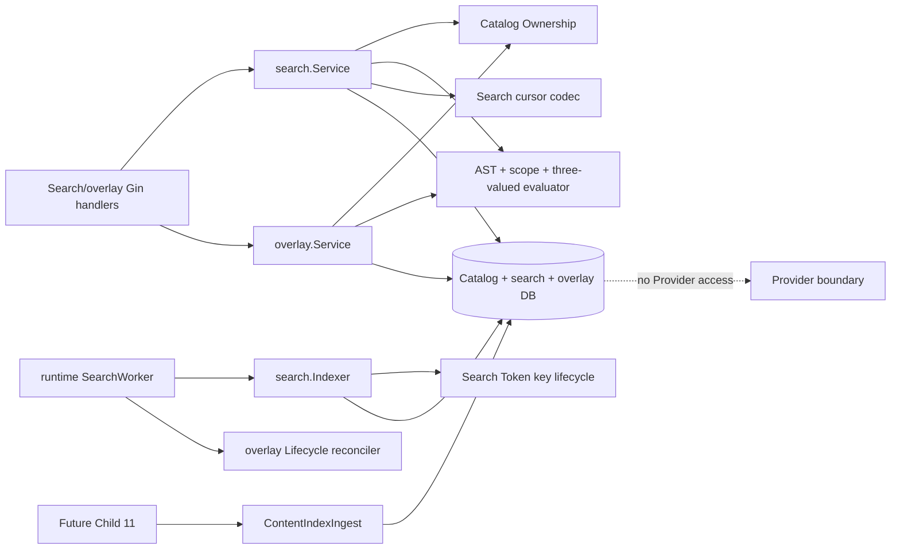

# Child 7 Backup Asset Search And User Overlays Design

## 1. Status, authority, and frozen boundary

This design and the paired PRD/implementation plan were approved on 2026-07-18.
The user then separately authorized `task.py start` and implementation. The task
is `in_progress` on `codex/backup-assets-search-overlays`, based on
`8cd6e5184e7dd05f702c3a5762b013c67901a399`; scope expansion still requires a
new review. Tasks 1-11 are implemented and locally verified; exact staging and
the Task 12-13 delivery flow have not started.

The design freezes these boundaries:

- Child 7 owns a rebuildable, database-only metadata search projection and
  owner-scoped saved searches, favorites, tags, and recent access.
- Child 7 consumes Child 6's exact active Catalog generation, composite
  `AssetRef`, producing-lineage authorization, Cursor Signing key, audit
  writer, lease service, settings snapshot, and runtime lifecycle.
- Child 7 defines `ContentIndexIngest` and persists only keyed postings,
  coverage/classification metadata, and a nullable opaque excerpt reference.
  It never creates excerpt ciphertext, text, OCR, or another derived artifact.
- Child 10 owns the Derived Store. Child 11 owns content/OCR/classification
  production and publication through Child 7's port. Child 8-15 files and
  migrations remain untouched.
- Search and overlays never invoke a Provider, mutate Provider bytes, create a
  command capability, alter retention, or become a hold.
- `backup_assets.enabled` stays `false` by default. Command remains typed
  unsupported.

The source-backed gap analysis is in
`research/current-main-evidence.md`. The parent contract remains authoritative
where this document is silent.

## 2. Component boundary



### 2.1 Package ownership

- `backupasset/search` owns normalization, AST validation/canonicalization,
  HMAC tokenization, scope resolution, indexing, search evaluation, ranking,
  search cursor encoding, coverage, key lifecycle coordination, and the future
  content-ingest port.
- `backupasset/overlay` owns saved-search encryption/lifecycle, favorites,
  tag definitions and assignments, recent access, quotas, idempotency, and
  source-expiry reconciliation. It imports the public AST validator from
  `search`; `search` does not import `overlay`. Tag-leaf evaluation receives a
  narrow owner-tag resolver port and saved-search execution receives a narrow
  owner-query resolver port, preventing a package cycle.
- `backupasset/runtime` remains the only composition root. Its Search worker
  performs DB-only backfill/reconciliation and has no Provider registry,
  command transport, credentials, or native locator.
- Dedicated search and overlay handlers remain thin. They enforce strict
  transport limits/RBAC, derive the authenticated actor, run the optional exact
  step-up verifier, map sentinels with response helpers, and never construct
  SQL predicates.
- Frontend modules own only raw DTO validation, camelCase mapping, and request
  factories. No route, page, component, hook, storage, or URL-state change is
  part of this Child.

## 3. Portable normalization and keyed terms

`NormalizerVersion = 1` is a persisted closed contract. The Go pipeline is:

1. validate UTF-8 and bounded input;
2. normalize with `golang.org/x/text/unicode/norm.NFKC`;
3. apply `golang.org/x/text/cases.Fold()` full case folding;
4. map backslash to slash, collapse repeated separators, remove `.` segments,
   and reject `..`, NUL, control characters, and absolute/native locator forms;
5. tokenize per field.

Field rules are deterministic:

- `name` and `path`: retain canonical UTF-8 for private sort/group derivation;
  split on slash and Unicode separator/punctuation boundaries; bound every run
  and total grams.
- consecutive Han runs emit overlapping bigrams; a one-rune run emits one
  unigram. Latin/digit runs emit full tokens. Mixed runs split by script.
- extension is the folded suffix after the final dot in the final segment,
  excluding empty/dotfile-only suffixes.
- modified time is converted to UTC and emits `YYYY`, `YYYY-MM`, and
  `YYYY-MM-DD` tokens.
- tag names use the same string normalizer for owner-local uniqueness, but tag
  leaves resolve through owner overlays rather than shared metadata postings.

Every posting token is:

```text
HMAC-SHA256(search_token_key,
  "xirang/search/v1\x00" || field || "\x00" || kind || "\x00" || normalized)
```

The stored value is lowercase hex. Field, token kind, normalizer version, and
Search Token key version are domain separated. Search, Entry Identity, Cursor
Signing, Audit Fingerprint, Recovery Cleanup, and future Derived keys are never
interchanged.

Search postings and private sort helpers use the folded representation.
All-history `path_group_token` instead HMACs Child 6's exact canonical Catalog
path bytes with a separate `group/path/v1` prefix, preserving case and segment
identity; case-distinct files are never merged. Its lineage token likewise
binds the validated exact producing lineage, not a display/task name. Immutable
points bind publication Task/link lineage, mutable heads bind their active
Task/link lineage, and Admin-only imported/unattributed points use an isolated
RecoveryPoint lineage token so they cannot merge with another point.

Database-native FTS, regex, `LIKE`, collation, locale sorting, and database
tokenizers are outside the product contract. SQL performs equality,
intersection, bounded joins, and deterministic ID keysets. Go performs
bytewise comparison of private ASCII-hex sort data and owns normalization,
boolean truth, ranking, grouping, final ordering, and cursor semantics.

## 4. Search Token key lifecycle

Add `search_token` to the wrapped domain-key closed set and valid keyring
domains, backed by the existing random 32-byte key generation and application
KEK envelope. It is not added to an unconditional boot-time required list;
only the enabled Search startup pass ensures it.

- `Keyring.Rotate(search_token, ...)` returns
  `ErrKeyRotationProhibited`. Ordinary rotation would strand every posting and
  is never allowed.
- KEK rotation calls `RewrapAll` during the enabled backup-asset startup pass.
  Rewrap changes only envelope/fingerprint metadata; plaintext key bytes and
  domain version must remain identical. Unexpected unwrap/rewrap failure is a
  startup-fatal configuration error, not silent key replacement.
- An intentionally recorded lost Search Token key is never regenerated by
  `Ensure`. Search becomes typed `unavailable`, existing cursors are stale, and
  Catalog/list remain usable. Tag lookup/mutation and saved-search execution are
  also unavailable because they require token evaluation; owner-only saved AST
  CRUD, favorites, and recent CRUD remain available through their independent
  encryption/ownership contracts.
- An explicit administrative recovery operation uses one narrow
  `ReplaceRebuildable` keyring transaction. Before activating a new random key,
  its invalidation callback clears every active Search generation, marks old
  generations superseded/unavailable, increments the projection epoch, marks
  owner tag lookup/mutation unavailable, and queues full metadata and tag-token
  reindex. Encrypted tag names are decrypted only inside Core and re-HMACed in
  bounded reconciliation batches; tag search/mutation remains unavailable
  until every definition carries the active key version. If invalidation fails,
  the key and projections remain on the old version.
- No HTTP endpoint for key replacement is added in this Child. The lifecycle
  method is an internal, testable runtime/operations port for later admin
  plumbing.

When the feature gate is false, search startup/API/worker paths return before
ensuring, rewrapping, or reading the Search Token key and before search DB
mutation. Existing non-search bootstrap behavior is unchanged.

## 5. Paired `000065` schema

Both engines use
`000065_backup_asset_search.{up,down}.sql`. SQLite uses `TEXT/INTEGER/DATETIME`
and the configured immediate transaction/UTC connection. PostgreSQL uses
bounded `VARCHAR`, `BIGINT`, `BOOLEAN`, and `TIMESTAMPTZ`. Model tags match both.

### 5.1 Closed-set rebuilds

The up migration rebuilds/alters, without changing a row value:

- `wrapped_domain_keys.domain`: existing four values plus `search_token`;
- `recovery_point_leases.holder_type`: the post-000064 set, including
  `point_publication`, plus `search_index`.

SQLite table-copy DDL must preserve every column, FK, partial index, and row.
PostgreSQL drops/re-adds only the named CHECK constraint. The down migration
restores the exact 000064 closed sets, not the older 000062 set.

### 5.2 Search projection tables

`backup_asset_search_generations`

- opaque `id` PK; `recovery_point_id` FK; `catalog_generation_id` FK;
- monotonic `generation`, closed `state = building|complete|failed|superseded`,
  `is_active`, `source_fingerprint`, `normalizer_version`,
  `search_key_version`, and positive `projection_revision`;
- `lease_id`, `build_attempt_id`, and `fence_token_hash` bind publication;
- expected/written document counts, closed error code, correlation ID, and UTC
  start/finish/create/update times;
- unique `(recovery_point_id, generation)` and partial unique active generation
  per RecoveryPoint; indexes by Catalog generation/state and reconciliation
  time. Migration 000065 adds a no-data-change unique parent key
  `catalog_generations(id, recovery_point_id)` and uses it as the composite FK,
  so a Search generation cannot claim a different point. Only `complete` may
  be active.

`backup_asset_search_documents`

- composite PK `(search_generation_id, document_id)` and unique
  `(search_generation_id, entry_id)`;
- exact `recovery_point_id`, `catalog_generation_id`, and `entry_id`, with a
  composite FK to
  `catalog_entries(generation_id, entry_id, recovery_point_id)` and a composite
  FK to its Search generation identity. Migration 000065 adds the corresponding
  no-data-change Catalog parent unique key;
- closed sensitivity `non_secret|secret|unknown`, positive classification and
  metadata revisions, closed entry type, nullable modified time;
- HMAC lineage/path-group tokens and ASCII-hex `path_sort_key` /
  `name_sort_key`; these are private implementation fields and never enter a
  cursor, audit, log, error, or DTO;
- UTC create/update times and fixed-width candidate/group indexes. Full sort
  keys are `TEXT` and deliberately have no B-tree index because a maximum path
  expands beyond PostgreSQL's index-entry limit; Go sorts only after the hard
  candidate bound.

Catalog `security_state` and Search sensitivity are different semantic domains.
The Catalog producer persists exact `sealed` when its Provider locator is
authenticated and encrypted; Search maps exact, case-sensitive `sealed` and
legacy `''` to conservative `unknown`. Native Search-compatible persisted values
`non_secret|secret|unknown` retain their value. Any other non-empty value fails
the generation instead of guessing a field-level fallback; no trim, case-fold,
or wildcard mapping is allowed.

`backup_asset_search_postings`

- FK `(search_generation_id, document_id)` with cascading projection cleanup;
- closed field `name|path|extension|type|modified_time|content|ocr` and closed
  token kind `exact|segment|bigram|date`;
- key version, 64-hex token HMAC, and positive bounded term frequency;
- unique `(search_generation_id, document_id, field, token_kind, token_hmac)`;
  token lookup and document cleanup indexes.

Tag is intentionally absent from shared postings. Owner tag leaves resolve via
tag definitions/assignments after authorization.

`backup_asset_search_document_fields`

- FK `(search_generation_id, document_id)`;
- closed field `name|path|extension|type|modified_time|content|ocr` and closed
  state `complete|partial|building|failed|unavailable`;
- positive coverage, classification, pipeline, and index revisions; source
  fingerprint; nullable 32-hex `excerpt_ref`; UTC update time;
- unique `(search_generation_id, document_id, field)` and coverage indexes.

Metadata rows become complete only with atomic Search generation activation.
Content/OCR may be updated only through `ContentIndexIngest`. An excerpt ref is
opaque metadata, has no Derived FK in Child 7, and is never treated as readable
ciphertext.

### 5.3 Overlay tables

`backup_asset_saved_searches`

- opaque ID, owner FK, encrypted canonical versioned AST/scope, schema version,
  scope mode, optimistic version;
- closed state `active|broken|blocked`, closed broken reason, broken time, and
  UTC timestamps;
- owner/list/state indexes. No result, member, snippet, path, or source name is
  persisted.

`backup_asset_saved_search_scope_points`

- `(saved_search_id, recovery_point_id)` PK and saved-search cascade FK;
- no RecoveryPoint FK: a source deletion must not be blocked by an overlay and
  the opaque ID must remain long enough to report a broken exact scope.

`backup_asset_favorites`

- opaque ID, owner FK, composite opaque target, encrypted optional user label,
  closed `active|tombstone`, typed tombstone reason, optimistic version, UTC
  timestamps;
- unique `(owner_user_id, recovery_point_id, entry_id)`;
- no Catalog/RecoveryPoint FK and no copied path/name/MIME/hash.

`backup_asset_tag_definitions`

- opaque ID, owner FK, encrypted display name, Search-Token-keyed normalized
  name token, key version, closed `active|rekeying` token state, optimistic
  version, UTC timestamps;
- unique owner/name token and unique `(id, owner_user_id)` for assignment owner
  integrity.

`backup_asset_tag_assignments`

- opaque ID, owner/tag composite FK, composite opaque target, closed
  `active|tombstone`, reason/version/timestamps;
- unique `(owner_user_id, tag_id, recovery_point_id, entry_id)`;
- no source FK and no copied source metadata.

`backup_asset_recent_access`

- opaque ID, owner FK, composite opaque target, positive access count,
  last-access/expiry/create/update UTC times and optimistic version;
- unique `(owner_user_id, recovery_point_id, entry_id)` and expiry indexes;
- source invalidation deletes the row immediately; no tombstone exists.

`backup_asset_overlay_usage`

- one owner row with non-negative saved/favorite/tag-definition/
  tag-assignment/recent counts, a UTC recent-rate-window start and non-negative
  window write count, optimistic version, and UTC update time;
- PostgreSQL mutations lock the row; SQLite's configured `_txlock=immediate`
  serializes the same quota reservation.

`backup_asset_overlay_idempotency`

- opaque ID, owner, closed action, SHA-256 key hash, encrypted canonical request
  fingerprint, typed resource/result reference and version, create/expiry UTC;
- unique `(owner_user_id, action, key_hash)` and expiry index;
- no response body, query, path, name, label, tag, content, or snippet.

The high-entropy, bounded client idempotency key is hashed independently; it
does not reuse any domain key. The encrypted request fingerprint is used only
to distinguish same-request replay from key collision/misuse.

### 5.4 Migration apply/down contract

Apply starts from real 000064 data and creates no Search Token, projection, or
overlay row. Existing Catalog, audit, key, lease, and Provider/publication rows
must remain byte-for-byte/field-for-field equivalent. The two new Catalog
composite parent indexes are dropped by pristine down after all dependent
Search tables are removed.

Down begins with an atomic guard. It succeeds only if all new tables are empty,
there is no `search_token` row in any state, and there is no `search_index`
lease in any state. A rejected down must leave schema version, schema objects,
indexes, constraints, and data unchanged. A pristine down drops Child 7 tables,
rebuilds the two closed constraints to their 000064 definitions, and reaches
000064. Used deployments disable/fence Search and use forward repair; they do
not destroy overlays or keys merely to run an old binary.

`000066...000071` remain reserved for Child 8 through Child 15. If `000065` is
occupied before implementation starts, execution stops for a parent-level
reservation decision rather than skipping a version.

### 5.5 Closed persisted and public reasons

Search generation error codes are empty or exactly:

```text
search_build_abandoned
search_build_failed
search_build_limit
search_build_timeout
search_catalog_changed
search_source_changed
search_fence_lost
search_key_unavailable
search_invalid_security_state
search_projection_mismatch
```

Search public capability/error codes added to the existing safe capability
product are exactly:

```text
search_unavailable
search_index_building
search_index_partial
search_index_failed
search_key_unavailable
search_cursor_stale
search_scope_stale
search_resource_limit
search_excerpt_unavailable
search_query_invalid
```

Saved-search broken reasons are:

```text
point_retired | point_expiring | point_expired | point_failed
point_purge_blocked | point_missing | scope_unauthorized
```

The blocked reason is `ast_schema_unsupported`. Favorite/tag tombstone reasons
are:

```text
source_retired | source_expiring | source_expired | source_failed
source_purge_blocked | source_missing
```

Idempotency action values cover only overlay mutations:

```text
saved_search_create | saved_search_update | saved_search_delete
favorite_add | favorite_remove
tag_create | tag_update | tag_delete | tag_assign | tag_unassign
recent_clear
```

Recent internal recording uses its natural transactional upsert and persisted
rate window, not a caller-supplied idempotency key. Unknown persisted/public
reason/action/state is an invalid whole product; it is never mapped field by
field.

## 6. Versioned AST and scope contract

The transport uses a closed discriminated union, never `map[string]any` after
decode:

```go
type QueryNode struct {
    Op       QueryOp
    Field    SearchField
    Text     string
    Values   []string
    From     *time.Time
    To       *time.Time
    Children []QueryNode
}

type SearchScope struct {
    Mode             SearchScopeMode
    RepositoryIDs    []string
    TaskIDs          []uint
    RecoveryPointIDs []string
}

type SearchRequest struct {
    SchemaVersion int
    Root          QueryNode
    Scope         SearchScope
    Sort          SearchSort
    Limit         int
    Cursor        string
}
```

Schema version 1 supports `and|or|not|term|type|modified_time` and fields
`any|name|path|extension|tag|content|ocr`. `and/or` need at least two children;
`not` needs exactly one; leaves have no children. Unused properties must be
zero/absent. Type values and sort are closed enums. Time bounds parse RFC3339,
normalize to UTC, and require `from <= to`.

One validator enforces request/saved-search limits for body bytes, depth,
nodes, values/node, value UTF-8 bytes/runes, page size, candidates, execution
deadline, and suggestions. Canonicalization recursively canonicalizes nodes,
sorts and deduplicates commutative `and/or` children by canonical bytes, and
deduplicates/sorts scope IDs and closed value sets before emitting deterministic
JSON. Unknown schema/op/field/value, empty exact scope, mixed dynamic/exact
scope, invalid IDs, trailing JSON, or a limit violation rejects the whole
request.

Scope resolution precedes coverage lookup:

- `current`: enumerate eligible authorized producing lineages, then select each
  lineage's newest committed/degraded point or its stable non-retired
  `mutable_head`. Immutable newest order is committed time, captured time,
  created time, then opaque ID, all descending. A newer unindexed point stays
  selected and reports its real coverage; no older indexed fallback is allowed.
- `all_retained`: select all eligible authorized committed/degraded retained
  points plus the current observed mutable head. Group by HMAC validated
  lineage identity plus canonical path, never merely repository/path.
- `exact_points`: every point must exist, be eligible, be authorized, and match
  the canonical saved membership. One missing/expired/unowned point fails the
  whole request; a saved exact search becomes durably broken.
- imported/unattributed points never enter Operator current expansion. Admin
  may request them only through all-retained/exact semantics.

Repository/task filters only narrow the resolved authorized set. A request can
never widen ownership or infer the existence of a filtered-out point.
Current main limits one `Catalog.Ownership.AuthorizedPointIDs` call to 2,000
candidates. The resolver partitions opaque candidate IDs into stable batches
of at most 2,000, calls that same predicate for every batch, and restores the
original deterministic order. It does not copy or replace Catalog's ownership
SQL. A failure in any batch fails the whole scope closed.

## 7. Authorization, classification, and threat model

### 7.1 Fixed evaluation pipeline

Every request follows this order:

```text
feature/RBAC -> authorized scope -> visible candidates
-> classification + exact step-up -> AST truth
-> grouping -> count -> suggestions -> snippet/DTO
```

Viewer is denied by `backup_assets:list` before service/database search work.
Admin/Operator scope uses Child 6's producing-lineage ownership predicate.
Owning one Task in a shared Repository never authorizes sibling lineages.

The optional proof verifier accepts only an unexpired five-minute
`asset.secret_reveal` proof matching token class, user, role, token version,
and current TOTP state. Missing, malformed, expired, or wrong-purpose proof is
uniformly treated as no content-reveal capability; it never grants access and
does not turn metadata search into an oracle. Infrastructure failure fails the
request closed. Download/recovery/export/purge proofs cannot substitute.

Current `validateStepUpProof` returns undifferentiated errors, so implementation
first introduces private typed `invalid` versus `verifier_unavailable` results.
JWT/claim/user-not-found/revoked mismatches are invalid; nil verifier/database
and non-not-found database errors are unavailable. Existing mandatory
middleware continues to expose the same 403 envelope for both, while optional
Search swallows only `invalid` and propagates `verifier_unavailable` as a safe
closed service error.

### 7.2 Three-valued content truth

For a `secret` or `unknown` document without exact proof, content/OCR leaves
evaluate `unknown`, not false. Kleene logic applies:

- `NOT unknown = unknown`;
- `true OR unknown = true`, but hit fields/count reasons/suggestions/snippets
  contain only the true authorized branch;
- `false OR unknown = unknown`; unknown never becomes a returned match;
- `false AND unknown = false`, `true AND unknown = unknown`.

Name/path/extension/type/date/tag metadata remains governed by list and target
ownership. Sensitivity never expands metadata permission. Content candidates
also require a future excerpt resolver to verify the true match after proof;
without a resolver, content/OCR public coverage cannot be complete and an HMAC
candidate is never returned.

### 7.3 Threats and controls

| Threat | Control |
|---|---|
| Viewer/unowned Operator infers existence | RBAC and producing-lineage scope before candidates/count/group/suggestions; uniform safe errors |
| Secret inferred by `NOT`, count, suggestion, cursor, timing | three-valued truth; secret/unknown facts removed before downstream stages; bounded common execution path |
| DB dump enables query dictionary attack | independent random Search Token HMAC with field/kind/version separation; no plaintext posting dictionary |
| Cursor leaks query/path/name or crosses users | signed closed envelope with opaque anchor and HMAC/digests only; bind user/role/scope/proof/generations/expiry |
| Stale worker publishes after takeover | `search_index` lease, attempt/fence hash, active Catalog/source/key/classification CAS in one activation transaction |
| Mutable head or ownership changes mid-page | selected-point, source, active generation, scope membership, role and projection revisions are cursor-bound and revalidated |
| Idempotency replay/collision changes a mutation | owner/action/key unique row plus encrypted canonical fingerprint; same request replays, different request conflicts |
| Overlay blocks retention or leaks deleted metadata | no source FK, no copied source metadata, explicit broken/tombstone/delete lifecycle |
| Logs/audit expose low-entropy query | raw values banned; audit uses only in-memory canonical query with independent Audit Fingerprint key |
| Unknown future DTO/schema is guessed | backend closed enums/sentinels and frontend whole-product blocked mapping |

## 8. Atomic metadata projection

The Search worker lists DB candidates whose active complete Catalog generation
has no exact active Search generation for `(catalog_generation_id,
source_fingerprint, normalizer_version, search_key_version)`. It uses bounded
per-repository fairness and dynamic settings, but never opens a Catalog read
session or Provider command.

Build sequence:

1. feature/config/key checks; acquire a `search_index` RecoveryPoint lease;
2. freeze point, source fingerprint, active complete Catalog generation,
   Search Token key version, normalizer version, and fence;
3. create a non-active `building` Search generation;
4. stream exact Catalog rows in deterministic keyset batches; explicitly map
   the Catalog locator-seal domain to the Search content-sensitivity domain,
   then normalize and insert documents/postings/field rows into staging only;
5. in one transaction re-lock and revalidate point/source, active Catalog,
   Search key, generation counts, lease owner/attempt/fence/deadline, and every
   frozen Catalog security state and closed Search sensitivity mapping;
6. supersede the prior active Search generation, activate the complete staging
   generation, advance projection revision, and release the lease.

Cancel, timeout, limit, invalid legacy state, key loss, Catalog/source drift,
or lost fence marks the staging generation failed and never changes the active
projection. A prior active projection is usable only while it binds the exact
still-active Catalog generation. Zero-entry complete Catalog produces an
active zero-document Search generation and can authoritatively answer metadata
queries empty.

Startup/periodic reconciliation fails abandoned builds, expires leases, removes
impossible active rows, and queues exact rebuilds. Late builders cannot publish
after key replacement, Catalog activation, mutable refresh, or lease takeover.

## 9. Query, ranking, grouping, coverage, and cursor

SQL obtains a hard-bounded union of candidates for positive keyed leaves and
owner tags. Go reloads exact private Catalog metadata, applies full AST truth,
then ranks. Queries with no positive selective leaf must remain within the
configured candidate ceiling or return `resource_limit`; they are never
silently truncated.

The implemented candidate planner preserves boolean safety without loading the
whole projection first. Posting/type/time leaves compile to portable SQL
predicates. The owner-scoped `TagResolver.CandidateRefs` port receives only the
already-authorized selected point IDs and returns bounded composite refs; `any`
unions those refs with name/path/extension and eligible content/OCR posting
candidates. `AND` may use any selective child as a safe superset, `OR` unions
all branches, and an `OR` branch containing an unselective negative expression
falls back to the bounded full scan. Candidate rows are deduplicated and sorted
before private Catalog/posting hydration on both engines.

Default integer relevance is frozen as:

```text
score = matched_distinct_positive_leaf_count * 1_000_000
      + sum(field_weight * 1_000 + token_kind_weight * 100 + min(tf, 99))
      + sum(path_leaf_proximity)

field_weight: name=500, path=350, extension=300, tag=250,
              content=150, ocr=120, type=100, modified_time=80
token_kind_weight: exact=4, segment=3, date=2, bigram=1
path_leaf_proximity: max(0, 64 - segments_after_nearest_true_segment)
```

Path proximity is computed from the same NFKC/folded slash segments and token
kinds as posting evaluation. The deepest matching segment gets 64 and each
remaining segment toward the leaf subtracts one, clamped at zero.

Only distinct, non-negated, authorized `true` leaves contribute. Total order is
score descending,
current-lineage representative first, point captured/committed/observed time
descending, path sort hex ascending, name sort hex ascending, RecoveryPoint ID
ascending, Entry ID ascending. Closed explicit sorts reuse the same final
tie-breakers. All-history first groups by `(lineage_token, path_group_token)`
and selects the highest tuple; it never groups across producing lineages.

The search cursor is signed by the independent Cursor Signing domain, expires
within 15 minutes, and contains only:

- cursor schema/key version and expiry;
- user ID, role, sort, query HMAC, scope digest, selected point/Search generation
	digest, projection/classification revision digest, owner-tag revision digest,
	and exact proof ID/expiry digest;
- opaque group/document anchor ID.

It contains no query, token, path, name, tag, label, snippet, sort text, or
source metadata. Resume reloads the opaque anchor and its sort tuple. User,
role, ownership, scope membership, newest point, Catalog/Search generation,
key, classification, proof, or anchor drift returns one typed stale-cursor
error.

Suggestions are generated only after authorization, classification, AST truth,
ranking, and all-history grouping. They are deterministic, deduplicated, and
bounded by `search_suggestion_limit`; Child 7 emits only true metadata facts
(name, path, extension, type, or UTC date). It never derives a suggestion from
content/OCR postings or snippet text. The frontend independently rejects a
content/OCR hit, snippet, or suggestion when server content capability is
false; `secret_reveal=false` alone does not discard a valid non-secret content
hit because classification authority remains on the server.

Each response contains a query generation HMAC, per-selected-point Catalog and
Search generation/projection revision, composite AssetRef, authorized hit
fields, coverage/staleness/capability, and server-evaluated permissions.
Coverage is aggregated only over fields used by the AST:

```go
type SearchResponse struct {
    QueryGeneration   string
    Indexes           []SearchIndexStatus
    Items             []SearchHit
    NextCursor        string
    Total             *int64
    TotalRelation     TotalRelation // exact | lower_bound | unavailable
    AuthoritativeEmpty bool
    Coverage          SearchCoverage
    Suggestions       []SearchSuggestion
    Capabilities      SearchCapabilities
    Permissions       SearchPermissions
}

type SearchIndexStatus struct {
    RecoveryPointID    string
    CatalogGenerationID string
    SearchGenerationID string
    ProjectionRevision int64
    Coverage           CoverageStatus
    Staleness          StalenessStatus
}

type SearchHit struct {
    Ref       backupasset.AssetRef
    Asset     catalog.EntryDTO
    HitFields []SearchField
    Score     int64
    Snippet   *VerifiedSnippet
}
```

`catalog.EntryDTO` is the existing sanitized Catalog projection; it never contains a
Provider locator or private search sort/group key. `VerifiedSnippet` cannot be
constructed without the future resolver, exact proof where required, and a
real-match verification. The JSON/Swagger/frontend products use the same
closed strings and reject duplicate/unknown hit fields or mismatched point and
index identities.

- exact total and `authoritative_empty=true` require complete coverage for
  every used field over every selected point plus content resolver availability
  where applicable;
- partial/building/failed/unavailable may return covered visible matches, but
  `total` is null or an explicit lower bound and `authoritative_empty=false`;
- zero returned items under non-complete coverage never means zero assets;
- counts and suggestions describe only the same covered, visible, classified
  set. They never use a broader SQL count.

## 10. `ContentIndexIngest` contract

```go
type ContentProjection struct {
    Ref                            catalog.AssetRef
    Field                          Field // content | ocr
    Terms                          []TermFrequency
    SourceFingerprint              string
    CatalogGenerationID            string
    SearchGenerationID             string
    ProcessingLeaseID              string
    AttemptID                      string
    FenceToken                     string
    ExpectedClassificationRevision int64
    Classification                 Sensitivity // non_secret | secret | unknown
    ClassificationRevision         int64
    PipelineRevision               int64
    IndexRevision                  int64
    ExcerptRef                     *string
    Coverage                       FieldCoverage
}

type ContentIndexIngest interface {
    PublishContentProjection(context.Context, ContentProjection) error
    RevokeContentProjection(context.Context, RevokeProjection) error
}
```

The implementation accepts server-resolved IDs only. In one transaction it
revalidates the eligible point, source fingerprint, exact active Catalog/Search
generation, document, Search key version, active `processing_job` lease
owner/attempt/fence/deadline, expected classification revision, and monotonic
classification/pipeline/index revisions. It then deletes the old field
postings, HMACs bounded terms in memory, inserts replacements, atomically CASes
the document sensitivity/revision, updates field coverage/excerpt ref, and
advances projection revision. A changed sensitivity requires a strictly newer
classification revision; an unchanged state may retain the current revision.
When sensitivity changes, the transaction first deletes postings for both
content and OCR, advances both field rows to the new classification revision,
sets the sibling field unavailable, and clears its excerpt ref. A sibling can
be republished only with that exact new revision; old-classification postings
cannot survive through the other field.
Failure rolls back all changes; metadata fields cannot be overwritten through
this port.

The Search Token key is never sent to a Worker. Plaintext terms exist only in
the Core call stack, are zeroed/released where practical, and never enter SQL,
logs, metrics, audit, or errors. Child 7 has no producer and no excerpt reader.
Revocation removes postings/ref/coverage before a future Derived key/blob is
destroyed, preventing ghost matches.

## 11. Overlay behavior

### 11.1 Authorization and safe lookup

Every row is owner-scoped. Other-owner and missing IDs return the same safe
not-found result. Active target creation/assignment/recording first validates
the composite AssetRef through Catalog ownership using the same mutation
transaction `*gorm.DB`; idempotency replay is reauthorized before returning.
Bulk requests deduplicate first, then authorize every target inside that
transaction before any usage/resource write; one invalid/unowned target rolls
back the entire request. This closes the ownership-change TOCTOU window.
Listing never rehydrates source metadata into overlay rows.

### 11.2 Quota and idempotency

Mutation transactions lock/create `backup_asset_overlay_usage`, calculate only
new natural-key rows, enforce all configured per-user quotas, mutate usage and
resources, and commit one idempotency receipt. Same key/action/owner and same
canonical request returns the original typed resource/result reference; the
same key with another request returns conflict. Natural duplicate add/assign is
also an idempotent success. Delete/unassign of an absent natural target is an
idempotent success.

Receipts expire and are deleted in bounded batches. Quota overflow is a stable
typed error, never partial success or silent truncation. Recent writes use the
persisted per-owner transaction-locked window for 120/minute enforcement and a
10,000-row quota; restart or another process cannot reset the window. Broken saved
searches and favorite/tag tombstones continue to count while persisted; only
explicit deletion decrements those usage counters. Lifecycle deletion of a
recent row decrements recent usage in the same transaction.

### 11.3 Lifecycle

| Overlay | Source becomes retired/expiring/expired/failed/purge-blocked/missing |
|---|---|
| Saved `exact_points` | transactionally mark `broken`, retain encrypted AST and opaque membership, audit; never change to current/all |
| Favorite | retain opaque AssetRef + encrypted user label as typed tombstone; remove all server-derived cache (none is stored) |
| Tag assignment | retain opaque AssetRef + owner tag as typed tombstone |
| Recent | delete immediately; no tombstone |

Cleanup is bounded, restart-safe, idempotent, and callable both by the Child 7
runtime reconciler and a future Child 14 lifecycle coordinator port. A source
return does not silently reactivate a broken exact search or tombstone. User
must explicitly recreate/repair it. User deletion cascades overlays; source
deletion never waits for overlay cleanup and overlays never update point hold
or retention columns.

Saved AST, favorite label, tag name, and idempotency request fingerprint use
existing model encryption hooks. Bootstrap v1-to-v2 enumeration and tests
include every new encrypted column.

## 12. API contract

All routes are under `/api/v1`, authenticated, and require
`backup_assets:list`. Strict JSON rejects unknown fields, trailing values,
oversized body/cursor/header, malformed IDs, and invalid closed products.
After RBAC/strict transport validation, handlers run an atomic feature-config
preflight before optional proof verification or Search/overlay DB access; the
service rechecks the same enabled generation before work to close transition
races. Disabled requests do not touch the Search key, projection, proof-user
lookup, audit side effect, or overlay mutation.

Search:

- `POST /asset-search` accepts exactly one of inline `{query}` or opaque
  `{saved_search_id}`, plus scope/sort/page/cursor in the body. Query text and
  paths never enter URL/access logs.

Saved searches:

- `GET|POST /asset-saved-searches`
- `GET|PATCH|DELETE /asset-saved-searches/:id`

Favorites:

- `GET|POST /asset-favorites`
- `DELETE /asset-favorites/:recoveryPointId/:entryId`

Tags:

- `GET|POST /asset-tags`
- `PATCH|DELETE /asset-tags/:id`
- `POST /asset-tags/:id/assignments`
- `DELETE /asset-tags/:id/assignments/:recoveryPointId/:entryId`

Recent:

- `GET /asset-recent`
- `POST /asset-recent/clear`
- recent recording is an internal server port, not a public client assertion.

Mutations require a bounded `Idempotency-Key`; the central frontend request
option sets it, and router CORS allows it. Search optionally accepts the existing
`X-Xirang-Step-Up`. Safe errors expose closed code/correlation/coverage fields,
never raw SQL, crypto, source, query, path, name, token, or classification
detail. The raw idempotency key is likewise absent from logs, audit, errors,
metrics, and responses.

Audit uses registered actions `asset_search`, saved CRUD/use/broken, favorite
add/remove/tombstone, tag CRUD/assign/unassign/tombstone, recent record/clear,
and overlay cleanup. Search passes canonical query bytes only to the audit
writer's in-memory independent fingerprint input; no query text is persisted.
Handlers never invent action/stage strings.

## 13. Frontend safe boundary

`domain.ts` gains closed camelCase AST, scope, search response, coverage,
permission, saved search, favorite, tag, recent, and blocked projection types.
Private raw DTOs remain in API modules.

- `backup-asset-search-api.ts` always POSTs AST/saved ID in the body and maps a
  coupled response atomically.
- `backup-asset-overlays-api.ts` owns overlay request factories and passes
  `idempotencyKey` through the central wrapper.
- a small shared backup-asset boundary module validates opaque IDs,
  `AssetRef`, finite counts, closed time/enums, and constructs the standard
  blocked projection; the existing Catalog API is migrated to it to avoid
  divergent AssetRef parsing.
- unknown enum/schema/op/field, invalid AssetRef, contradictory coverage/total/
	authoritative-empty, missing generation, content hit/snippet/suggestion without
	server content capability, or impossible overlay state blocks the entire
	product. No field is guessed or dropped to make the rest renderable.
- modules do not reference `localStorage`, `sessionStorage`, `history`, router,
  or URL APIs. A saved-search ID validator accepts only the opaque ID; Child 7
  adds no URL integration.

## 14. Settings, runtime, and observability

`settings.Service` and `FoundationService` add typed, cross-validated Search and
Overlay snapshots. Production `settings.Service` exposes its existing
mutation-mutex-protected full backup-asset snapshot through a narrow reader
port; `FoundationService` parses Search/Overlay and shared lease/feature values
from that one map, never from a mix of per-key reads. Tests use explicit
snapshot fakes. Defaults are bounded: 1-minute reconcile, 30-minute build,
500-row batches, concurrency 2, AST depth 8/nodes 64/values 32, request 64 KiB,
value 1 KiB, candidate ceiling 10,000, query timeout 5 seconds, page max 200,
suggestions 20, saved 100, favorites 5,000, tag definitions 100, assignments
10,000, bulk 200, recent 10,000/30 days/120 writes per minute, idempotency 24
hours/128 bytes. Implementation names and min/max values are enumerated in
`implement.md`; unknown/invalid cross-setting combinations fail startup or the
dynamic read before work begins.

Search metrics use low-cardinality outcome/status/field labels only: scans,
build duration/outcome, active builds, query duration/outcome/coverage, stale
cursors, ingest outcome, overlay mutation outcome, cleanup counts, quota/rate
rejection, and key-unavailable state. No metric/log label contains actor,
query, path, name, tag, AssetRef, proof, idempotency key, or source metadata.

Runtime starts Search after admission/bootstrap checks, exposes search/overlay
services to Router, runs Catalog and Search workers independently, cancels and
joins Search before lower dependencies on shutdown, and leaves Catalog/provider
behavior intact when Search is disabled or unavailable.

## 15. Verification design

Tests use injected/frozen clocks or relative future/past values. SQLite and
real PostgreSQL run the same behavior fixtures.

- normalization property/golden tests cover canonical equivalents, Unicode
  fold edge cases, slash/dot rejection, Han bigrams, Latin tokens, extensions,
  dates, hard limits, HMAC domain separation, and stable sort bytes;
- migration tests cover 064 legacy apply, pristine down, every used-down guard,
  rejection atomicity, FK/check/unique/index/UTC/model parity and PostgreSQL
  mandatory-DSN behavior;
- projection tests cover staging invisibility, zero documents, activation,
  old active preservation, source/Catalog/key drift, takeover/late fence,
  restart reconciliation, loss/rewrap/replacement and concurrent builders;
- search behavior tests cover all AST products/limits, current/all/exact,
	no-old fallback, all-history lineage grouping, deterministic ranking/pages,
	positive posting/owner-tag candidate preselection, path-leaf proximity,
	metadata-only suggestions, tag-revision cursor binding/staleness, partial
	truth, and SQLite/PostgreSQL parity;
- security tests cover Admin/Operator/Viewer, shared repositories,
  imported/unattributed points, ownership changes, all registered cross-purpose
  proofs, expiry between pages, Kleene `NOT`, count/suggestion/snippet/error
  non-existence leaks, and audit/log/cursor plaintext scans;
- ingest tests cover source/fence/classification CAS, atomic replace/revoke,
  monotonic revisions, stale workers, no metadata overwrite, no plaintext SQL,
  and unavailable excerpt resolver;
- overlay tests cover owner-safe not-found, quota races, bulk rollback, natural
	and key idempotency, optimistic conflict, saved exact broken, favorite/tag
	tombstone, transaction-bound asset authorization, owner-tag candidates, recent
	immediate deletion/TTL/rate, cleanup retry, and no hold or Provider table
	mutation;
- handlers/router/Swagger tests cover strict POST body, RBAC before service,
  headers/CORS, standard envelopes, audit action registry, and source-boundary
  static assertions;
- frontend tests cover raw mapper products, unknown/contradiction blocking,
  POST/idempotency/exact step-up headers, and negative browser-storage/URL use.

CI extends the PostgreSQL 18 job to 000065 and runs
`TestSearchBehaviorPostgres` under `REQUIRE_POSTGRES_SEARCH_TEST=1`; missing DSN
is fatal. SQL-text or skipped tests are not parity evidence.

## 16. Rollout and rollback

1. Apply additive paired 000065 while the feature remains disabled.
2. On explicit enable, rewrap/ensure the Search Token key and build Search
   generations asynchronously from exact active Catalog generations.
3. Search reports building/partial/unavailable honestly until exact activation;
   no old point fallback or authoritative zero is exposed.
4. Overlay APIs may be enabled only with the same feature gate and server
   ownership checks.

Application rollback disables routes/scheduling, cancels and fences builders,
and retains 000065 data. Rebuildable postings may be removed only through the
key lifecycle coordinator; user overlays are preserved. Provider and Catalog
data are untouched. Schema down is allowed only under the pristine guard.
After use, recovery is a forward-fix migration/PR, never destructive down or
tag mutation.

## 17. Parent-contract coverage and deviations

| Parent / delegated contract | Design section | Status |
|---|---|---|
| Portable NFKC/fold/path/Han/Latin/extension/date semantics | 3, 9, 15 | covered |
| Independent wrapped Search Token, KEK rewrap, no key reuse | 4, 5, 15 | covered |
| Closed AST, bounded scopes, no newest-point fallback | 6, 8, 9 | covered |
| Authorization before facts; exact five-minute secret proof | 7, 9, 12 | covered |
| Composite refs, hit/generation/coverage/staleness/capability/permissions | 9, 12, 13 | covered |
| `POST /asset-search`, opaque cursor, query-free audit/log | 7, 9, 12 | covered |
| Atomic future content ingest, no excerpt ciphertext | 5, 7, 10 | covered |
| Saved/favorite/tag/recent ownership/quota/idempotency/lifecycle/no hold | 5, 11, 12 | covered |
| Frontend DTO/API/test only; no browser persistence | 13 | covered |
| Paired 000065 and real PostgreSQL apply/down/behavior | 5, 15 | covered |
| Child 8-15/Provider/Command exclusion | 1, 2, 10, 16 | covered |

Focused refinements, not scope expansion:

- Search is placed in focused `search` and `overlay` packages instead of
  extending the already large Catalog service/handler. Catalog ownership and
  identity contracts are reused directly.
- Owner tags are evaluated through owner overlays, not shared Search postings;
  this is required to avoid cross-user tag disclosure.
- Source tables intentionally omit overlay FKs. This is required for the
  explicit no-retention-hold and tombstone/broken semantics.
- Child 7 defines an excerpt-resolver dependency but installs no resolver, so
  content/OCR cannot claim complete or return a match until Child 10/11 own the
  ciphertext and publication path.

There is no migration-reservation deviation and no dependency on an unmerged
sibling.

## 18. High-risk review gates

| Risk | Required evidence before merge |
|---|---|
| SQLite key/lease table rebuild diverges from PostgreSQL ALTER | legacy-row snapshot, all prior constraints/indexes, real dual-engine apply/down, rejected-down atomicity |
| Search Token replacement leaves old postings or tag tokens usable | key/version tests, projection invalidation before activation, tag `rekeying` gate, full rebuild convergence |
| Optional step-up becomes a proof/error oracle | pairwise purpose tests, expiry/user/role/token/TOTP drift, identical metadata behavior without exact proof |
| Scope size or shared repository bypasses ownership | <=2,000 batching through the same Catalog predicate, all-batch fail closure, shared-lineage fixtures |
| Broad/negative AST causes unbounded scan or authoritative false zero | positive-candidate ceiling, deadline/cancel tests, three-valued truth, incomplete coverage contract |
| SQLite/PostgreSQL quota races exceed limits | immediate transaction/row-lock concurrency and idempotency replay tests on both engines |
| Cursor/DTO unknown state leaks or resumes across drift | payload plaintext scan, every binding stale test, frontend whole-product blocked matrix |
| Cleanup creates a retention hold or source metadata tombstone | no source FK/copied metadata, lifecycle mutation diff, hold/retention/Provider negative assertions |

Any failed gate returns the task to planning/design correction. It is not
waived by a passing layer-wide test command.

## 19. Design review gate

The user approved this design with `prd.md` and `implement.md`, then separately
authorized `task.py start` and implementation on 2026-07-18. Tasks 1-11 are now
implemented and locally verified without a migration or sibling-scope
deviation. Exact staging, commit, archive/journal, push, PR, required CI, merge,
post-merge automation, and branch cleanup remain separate unexecuted delivery
steps.
